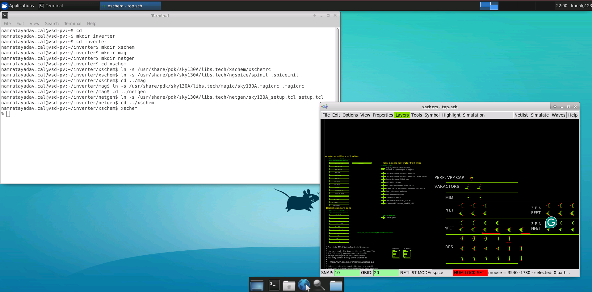
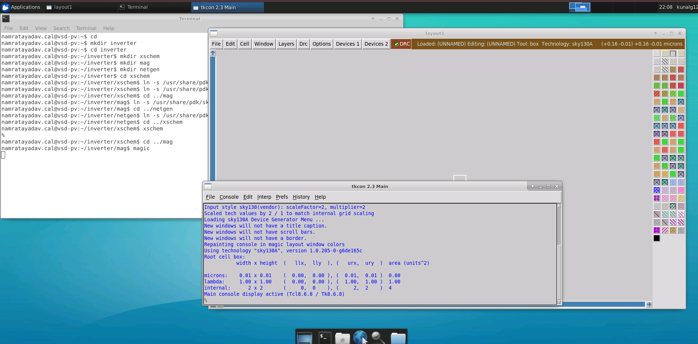
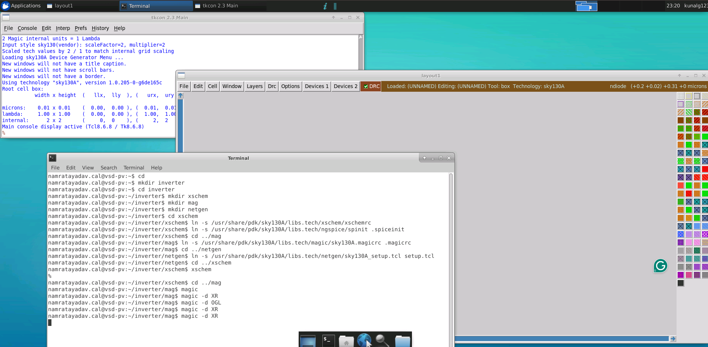

# L2 — SKY130 PDK Setup and Tool Environment

## Objective

The objective of this lab is to set up the **SKY130 PDK environment** for the open-source IC design and physical verification tools used throughout the project.

The project environment is organized for:

- Schematic design using **Xschem**
- Circuit simulation using **Ngspice**
- Physical layout using **Magic VLSI**
- Layout Versus Schematic (LVS) verification using **Netgen**

---

## 1. Create the Project Directory

A separate project directory was created for the CMOS inverter.

```bash
cd
mkdir inverter
cd inverter
```

Three subdirectories were then created:

```bash
mkdir xschem
mkdir mag
mkdir netgen
```

The resulting project structure is:

```text
inverter/
├── xschem/
├── mag/
└── netgen/
```

### Purpose of Each Directory

| Directory | Purpose |
|---|---|
| `xschem/` | Schematic creation and simulation setup |
| `mag/` | Physical layout using Magic VLSI |
| `netgen/` | LVS verification using Netgen |

---

## 2. Configure Xschem for SKY130

Move into the Xschem directory:

```bash
cd xschem
```

Create a symbolic link to the SKY130 Xschem configuration file:

```bash
ln -s /usr/share/pdk/sky130A/libs.tech/xschem/xschemrc
```

The `xschemrc` file configures Xschem to access the SKY130 PDK device libraries and technology-specific symbols.

Instead of copying the original PDK configuration file, a **symbolic link** is created so that the project directly references the installed SKY130 configuration.

---

## 3. Configure Ngspice

Ngspice is used to simulate the circuits created in Xschem.

The SKY130 Ngspice initialization file was linked into the Xschem project directory using:

```bash
ln -s /usr/share/pdk/sky130A/libs.tech/ngspice/spinit .spiceinit
```

The `.spiceinit` file provides the initialization settings required to run Ngspice with the SKY130 simulation environment.

The Xschem environment can then be launched using:

```bash
xschem
```



---

## 4. Configure Magic VLSI for SKY130

Move from the Xschem directory to the Magic layout directory:

```bash
cd ../mag
```

Create a symbolic link to the SKY130 Magic configuration file:

```bash
ln -s /usr/share/pdk/sky130A/libs.tech/magic/sky130A.magicrc .magicrc
```

The `.magicrc` file configures Magic to use the **SKY130 technology environment**.

It allows Magic to recognize the process-specific layout layers and technology information required to create physical layouts.

Magic can then be launched using:

```bash
magic
```



---

## 5. SKY130 Technology Layers in Magic

After launching Magic with the SKY130 configuration, the technology-specific layout layers become available.

These layers are used to physically construct transistors and interconnections.

Examples include:

- Wells
- Diffusion / active regions
- Polysilicon
- Contacts
- Metal routing layers
- Vias

The presence of the SKY130 technology name and the layer palette confirms that the SKY130 Magic environment has been loaded.



---

## 6. Configure Netgen for LVS

Move into the Netgen directory:

```bash
cd ../netgen
```

Create a symbolic link to the SKY130 Netgen setup file:

```bash
ln -s /usr/share/pdk/sky130A/libs.tech/netgen/sky130A_setup.tcl setup.tcl
```

The `setup.tcl` file provides the SKY130-specific configuration required by Netgen.

Netgen will later be used to perform **Layout Versus Schematic (LVS)** verification by comparing:

```text
Schematic Netlist
        │
        ▼
      Netgen
        ▲
        │
Extracted Layout Netlist
```

This verifies that the physical layout represents the same electrical circuit as the original schematic.

---

## 7. Tool Flow

After completing the setup, the SKY130 design and verification environment consists of:

```text
                 SKY130 PDK
                     │
        ┌────────────┼────────────┐
        │            │            │
        ▼            ▼            ▼
     Xschem        Magic        Netgen
        │            │            │
   Schematic       Layout         LVS
        │            │            │
        ▼            │            │
     Ngspice         │            │
   Simulation        │            │
                     │            │
                     └────────────┘
```

The complete project flow is:

```text
Xschem
   │
   │ Create Schematic
   ▼
Ngspice
   │
   │ Simulate Circuit
   ▼
Magic
   │
   │ Create Physical Layout
   │
   │ Extract Layout Netlist
   ▼
Netgen
   │
   │ Compare Schematic and Layout
   ▼
LVS Verification
```

---

## 8. Key Commands Used

| Command | Purpose |
|---|---|
| `mkdir inverter` | Create the main inverter project directory |
| `mkdir xschem` | Create the schematic workspace |
| `mkdir mag` | Create the Magic layout workspace |
| `mkdir netgen` | Create the LVS workspace |
| `cd` | Change the current directory |
| `ln -s` | Create a symbolic link |
| `xschem` | Launch Xschem |
| `magic` | Launch Magic VLSI |

---

## Result

The **SKY130 PDK environment was successfully configured** for Xschem, Ngspice, Magic VLSI, and Netgen.

The project now has the required environment for:

- CMOS schematic creation
- SPICE simulation
- Physical layout
- Layout extraction
- LVS verification

This setup provides the foundation for creating and verifying a CMOS inverter using the SKY130 technology.

---

## Next Lab

➡️ **[L3 — CMOS Inverter Schematic Design using Xschem](../L3_CMOS_Inverter_Xschem/README.md)**
