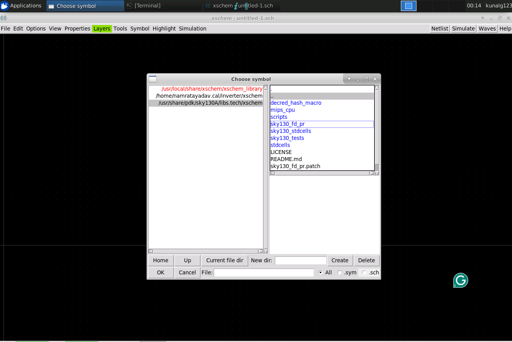
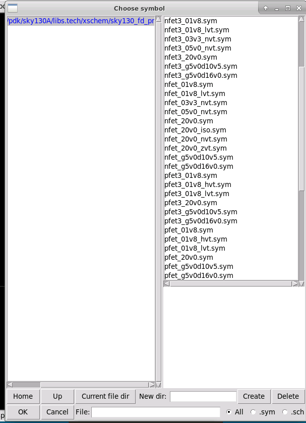
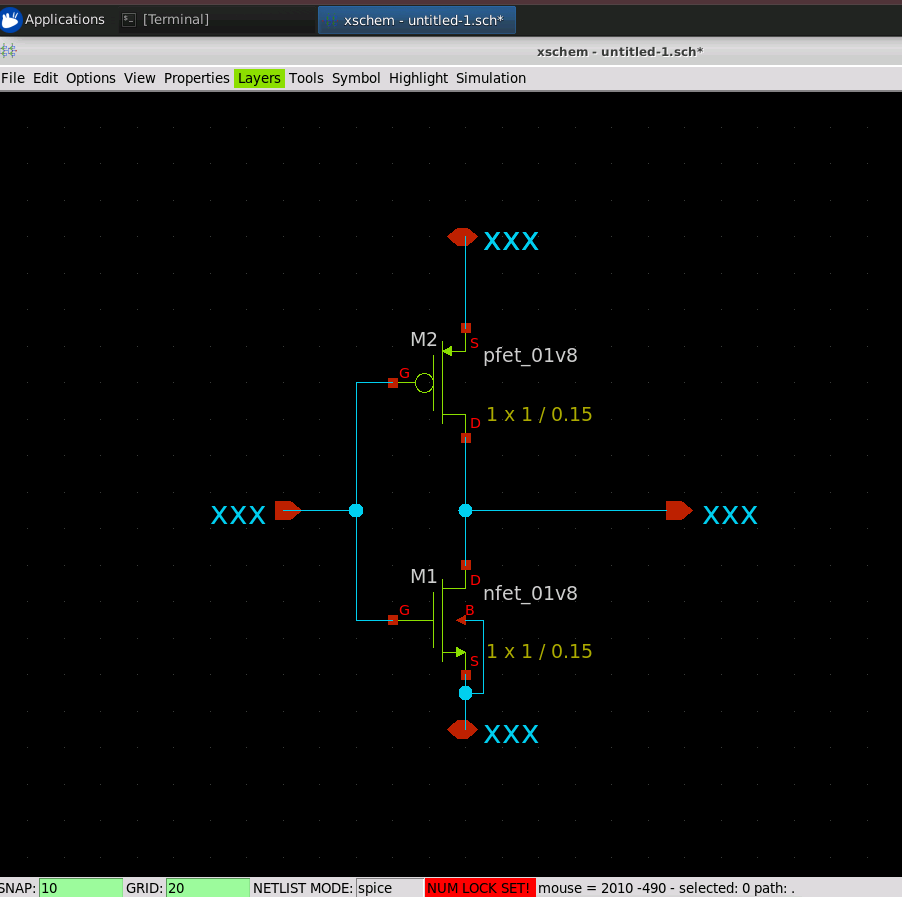
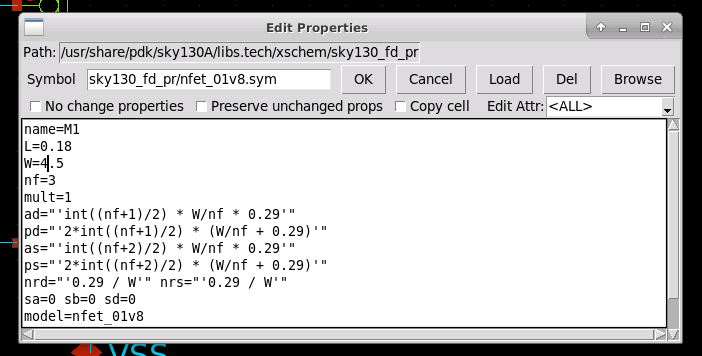
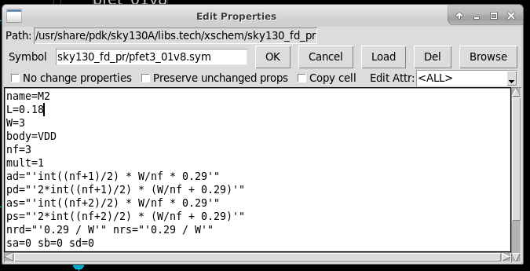
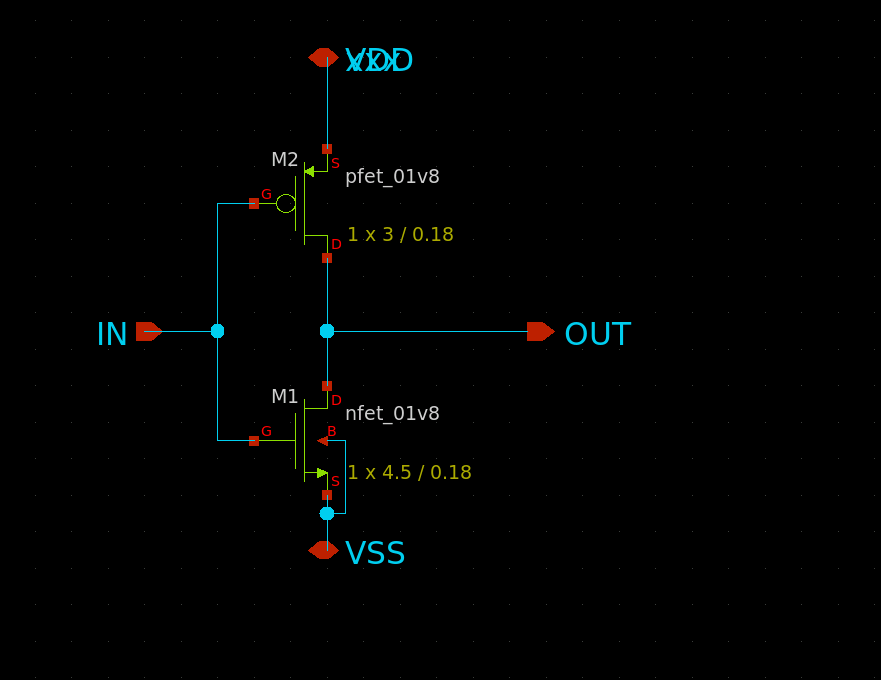

# L3 — CMOS Inverter Schematic Design using Xschem

## Objective

The objective of this lab is to create a **CMOS inverter schematic using SKY130 devices in Xschem**. The NMOS and PMOS devices are instantiated from the SKY130 PDK, connected to form an inverter, configured with the required device dimensions, and saved for subsequent simulation and layout.

---

## 1. Create a New Schematic

Xschem was launched from the project `xschem` directory.

A new schematic was created using:

```text
File → New Schematic
```

The **Insert** key was used to open the **Choose Symbol** window.

---

## 2. Select SKY130 MOSFET Devices

From the symbol selection window, the SKY130 primitive device library was accessed through:

```text
/usr/share/pdk/sky130A/libs.tech/xschem/sky130_fd_pr
```



The following MOSFET symbols were selected:

- `nfet_01v8.sym` — NMOS transistor
- `pfet3_01v8.sym` — PMOS transistor



The PMOS was placed at the top and the NMOS at the bottom to form the basic CMOS inverter structure.

---

## 3. Add Input, Output, and Supply Pins

From the Xschem device library:

```text
xschem_library → devices
```

the following symbols were used:

- `ipin.sym` — Input pin
- `opin.sym` — Output pin
- `iopin.sym` — Supply/bidirectional pin

The pins were renamed as:

- `IN` — Inverter input
- `OUT` — Inverter output
- `VDD` — Positive supply
- `VSS` — Ground supply

---

## 4. Wire the CMOS Inverter

The **W** key was used to draw wires between the devices.

The following connections were made:

- PMOS gate and NMOS gate → `IN`
- PMOS drain and NMOS drain → `OUT`
- PMOS source → `VDD`
- NMOS source → `VSS`

This creates the standard CMOS inverter topology.



---

## 5. Configure the NMOS

The NMOS device properties were opened and configured as:

```text
name=M1
L=0.18
W=4.5
nf=3
mult=1
model=nfet_01v8
```

where:

- `L` — Channel length
- `W` — Device width
- `nf` — Number of fingers
- `mult` — Device multiplier



---

## 6. Configure the PMOS

The PMOS device properties were configured as:

```text
name=M2
L=0.18
W=3
nf=3
mult=1
body=VDD
```



---

## 7. Final CMOS Inverter Schematic

The completed CMOS inverter contains a PMOS pull-up device and an NMOS pull-down device.

Its basic operation is:

- When `IN = LOW`, the PMOS turns ON and pulls `OUT` toward `VDD`.
- When `IN = HIGH`, the NMOS turns ON and pulls `OUT` toward `VSS`.



---

## 8. Save the Schematic

The completed schematic was saved using:

```text
File → Save As
```

with the filename:

```text
inverter.sch
```

The schematic was saved inside the project `xschem` directory.

---

## Result

Successfully created a **SKY130 CMOS inverter schematic in Xschem** using the SKY130 NMOS and PMOS devices. The transistor parameters were configured, the `IN`, `OUT`, `VDD`, and `VSS` connections were established, and the completed design was saved as `inverter.sch` for subsequent simulation, layout, extraction, and physical verification.
