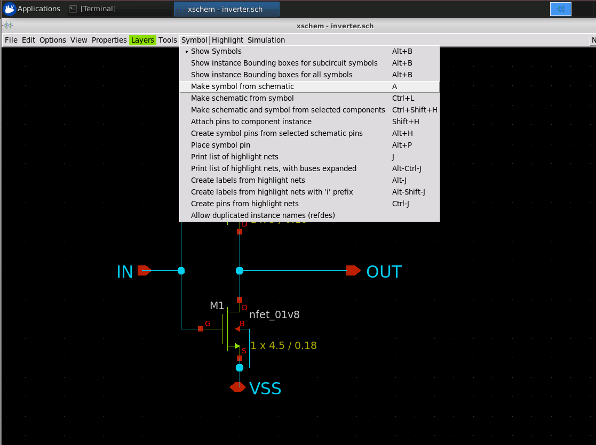
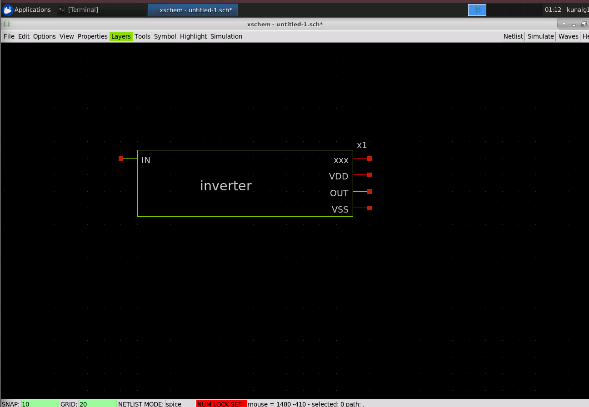
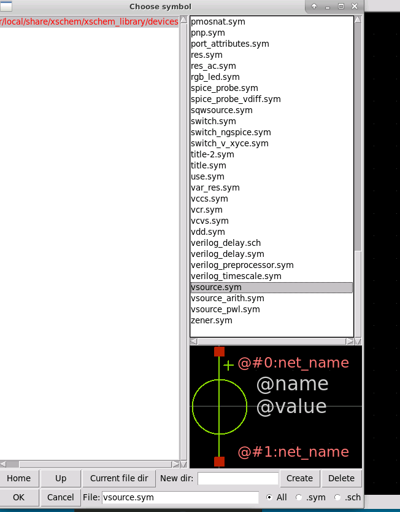
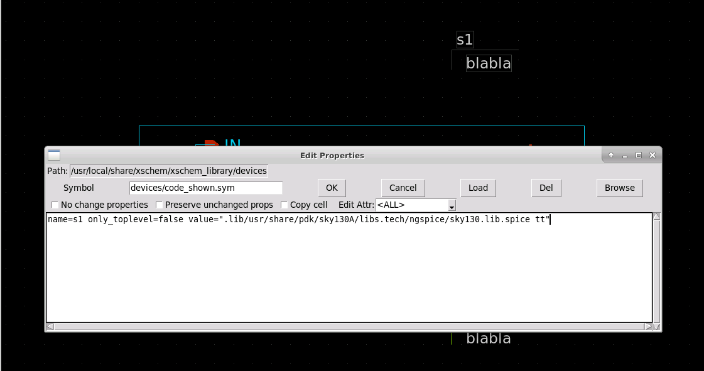
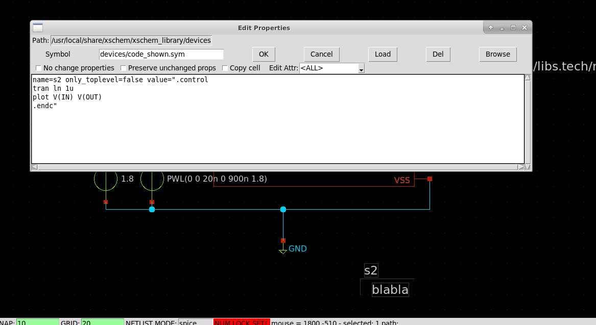
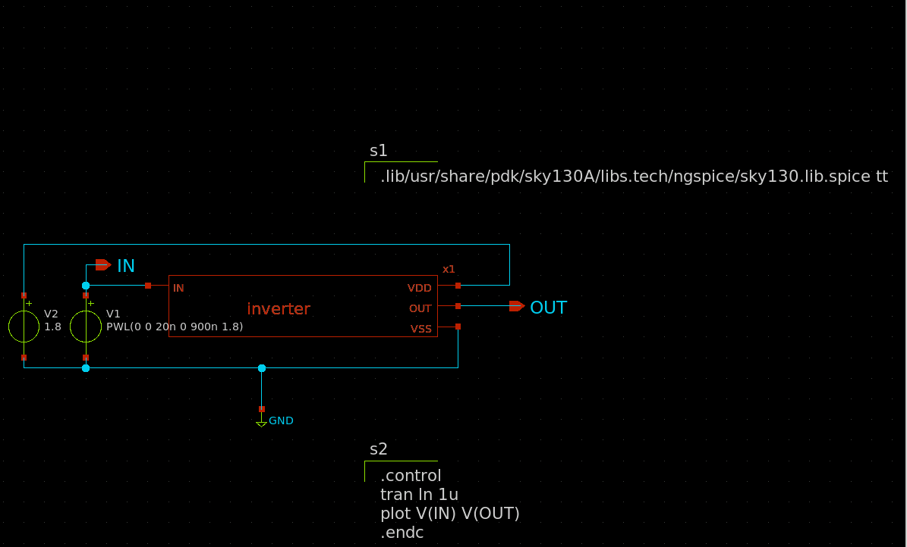
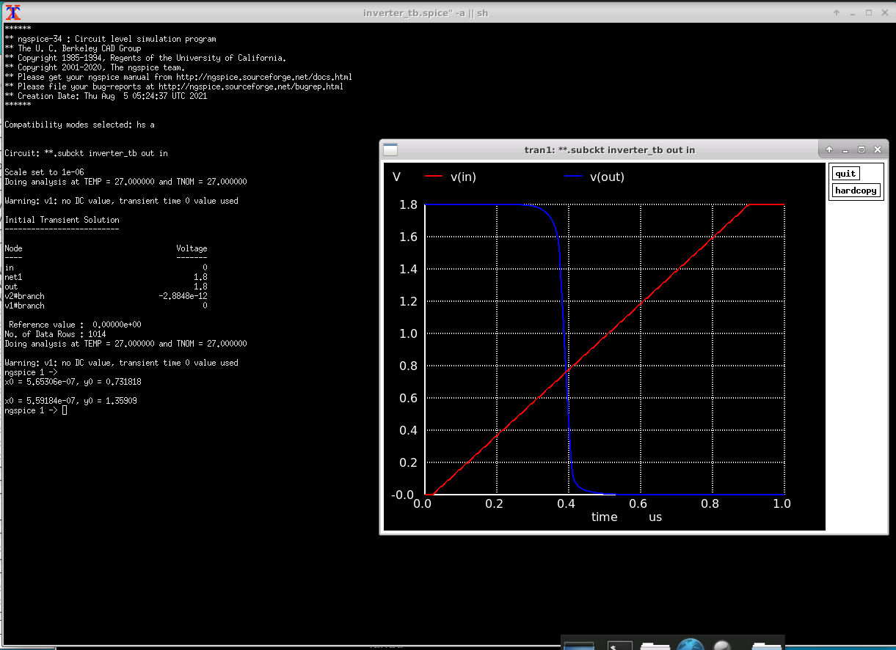
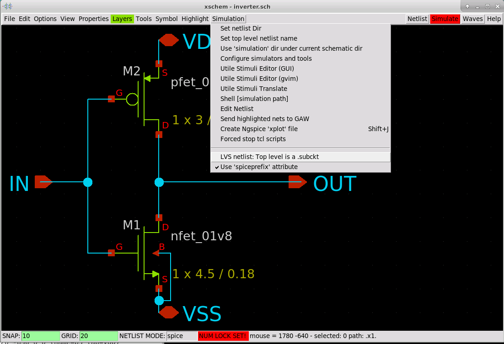

# L4 — Inverter Symbol Creation, Testbench & Functional Verification

## Overview

In this lab, I converted the transistor-level SKY130 CMOS inverter developed in the previous stage into a reusable hierarchical Xschem symbol and built a separate testbench for functional verification.

The inverter was simulated using **ngspice** with the **SKY130 TT device models** and a 1.8 V supply. During simulation, I encountered a hierarchical net-connectivity issue where the expected `OUT` node was not recognized by ngspice. I debugged the generated node connectivity, corrected the testbench/symbol connections, and successfully obtained the expected inverter transient response.

The schematic was then configured to generate a top-level `.subckt` netlist for subsequent LVS verification.

---

## Design Flow

```text
Transistor-Level Inverter
          ↓
Generate Hierarchical Symbol
          ↓
Create Simulation Testbench
          ↓
Apply VDD + PWL Input
          ↓
Include SKY130 TT Models
          ↓
Generate SPICE Netlist
          ↓
Transient Simulation
          ↓
Debug Net Connectivity
          ↓
Functional Verification
          ↓
Generate LVS-Ready .subckt
```

---

## 1. Hierarchical Inverter Symbol

The transistor-level inverter schematic contains four external terminals:

```text
IN
OUT
VDD
VSS
```

I generated a hierarchical symbol directly from the completed inverter schematic using Xschem.



The generated `inverter.sym` encapsulates the transistor-level implementation while exposing only the required external connections.



This allowed the inverter to be reused as a single circuit block in the simulation testbench while preserving the underlying PMOS/NMOS schematic hierarchy.

---

## 2. Testbench Development

I created a separate Xschem testbench and instantiated the generated inverter symbol.

Two voltage sources were used:

- **Supply:** `VDD = 1.8 V`
- **Input stimulus:** PWL source from 0 V to 1.8 V

The voltage sources were instantiated using `vsource.sym`.



The input stimulus used was:

```spice
PWL(0 0 20n 0 900n 1.8)
```

This provided a gradual input transition across the full 0–1.8 V operating range, allowing the inverter switching behavior to be observed during transient analysis.

---

## 3. SKY130 Model Setup

The SKY130 ngspice device models were included in the testbench using:

```spice
.lib /usr/share/pdk/sky130A/libs.tech/ngspice/sky130.lib.spice tt
```



The simulation was performed using the **Typical-Typical (`tt`) process corner**.

---

## 4. Transient Analysis Setup

Transient analysis was configured using:

```spice
.control
tran 1n 1u
plot V(IN) V(OUT)
.endc
```



The simulation used a **1 ns time step** over a total duration of **1 µs**, while monitoring both the input and output voltages.

The completed testbench contained the hierarchical inverter, VDD source, PWL input source, ground connection, SKY130 model inclusion, and transient-analysis commands.



---

## 5. Issue Encountered — Output Node Not Recognized

During the first simulation attempts, the transient analysis executed, but ngspice reported:

```text
Error: no such vector out
```

Instead of showing the expected nodes:

```text
IN
OUT
```

the ngspice node list contained automatically generated nodes such as:

```text
net1
net2
```

I initially verified `net1` and found that it remained at **1.8 V**, confirming that it corresponded to the VDD rail rather than the inverter output.

This indicated that the problem was not with the transient-analysis command itself. The issue was associated with **hierarchical pin/net connectivity between the inverter schematic, generated symbol, and testbench**.

### Debugging Approach

I checked:

- `IN`, `OUT`, `VDD`, and `VSS` connections in the transistor-level schematic
- Pin definitions in the generated inverter symbol
- Testbench wiring between the voltage sources and inverter symbol
- Input/output net naming
- Nodes recognized by the generated ngspice netlist

After correcting the hierarchical connectivity and regenerating the netlist, ngspice correctly recognized:

```text
in
out
net1
```

with `net1` representing the 1.8 V supply rail.

This resolved the:

```text
no such vector out
```

error and allowed the intended output waveform to be plotted.

---

## 6. Functional Verification

After resolving the connectivity issue, the transient simulation completed successfully.



The final waveform shows the expected CMOS inverter behavior:

| Input | Output |
|---|---|
| `VIN ≈ 0 V` | `VOUT ≈ 1.8 V` |
| `VIN ↑` | `VOUT ↓` |
| `VIN ≈ 1.8 V` | `VOUT ≈ 0 V` |

The input voltage increases from **0 V to 1.8 V**, while the output initially remains near **1.8 V** and then transitions sharply toward **0 V** as the input crosses the inverter switching region.

This successfully verified the logical inversion behavior of the SKY130 CMOS inverter before proceeding to physical layout verification.

---

## 7. LVS Netlist Preparation

After functional verification, I configured Xschem to generate the inverter as a top-level SPICE subcircuit by enabling:

```text
Simulation → LVS netlist: Top level is a .subckt
```



The generated schematic netlist is therefore represented hierarchically using:

```spice
.subckt inverter ...
...
.ends inverter
```

This provides the schematic-side subcircuit required for the later **Layout Versus Schematic (LVS)** comparison with the netlist extracted from the Magic layout.

---

## Results

| Item | Result |
|---|---|
| CMOS inverter symbol | Successfully generated |
| Hierarchical testbench | Completed |
| Supply voltage | 1.8 V |
| Input stimulus | PWL, 0–1.8 V |
| SKY130 model corner | TT |
| Transient analysis | 1 ns step, 1 µs duration |
| Input/output simulation | Passed |
| Hierarchical net issue | Debugged and resolved |
| LVS schematic netlist | Configured as `.subckt` |

---

## Key Learnings

- Created and reused a **hierarchical Xschem symbol** from a transistor-level schematic.
- Built an independent testbench for pre-layout functional verification.
- Used the **SKY130 ngspice TT models** for transistor-level simulation.
- Configured and analyzed transient inverter behavior.
- Learned that visually correct schematic wiring does not necessarily guarantee correct SPICE net naming across hierarchy.
- Used the **ngspice node list** to distinguish the VDD rail from the missing output node and isolate the connectivity issue.
- Successfully verified the expected complementary `VIN`/`VOUT` behavior.
- Prepared the schematic as a hierarchical `.subckt` for the upcoming LVS flow.

---

## Final Status

**Functional Verification: PASS**

```text
VIN:   0 V  ───────────────→  1.8 V
VOUT:  1.8 V ──────────────→  0 V
```

The inverter is functionally verified and the schematic netlist is prepared for the next stage of the physical verification flow.
