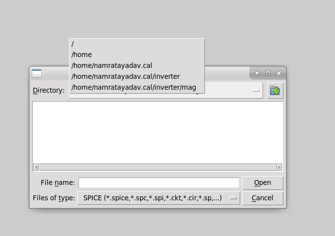
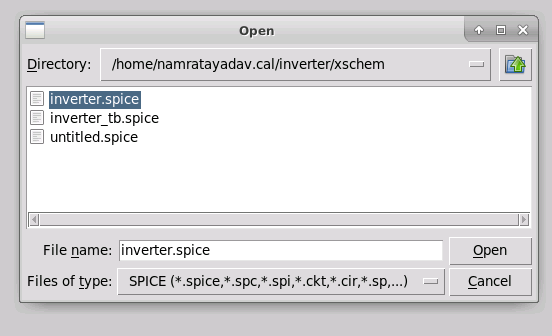
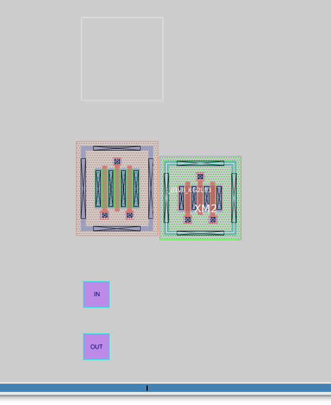
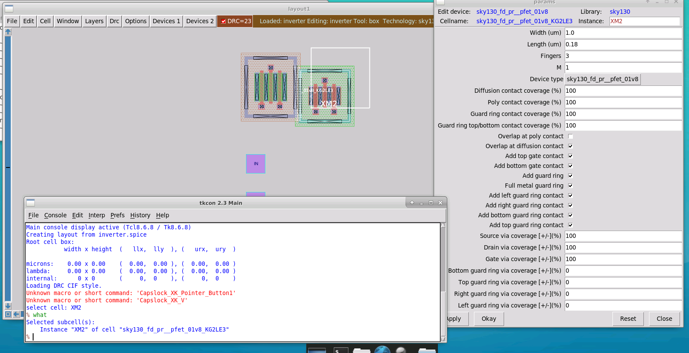
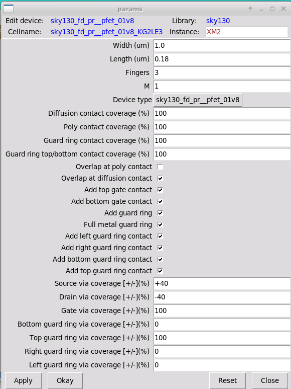
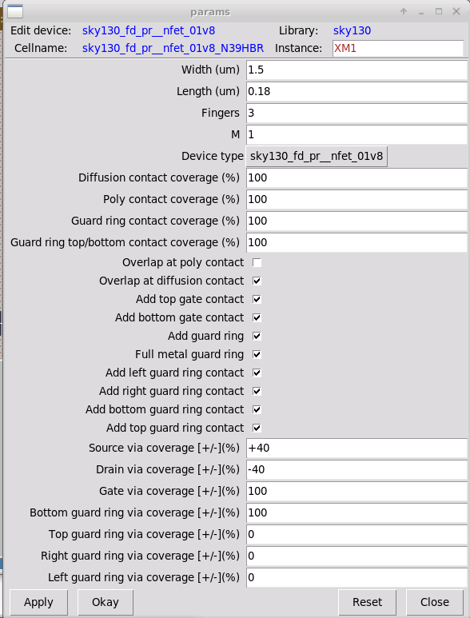
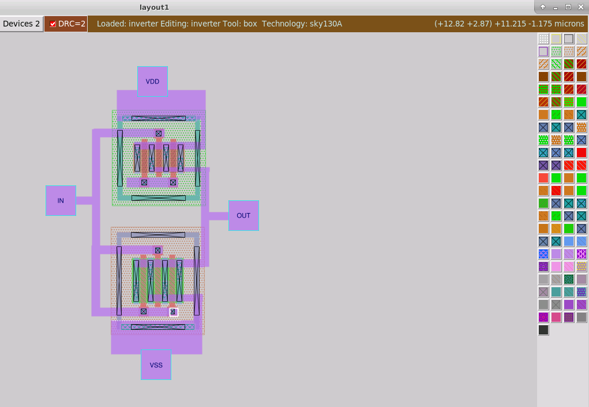

# L5 — Importing the Inverter Netlist into Magic and Building the Layout

## Overview

In this lab, I imported the SPICE netlist generated from the Xschem CMOS inverter into **Magic VLSI** and used the imported device instances to begin building the physical inverter layout.

The main focus was not only importing the schematic connectivity into Magic, but also understanding how the generated PFET and NFET instances could be repositioned and physically configured for practical routing.

I modified the device contact/via placement to make the source, drain, and guard-ring connections easier to route using Metal1, then connected the inverter terminals `IN`, `OUT`, `VDD`, and `VSS`.

The overall flow was:

```text
Xschem Inverter
      ↓
Generate inverter.spice
      ↓
Launch Magic with SKY130A
      ↓
Import SPICE Netlist
      ↓
Generate PFET/NFET Instances
      ↓
Inspect Device Parameters
      ↓
Modify Contact / Via Placement
      ↓
Reposition Devices and Pins
      ↓
Route IN / OUT / VDD / VSS
      ↓
Physical CMOS Inverter Layout
```

---

## 1. Launching Magic with the SKY130 PDK

I moved into the Magic working directory and launched Magic using:

```bash
cd ../mag
magic -d XR
```

Magic successfully loaded the SKY130A technology environment.


The technology information confirmed that the layout editor was running with:

```text
Technology: sky130A
```

This ensured that the imported transistor devices and physical layers would follow the SKY130 technology definitions.

---

## 2. Importing the Xschem SPICE Netlist

The schematic generated in Xschem was exported as:

```text
inverter.spice
```

Inside Magic, I used:

```text
File → Import SPICE
```

and navigated to the Xschem working directory.



The inverter SPICE netlist was then selected:

```text
inverter.spice
```



Magic interpreted the SPICE netlist and generated the corresponding physical device instances and top-level circuit ports.

---

## 3. Initial Layout Generated from the Netlist

After importing the SPICE netlist, Magic automatically created:

- PFET instance
- NFET instance
- `IN`
- `OUT`
- `VDD`
- `VSS`

The imported devices initially appeared close together and required repositioning before routing.



This stage showed how schematic connectivity can be converted into an initial physical-layout representation.

However, the imported placement is only a starting point. The devices still need to be arranged and routed manually to produce a clean physical layout.

---

## 4. Inspecting Device Instances

To work with the imported transistor instances, I learned how to select and inspect hierarchical device objects in Magic.

For selecting a complete device instance:

```text
Hover over device → press i
```

To identify the selected object from the Magic console:

```text
what
```

To open the device parameter window:

```text
Hover over device → i → Ctrl+P
```

The PFET instance parameters were inspected using this method.



This allowed me to inspect physical parameters such as:

```text
Width
Length
Number of fingers
Contact coverage
Via coverage
Guard-ring options
```

---

## 5. Repositioning Device Instances

The imported PFET and NFET needed to be repositioned to create a more practical inverter structure.

To move an entire device instance:

```text
1. Hover over the device
2. Press i to select the instance
3. Move the mouse pointer to the desired location
4. Press m
```

The device moves as a complete instance rather than moving individual geometry.

This was useful for arranging the PFET above the NFET, matching the conventional CMOS inverter layout structure.

For individual layout geometry or pins, I used:

```text
s
```

to select the geometry and:

```text
m
```

to move the selected object.

---

## 6. PFET Contact and Via Configuration

The PFET parameters were modified to make routing easier.

The following settings were changed:

```text
Source via coverage = +40
Drain via coverage  = -40
Top guard ring via coverage = 100
```



### Purpose of the changes

The source and drain via coverage settings were intentionally moved in opposite directions.

```text
Source → +40
Drain  → -40
```

This separates the source and drain access locations vertically, making it easier to connect horizontal Metal1 routes without overlapping the two terminals.

The PFET guard-ring setting:

```text
Top guard ring via coverage = 100
```

provides a Metal1-accessible guard-ring connection at the top of the PFET structure.

This is useful for connecting the PFET body/well structure to the VDD rail.

---

## 7. NFET Contact and Via Configuration

The same routing-oriented idea was applied to the NFET.

The NFET source and drain via coverage values were configured as:

```text
Source via coverage = +40
Drain via coverage  = -40
```



This produced better separation between the source and drain routing access points and made the final Metal1 connectivity easier to implement.

The parameter editing stage helped me understand that PCell parameters are not only used to define transistor dimensions, but also to control physical contact and via placement for layout optimization.

---

## 8. Routing the CMOS Inverter

After arranging the devices and modifying the contact positions, I routed the inverter connections.

Magic's continuous wiring mode was used:

```text
Spacebar → enter wiring mode
Left mouse button + drag → draw route
Middle mouse button → stop routing
```

The following electrical connections were completed:

```text
PFET source → VDD
NFET source → VSS

PFET gate ─┐
           ├── IN
NFET gate ─┘

PFET drain ─┐
            ├── OUT
NFET drain ─┘
```

The resulting layout is shown below.



The layout now physically represents the same electrical connectivity as the transistor-level inverter schematic.

---

## 9. Physical Design Decisions

Several physical-design decisions were made during this lab.

### Device placement

The PFET was positioned above the NFET to create a conventional CMOS inverter structure:

```text
VDD
 │
PFET
 │
OUT
 │
NFET
 │
VSS
```

This arrangement keeps the power rails naturally separated and allows the common drain connection to form the inverter output.

### Gate connection

The PFET and NFET gate regions were connected together to form the common:

```text
IN
```

node.

### Drain connection

The two drain terminals were connected together to form:

```text
OUT
```

### Contact positioning

The source and drain contacts were intentionally shifted in opposite directions using via-coverage parameters to improve routing accessibility.

This reduced routing congestion and made Metal1 connections easier to implement.

---

## 10. What I Learned

This lab helped connect the schematic-level representation of a circuit with its physical implementation.

Key concepts I learned include:

- Importing a SPICE netlist from Xschem into Magic
- Generating physical transistor instances from a schematic netlist
- Selecting hierarchical device instances in Magic
- Inspecting PCell parameters
- Moving entire PFET/NFET instances
- Understanding the difference between instance selection and geometry selection
- Modifying source/drain via placement for routing accessibility
- Configuring guard-ring connectivity
- Using Metal1 routing to implement circuit connectivity
- Translating schematic connectivity into a physical layout

---

## Current Result

The inverter netlist was successfully imported into Magic and converted into a routed physical layout.

```text
Xschem Netlist Import     ✓
PFET/NFET Generation      ✓
Device Placement          ✓
PCell Parameter Editing   ✓
Contact Optimization      ✓
IN Routing                ✓
OUT Routing               ✓
VDD Routing               ✓
VSS Routing               ✓
```

The physical layout now represents the intended CMOS inverter connectivity and is ready for subsequent physical verification steps.

---

## Next Step

The next stage is to verify the physical layout using:

```text
DRC
Extraction
Layout Netlist Generation
LVS
```

to ensure that the layout is both manufacturable and electrically equivalent to the original Xschem schematic.
