# L6 — Layout Extraction, LVS and Post-Layout Simulation

## Overview

In this lab, I completed the end-to-end physical verification flow for the SKY130 CMOS inverter.

Starting from the routed inverter layout in Magic, I extracted the layout netlist, generated an LVS-compatible SPICE representation, compared the layout netlist against the Xschem schematic using Netgen, inspected the LVS mismatch, extracted layout parasitics, and finally performed a post-layout ngspice simulation using the extracted Magic netlist.

The overall flow was:

```text
Completed Magic Layout
        ↓
Layout Extraction
        ↓
Generate Layout SPICE Netlist
        ↓
Run LVS with Netgen
        ↓
Inspect LVS Mismatch
        ↓
Extract Parasitics
        ↓
Inspect Extracted Netlist
        ↓
Verify Subcircuit Port Order
        ↓
Build Post-Layout Testbench
        ↓
Include Extracted Layout Netlist
        ↓
Run ngspice
        ↓
Verify Post-Layout Functionality
```

---

## 1. Layout Extraction in Magic

After completing the physical inverter layout, I extracted the electrical information from the geometry using Magic.

During extraction, Magic prompted for handling parameterized device cells.

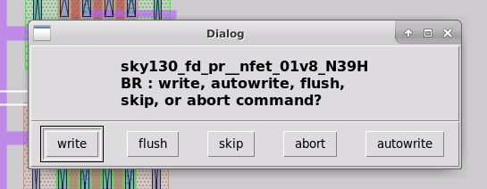

The extraction commands used were:

```tcl
extract do local
extract all
ext2spice lvs
ext2spice
```

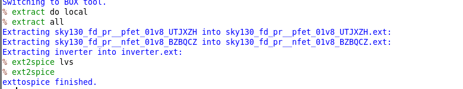

### `extract do local`

```tcl
extract do local
```

This configures Magic to perform extraction for the local cell hierarchy.

### `extract all`

```tcl
extract all
```

This extracts electrical information from the layout, including:

- device recognition
- node connectivity
- terminal information
- layout-derived parasitic information

Magic generates `.ext` files containing the extracted electrical representation.

### `ext2spice lvs`

```tcl
ext2spice lvs
```

This configures the SPICE output for LVS comparison.

The generated netlist is intended for comparison against the schematic representation.

### `ext2spice`

```tcl
ext2spice
```

This converts the Magic extraction data into a SPICE netlist.

The top-level extracted layout netlist was:

```text
inverter.spice
```

---

## 2. Extraction Files and Directory Cleanup

After extraction, I inspected the Magic working directory using:

```bash
ls -al
```

The extraction generated files including:

```text
inverter.ext
inverter.spice
device .ext files
device .mag files
```

The `.ext` files are intermediate extraction files generated by Magic.

After generating the required SPICE netlist, I removed the temporary extraction files using:

```bash
rm *.ext
```

The directory also contained additional parameterized-device `.mag` files generated during earlier device editing.

I cleaned the unreferenced PCell files using:

```bash
/usr/share/pdk/bin/cleanup_unref.py -remove .
```

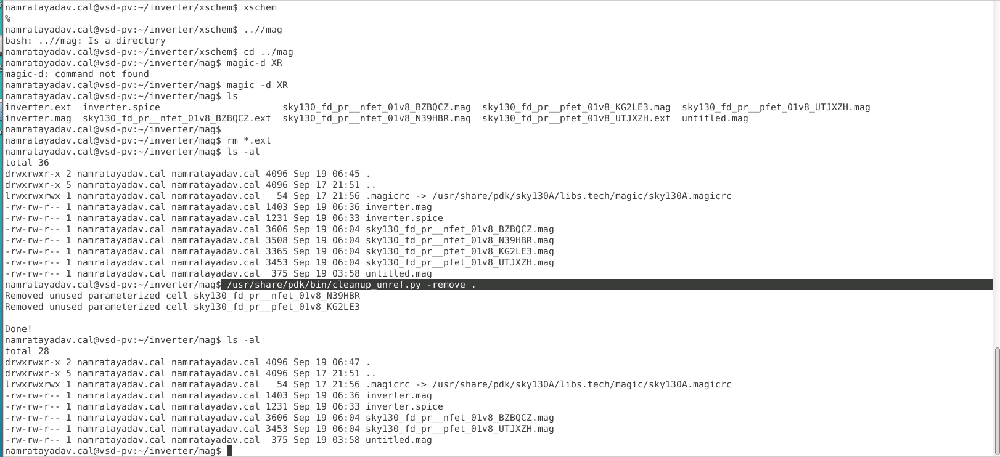

This removed unused parameterized cells while preserving the device cells referenced by the final inverter layout.

---

## 3. Running LVS with Netgen

I then moved to the Netgen directory:

```bash
cd ../netgen
```

and compared the extracted layout netlist against the schematic netlist using:

```bash
netgen -batch lvs "../mag/inverter.spice inverter" "../xschem/inverter.spice inverter"
```

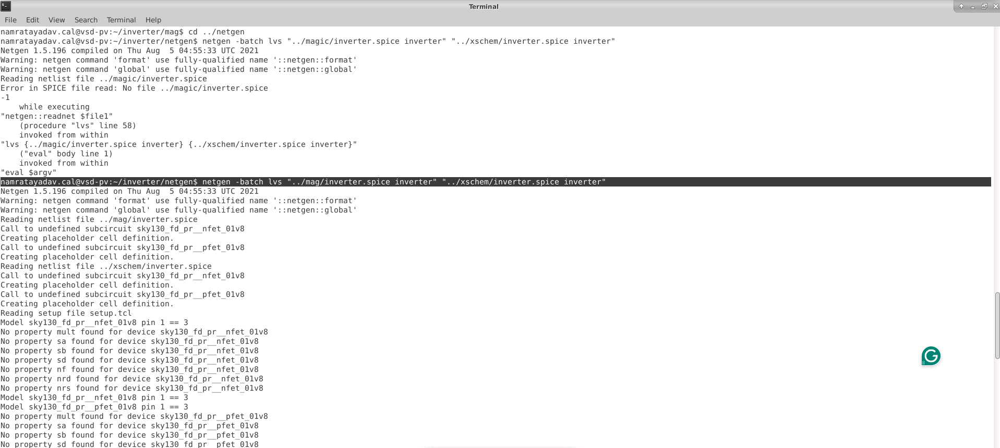

Each LVS argument contains:

```text
"netlist-file subcircuit-name"
```

For the layout:

```text
../mag/inverter.spice inverter
```

For the schematic:

```text
../xschem/inverter.spice inverter
```

I used the **layout netlist first** and the **schematic netlist second** so the comparison remained consistent while reviewing the Netgen output.

---

## 4. Initial LVS Result

The first LVS comparison did not pass.

Netgen reported a mismatch between the extracted layout and schematic representations.

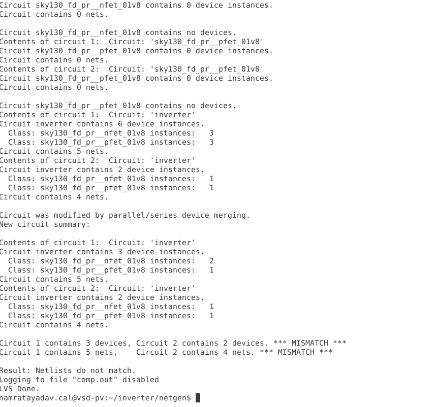

The output included:

```text
*** MISMATCH ***
```

and:

```text
Result: Netlists do not match.
```

The comparison showed differences in the number of devices and nets.

This demonstrated that a layout can appear physically connected while still being electrically different from the schematic.

The LVS output therefore became useful for checking:

- device count
- net count
- connectivity
- hierarchy
- port mapping
- device properties

---

## 5. Parasitic Extraction

After reviewing the LVS output, I returned to the Magic layout:

```bash
cd ../mag
magic -d XR inverter
```

The layout was extracted again.

To include all extracted capacitances in the SPICE netlist, I used:

```tcl
ext2spice cthresh 0
```

followed by:

```tcl
ext2spice
```

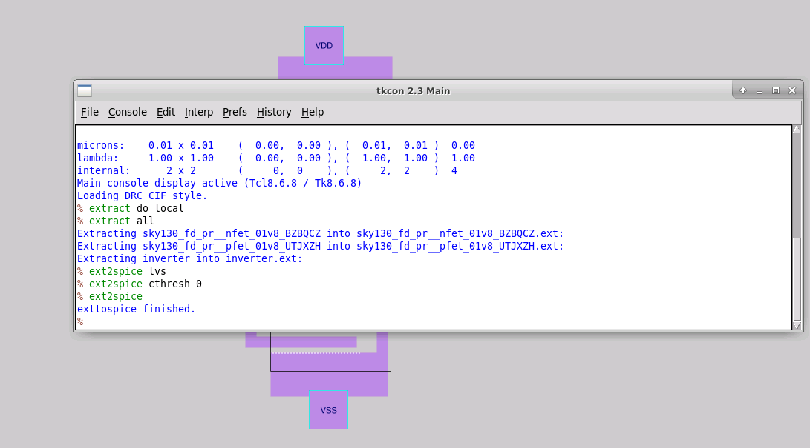

Setting:

```text
cthresh 0
```

forces Magic to retain extracted capacitances down to zero threshold in the output SPICE netlist.

---

## 6. Inspecting the Extracted Layout Netlist

I opened the extracted layout netlist using:

```bash
vi inverter.spice
```

The generated SPICE file contained many lines beginning with:

```text
C
```

representing parasitic capacitances extracted from the physical geometry.

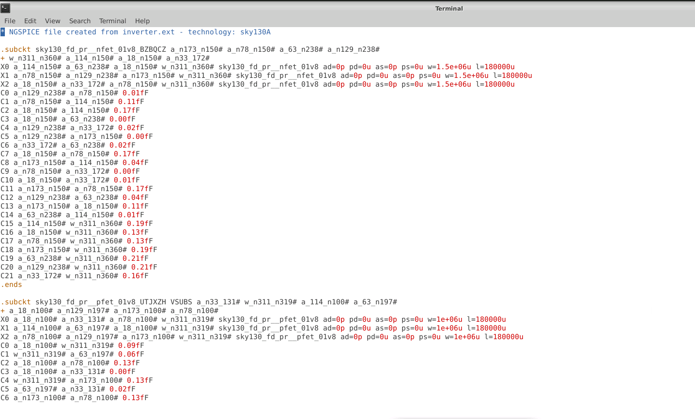

These capacitances were associated with:

- internal device nodes
- interconnect
- input/output nets
- supply rails
- substrate-related nodes

These parasitic components were not explicitly present in the original transistor-level schematic and were introduced by the physical layout.

---

## 7. Extracted Subcircuit and Port Order

The extracted layout netlist also contained the inverter subcircuit definition.

I noted the port order:

```spice
.subckt inverter IN OUT VDD VSS
```

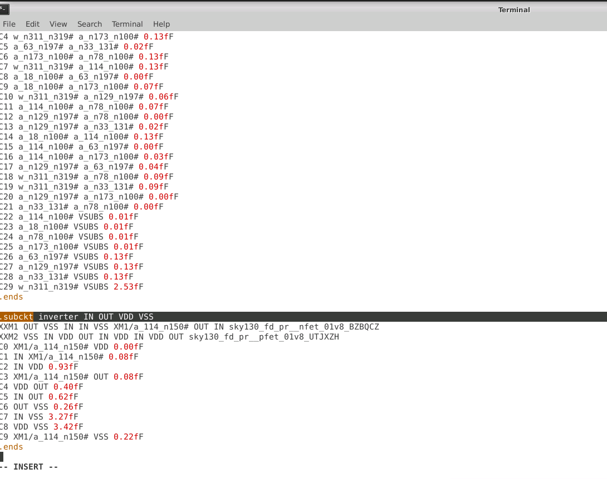

The extracted layout therefore expected the ports in the following order:

```text
IN
OUT
VDD
VSS
```

This became important when reusing the original Xschem testbench because SPICE subcircuit connections are positional.

---

## 8. Preparing the Post-Layout Testbench

I copied the original Xschem testbench into the Magic directory:

```bash
cp ../xschem/inverter_tb.spice .
```

The original testbench contained the schematic-level inverter representation.

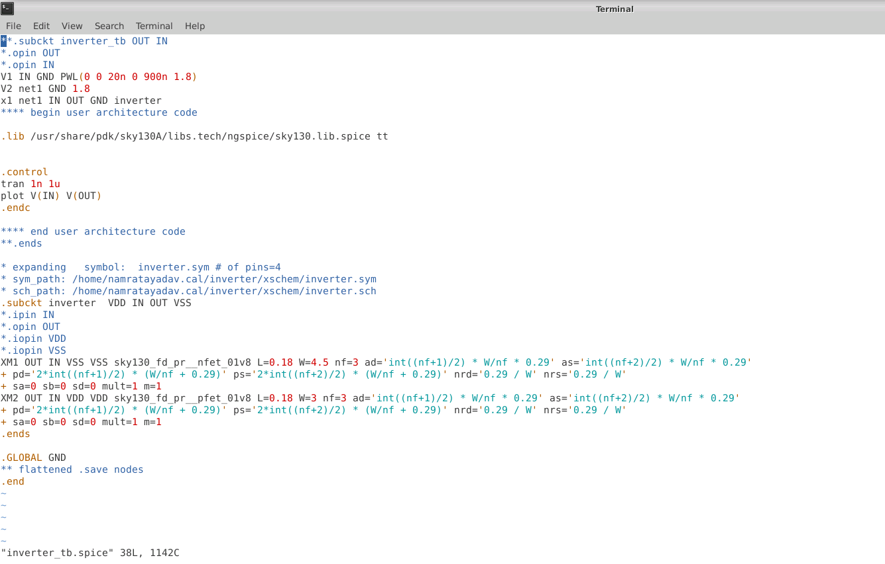

For post-layout simulation, I wanted the DUT to use the **layout-extracted inverter**, not the original schematic definition.

I therefore edited:

```bash
vi inverter_tb.spice
```

and replaced the schematic inverter definition with:

```spice
.include inverter.spice
```

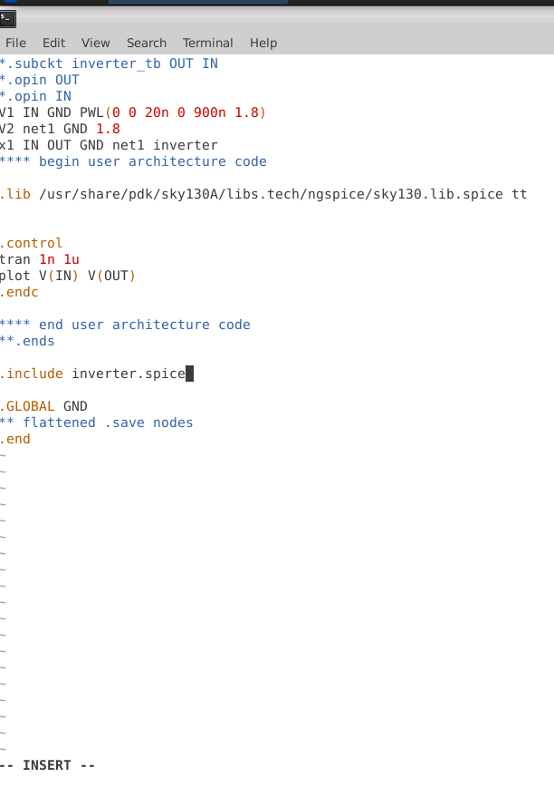

The rest of the testbench remained unchanged, including:

- PWL input source
- 1.8 V supply
- transient-analysis setup
- `V(IN)` and `V(OUT)` plotting commands

---

## 9. Matching the Subcircuit Port Order

Before running the post-layout simulation, I compared the inverter instance call in the testbench against the extracted layout subcircuit definition.

The extracted layout used:

```spice
.subckt inverter IN OUT VDD VSS
```

Therefore, the instance call had to map the testbench nets to this order correctly.

This step highlighted an important hierarchical SPICE concept:

> Subcircuit connections are position-dependent, so the instance call must match the port order defined by the `.subckt` statement.

An incorrect port order can result in a syntactically valid netlist with incorrect electrical behavior.

---

## 10. ngspice Setup

The ngspice initialization file was copied from the Xschem working directory:

```bash
cp ../xschem/.spiceinit .
```

The post-layout testbench was then simulated using:

```bash
ngspice inverter_tb.spice
```

---

## 11. Post-Layout Simulation

The extracted layout netlist successfully simulated in ngspice.

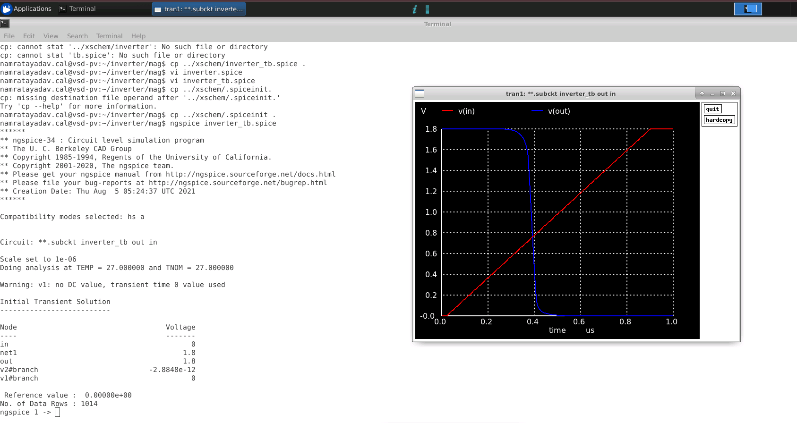

The waveform showed the expected inverter behavior:

```text
VIN : 0 V → 1.8 V
VOUT: 1.8 V → 0 V
```

The post-layout waveform remained close to the earlier schematic-level simulation.

For this small inverter, the extracted parasitic capacitances did not significantly alter the overall functional response.

---

## Pre-Layout vs. Post-Layout Flow

The pre-layout simulation used:

```text
Xschem Schematic
      ↓
SPICE Netlist
      ↓
ngspice
      ↓
Pre-Layout Waveform
```

The post-layout simulation used:

```text
Magic Layout
      ↓
Extraction
      ↓
Parasitic SPICE Netlist
      ↓
ngspice
      ↓
Post-Layout Waveform
```

This showed how simulation can move from an ideal schematic representation to a netlist derived from the actual physical implementation.

---

## Issues Encountered

### LVS Path Error

During an initial Netgen attempt, the layout netlist path was referenced incorrectly.

I corrected the relative path from the Netgen directory so that both netlists could be read successfully.

---

### LVS Mismatch

The initial LVS comparison reported:

```text
*** MISMATCH ***
```

with differences in the device and net counts.

The mismatch showed that LVS is not only a final pass/fail check but also an important debugging tool for identifying differences between schematic and layout representations.

---

### Unused PCell Files

Several parameterized device `.mag` files remained from previous layout edits.

I removed unreferenced device cells using:

```bash
/usr/share/pdk/bin/cleanup_unref.py -remove .
```

This cleaned the Magic working directory while retaining only the cells referenced by the final inverter layout.

---

### Post-Layout Testbench Modification

The original testbench referenced the schematic inverter.

For the post-layout simulation, I changed the testbench to use:

```spice
.include inverter.spice
```

so the extracted Magic netlist became the DUT.

I also verified the extracted `.subckt` port order before running ngspice.

---

## Results

| Stage | Result |
|---|---|
| Layout extraction | Completed |
| Layout SPICE generation | Completed |
| Netgen LVS execution | Completed |
| Initial LVS comparison | Mismatch observed |
| LVS mismatch inspection | Completed |
| Parasitic extraction | Completed |
| Extracted netlist inspection | Completed |
| Port-order verification | Completed |
| Post-layout testbench | Created |
| Post-layout ngspice simulation | Successful |
| CMOS inverter functionality | Preserved |

---

## Key Learnings

- Extracted electrical connectivity from the completed Magic layout.
- Generated LVS-oriented and simulation-oriented SPICE netlists.
- Understood the role of Magic `.ext` files as intermediate extraction data.
- Used Netgen to compare layout and schematic netlists.
- Observed how device count, net count, hierarchy, and port mapping affect LVS.
- Extracted physical parasitic capacitances using `ext2spice cthresh 0`.
- Inspected the extracted layout SPICE netlist directly.
- Verified the `.subckt` port order before hierarchical simulation.
- Adapted the original schematic testbench for post-layout simulation.
- Verified that the layout-extracted inverter still produced the expected functional response.

---

## End-to-End Flow Completed

This lab completed the full inverter design and verification path:

```text
SKY130 Devices
      ↓
Xschem Inverter Schematic
      ↓
Hierarchical Symbol
      ↓
Pre-Layout Simulation
      ↓
SPICE Netlist
      ↓
Magic Layout
      ↓
Physical Routing
      ↓
Layout Extraction
      ↓
LVS Comparison
      ↓
Parasitic Extraction
      ↓
Post-Layout Simulation
```

The exercise connected schematic capture, physical layout, extraction, LVS, parasitic analysis, and post-layout simulation into one complete physical-verification workflow.
