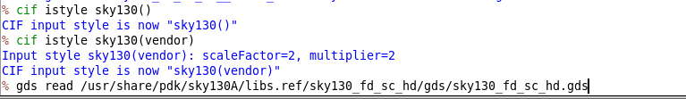
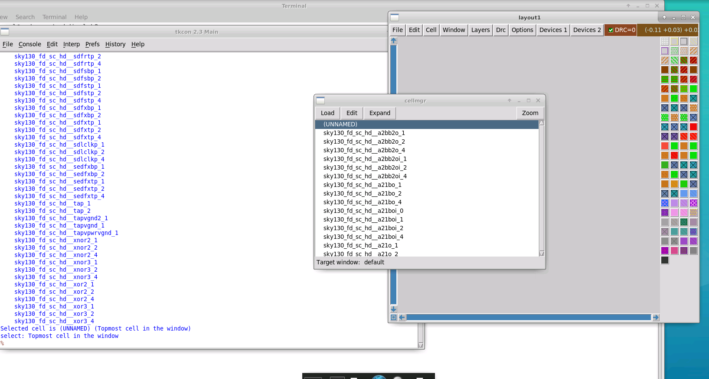
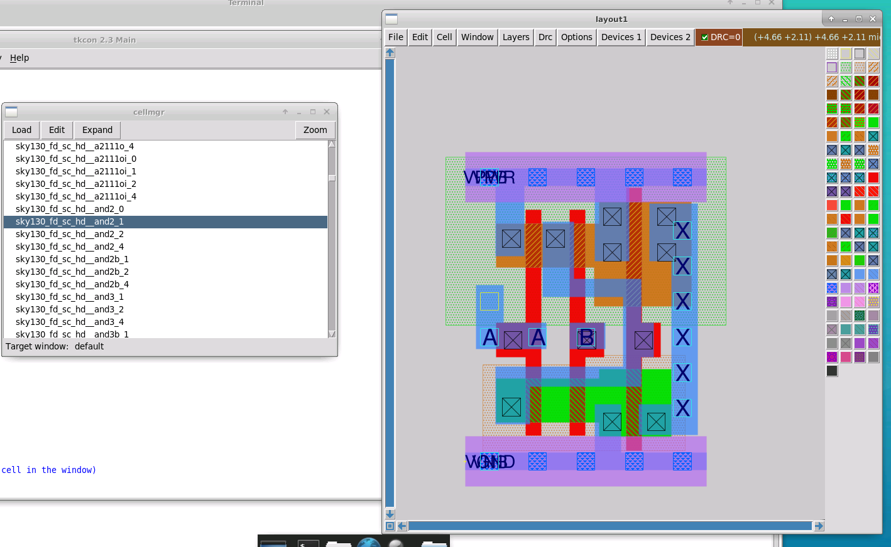

# L1 — Reading SKY130 GDS into Magic

## Overview

In this lab, I worked with the SKY130 standard-cell GDS library and explored how Magic reads GDS data, handles different input styles, identifies cells contained in a GDS library, and controls duplicate cell definitions.

The main focus was understanding how an external GDS library is brought into Magic and how the selected GDS/CIF input style affects the interpretation of labels and ports.

### Flow

```text
Set up SKY130 Magic environment
        ↓
Launch Magic
        ↓
Inspect available input styles
        ↓
Read SKY130 standard-cell GDS
        ↓
Inspect imported cells
        ↓
Load an individual standard cell
        ↓
Compare GDS input styles
        ↓
Enable duplicate protection
        ↓
Re-read GDS
```

---

## 1. SKY130 Magic Environment Setup

I created a separate working directory for the GDS read/write labs and configured Magic with the SKY130A technology file.

```bash
mkdir lab2
cd lab2

mkdir mag
cd mag

cp /usr/share/pdk/sky130A/libs.tech/magic/sky130A.magicrc ./.magicrc

magic -d XR
```

Magic successfully launched with the SKY130A technology environment.


---

## 2. Inspecting GDS/CIF Input Styles

Before reading the GDS library, I inspected the input styles available in Magic.

```tcl
cif listall istyle
```

This lists the known input styles.

I also checked the currently active input style using:

```tcl
cif list istyle
```

and explored changing the input style with:

```tcl
cif istyle sky130()
```

The different styles affect how information such as text, labels, and pins is interpreted when GDS data is read.

---

## 3. Reading the SKY130 Standard-Cell GDS

For the GDS file, I used the complete path to the SKY130 standard-cell library:

```tcl
gds read /usr/share/pdk/sky130A/libs.ref/sky130_fd_sc_hd/gds/sky130_fd_sc_hd.gds
```



Unlike Magic's native `.mag` database files, I explicitly provided the GDS path.

After reading the GDS, no single layout appeared automatically.

The file contains a **library of many standard cells**, rather than one instantiated top-level layout.

---

## 4. Inspecting the Imported Cells

After reading the GDS library, I inspected the available cells.

Because the cells had been read from the library but were not instantiated inside another parent layout, they appeared as independent top-level cells.

Magic's **Cell Manager** provided a convenient way to inspect the available cell definitions.



I selected and loaded:

```text
sky130_fd_sc_hd__and2_1
```

to inspect an individual SKY130 standard cell.



This exposed the actual physical implementation of the standard cell, including its geometry, routing layers, labels, and ports.

---

## 5. Comparing GDS Input Styles

I then changed the input style:

```tcl
cif istyle sky130()
```

and read the GDS library again.

The representation of the imported text/pin information changed.

With the vendor-oriented style, the standard-cell ports were represented as ports. With the alternate style, the corresponding information appeared as regular text rather than being interpreted in the same way as the standard-cell pins.

This demonstrated that the selected input style matters when importing a vendor-provided GDS library.

For a standard-cell GDS containing intended pin information, preserving the vendor interpretation is important.

---

## 6. Preventing Existing Cells from Being Overwritten

Re-reading the same GDS raised another question: what happens to cell definitions that Magic has already loaded?

I checked:

```tcl
gds noduplicates
```

and observed that duplicate protection was initially disabled.

I then enabled it:

```tcl
gds noduplicates true
```


After changing the input style and reading the GDS again, Magic preserved the cells that were already loaded.

The console reported messages such as:

```text
Using pre-existing cell definition
```


This confirmed that:

```tcl
gds noduplicates true
```

prevents an existing cell definition from being overwritten when the same cell is encountered during another GDS read.

I also explored returning to overwrite behavior using:

```tcl
gds noduplicates false
```

---

## Key Commands

```tcl
cif listall istyle
cif list istyle
cif istyle sky130()

gds read /usr/share/pdk/sky130A/libs.ref/sky130_fd_sc_hd/gds/sky130_fd_sc_hd.gds

gds noduplicates
gds noduplicates true
gds noduplicates false
```

---

## Key Learnings

- Read the SKY130 standard-cell GDS library into Magic.
- Explored Magic's GDS/CIF input styles.
- Understood that a standard-cell GDS can contain many independent cell definitions rather than one top-level design.
- Used the Cell Manager to inspect cells loaded from the GDS library.
- Loaded and inspected a SKY130 `AND2` standard cell.
- Observed how the selected input style changes the interpretation of labels and ports.
- Learned why the vendor input style is important when reading vendor-provided standard-cell data.
- Used `gds noduplicates` to control whether previously loaded cell definitions are overwritten.

---

## Result

```text
SKY130 Magic setup          ✓
GDS library read            ✓
Standard cells discovered   ✓
AND2 cell inspected         ✓
Input styles compared       ✓
Duplicate handling tested   ✓
```

The SKY130 standard-cell GDS library was successfully imported and inspected, providing the foundation for the next lab on **ports and pin handling**.
