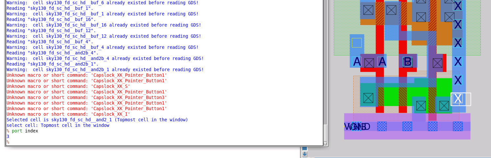

# L2 — Port Metadata and Annotation in Magic

## Overview

In this lab, I investigated how ports are represented when a SKY130 standard-cell layout is imported into Magic from GDS.

The main issue explored was that **GDS preserves physical geometry and labels, but does not contain all of the metadata required to completely describe a standard-cell interface**.

After reading the SKY130 standard-cell GDS, Magic could identify ports, but information such as port class, port use, and the vendor-defined port ordering was either missing or assigned automatically.

I used the vendor **LEF** and **SPICE** libraries to annotate the imported GDS layout with this missing information.

The overall flow was:

```text
SKY130 Standard-Cell GDS
        ↓
Inspect Existing Ports
        ↓
Query Port Index / Name / Class / Use
        ↓
Compare Against Vendor SPICE
        ↓
Identify Incorrect Port Ordering
        ↓
Read Vendor LEF
        ↓
Recover Port Class / Use Metadata
        ↓
Read Vendor SPICE Metadata
        ↓
Recover Vendor Port Ordering
        ↓
Verify Correct Port Definition
```

---

## 1. Inspecting Ports in the Imported Layout

I continued with the SKY130 standard-cell library imported in the previous lab and inspected:

```text
sky130_fd_sc_hd__and2_1
```

Magic allows information about a selected port label to be queried using:

```tcl
port index
```

For example, selecting the `X` output label and running:

```tcl
port index
```

returned its assigned port index.



One limitation of this method is that exactly one label must be selected.

When multiple overlapping labels were selected, Magic reported:

```text
Exactly one label may be present under the cursor box.
Use "port <name> ..." to specify a unique port.
```

This made direct graphical inspection difficult for locations containing overlapping labels.

---

## 2. Querying Ports by Index

A more reliable way to inspect the complete port definition was to query ports directly from the Magic console.

I first used:

```tcl
port first
```

to determine the first numbered port.

The returned index was:

```text
1
```

Individual properties could then be queried using:

```tcl
port 1 name
port 1 class
port 1 use
```

Initially, Magic reported the port name but the additional metadata appeared as:

```text
default
```

for properties such as port class and use.

This demonstrated that the GDS representation alone did not provide all of the interface metadata expected for the standard cell.

---

## 3. Checking the Vendor SPICE Definition

Because the port order generated by Magic was not guaranteed to match the vendor definition, I inspected the SKY130 standard-cell SPICE library.

I navigated to:

```bash
cd /usr/share/pdk/sky130A/libs.ref/sky130_fd_sc_hd/spice
```

and inspected:

```text
sky130_fd_sc_hd.spice
```


I located the subcircuit definition for:

```text
sky130_fd_sc_hd__and2_1
```

The vendor SPICE file defined the cell as:

```spice
.subckt sky130_fd_sc_hd__and2_1 A B VGND VNB VPB VPWR X
```


Therefore, the vendor-defined port order was:

```text
1 → A
2 → B
3 → VGND
4 → VNB
5 → VPB
6 → VPWR
7 → X
```

This is important because the ordering of nodes in a SPICE `.subckt` definition determines how a hierarchical instance is electrically connected.

---

## 4. Identifying the Port-Order Problem

Before annotation, Magic assigned its own port ordering after reading the GDS.

For example, querying:

```tcl
port first
port 1 name
```

did not initially identify `A` as the first port.

However, the vendor SPICE definition clearly specified:

```spice
.subckt sky130_fd_sc_hd__and2_1 A B VGND VNB VPB VPWR X
```

with:

```text
A
```

as the first terminal.

This showed that the automatically generated Magic port ordering did not reproduce the vendor's intended SPICE port order.

The underlying reason is that the required port-order metadata is not inherently available from the GDS representation being read.

---

## 5. Annotating the Layout with LEF Metadata

The SKY130 library also provides a LEF representation containing additional physical interface information.

I loaded the vendor LEF using:

```tcl
lef read /usr/share/pdk/sky130A/libs.ref/sky130_fd_sc_hd/lef/sky130_fd_sc_hd.lef
```

Magic detected that the cells already existed in memory.

Instead of replacing the detailed GDS layouts with LEF abstract views, Magic used the matching LEF macros to **annotate the existing cells**.

After LEF annotation, I repeated:

```tcl
port 1 name
port 1 use
port 1 class
```


The port now contained additional metadata.

For example, the power port could be identified with information such as:

```text
use   → power
class → bidirectional
```

instead of the original generic:

```text
default
```

This demonstrated how LEF supplements information that is missing from the GDS representation.

---

## 6. What LEF Fixed — and What It Did Not

Reading the LEF improved the port metadata by supplying information such as:

```text
port use
port class
```

However, it did **not** correct the vendor SPICE port ordering.

The first Magic port still did not necessarily correspond to the first port in the vendor `.subckt` definition.

Therefore:

```text
GDS
 ↓
geometry + labels

LEF
 ↓
physical interface metadata
(port class/use)

SPICE/CDL
 ↓
electrical connectivity
+ authoritative subcircuit port order
```

All three representations contribute different information about the same standard cell.

---

## 7. Annotating Port Order from SPICE

To recover the correct vendor-defined port order, I used the provided Magic Tcl procedure:

```tcl
readspice
```

with the SKY130 standard-cell SPICE library.

Conceptually, this uses the SPICE `.subckt` definitions to annotate the existing Magic cells with the correct terminal ordering.

After applying the SPICE annotation, I returned to the `AND2_1` cell and queried:

```tcl
port first
```

followed by:

```tcl
port 1 name
```


The result now showed:

```text
port first
→ 1

port 1 name
→ A
```

This matched the vendor SPICE definition:

```spice
.subckt sky130_fd_sc_hd__and2_1 A B VGND VNB VPB VPWR X
```

The SPICE-based annotation therefore restored the intended port ordering.

---

## 8. Verifying the Port Information

I also used graphical port selection together with:

```tcl
port index
```

to inspect the port assignment directly on the physical cell.


This connected the physical labels visible in the Magic layout with their electrical port definitions.

---

## Metadata Across GDS, LEF and SPICE

A major takeaway from this lab was understanding why a physical-verification flow often requires multiple representations of the same library.

| File | Information used in this lab |
|---|---|
| **GDS** | Detailed physical geometry and labels |
| **LEF** | Interface/port metadata such as use and class |
| **SPICE/CDL** | Electrical connectivity and authoritative subcircuit port order |

The complete cell representation therefore comes from combining information from multiple sources:

```text
             GDS
              │
        Physical Geometry
              │
              ▼
        ┌───────────┐
LEF ───►│   Magic   │◄─── SPICE
        └───────────┘
   Port metadata       Port order /
   class + use         connectivity
```

---

## Issue Encountered

### Ambiguous Port Selection

When querying:

```tcl
port index
```

from the layout, I found that Magic requires exactly one label to be selected.

For locations containing multiple or overlapping labels, Magic reported:

```text
Exactly one label may be present under the cursor box.
```

Instead of relying only on graphical selection, I used indexed port queries:

```tcl
port first
port 1 name
port 1 class
port 1 use
```

This provided a more reliable way to inspect individual port properties.

---

## Key Commands

```tcl
port index

port first
port 1 name
port 1 class
port 1 use
```

LEF annotation:

```tcl
lef read /usr/share/pdk/sky130A/libs.ref/sky130_fd_sc_hd/lef/sky130_fd_sc_hd.lef
```

SPICE metadata annotation:

```tcl
readspice /usr/share/pdk/sky130A/libs.ref/sky130_fd_sc_hd/spice/sky130_fd_sc_hd.spice
```

Vendor SPICE inspection:

```bash
cd /usr/share/pdk/sky130A/libs.ref/sky130_fd_sc_hd/spice
vi sky130_fd_sc_hd.spice
```

---

## Key Learnings

- Queried physical-layout ports directly in Magic.
- Used `port first` and indexed queries to inspect port properties.
- Identified that GDS alone does not preserve all required port metadata.
- Compared Magic's automatically assigned port ordering against the vendor SPICE definition.
- Verified the authoritative `AND2_1` subcircuit terminal order from the SKY130 SPICE library.
- Used LEF to annotate existing detailed layouts with additional port metadata.
- Observed port `use` and `class` information after LEF annotation.
- Used SPICE-based annotation to restore the vendor-defined port ordering.
- Understood why GDS, LEF, and SPICE/CDL complement each other in a physical-verification flow.

---

## Result

The imported SKY130 `AND2_1` layout was successfully augmented with metadata from the vendor LEF and SPICE representations.

```text
GDS geometry loaded             ✓
Physical ports inspected        ✓
Initial port order checked      ✓
Vendor SPICE order verified     ✓
LEF metadata annotated          ✓
Port use/class recovered        ✓
SPICE port order annotated      ✓
Port 1 verified as A            ✓
```

The lab demonstrated that a complete standard-cell representation cannot always be reconstructed from GDS geometry alone; the accompanying LEF and SPICE/CDL views provide additional metadata required for downstream extraction and hierarchical verification.

The next lab explores **abstract views** and how LEF representations are used when the complete detailed layout is not required.
