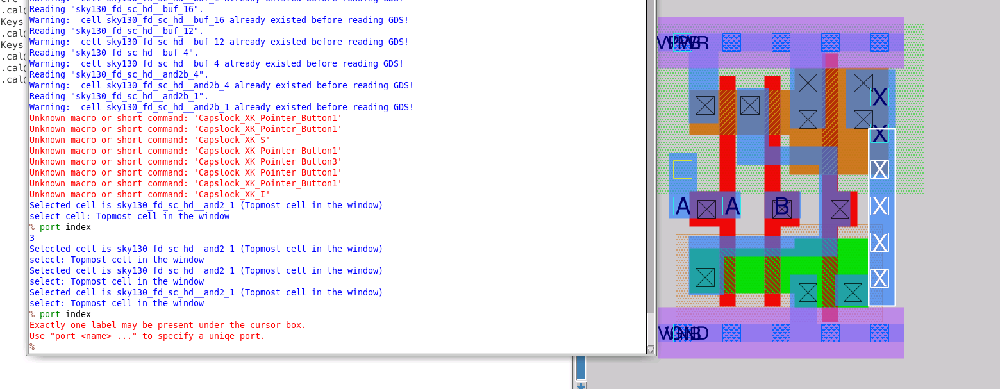
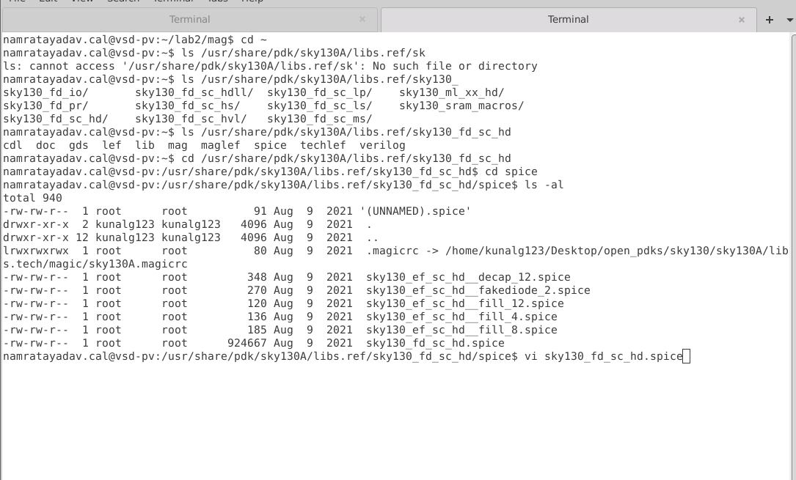
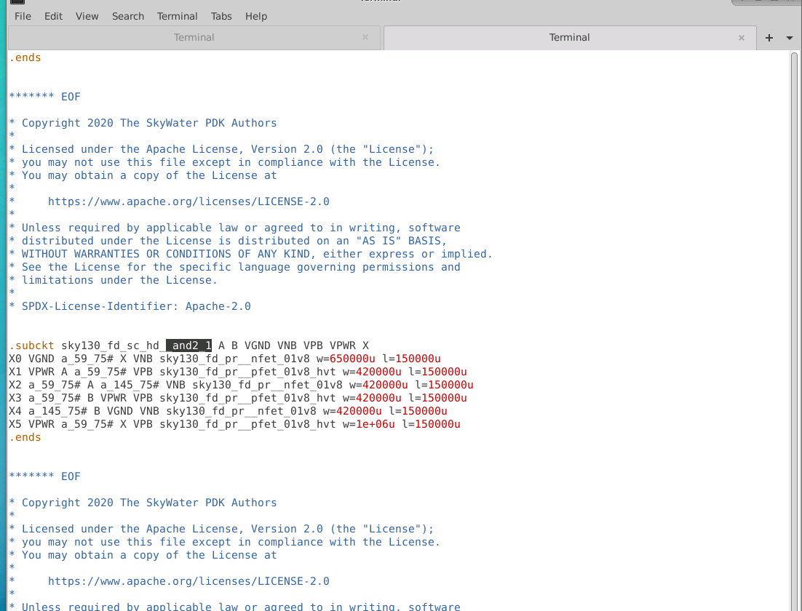
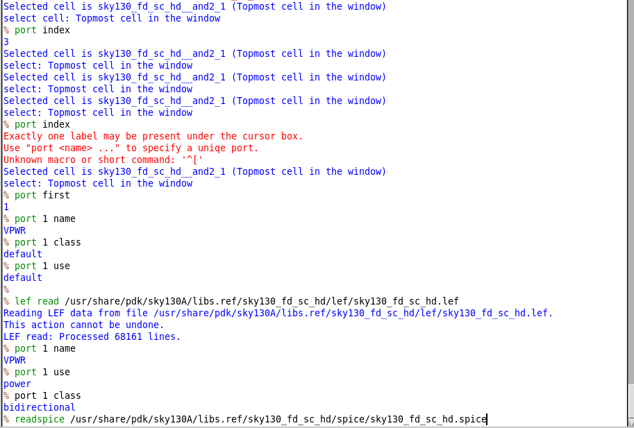
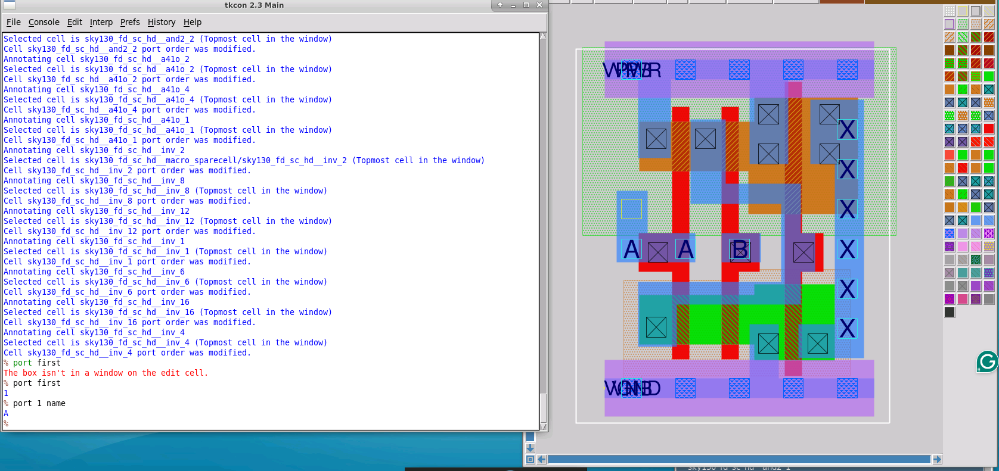

# L2 — Port Metadata and Annotation in Magic

## Overview

In this lab, I investigated how port information is represented when a SKY130 standard-cell layout is imported into Magic from GDS.

The GDS layout contains the physical geometry and labels of the standard cell, but some information required to fully describe the cell interface is not preserved as part of the GDS representation.

I therefore compared the port information initially available from the GDS against the vendor SPICE definition, then used the SKY130 LEF and SPICE data to annotate the layout with additional metadata and recover the vendor-defined port ordering.

The overall flow was:

```text
SKY130 Standard-Cell GDS
        ↓
Inspect Existing Ports
        ↓
Query Port Index
        ↓
Observe Ambiguous Label Selection
        ↓
Inspect Port Name / Class / Use
        ↓
Compare Against Vendor SPICE
        ↓
Identify Port-Order Difference
        ↓
Read Vendor LEF
        ↓
Recover Port Class / Use
        ↓
Annotate Using Vendor SPICE
        ↓
Recover Correct Port Order
```

---

## 1. Inspecting Ports in the GDS Layout

I continued working with the SKY130 standard cell:

```text
sky130_fd_sc_hd__and2_1
```

After reading the standard-cell GDS into Magic, the layout already contained visible labels corresponding to signals such as:

```text
A
B
X
VPWR
VGND
```

I started by investigating how Magic associates these labels with ports.

---

## 2. Querying a Single Port

Magic provides:

```tcl
port index
```

to return the index associated with the selected port.

I selected a single `X` label and executed:

```tcl
port index
```

Magic returned:

```text
3
```


This confirmed that when exactly one port label is selected, Magic can directly return the port index assigned to that label.

In this case:

```text
Selected label → X
Magic port index → 3
```

However, this index was Magic's current port assignment and did not yet prove that the ordering matched the vendor SPICE definition.

---

## 3. Multiple / Overlapping Port Labels

I then encountered a limitation of querying ports directly from the layout.

Some locations contain multiple or overlapping labels. If more than one label is selected and I execute:

```tcl
port index
```

Magic cannot determine which port is being requested.



The console reported:

```text
Exactly one label may be present under the cursor box.
Use "port <name> ..." to specify a unique port.
```

This demonstrated the difference between the two cases:

```text
Exactly one label selected
        ↓
port index
        ↓
Port index returned successfully
```

versus:

```text
Multiple / overlapping labels selected
        ↓
port index
        ↓
Ambiguous selection
        ↓
Specify a unique port explicitly
```

This became especially relevant for supply labels, where multiple labels can visually overlap.

Instead of relying only on graphical selection, I used Magic's indexed port-query commands to inspect the ports systematically.

---

## 4. Inspecting Ports by Index

I used:

```tcl
port first
```

to determine the first numbered port.

Magic returned:

```text
1
```

I could then query information about that port using:

```tcl
port 1 name
port 1 class
port 1 use
```

Initially, properties such as port class and use were reported as:

```text
default
```

This indicated that the imported GDS did not provide all of the metadata needed to fully describe the function of each port.

More importantly, the port numbering assigned by Magic needed to be compared against the vendor's electrical definition.

---

## 5. Checking the Vendor SPICE Library

To determine the authoritative electrical port order, I inspected the SKY130 vendor SPICE library.

I navigated to:

```bash
cd /usr/share/pdk/sky130A/libs.ref/sky130_fd_sc_hd/spice
```

and inspected the available files.



I opened:

```bash
vi sky130_fd_sc_hd.spice
```

and searched for the `AND2_1` standard-cell definition.

---

## 6. Vendor-Defined AND2 Port Order

The vendor SPICE library contained the subcircuit definition:

```spice
.subckt sky130_fd_sc_hd__and2_1 A B VGND VNB VPB VPWR X
```



Therefore, the vendor-defined order is:

```text
1 → A
2 → B
3 → VGND
4 → VNB
5 → VPB
6 → VPWR
7 → X
```

This exposed an important problem.

Before annotation, Magic reported a different first port. The port order generated from the GDS therefore did not match the order defined by the vendor SPICE model.

The vendor SPICE definition must be treated as the electrical reference because hierarchical SPICE connectivity depends on the order of the terminals in the `.subckt` definition.

---

## 7. Why GDS Alone Was Not Enough

The experiment demonstrated that the GDS representation provided the physical cell layout but did not provide all of the metadata required to reconstruct the complete vendor interface.

In particular, I needed additional information for:

```text
Port class
Port use
Vendor-defined port order
```

The different library views provide complementary information:

```text
GDS
 │
 └── Detailed physical geometry + labels

LEF
 │
 └── Port / interface metadata

SPICE
 │
 └── Electrical connectivity + subcircuit port order
```

Therefore, the complete standard-cell representation required information from more than the GDS file alone.

---

## 8. Annotating the Existing Layout Using LEF

The SKY130 standard-cell library also provides a LEF representation.

I read the LEF file using:

```tcl
lef read /usr/share/pdk/sky130A/libs.ref/sky130_fd_sc_hd/lef/sky130_fd_sc_hd.lef
```

Because the detailed GDS cells were already loaded into Magic, the matching LEF macros were used to annotate the existing cells rather than simply replacing them with abstract layouts.

After reading the LEF, I queried the port information again:

```tcl
port 1 name
port 1 use
port 1 class
```



The additional metadata now contained meaningful information.

For example:

```text
use   → power
class → bidirectional
```

instead of:

```text
default
```

This confirmed that LEF could provide port metadata that was missing from the GDS import.

---

## 9. What LEF Corrected

After LEF annotation, Magic had more information about what the ports represented.

For example, the library could distinguish information such as:

```text
signal
power
ground
```

through the corresponding port metadata.

However, the vendor-defined **port ordering** was still a separate issue.

The first port still needed to match the electrical interface defined by:

```spice
.subckt sky130_fd_sc_hd__and2_1 A B VGND VNB VPB VPWR X
```

The required ordering information was therefore obtained from the SPICE representation.

---

## 10. Annotating Port Order from SPICE

I used the provided Magic Tcl `readspice` procedure to annotate the loaded cells using the SKY130 SPICE library.

This allowed Magic to associate the port ordering with the corresponding vendor `.subckt` definitions.

After performing the SPICE annotation, I returned to the `AND2_1` cell and checked:

```tcl
port first
```

Magic returned:

```text
1
```

I then queried:

```tcl
port 1 name
```

and obtained:

```text
A
```



This now matched the vendor definition:

```spice
.subckt sky130_fd_sc_hd__and2_1 A B VGND VNB VPB VPWR X
```

Therefore:

```text
Vendor SPICE first port → A
Magic first port after annotation → A
```

The port annotation was successful.

---

## GDS + LEF + SPICE Relationship

This lab helped clarify the role of the different standard-cell views.

| Library View | Information Used |
|---|---|
| **GDS** | Detailed physical geometry and labels |
| **LEF** | Port/interface metadata such as class and use |
| **SPICE/CDL** | Electrical connectivity and vendor subcircuit port order |

Together:

```text
                  GDS
                   │
                   │ Physical geometry
                   ▼
             ┌───────────┐
             │   Magic   │
             └───────────┘
               ▲       ▲
               │       │
        LEF ───┘       └─── SPICE
        │                   │
   Port metadata       Electrical connectivity
   class / use         + port ordering
```

Using all three views provides a more complete representation of the standard cell than relying on GDS alone.

---

## Issue Encountered — Ambiguous Port Selection

One practical issue I encountered was selecting individual labels from the physical layout.

With exactly one label selected:

```tcl
port index
```

successfully returned the associated port number.

With multiple labels under the cursor:

```tcl
port index
```

failed with:

```text
Exactly one label may be present under the cursor box.
Use "port <name> ..." to specify a unique port.
```

I resolved this by using explicit/indexed port queries such as:

```tcl
port first
port 1 name
port 1 class
port 1 use
```

instead of depending entirely on graphical label selection.

---

## Key Commands

### Inspecting ports

```tcl
port index
port first
port 1 name
port 1 class
port 1 use
```

### Reading LEF metadata

```tcl
lef read /usr/share/pdk/sky130A/libs.ref/sky130_fd_sc_hd/lef/sky130_fd_sc_hd.lef
```

### Inspecting vendor SPICE

```bash
cd /usr/share/pdk/sky130A/libs.ref/sky130_fd_sc_hd/spice
vi sky130_fd_sc_hd.spice
```

The SPICE library was then used with the available `readspice` Tcl procedure to annotate the loaded cells with the vendor port ordering.

---

## Key Learnings

- Inspected ports directly from a SKY130 standard-cell layout in Magic.
- Used `port index` to determine the index of a single selected port.
- Observed that `port index` becomes ambiguous when multiple labels are selected.
- Used indexed port queries as a more reliable method of inspecting port information.
- Compared Magic's initial port assignment against the vendor SPICE definition.
- Verified the authoritative `AND2_1` terminal ordering from the SKY130 SPICE library.
- Used LEF to recover additional port metadata such as `use` and `class`.
- Used SPICE-based annotation to recover the vendor-defined port ordering.
- Verified that port 1 became `A`, matching the vendor `.subckt`.
- Understood how GDS, LEF, and SPICE provide complementary views of the same standard cell.

---

## Result

The SKY130 `AND2_1` layout was successfully augmented with metadata from the vendor LEF and SPICE representations.

```text
GDS layout loaded                 ✓
Single port index queried         ✓
Ambiguous selection identified    ✓
Vendor SPICE inspected            ✓
Vendor port order established     ✓
LEF metadata annotated            ✓
Port class/use recovered          ✓
SPICE port ordering annotated     ✓
Port 1 verified as A              ✓
```

The lab demonstrated why physical geometry alone is not sufficient to reconstruct all of the interface information required for a standard cell and how the GDS, LEF, and SPICE library views work together to provide that information.

The next lab explores **abstract views**.
