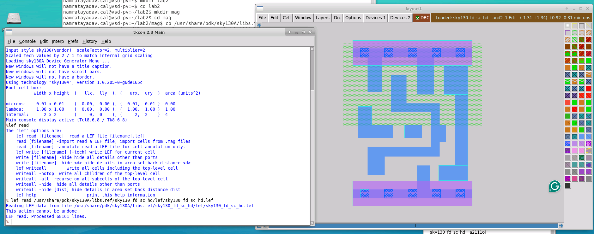
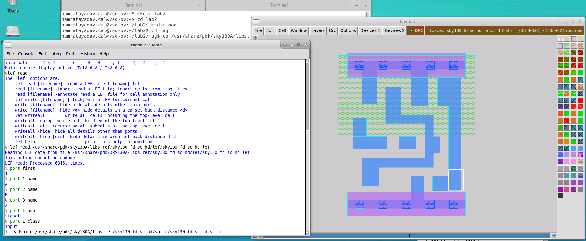
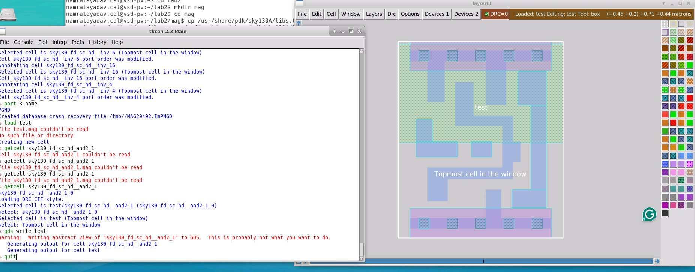
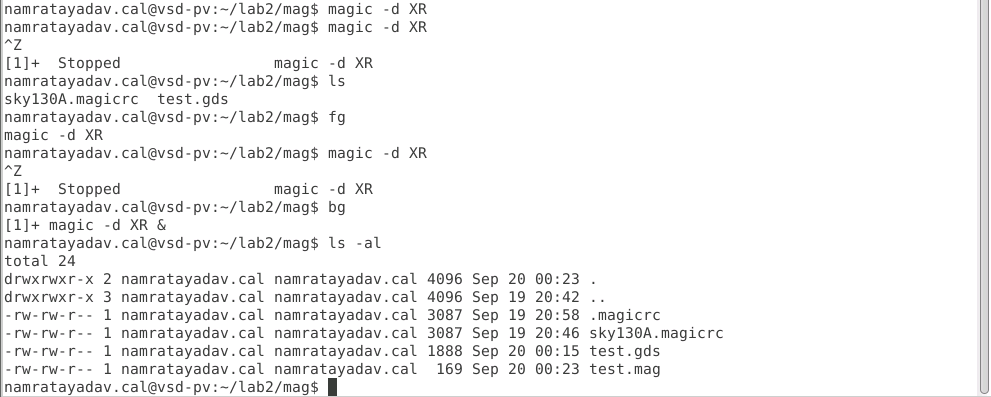
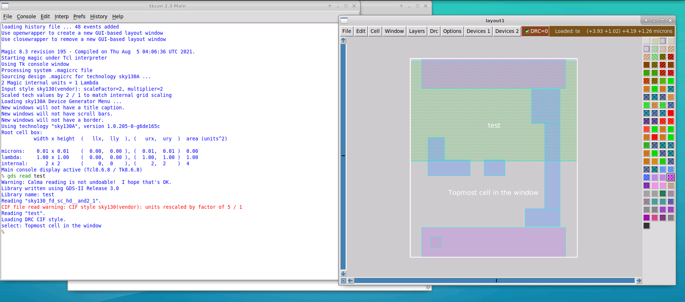
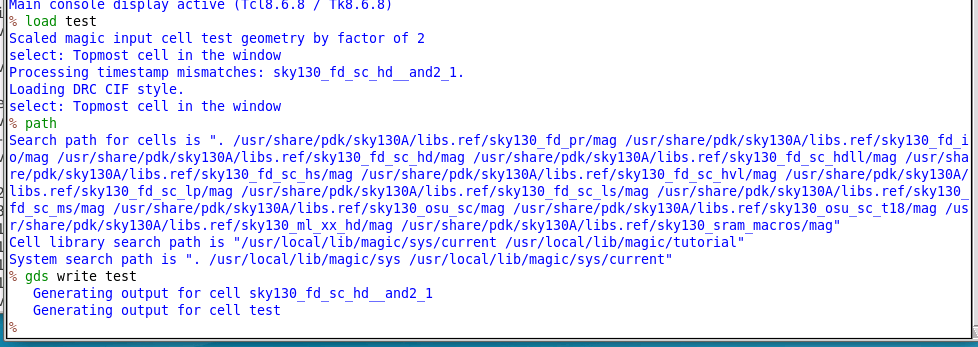
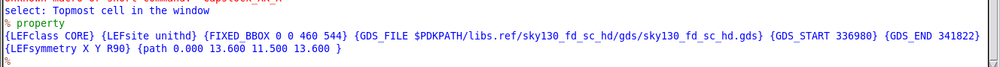
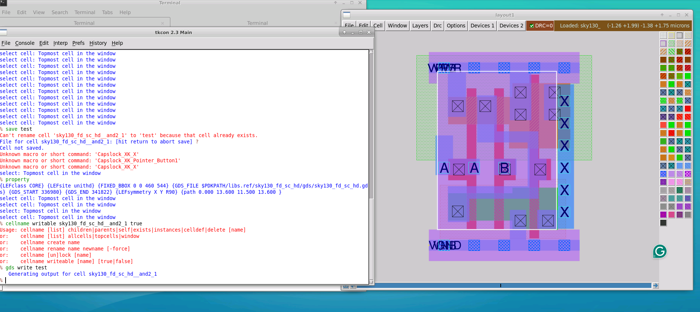
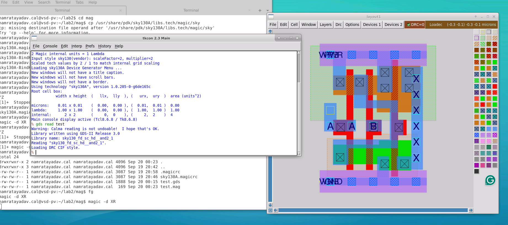

# L3 — Abstract Views and Library References in Magic

## Overview

In this lab, I explored how **abstract views** are represented in Magic and how they differ from full GDS layout data.

The lab demonstrated that LEF provides a simplified physical representation containing information required for placement and routing rather than the complete mask geometry of a standard cell.

I also investigated how Magic uses its library search path and embedded GDS metadata to reference the original vendor layout when a detailed cell is required.

The overall flow was:

```text
Start with Clean Magic Session
        ↓
Read SKY130 LEF
        ↓
Load Standard-Cell Abstract View
        ↓
Inspect Ports and Metadata
        ↓
Annotate Port Order from SPICE
        ↓
Instantiate Abstract Cell
        ↓
Attempt GDS Write
        ↓
Save Only Top-Level .mag
        ↓
Reload Using Magic Library Search Path
        ↓
Inspect GDS Reference Metadata
        ↓
Write Valid GDS Using Vendor Reference
```

---

## 1. Reading the LEF Library

I restarted Magic with a clean session and read the SKY130 standard-cell LEF library:

```tcl
lef read /usr/share/pdk/sky130A/libs.ref/sky130_fd_sc_hd/lef/sky130_fd_sc_hd.lef
```

Unlike a GDS read, reading the LEF library did not automatically display a layout in the editing window.

The LEF file contains library macros rather than a single top-level design.

I loaded a standard cell from the Cell Manager to inspect its representation.



The resulting layout was significantly simpler than the full GDS representation.

This is the **abstract view** of the standard cell.

---

## 2. What an Abstract View Contains

The LEF representation does not attempt to reproduce every mask shape in the detailed layout.

Instead, it mainly describes information required by higher-level physical-design tools, including:

- Cell boundary
- Placement size
- Pins
- Routing-access geometry
- Obstructions
- Port use and class

The detailed transistor and mask implementation remains hidden.

Conceptually:

```text
Full GDS View
────────────────────────
Transistors
Diffusion
Poly
Contacts
Metal
Vias
Wells
Detailed geometry


LEF Abstract View
────────────────────────
Cell boundary
Pins
Routing access
Obstructions
Placement information
```

This allows place-and-route tools to work with the cell without processing all of its internal geometry.

---

## 3. Inspecting Ports in the Abstract View

I queried the abstract cell ports using:

```tcl
port first
port 1 name
port 2 name
port 3 name
port 1 use
port 1 class
```



The LEF file preserved useful metadata such as:

```text
port use
port class
```

For example:

```text
use  → signal
class → input
```

However, the port ordering did not necessarily match the vendor SPICE subcircuit order.

This reinforced the result from L2:

```text
LEF → port type / use / physical interface metadata
SPICE → authoritative electrical port order
```

I therefore used the available `readspice` procedure to restore the vendor-defined SPICE port ordering.

---

## 4. Why Writing an Abstract View Directly to GDS Is Problematic

I created a new top-level cell named:

```text
test
```

and instantiated the standard-cell abstract view inside it.

I then attempted:

```tcl
gds write test
```



Magic produced a warning indicating that an abstract view was being written to GDS.

The reason is that LEF contains concepts such as:

```text
PIN
OBS / obstruction
```

that are not equivalent to normal manufacturing mask geometry.

In particular, an obstruction is metadata used by routing tools. It is not necessarily represented as a physical GDS mask layer.

Therefore, directly converting a LEF abstract view into GDS can result in missing information.

---

## 5. Saving Only the Top-Level Cell

Instead of saving every subcell, I saved only the current top-level design:

```tcl
save test
```

Magic's `save` command writes the cell currently being edited but does not automatically create local `.mag` copies of every referenced subcell.

After quitting Magic, the working directory contained files such as:

```text
test.mag
test.gds
```



There was no locally saved copy of the SKY130 standard cell.

This became important when the design was loaded again.

---

## 6. Reloading the Design

After restarting Magic, I loaded:

```tcl
load test
```

and expanded the standard-cell instance.

Instead of showing only the simplified LEF abstract geometry, Magic was able to locate the detailed SKY130 standard cell.



This happens because the SKY130 Magic setup defines search paths to the installed PDK libraries.

---

## 7. Magic Library Search Path

I inspected Magic's search paths using:

```tcl
path
```



The output included several directories inside the installed SKY130 PDK.

These paths allow Magic to resolve referenced cells without requiring local copies of every standard-cell `.mag` file.

Conceptually:

```text
test.mag
   │
   └── instance of SKY130 standard cell
                     │
                     ▼
              Magic search path
                     │
                     ▼
         Installed SKY130 PDK library
```

This allows a small local design database to reference cells maintained centrally in the PDK.

---

## 8. Inspecting the Library Cell Metadata

I descended into the referenced standard cell and queried its properties:

```tcl
property
```

The cell contained metadata similar to:

```text
LEFclass
LEFsite
FIXED_BBOX
GDS_FILE
GDS_START
GDS_END
LEFsymmetry
```



One of the most important properties was:

```text
GDS_FILE
```

along with offsets such as:

```text
GDS_START
GDS_END
```

These properties tell Magic where the original detailed GDS representation can be found.

The local Magic cell therefore acts partly as a **reference to the vendor GDS data** rather than simply being an independent copy of all geometry.

---

## 9. Referenced GDS as Another Form of Abstraction

This revealed another important concept.

Although the cell displayed in Magic looks like detailed physical geometry, the library cell can contain metadata pointing back to the original GDS source.

Conceptually:

```text
Magic Library Cell
      │
      ├── LEF metadata
      ├── Ports
      ├── Boundary information
      │
      └── GDS reference
              │
              ▼
        Vendor GDS file
```

When Magic writes GDS, it can use this reference to retrieve the original vendor geometry.

---

## 10. Testing the GDS Reference

To demonstrate this behavior, I forced the vendor cell to become writable and temporarily modified the displayed geometry.

I then wrote the design again using:

```tcl
gds write test
```



Because the cell contained metadata pointing to the original vendor GDS, the GDS writer could use the referenced vendor geometry rather than treating my temporary displayed modification as the authoritative source.

---

## 11. Re-Reading the Generated GDS

I restarted Magic and read the generated file:

```tcl
gds read test
```



The temporary geometry modification was not present in the newly read layout.

The original vendor cell geometry was preserved.

This demonstrated that the GDS reference metadata can cause Magic to use the original vendor GDS representation when writing the cell.

---

## Abstract View vs. Detailed View

The experiment helped distinguish three representations of the same standard cell.

| Representation | Main Purpose |
|---|---|
| **GDS** | Detailed physical mask geometry |
| **LEF** | Placement/routing abstract representation |
| **Magic library cell** | Local database representation with metadata and references to vendor data |

The relationship can be summarized as:

```text
               Vendor GDS
                   │
             detailed geometry
                   │
                   ▼
            Magic Library Cell
             ▲             ▲
             │             │
      LEF metadata      GDS reference
             │             │
             └──────┬──────┘
                    │
                    ▼
              User Design
```

---

## 12. Why Abstract Views Are Useful

Large digital designs may contain thousands or millions of standard-cell instances.

Using the complete transistor-level geometry for every instance during placement and routing would make the design database unnecessarily large and slow.

An abstract view provides only the information required by the higher-level tool:

```text
Cell dimensions
Pin locations
Routing access
Obstructions
Power rails
```

while hiding the detailed transistor implementation.

This allows hierarchical physical design to remain efficient.

---

## Read-Only GDS Concept

The lab also introduced Magic's read-only GDS flow.

The relevant options include:

```tcl
gds readonly true
gds rescale false
```

followed by reading the vendor GDS.

The purpose is to create a Magic representation that retains references to the vendor GDS rather than treating the imported geometry as an ordinary editable local layout.

The resulting cell can contain properties such as:

```text
GDS_FILE
GDS_START
GDS_END
```

which allow the detailed vendor geometry to be recovered when needed.

---

## Challenge / Complete Library-Cell Construction Flow

The final exercise combined the concepts from the previous labs.

A Magic standard-cell representation equivalent to the PDK library cell can be constructed conceptually by combining:

```text
Vendor GDS
   ↓
Read in read-only/reference mode
   ↓
Vendor LEF
   ↓
Annotate physical/port metadata
   ↓
Vendor SPICE
   ↓
Annotate electrical port ordering
   ↓
Save Magic library representation
```

This combines the complementary information contained in:

```text
GDS + LEF + SPICE
```

into a usable Magic database cell.

---

## Issues Encountered

### Writing an abstract LEF cell directly to GDS

Magic warned when I attempted:

```tcl
gds write test
```

with an abstract cell.

The reason is that an LEF abstract contains metadata such as routing obstructions that does not directly correspond to normal GDS manufacturing layers.

### Local subcell not saved

Using:

```tcl
save test
```

only saved the current top-level cell.

The referenced SKY130 standard cell was not copied locally.

Instead, Magic located it later using the search paths configured by the SKY130 PDK.

### Vendor library cell was not writable

The referenced standard cell originated from the installed PDK and was therefore treated as a library cell.

To experiment with modifications, it had to be explicitly made writable.

---

## Key Commands

### Read LEF

```tcl
lef read /usr/share/pdk/sky130A/libs.ref/sky130_fd_sc_hd/lef/sky130_fd_sc_hd.lef
```

### Inspect ports

```tcl
port first
port 1 name
port 2 name
port 3 name
port 1 use
port 1 class
```

### Create / load hierarchy

```tcl
load test
getcell sky130_fd_sc_hd__and2_1
```

### Save top-level database

```tcl
save test
```

### Inspect library paths

```tcl
path
```

### Inspect cell metadata

```tcl
property
```

### Write / read GDS

```tcl
gds write test
gds read test
```

### Read-only GDS concept

```tcl
gds readonly true
gds rescale false
```

---

## Key Learnings

- Loaded a SKY130 standard cell directly from LEF as an abstract view.
- Distinguished an LEF abstract view from full GDS geometry.
- Verified that LEF retains pin/use/class information but not authoritative SPICE port ordering.
- Observed why directly writing an abstract LEF representation to GDS is not appropriate.
- Learned that `save` only writes the currently edited Magic cell and does not automatically copy referenced library subcells.
- Inspected Magic's PDK search paths.
- Understood how a local layout can reference standard cells stored in the installed PDK.
- Inspected `GDS_FILE`, `GDS_START`, and `GDS_END` metadata.
- Demonstrated that Magic can preserve vendor geometry through GDS references.
- Learned the purpose of read-only GDS-backed library cells.
- Connected GDS, LEF, and SPICE metadata into a complete standard-cell library representation.

---

## Result

```text
LEF abstract view loaded           ✓
Abstract cell inspected            ✓
Port metadata inspected            ✓
Top-level test cell created        ✓
Abstract-to-GDS limitation seen    ✓
Magic search path inspected        ✓
GDS reference metadata inspected   ✓
Referenced-cell behavior tested    ✓
Vendor geometry preserved          ✓
```

This lab demonstrated how Magic uses abstract views and referenced library cells to efficiently work with vendor standard-cell libraries while retaining access to the original detailed GDS geometry.

The next lab moves into **basic extraction**.
