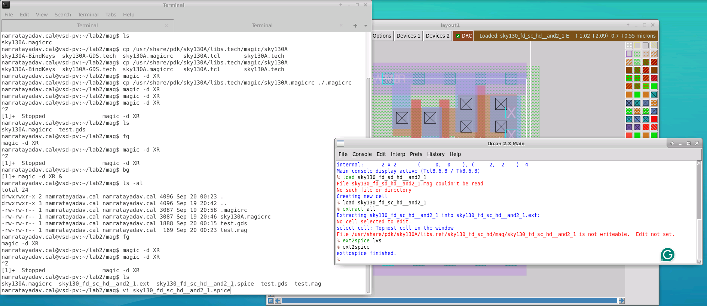
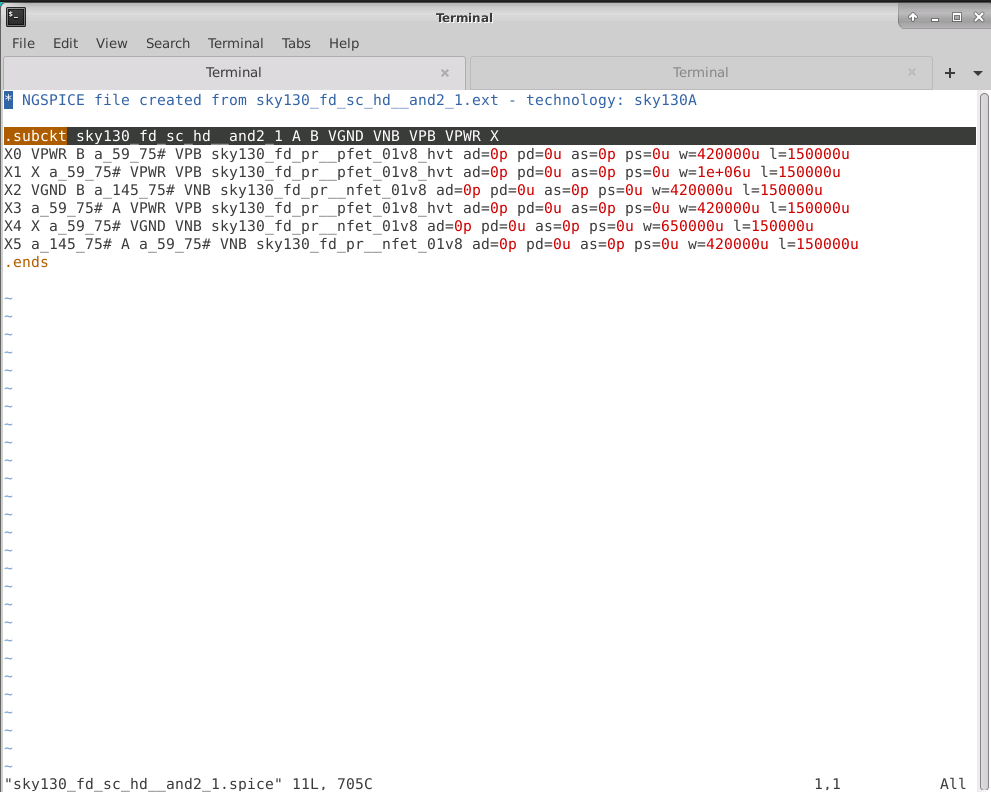
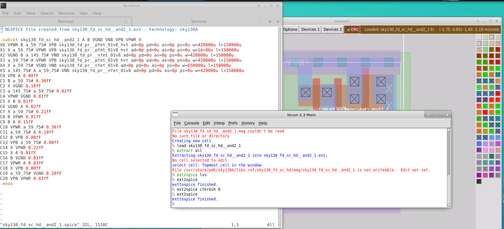
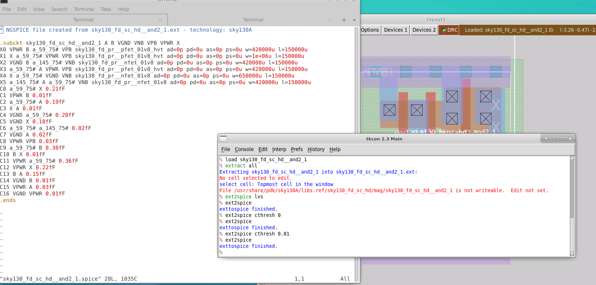
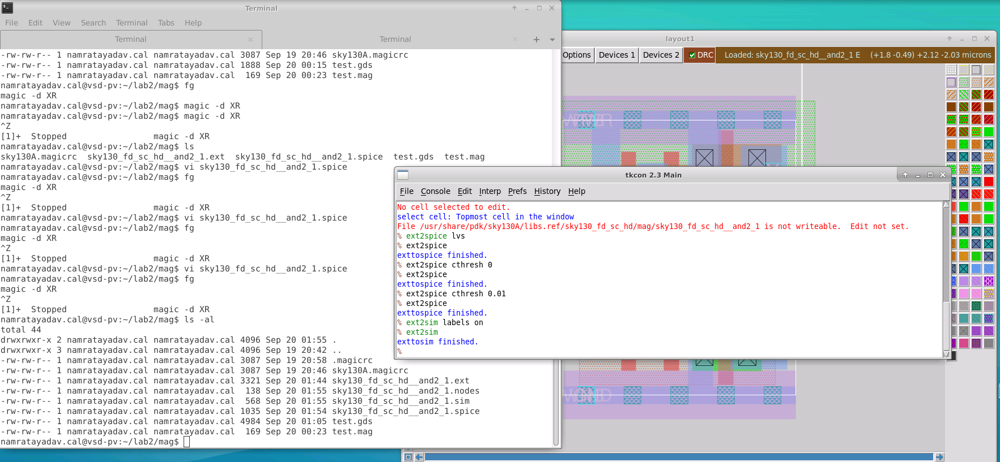
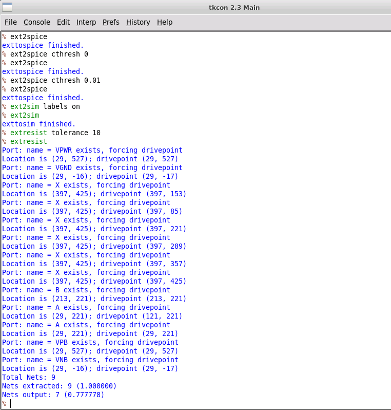
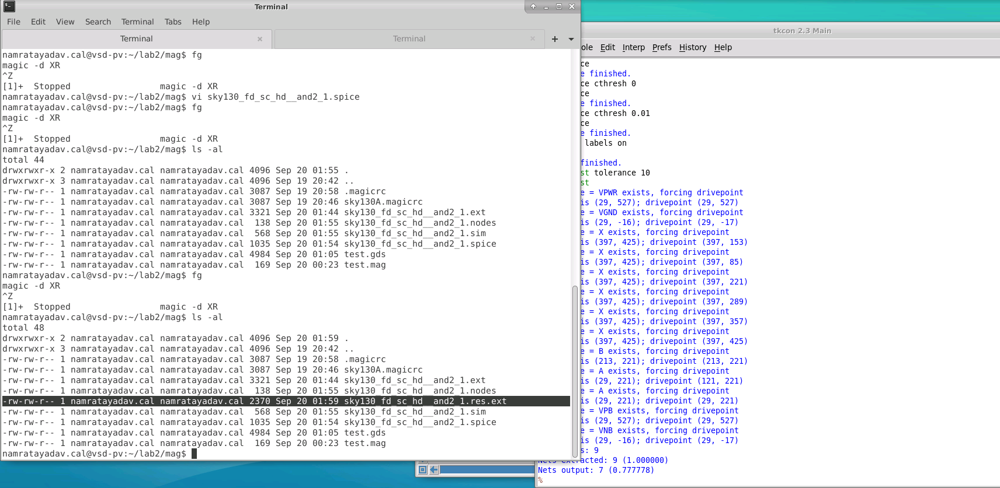
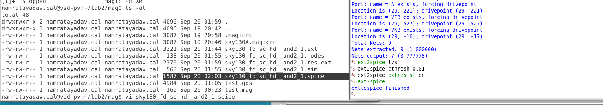
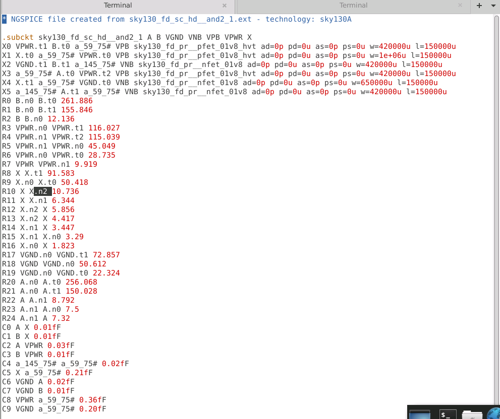

# L4 — Basic Extraction and Parasitic RC Netlist Generation

## Overview

In this lab, I explored the extraction flow in Magic using a SKY130 standard-cell layout.

The goal was to move from the physical layout to progressively more detailed electrical representations:

1. Basic extracted connectivity
2. LVS-oriented SPICE netlist
3. SPICE netlist with parasitic capacitances
4. Resistance extraction
5. Final RC-aware SPICE netlist

This lab demonstrated that the same physical layout can be extracted differently depending on whether the objective is **LVS verification** or **post-layout electrical simulation**.

The overall flow was:

```text
SKY130 Standard-Cell Layout
        ↓
Magic Extraction
        ↓
.ext Intermediate File
        ↓
LVS SPICE Netlist
        ↓
Add Parasitic Capacitance
        ↓
Generate ext2sim Data
        ↓
Extract Interconnect Resistance
        ↓
.res.ext Resistance Data
        ↓
Generate Final RC SPICE Netlist
        ↓
Inspect Extracted R + C Network
```

---

## 1. Basic Layout Extraction

I loaded the SKY130 standard cell used in the previous exercises and extracted its electrical connectivity using:

```tcl
extract all
```

Magic generated an intermediate extraction file:

```text
sky130_fd_sc_hd__and2_1.ext
```

I then configured the SPICE output for LVS and generated the netlist:

```tcl
ext2spice lvs
ext2spice
```



The working directory now contained:

```text
sky130_fd_sc_hd__and2_1.ext
sky130_fd_sc_hd__and2_1.spice
```

The `.ext` file is Magic's intermediate extracted representation, while the `.spice` file is the electrical netlist generated from it.

---

## 2. LVS-Oriented SPICE Netlist

I inspected the generated SPICE file using:

```bash
vi sky130_fd_sc_hd__and2_1.spice
```



The extracted subcircuit retained the standard-cell port order:

```spice
.subckt sky130_fd_sc_hd__and2_1 A B VGND VNB VPB VPWR X
```

The netlist contained six transistor subcircuit instances corresponding to the devices recognized from the physical layout.

At this stage, the main information represented was:

```text
Devices
+
Electrical connectivity
```

without detailed parasitic RC components.

This type of netlist is suitable for **Layout Versus Schematic (LVS)** comparison.

---

## 3. Adding Parasitic Capacitance

The extraction database already contained capacitance information, but the LVS-oriented output did not include it in the SPICE netlist.

To include all extracted capacitances, I used:

```tcl
ext2spice cthresh 0
ext2spice
```



With:

```text
cthresh = 0
```

Magic included all extracted parasitic capacitances.

The SPICE file now contained entries beginning with:

```text
C0
C1
C2
...
```

These represent capacitances extracted from the physical layout.

---

## 4. Applying a Capacitance Threshold

Some extracted capacitances were extremely small and close to zero.

To remove insignificant values, I changed the capacitance threshold to:

```tcl
ext2spice cthresh 0.01
ext2spice
```



The behavior can be summarized as:

```text
cthresh 0
    ↓
Include all extracted capacitances

cthresh 0.01
    ↓
Exclude very small capacitances
```

This creates a cleaner parasitic netlist while retaining the more relevant capacitive effects.

---

## 5. Preparing Data for Resistance Extraction

Resistance extraction requires additional intermediate connectivity information.

I generated this using:

```tcl
ext2sim labels on
ext2sim
```



This generated additional files including:

```text
sky130_fd_sc_hd__and2_1.nodes
sky130_fd_sc_hd__and2_1.sim
```

These files contain intermediate network information used by the resistance-extraction flow.

---

## 6. Extracting Interconnect Resistance

I configured resistance extraction using:

```tcl
extresist tolerance 10
```

and then ran:

```tcl
extresist
```



The tolerance determines when an extracted net should be replaced with a distributed resistance network.

For this exercise, I used:

```text
10
```

During extraction, Magic identified the circuit ports and generated drive points for the corresponding nets.

The output also reported:

```text
Total Nets
Nets extracted
Nets output
```

showing how many networks were analyzed and how many were represented using resistance extraction.

---

## 7. Resistance Extraction Output File

After running `extresist`, a new file appeared in the working directory:

```text
sky130_fd_sc_hd__and2_1.res.ext
```



This file contains the resistance information associated with the original extraction database.

The flow is:

```text
Original .ext
      +
.res.ext
      ↓
ext2spice
      ↓
RC-aware SPICE netlist
```

The `.res.ext` file therefore supplements the original extraction with distributed interconnect resistance information.

---

## 8. Generating the Final RC-Aware SPICE Netlist

I configured the final extraction using:

```tcl
ext2spice lvs
ext2spice cthresh 0.01
ext2spice extresist on
ext2spice
```



The important additional option was:

```tcl
ext2spice extresist on
```

which tells Magic to incorporate the resistance-extraction information into the generated SPICE netlist.

The final representation therefore contains:

```text
Transistor devices
+
Parasitic capacitances
+
Parasitic resistances
```

---

## 9. Inspecting the Final RC-Extracted SPICE Netlist

I inspected the final generated SPICE file after enabling resistance extraction.



The final netlist clearly contained three types of electrical elements.

### Device Instances

Lines beginning with:

```text
X
```

represent the extracted transistor/device instances:

```spice
X0 ...
X1 ...
X2 ...
```

These correspond to the MOS devices recognized from the physical layout.

### Parasitic Resistances

Lines beginning with:

```text
R
```

represent the distributed interconnect resistance.

Examples from the extracted netlist included:

```spice
R0 B.n0 B.t0 ...
R1 B.n0 B.t1 ...
R3 VPWR.n0 VPWR.t1 ...
R8 X X.t1 ...
```

The original ideal nets were divided into internal nodes such as:

```text
B.n0
B.t0
B.t1
VPWR.n0
VPWR.t0
X.n1
X.t1
```

This represents physical interconnect as a distributed resistance network rather than as a single ideal zero-resistance node.

### Parasitic Capacitances

The final netlist also contained:

```text
C0
C1
C2
...
```

representing extracted parasitic capacitances.

Examples included coupling between nets such as:

```text
A ↔ X
B ↔ X
A ↔ VPWR
VGND ↔ A
X ↔ VPWR
```

The final extracted representation therefore contains:

```text
Devices
+
Distributed Resistance
+
Parasitic Capacitance
```

and can be used for more realistic post-layout simulation.

---

## 10. Extraction Levels Compared

This lab generated several progressively more detailed representations of the same physical layout.

| Extraction Level | Devices | Parasitic C | Parasitic R | Main Purpose |
|---|---:|---:|---:|---|
| LVS netlist | ✓ | — | — | Connectivity verification |
| Capacitive netlist | ✓ | ✓ | — | Post-layout simulation |
| RC-aware netlist | ✓ | ✓ | ✓ | Detailed post-layout analysis |

The progression is:

```text
Ideal Connectivity
       ↓
Devices
       ↓
Devices + C
       ↓
Devices + C + R
       ↓
More realistic physical behavior
```

---

## 11. Understanding the Distributed RC Network

In an ideal schematic, a wire is treated as one electrical node:

```text
A ───────────────── OUT
```

A physical interconnect, however, contains resistance and capacitance.

The extracted representation is closer to:

```text
A ─R1─●─R2─●─R3─ OUT
      │     │
     C1    C2
      │     │
     GND   GND
```

The resistor network models distributed interconnect resistance, while the capacitances represent parasitic loading and coupling produced by the physical geometry.

---

## 12. Internal Node Naming

Resistance extraction introduced additional internal node names.

Examples from the extracted netlist included:

```text
B.n0
B.t0
VPWR.n0
VPWR.t1
X.n1
X.t1
A.n0
A.t0
```

These internal nodes allow a physical net to be divided into multiple electrical segments connected through parasitic resistances.

As a result, the RC-extracted SPICE netlist is significantly more detailed than the original ideal netlist.

---

## 13. Why RC Extraction Matters

An ideal schematic generally assumes:

```text
Rwire = 0
Cwire = 0
```

Real physical interconnect introduces:

```text
Interconnect resistance
+
Coupling capacitance
+
Capacitance to surrounding structures
```

These parasitic effects can influence:

- propagation delay
- rise and fall time
- transient response
- analog settling
- timing accuracy

Therefore, RC-aware extraction provides a more realistic representation of the physical circuit.

---

## 14. LVS Extraction vs. Post-Layout Extraction

An important distinction from this lab is the purpose of each extraction flow.

### LVS-Oriented Extraction

For LVS, the main question is:

```text
Does the physical layout contain the same
devices and electrical connectivity as the schematic?
```

The flow is:

```text
Layout
   ↓
Devices + Connectivity
   ↓
LVS Comparison
```

### Post-Layout Extraction

For post-layout simulation:

```text
Layout
   ↓
Devices
+ Parasitic Resistance
+ Parasitic Capacitance
   ↓
SPICE Simulation
```

The same physical layout can therefore produce different electrical representations depending on the verification objective.

---

## Generated Files

During this extraction flow, I generated:

```text
sky130_fd_sc_hd__and2_1.ext
sky130_fd_sc_hd__and2_1.spice
sky130_fd_sc_hd__and2_1.nodes
sky130_fd_sc_hd__and2_1.sim
sky130_fd_sc_hd__and2_1.res.ext
```

| File | Purpose |
|---|---|
| `.ext` | Magic extracted electrical database |
| `.spice` | Generated SPICE netlist |
| `.nodes` | Extracted-node information |
| `.sim` | Intermediate simulation/extraction representation |
| `.res.ext` | Distributed resistance extraction information |

---

## Key Commands

### Basic Extraction

```tcl
extract all
```

### LVS-Oriented SPICE

```tcl
ext2spice lvs
ext2spice
```

### Include All Capacitances

```tcl
ext2spice cthresh 0
ext2spice
```

### Apply Capacitance Threshold

```tcl
ext2spice cthresh 0.01
ext2spice
```

### Generate Intermediate Data

```tcl
ext2sim labels on
ext2sim
```

### Resistance Extraction

```tcl
extresist tolerance 10
extresist
```

### Generate Final RC Netlist

```tcl
ext2spice lvs
ext2spice cthresh 0.01
ext2spice extresist on
ext2spice
```

---

## Key Learnings

- Extracted electrical connectivity from a SKY130 standard-cell layout.
- Generated Magic `.ext` extraction data.
- Converted extracted layout information into SPICE.
- Generated an LVS-oriented representation containing devices and connectivity.
- Added layout-derived parasitic capacitances.
- Applied a capacitance threshold to remove insignificant values.
- Generated `.nodes` and `.sim` intermediate extraction files.
- Performed distributed resistance extraction using `extresist`.
- Generated a `.res.ext` resistance representation.
- Incorporated extracted resistance into the final SPICE netlist.
- Inspected the final `R` and `C` elements directly in the extracted netlist.
- Understood how an ideal net becomes a distributed RC network after physical extraction.
- Distinguished LVS-oriented extraction from detailed post-layout extraction.

---

## Result

```text
Layout extraction completed          ✓
.ext database generated              ✓
LVS SPICE netlist generated          ✓
Device connectivity extracted        ✓
Parasitic capacitances extracted     ✓
Capacitance threshold applied        ✓
ext2sim intermediate files created   ✓
Resistance extraction completed      ✓
.res.ext file generated              ✓
RC-aware SPICE netlist generated     ✓
Final R/C network inspected          ✓
```

The lab demonstrated the progression from a physical SKY130 standard-cell layout to an electrical SPICE representation containing devices, extracted capacitance, and distributed interconnect resistance.

---

## Suggested Follow-Up

A useful follow-up experiment is to simulate the same cell using three representations:

```text
1. LVS / ideal extracted netlist

2. Extracted netlist
   + parasitic capacitance

3. Extracted netlist
   + parasitic capacitance
   + parasitic resistance
```

The transient waveforms can then be compared to observe the effect of physical-layout parasitics on circuit behavior.
