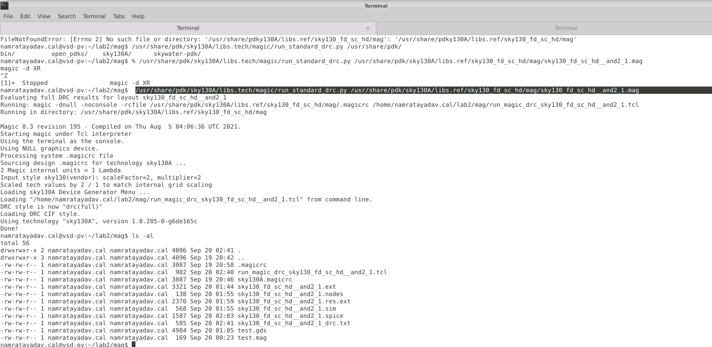
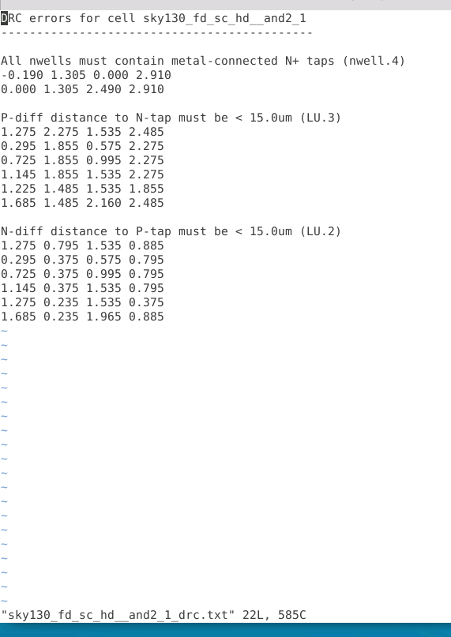
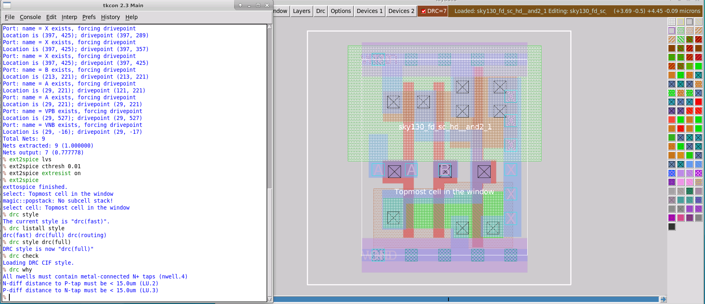
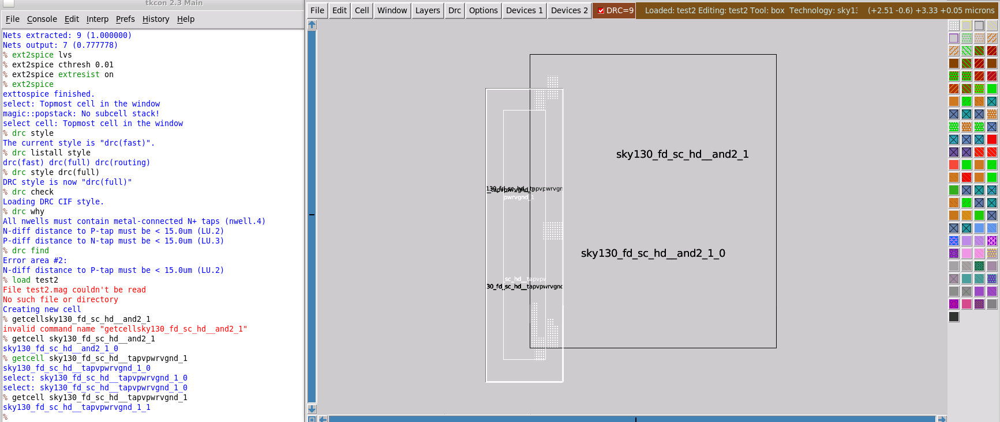
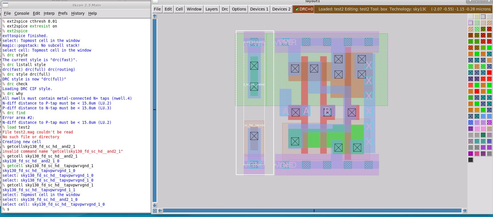
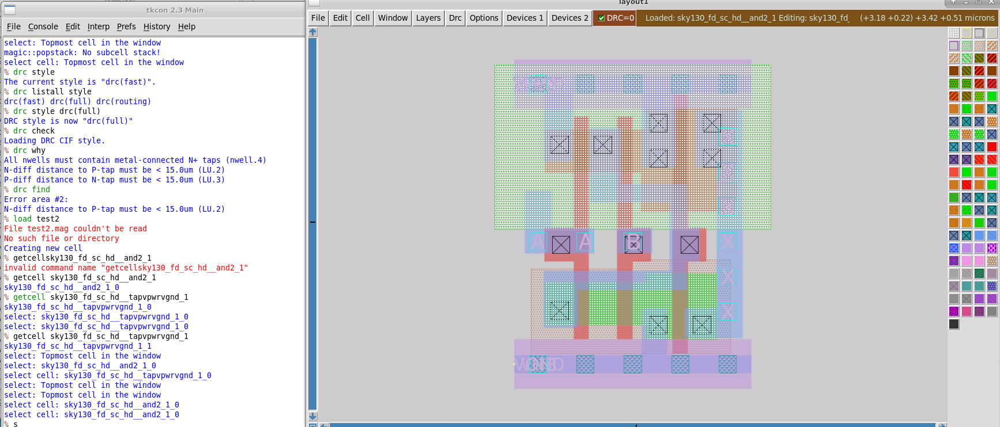

# L5 — DRC Setup, Batch Verification and Hierarchical DRC

## Overview

In this lab, I worked with both **batch and interactive Design Rule Checking (DRC)** in Magic using the SKY130 PDK.

The main objective was not only to run DRC, but also to understand why a standard cell can report violations when checked independently while becoming DRC-clean when placed correctly in a hierarchical design.

The lab covered:

- Running batch DRC using the OpenPDK helper script
- Reading the generated DRC report
- Comparing Magic's `fast` and `full` DRC styles
- Forcing an interactive DRC check
- Locating and interpreting violations
- Understanding well/substrate tap-related violations
- Adding the required tap/end-cap structure
- Observing hierarchical DRC behavior

The overall flow was:

```text
SKY130 Standard Cell
        ↓
Run Batch DRC
        ↓
Generate DRC Report
        ↓
Inspect Violated Rules
        ↓
Open Cell in Magic
        ↓
Compare fast vs. full DRC
        ↓
Force Full DRC Check
        ↓
Identify Well/Tap Violations
        ↓
Create Top-Level Layout
        ↓
Add Tap / End-Cap Cell
        ↓
Align Standard Cells
        ↓
Hierarchical DRC → Clean
```

---

## 1. Running Batch DRC

I first ran DRC from the terminal using the OpenPDK batch DRC utility.

The command used was:

```bash
/usr/share/pdk/sky130A/libs.tech/magic/run_standard_drc.py \
/usr/share/pdk/sky130A/libs.ref/sky130_fd_sc_hd/mag/sky130_fd_sc_hd__and2_1.mag
```



The script automatically launched Magic in batch mode and configured the appropriate DRC environment.

The output showed that the DRC style was set to:

```text
drc(full)
```

After completion, I checked the generated files using:

```bash
ls -al
```

A DRC report was generated:

```text
sky130_fd_sc_hd__and2_1_drc.txt
```

This provides a convenient way to perform DRC without manually opening the layout editor.

---

## 2. Inspecting the Batch DRC Report

I opened the generated report and inspected the violations.



The report contained three main rule categories:

```text
All nwells must contain metal-connected N+ taps (nwell.4)

P-diff distance to N-tap must be < 15.0um (LU.3)

N-diff distance to P-tap must be < 15.0um (LU.2)
```

At first, it appeared surprising that a standard cell from the SKY130 library contained DRC violations.

However, these errors are related to **well and substrate connections** rather than incorrect transistor geometry.

The standalone standard cell does not contain every substrate/well connection locally because those structures can be supplied by neighboring tap/end-cap cells when the standard cells are assembled into a larger digital layout.

---

## 3. Why the Standard Cell Initially Appeared DRC-Clean in Magic

When I previously viewed the same cell interactively in Magic, the top of the layout window showed no DRC errors.

To investigate this difference, I queried the current DRC style:

```tcl
drc style
```

Magic reported:

```text
drc(fast)
```

I then listed the available DRC styles:

```tcl
drc listall style
```

The available styles included:

```text
drc(fast)
drc(full)
drc(routing)
```

The batch DRC flow used:

```text
drc(full)
```

while the interactive Magic session was initially using:

```text
drc(fast)
```

This explained why the two checks did not initially appear identical.

---

## 4. Switching to Full DRC

I changed the interactive DRC style using:

```tcl
drc style drc(full)
```

and forced Magic to recheck the layout:

```tcl
drc check
```

After the check, the layout showed multiple highlighted DRC regions.



I then used:

```tcl
drc why
```

to determine which rules were being violated.

Magic reported the same rule categories seen in the batch report:

```text
All nwells must contain metal-connected N+ taps (nwell.4)

N-diff distance to P-tap must be < 15.0um (LU.2)

P-diff distance to N-tap must be < 15.0um (LU.3)
```

This confirmed that the batch and interactive full-DRC flows were detecting the same underlying problems.

---

## 5. Locating Individual DRC Errors

Magic also provides:

```tcl
drc find
```

which can be used to step through individual DRC violations.

For example, Magic reported:

```text
Error area #2:
N-diff distance to P-tap must be < 15.0um (LU.2)
```

This is useful when a large layout contains many highlighted error regions and a specific violation needs to be located.

An important observation was that the number shown by Magic at the top of the layout window does not necessarily equal the number of unique rule types.

For example, several geometric regions can violate the same rule.

Therefore:

```text
Number of highlighted DRC errors
        ≠
Number of unique violated rules
```

---

## 6. Understanding the Reported Violations

The violations were primarily associated with missing or distant well/substrate taps.

### N-well connection

```text
All nwells must contain metal-connected N+ taps
```

The N-well must have the required electrical connection through an appropriate tap structure.

### N-diffusion to P-tap distance

```text
N-diff distance to P-tap must be < 15.0um
```

The NMOS region must be sufficiently close to the required substrate tap.

### P-diffusion to N-tap distance

```text
P-diff distance to N-tap must be < 15.0um
```

The PMOS/N-well region similarly requires an appropriate nearby tap.

The standalone cell therefore violates these context-dependent rules when checked by itself.

---

## 7. Creating a Hierarchical Test Layout

To investigate how these violations are resolved in an actual standard-cell layout, I created a new top-level cell and instantiated the AND2 standard cell.

I then instantiated a SKY130 tap/end-cap cell next to it.



Initially, the tap cell was not properly aligned with the AND2 cell.

This caused additional DRC violations.

The experiment demonstrated that simply adding the correct supporting cell is not enough — the standard cells must also follow the required placement and alignment structure.

---

## 8. Positioning the Tap / End-Cap Cell

I expanded the cells so that I could see their internal geometry and moved the tap/end-cap cell into the correct position beside the logic cell.



The supporting cell provides the well/substrate connection that was missing when the AND2 cell was checked independently.

Conceptually:

```text
Standalone AND2
      ↓
Missing nearby well/substrate taps
      ↓
Full DRC reports violations
```

After adding the neighboring tap structure:

```text
AND2 + Tap/End-Cap
        ↓
Required well/substrate connection provided
        ↓
Context-dependent violations disappear
```

---

## 9. Hierarchical DRC Result

After the supporting cell was correctly positioned, the top-level layout became DRC clean.



The Magic window showed:

```text
DRC=0
```

This demonstrated an important property of hierarchical physical verification.

The standard cell can still contain context-dependent DRC violations when viewed independently, while the **complete hierarchical layout satisfies the rules** because neighboring cells provide the required physical structures.

---

## 10. Standalone Cell vs. Hierarchical Layout

The behavior observed in this lab can be summarized as:

```text
Standalone standard cell
        ↓
No neighboring tap cell
        ↓
Full DRC
        ↓
Well/tap violations
```

while:

```text
Top-Level Layout
      ↓
Logic Cell + Tap/End-Cap Cell
      ↓
Correct placement/alignment
      ↓
Full DRC
      ↓
DRC Clean
```

This explains why standard-cell physical verification cannot always be interpreted correctly without considering the placement context.

---

## 11. Interactive DRC vs. Batch DRC

Both approaches were used in this lab.

| Method | Main Purpose |
|---|---|
| Interactive DRC | Debugging violations while viewing the layout |
| Batch DRC | Automated verification and report generation |

### Interactive DRC

Useful commands include:

```tcl
drc style
drc listall style
drc style drc(full)
drc check
drc why
drc find
```

This method is useful while actively debugging layout geometry.

### Batch DRC

The OpenPDK helper script performs the check automatically and produces a text report.

```bash
/usr/share/pdk/sky130A/libs.tech/magic/run_standard_drc.py \
/usr/share/pdk/sky130A/libs.ref/sky130_fd_sc_hd/mag/sky130_fd_sc_hd__and2_1.mag
```

This is useful for automated or repeatable verification.

---

## 12. Understanding DRC Styles

Magic provides multiple DRC styles for different purposes.

In this exercise I observed:

```text
drc(fast)
drc(full)
drc(routing)
```

The default interactive session used:

```text
drc(fast)
```

while the batch verification flow used:

```text
drc(full)
```

The full style performs the more comprehensive rule check used in this exercise.

Changing the style alone does not necessarily immediately recompute every rule.

I therefore explicitly forced a new check using:

```tcl
drc check
```

---

## Issue Encountered — Batch DRC Path

While setting up the batch command, I initially entered an incorrect path and received a file-not-found error.

After correcting the path to the SKY130 standard-cell `.mag` library, the batch script ran successfully.

The working command was:

```bash
/usr/share/pdk/sky130A/libs.tech/magic/run_standard_drc.py \
/usr/share/pdk/sky130A/libs.ref/sky130_fd_sc_hd/mag/sky130_fd_sc_hd__and2_1.mag
```

This reinforced the importance of distinguishing between:

```text
libs.tech
```

which contains tool-specific setup/scripts, and:

```text
libs.ref
```

which contains reference library data such as standard-cell layouts.

---

## Key Commands

### Run Batch DRC

```bash
/usr/share/pdk/sky130A/libs.tech/magic/run_standard_drc.py \
/usr/share/pdk/sky130A/libs.ref/sky130_fd_sc_hd/mag/sky130_fd_sc_hd__and2_1.mag
```

### Check Generated Files

```bash
ls -al
```

### Inspect Current DRC Style

```tcl
drc style
```

### List DRC Styles

```tcl
drc listall style
```

### Select Full DRC

```tcl
drc style drc(full)
```

### Force DRC Check

```tcl
drc check
```

### Explain Current Violations

```tcl
drc why
```

### Locate a Violation

```tcl
drc find
```

---

## Key Learnings

- Ran SKY130 DRC using the OpenPDK batch DRC script.
- Generated and inspected a text-based DRC report.
- Compared `drc(fast)` and `drc(full)` checking styles.
- Forced a complete interactive DRC check using `drc check`.
- Used `drc why` to identify violated design rules.
- Used `drc find` to locate individual violation regions.
- Identified well/substrate tap-related violations in a standalone standard cell.
- Understood why these violations can exist when a library cell is checked outside its intended hierarchy.
- Added a supporting tap/end-cap cell to provide the required well/substrate connections.
- Observed that placement and alignment affect hierarchical DRC.
- Verified that the correctly assembled top-level layout reached `DRC=0`.
- Understood the difference between cell-level and hierarchical DRC interpretation.

---

## Result

```text
Batch DRC executed                     ✓
DRC text report generated              ✓
Full DRC violations inspected          ✓
Interactive DRC configured             ✓
drc why used                           ✓
drc find used                          ✓
Well/tap violations identified         ✓
Hierarchical test layout created       ✓
Tap/end-cap cell added                 ✓
Supporting cell correctly positioned   ✓
Top-level DRC = 0                      ✓
```

The key result of this lab was understanding that a DRC violation must be interpreted in its **layout context**. A standard cell may intentionally rely on neighboring cells for well and substrate connections, causing it to report violations when checked independently while remaining correct when assembled into the intended hierarchy.
