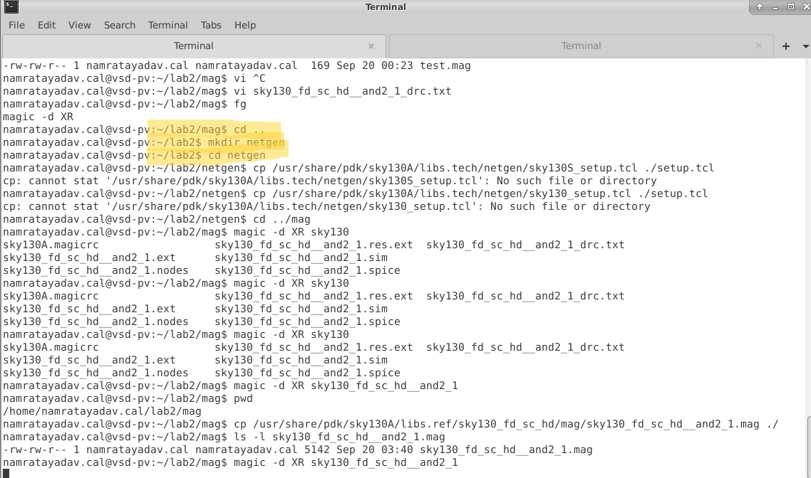
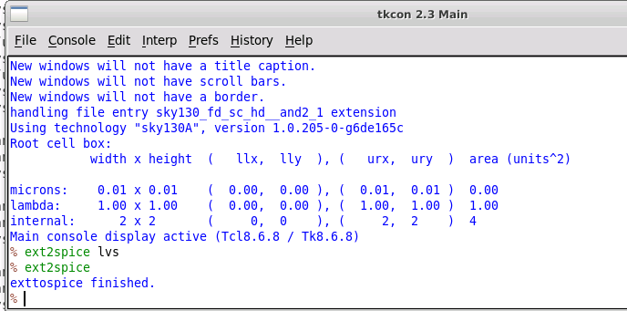
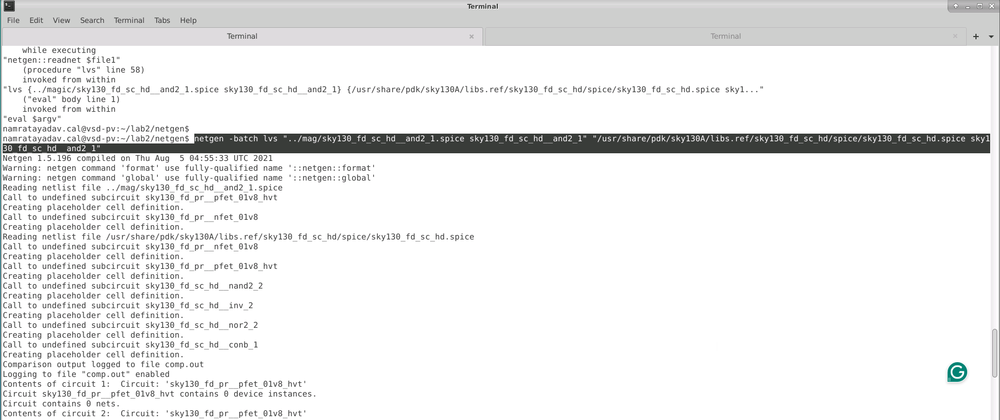
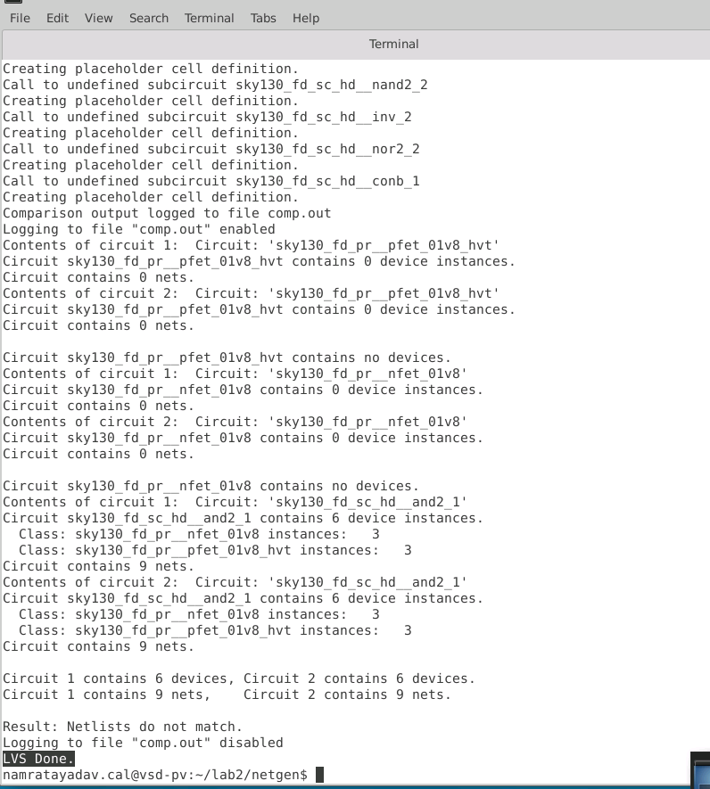

# L6 — Setting Up and Running LVS with Netgen

## Overview

In this lab, I set up a basic **Layout Versus Schematic (LVS)** flow using **Magic** and **Netgen**.

The objective was to compare:

- a SPICE netlist extracted from the physical layout in Magic
- the corresponding reference circuit from the SKY130 standard-cell SPICE library

The exercise also demonstrated why the layout netlist used for LVS should be a simplified connectivity-oriented netlist rather than the RC-extracted netlist generated in the previous lab.

The overall flow was:

```text
SKY130 Standard-Cell Layout
        ↓
Create Local Working Copy
        ↓
Magic Extraction Database
        ↓
Generate LVS-Oriented SPICE
        ↓
Layout Netlist
        ↓
Netgen
        ↑
Vendor SKY130 SPICE Library
        ↓
Compare Devices + Nets + Connectivity
        ↓
LVS Result
```

---

## 1. Creating a Separate LVS Working Directory

Because LVS compares information from multiple sources, I created a separate directory for the Netgen portion of the flow.

```bash
cd ~/lab2
mkdir netgen
cd netgen
```

I also attempted to copy the SKY130 Netgen setup file into the local working directory.

During this step I encountered a path/setup-file issue in the installed PDK environment, where the initially attempted setup-file paths were not found.

I then returned to the Magic directory to prepare the layout netlist required for comparison.



---

## 2. Creating a Local Writable Copy of the Layout

The SKY130 library `.mag` file is installed as part of the PDK and is not intended to be modified directly.

I therefore copied the standard-cell layout into my local working directory:

```bash
cp /usr/share/pdk/sky130A/libs.ref/sky130_fd_sc_hd/mag/sky130_fd_sc_hd__and2_1.mag ./
```

I verified that the file existed locally using:

```bash
ls -l sky130_fd_sc_hd__and2_1.mag
```

This allowed me to work from a local layout representation rather than directly editing the PDK library.

---

## 3. Why the Previous RC Netlist Was Not Used

In L4, I generated a detailed post-layout netlist containing:

```text
Devices
+
Parasitic capacitance
+
Parasitic resistance
```

That representation is useful for post-layout simulation, but it is not the desired representation for a simple LVS connectivity comparison.

For LVS, the main objective is to compare:

```text
Device types
Device counts
Network connectivity
Ports
```

rather than the detailed parasitic RC network.

Therefore, I regenerated a simplified LVS-oriented SPICE netlist.

---

## 4. Regenerating the Layout Netlist for LVS

I opened the locally copied cell in Magic:

```bash
magic -d XR sky130_fd_sc_hd__and2_1
```

The extraction database from the previous work was already available, so I configured the SPICE conversion for LVS:

```tcl
ext2spice lvs
ext2spice
```



Magic reported:

```text
exttospice finished.
```

This regenerated:

```text
sky130_fd_sc_hd__and2_1.spice
```

as a connectivity-oriented layout netlist suitable for LVS.

---

## 5. The Two Netlists Being Compared

For LVS I needed two representations of the same circuit.

### Layout side

The first input was the SPICE netlist extracted from my Magic layout:

```text
../mag/sky130_fd_sc_hd__and2_1.spice
```

with the subcircuit:

```text
sky130_fd_sc_hd__and2_1
```

### Reference side

The second input was the SKY130 vendor standard-cell SPICE library:

```text
/usr/share/pdk/sky130A/libs.ref/sky130_fd_sc_hd/spice/sky130_fd_sc_hd.spice
```

From that library, Netgen was asked to compare the same subcircuit:

```text
sky130_fd_sc_hd__and2_1
```

This is useful because the reference file contains the entire standard-cell library, while the second value in the quoted pair tells Netgen which specific subcircuit to use.

---

## 6. Running Batch LVS

From the Netgen working directory, I ran the LVS comparison in batch mode.

The command followed the form:

```bash
netgen -batch lvs \
"../mag/sky130_fd_sc_hd__and2_1.spice sky130_fd_sc_hd__and2_1" \
"/usr/share/pdk/sky130A/libs.ref/sky130_fd_sc_hd/spice/sky130_fd_sc_hd.spice sky130_fd_sc_hd__and2_1"
```



The command contains two quoted circuit specifications.

Each specification contains:

```text
"netlist_file subcircuit_name"
```

The traditional order is:

```text
Layout netlist
      first
        ↓
Reference schematic/library netlist
      second
```

So the comparison is conceptually:

```text
Extracted Layout SPICE
        ↓
      Netgen
        ↑
Vendor Reference SPICE
```

---

## 7. Understanding Netgen's Initial Output

During the comparison, Netgen read both netlists and encountered lower-level device models such as:

```text
sky130_fd_pr__pfet_01v8_hvt
sky130_fd_pr__nfet_01v8
```

Because their internal definitions were not part of the immediate cell comparison, Netgen created placeholder cell definitions while processing the hierarchy.

The important comparison was performed at:

```text
sky130_fd_sc_hd__and2_1
```

which is the standard cell being verified.

---

## 8. Device and Net Comparison

The final Netgen report showed that both circuits contained:

```text
6 devices
9 nets
```



The report showed:

```text
Circuit 1 contains 6 devices,
Circuit 2 contains 6 devices.

Circuit 1 contains 9 nets,
Circuit 2 contains 9 nets.
```

It also identified the same device classes:

```text
sky130_fd_pr__nfet_01v8      → 3 instances
sky130_fd_pr__pfet_01v8_hvt  → 3 instances
```

for both sides of the comparison.

This confirmed that the extracted layout and vendor reference had the same high-level transistor counts and net counts.

---

## 9. LVS Result Observed

Although the device and net counts were equal, the final output reported:

```text
Result: Netlists do not match.
```

Therefore, I did **not** treat this run as a successful LVS pass.

The result shows an important LVS concept:

```text
Same number of devices
+
Same number of nets
≠
Guaranteed LVS match
```

LVS checks more than counts.

It also evaluates whether the devices are connected to the corresponding nets and ports in an electrically equivalent way.

---

## 10. Issue Encountered — Netgen Setup File

While creating the LVS working directory, I attempted to copy the SKY130 Netgen setup file.

The attempted path in my environment returned:

```text
No such file or directory
```

This is important because the Netgen setup file contains technology-specific rules used to correctly interpret and compare SKY130 devices.

Without the correct setup configuration, device properties or hierarchy may not be normalized exactly as required for a clean LVS comparison.

This is one of the items that needs to be checked before treating the final mismatch as an actual circuit-layout error.

---

## 11. Issue Encountered — Same Counts but Netlists Did Not Match

The final comparison reported:

```text
Layout:
6 devices
9 nets

Reference:
6 devices
9 nets
```

but still ended with:

```text
Netlists do not match.
```

This means the mismatch is more subtle than a missing transistor or missing net.

Possible areas to investigate in a later LVS-debugging exercise include:

```text
Port correspondence
Connectivity
Device properties
Technology setup
Device equivalence rules
Subcircuit handling
```

For this introductory lab, the important result was successfully setting up the comparison flow and understanding how the layout and reference netlists are supplied to Netgen.

---

## 12. Why Layout Comes First

The Netgen command was written with the layout-extracted circuit first:

```text
Layout → Circuit 1
Reference → Circuit 2
```

This makes the comparison output easier to interpret because differences can be read as:

```text
What the layout contains

versus

What the reference circuit expects
```

This convention becomes particularly useful when debugging larger LVS failures.

---

## 13. File + Cell Pairing in Netgen

One of the most important command-line concepts from this lab was the two-part Netgen circuit specification.

For example:

```text
"../mag/sky130_fd_sc_hd__and2_1.spice sky130_fd_sc_hd__and2_1"
```

contains:

```text
File:
../mag/sky130_fd_sc_hd__and2_1.spice

Cell:
sky130_fd_sc_hd__and2_1
```

Likewise:

```text
"/usr/share/pdk/sky130A/libs.ref/sky130_fd_sc_hd/spice/sky130_fd_sc_hd.spice sky130_fd_sc_hd__and2_1"
```

means:

```text
Use the vendor library file
        ↓
Locate only the requested AND2 subcircuit
        ↓
Use that as the reference circuit
```

This allows an entire SPICE library to be supplied without manually extracting the individual cell definition first.

---

## 14. DRC vs. LVS

This lab also clarified the difference between the verification performed in L5 and L6.

### DRC

DRC asks:

```text
Does the physical geometry obey the process rules?
```

Examples include:

```text
Width
Spacing
Enclosure
Tap distance
Well rules
```

### LVS

LVS asks:

```text
Does the electrical circuit represented by the layout
match the intended reference circuit?
```

It compares:

```text
Devices
Connectivity
Ports
Device parameters / properties
```

Therefore:

```text
DRC
Physical legality
```

and:

```text
LVS
Electrical equivalence
```

are complementary verification steps.

---

## Key Commands

### Create Netgen Working Directory

```bash
cd ~/lab2
mkdir netgen
cd netgen
```

### Copy Standard-Cell Layout Locally

```bash
cd ../mag

cp /usr/share/pdk/sky130A/libs.ref/sky130_fd_sc_hd/mag/sky130_fd_sc_hd__and2_1.mag ./
```

### Open Local Layout in Magic

```bash
magic -d XR sky130_fd_sc_hd__and2_1
```

### Generate LVS-Oriented Netlist

```tcl
ext2spice lvs
ext2spice
```

### Run Netgen Batch LVS

```bash
netgen -batch lvs \
"../mag/sky130_fd_sc_hd__and2_1.spice sky130_fd_sc_hd__and2_1" \
"/usr/share/pdk/sky130A/libs.ref/sky130_fd_sc_hd/spice/sky130_fd_sc_hd.spice sky130_fd_sc_hd__and2_1"
```

---

## Key Learnings

- Created a separate working directory for LVS verification.
- Prepared a local writable copy of a SKY130 standard-cell layout.
- Regenerated a simple connectivity-oriented SPICE netlist for LVS.
- Understood why the previous RC-extracted netlist was not appropriate for basic LVS.
- Learned the Netgen `"file cell"` input format.
- Compared a single extracted layout cell against a cell contained inside the complete vendor SPICE library.
- Followed the conventional ordering of layout netlist first and reference netlist second.
- Verified that both compared circuits contained six MOS devices.
- Verified that both compared circuits contained nine nets.
- Observed that equal device/net counts do not automatically imply electrical equivalence.
- Encountered a Netgen setup-file path issue that requires resolution.
- Recorded the LVS mismatch rather than incorrectly treating the run as a pass.

---

## Result

```text
Separate LVS directory created          ✓
Local layout copy prepared              ✓
LVS-oriented layout netlist generated   ✓
Vendor SPICE library identified         ✓
Netgen batch comparison executed        ✓
Layout device count = 6                 ✓
Reference device count = 6              ✓
Layout net count = 9                    ✓
Reference net count = 9                 ✓
Final LVS match                         ✗
```

The observed result was:

```text
Result: Netlists do not match.
```

The lab successfully established the basic **Magic → extracted SPICE → Netgen → reference SPICE** LVS flow, while also exposing a configuration/comparison issue that needs to be debugged before obtaining a clean LVS match.

This provides the foundation for the later dedicated LVS labs, where mismatches can be investigated in more detail.
