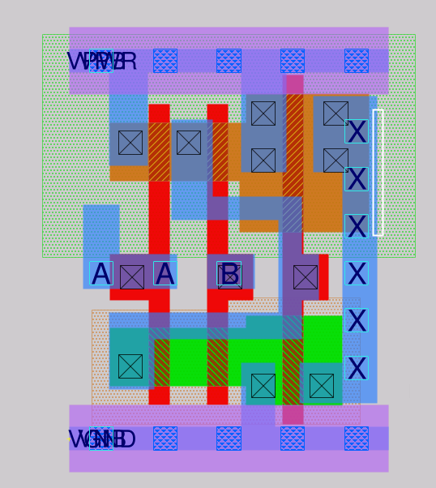
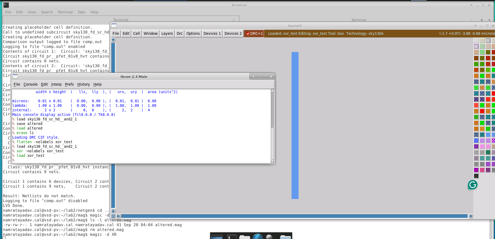
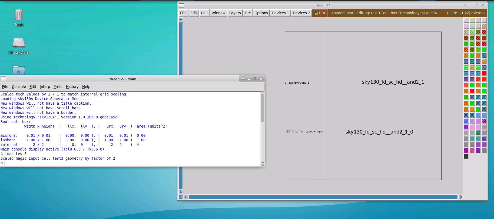
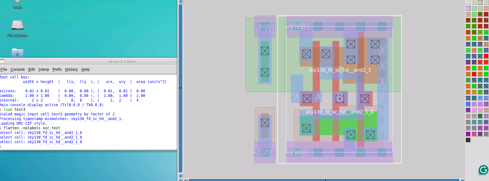
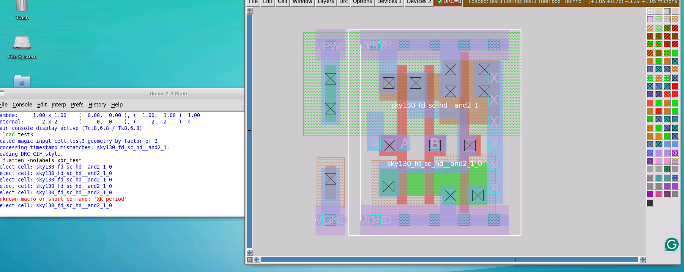
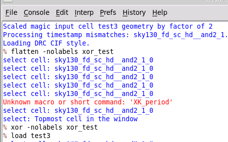
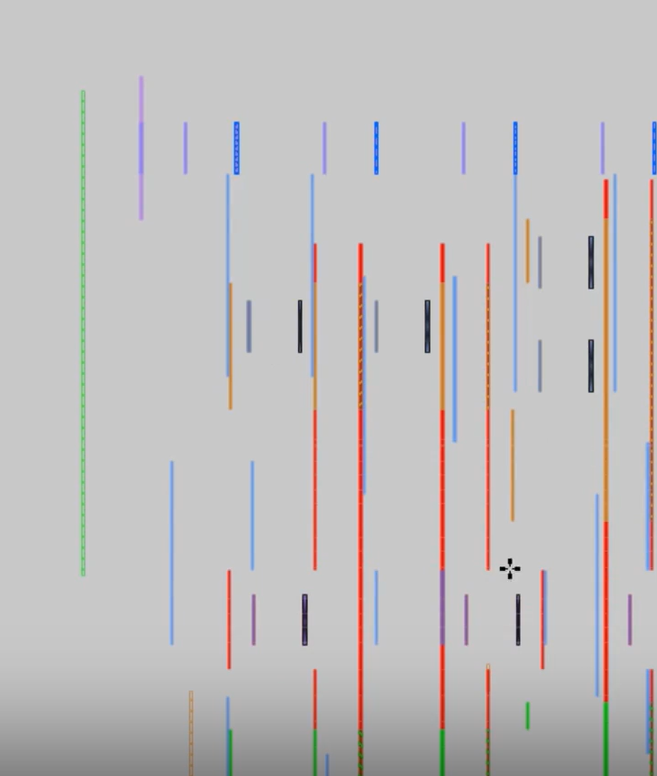

# L7 — XOR-Based Layout Comparison in Magic

## Overview

In this lab, I used **Magic's XOR operation** to compare two physical layouts and identify geometric differences between them.

The XOR operation is useful when comparing:

- two revisions of the same layout
- an edited layout against its original version
- pre- and post-processing layouts
- hierarchical designs where an unintended movement or edit may have occurred

The basic idea is:

```text
Layout A
   XOR
Layout B
   ↓
Only geometry that is different remains
```

If the layouts are geometrically identical, the XOR result should contain no meaningful geometry.

The lab consisted of two experiments:

1. Make a small local-interconnect modification to a copied standard cell and detect the change using XOR.
2. Shift a standard-cell instance inside a hierarchical layout and use XOR to reveal the unintended movement.

---

# Part 1 — Comparing an Altered Standard Cell Against the Original

## 1. Starting from the Original Layout

I started from the SKY130 standard-cell layout that had been used in the previous labs.

The cell was loaded in Magic so that I could create a local editable version.



The original layout acts as the reference geometry for the XOR comparison.

---

## 2. Creating a Local Editable Copy

Because the PDK library cell is a vendor-provided reference cell, I did not want to directly modify it.

Instead, I created a local copy named:

```text
altered
```

using:

```tcl
save altered
load altered
```

Once loaded from the local directory, the copied cell could be edited.

I then intentionally removed a small section of layout geometry.

The modification was deliberately kept small so that the XOR result would clearly show the difference.

---

## 3. Creating a Separate XOR Result Cell

Rather than directly overwriting either of the layouts being compared, I created a third cell for the XOR result.

The altered layout was copied into a new flattened cell using:

```tcl
flatten -nolabels xor_test
```

The option:

```text
-nolabels
```

was used because this comparison was focused only on **physical geometry**, not text labels.

The original standard cell was then loaded again and compared against the flattened copy using:

```tcl
xor -nolabels xor_test
```

Finally, I loaded the XOR-result cell:

```tcl
load xor_test
```



The XOR result contained only the geometry that differed between the two layouts.

---

## 4. Interpreting the First XOR Result

The modified layout differed from the original because a small strip of local interconnect had been removed.

Conceptually:

```text
Original Layout
       XOR
Altered Layout
       ↓
Removed Geometry
```

Therefore, the XOR result showed only the small region that had been modified.

This demonstrates the main advantage of XOR verification:

```text
Unchanged geometry disappears

Changed geometry remains visible
```

This makes it much easier to inspect a large layout for unintended edits.

---

# Part 2 — XOR Comparison on a Hierarchical Layout

## 5. Loading the Hierarchical Test Layout

For a more realistic experiment, I reused the `test3` layout created during the DRC lab.

This layout contained:

```text
Standard-cell logic
+
Tap / well-supporting cell
```

I restarted Magic and loaded:

```tcl
load test3
```



At this point the layout was still hierarchical, meaning that the logic and tap cells existed as separate instances.

---

## 6. Expanding the Hierarchical Layout

I expanded the layout so that the individual geometry inside the instantiated cells could be viewed.



The expanded view made it easier to identify the different standard-cell instances and observe how they were positioned relative to one another.

---

## 7. Flattening the Reference Geometry

I created an XOR reference copy using:

```tcl
flatten -nolabels xor_test
```

This created a flattened geometric representation of the current layout.

The purpose of this reference was to preserve the geometry before introducing the intentional modification.

The flow was therefore:

```text
Original test3
      ↓
Flatten -nolabels
      ↓
xor_test reference
```

---

## 8. Introducing an Intentional Placement Error

To simulate an accidental layout modification, I selected the AND2 standard-cell instance and shifted it slightly.



This represents a realistic type of physical-design error.

For example, while fixing one portion of a chip, it is possible to accidentally move a neighboring instance without immediately noticing.

Visually, such a shift may be difficult to detect in a large design.

---

## 9. Running XOR After the Layout Change

After shifting the cell, I compared the modified layout against the saved reference geometry:

```tcl
xor -nolabels xor_test
```

I then viewed the result:

```tcl
load xor_test
```

The relevant commands used during this experiment are shown below.



The important commands were:

```tcl
flatten -nolabels xor_test
xor -nolabels xor_test
load xor_test
```

---

## 10. XOR Result of the Shifted Cell

The XOR output produced a set of thin geometric slivers.



This occurs because the original and shifted versions of the cell overlap almost everywhere.

Only the geometry exposed by the displacement remains after XOR.

Conceptually:

```text
Original position:

|████████|

Shifted position:

   |████████|

XOR result:

|██|      |██|
```

The small strips on opposite sides of the geometry reveal that the entire cell moved.

This is very different from the first experiment, where only a small local region had been deliberately deleted.

---

# Why XOR Is Useful

XOR provides a simple geometric comparison:

```text
A XOR B
```

returns geometry that exists in one layout but not the other.

Therefore:

### If two layouts are identical

```text
Layout A XOR Layout B
        ↓
Empty result
```

### If one piece of geometry was changed

```text
Layout A XOR Layout B
        ↓
Only changed region
```

### If an entire instance moved

```text
Layout A XOR Layout B
        ↓
Difference strips around shifted geometry
```

This makes XOR useful for detecting changes that may be difficult to identify through visual inspection alone.

---

# `flatten -nolabels`

The command:

```tcl
flatten -nolabels xor_test
```

was important in this exercise.

### `flatten`

Converts hierarchical layout geometry into a flattened representation in a new cell.

### `xor_test`

Specifies the new cell that will hold the reference geometry.

### `-nolabels`

Prevents text labels from being copied into the comparison.

For this exercise, I wanted to compare:

```text
Physical mask geometry
```

rather than:

```text
Physical geometry + text labels
```

so `-nolabels` provided a cleaner XOR comparison.

---

# XOR vs. DRC vs. LVS

This exercise completed three different physical-verification concepts explored in this module.

| Verification | Main Question |
|---|---|
| DRC | Does the geometry obey fabrication rules? |
| LVS | Does the layout electrically match the intended circuit? |
| XOR | Are two physical layouts geometrically identical? |

The distinction can be summarized as:

```text
DRC
 ↓
Geometry vs. foundry rules

LVS
 ↓
Layout circuit vs. reference circuit

XOR
 ↓
Layout geometry vs. layout geometry
```

Each check detects a different type of physical-design problem.

---

# Practical Use of XOR

XOR comparison can be useful when:

- comparing two layout revisions
- checking whether an ECO changed only the intended area
- verifying GDS conversion
- checking database migration
- comparing pre- and post-processing layouts
- locating accidental layout modifications
- confirming that two supposedly identical layouts are actually identical

A large design may contain millions of shapes, making manual comparison unrealistic.

XOR reduces the comparison to:

```text
Show only what changed
```

which makes debugging significantly easier.

---

# Issues and Observations

## Local copy required for editing

The vendor SKY130 library layout should not be modified directly.

I therefore created a local copy before making intentional changes:

```tcl
save altered
load altered
```

This ensured that the original library layout remained untouched.

---

## Labels were excluded from comparison

For the XOR test, I used:

```tcl
-nolabels
```

because labels can create differences even when the actual fabrication geometry is unchanged.

The purpose of this exercise was to compare physical geometry only.

---

## Shifted-cell XOR looked unusual

When the AND2 instance was shifted slightly, the XOR result did not resemble the original cell.

Instead, it appeared as thin strips of geometry.

This behavior is expected.

Most of the shifted cell still overlaps its original location. XOR removes the overlapping geometry and preserves only the non-overlapping edges.

Therefore the thin strips are evidence that the complete cell was moved.

---

# Key Commands

## Create Local Editable Copy

```tcl
save altered
load altered
```

## Create Flattened Reference Cell

```tcl
flatten -nolabels xor_test
```

## Load Original Cell

```tcl
load sky130_fd_sc_hd__and2_1
```

## Perform Geometry XOR

```tcl
xor -nolabels xor_test
```

## View XOR Result

```tcl
load xor_test
```

## Load Hierarchical Test Layout

```tcl
load test3
```

---

# Key Learnings

- Used Magic to perform geometric XOR comparisons.
- Created a local editable copy of a vendor standard cell.
- Avoided modifying the original PDK library layout.
- Created a separate flattened cell to preserve reference geometry.
- Used `flatten -nolabels` to create a geometry-only comparison reference.
- Used `xor -nolabels` to compare layouts.
- Detected a deliberately removed interconnect section.
- Repeated the XOR experiment on a hierarchical standard-cell layout.
- Simulated an accidental layout edit by shifting a cell instance.
- Observed the characteristic thin-sliver XOR result caused by a shifted cell.
- Learned that XOR can quickly identify unintended physical-layout modifications.
- Distinguished XOR verification from DRC and LVS.

---

# Result

```text
Original standard cell loaded              ✓
Local editable copy created                ✓
Intentional geometry modification made     ✓
Flattened XOR reference created            ✓
Geometry-only XOR performed                ✓
Changed geometry successfully detected     ✓

Hierarchical test layout loaded            ✓
Reference layout flattened                 ✓
Standard-cell instance intentionally moved ✓
Second XOR comparison performed            ✓
Unintended geometric shift detected        ✓
```

The key result of this lab was demonstrating that **XOR provides a direct geometry-difference check between two layouts**.

A small local edit produced a localized XOR difference, while shifting an entire standard-cell instance produced multiple thin difference regions around the displaced geometry.

This showed how XOR can be used as a practical physical-verification tool for validating layout revisions and detecting unintended edits.
