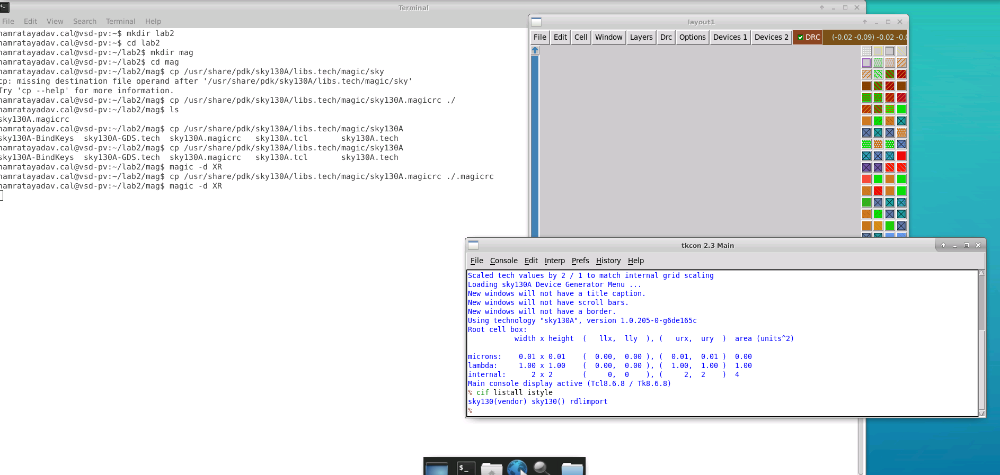
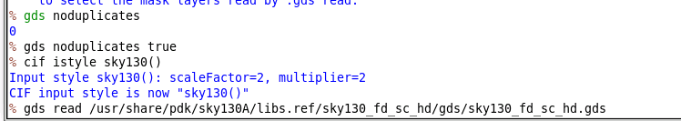
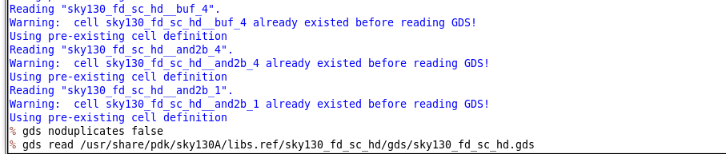

# L1 — Reading SKY130 GDS into Magic

## Overview

In this lab, I worked with the SKY130 standard-cell GDS library and explored how Magic reads GDS data, handles import styles, identifies top-level cells, and manages duplicate cell definitions.

The key focus was understanding the difference between Magic's native `.mag` database flow and external GDS input, and how the selected CIF/GDS input style affects imported pin/text interpretation.

The overall flow was:

```text
Set up SKY130 Magic environment
        ↓
Launch Magic
        ↓
Inspect available CIF input styles
        ↓
Read SKY130 standard-cell GDS
        ↓
Inspect loaded top-level cells
        ↓
Load a standard cell
        ↓
Compare GDS input styles
        ↓
Enable duplicate protection
        ↓
Re-read GDS without overwriting cells
```

---

## 1. SKY130 Magic Environment Setup

I created a dedicated working directory for this lab and copied the SKY130 Magic configuration into it.

```bash
mkdir lab2
cd lab2

mkdir mag
cd mag

cp /usr/share/pdk/sky130A/libs.tech/magic/sky130A.magicrc ./.magicrc
```

Magic was then launched using:

```bash
magic -d XR
```



The console confirmed that Magic was using the SKY130A technology environment.

---

## 2. Inspecting CIF / GDS Input Styles

Before reading the GDS library, I inspected the available input styles.

Commands used:

```tcl
cif listall istyle
```

to list all known input styles, and:

```tcl
cif list istyle
```

to check the currently active style.

I also used:

```tcl
cif istyle sky130()
```

to switch the input style.

Different input styles handle imported text, labels, and pin information differently.

For SKY130 vendor GDS, the vendor-specific style is important because standard-cell pin information should be interpreted correctly.


---

## 3. Reading the SKY130 Standard-Cell GDS

Unlike Magic `.mag` files, GDS files are not automatically found using Magic's normal search path.

Therefore, I provided the complete path to the SKY130 standard-cell GDS file:

```tcl
gds read /usr/share/pdk/sky130A/libs.ref/sky130_fd_sc_hd/gds/sky130_fd_sc_hd.gds
```

After reading the file, no single layout appeared automatically.

This is because the GDS file is a **library containing many subcells**, not one instantiated top-level layout.

The imported cells therefore existed as separate top-level cells in Magic.

---

## 4. Inspecting Imported Top-Level Cells

To inspect the imported cells, I used Magic's cell listing / cell manager.

The cell manager showed the large set of SKY130 standard cells contained in the GDS library.


These cells included standard logic gates and library variants.

I selected:

```text
sky130_fd_sc_hd__and2_1
```

and loaded it for inspection.


This allowed me to inspect the physical geometry, routing layers, labels, and pins of an actual SKY130 standard cell.

---

## 5. Effect of GDS Input Style

With the vendor input style active, Magic interpreted the cell ports using the vendor-specific pin representation.

When I changed the input style using:

```tcl
cif istyle sky130()
```

and re-read the GDS, the imported text/pin representation changed.

This showed that the selected input style directly affects how labels and port-purpose information are interpreted during GDS import.

For standard-cell libraries, the vendor style is preferred because the GDS contains intended pin information that should remain identifiable as ports.

---

## 6. Preventing Duplicate Cell Overwrites

I then explored Magic's duplicate-cell handling.

First, I checked the current setting:

```tcl
gds noduplicates
```

The returned value showed that duplicate protection was disabled.

I enabled it using:

```tcl
gds noduplicates true
```



After enabling duplicate protection, I changed the input style and re-read the same GDS file.

Magic reported messages such as:

```text
Using pre-existing cell definition
```

instead of overwriting cells that had already been loaded.



This confirmed that `gds noduplicates true` protects already-loaded cells from being replaced during subsequent GDS reads.

---

## 7. Disabling Duplicate Protection

To return to the default overwrite behavior, I disabled the option using:

```tcl
gds noduplicates false
```

This allows Magic to replace an existing cell definition if the same cell is encountered again in a newly read GDS file.

---

## What I Learned

- Magic uses different input styles to interpret GDS/CIF data.
- Vendor-specific input styles are important when reading foundry or standard-cell GDS files.
- GDS libraries can contain many independent cells without a single instantiated top-level design.
- Imported GDS cells can be inspected using the Cell Manager.
- Standard-cell pin/text interpretation can change depending on the selected input style.
- `gds noduplicates true` prevents existing cell definitions from being overwritten.
- GDS files require an explicit path, unlike Magic `.mag` files that can use Magic's search path.

---

## Key Commands

```tcl
cif listall istyle
cif list istyle
cif istyle sky130()

gds read /usr/share/pdk/sky130A/libs.ref/sky130_fd_sc_hd/gds/sky130_fd_sc_hd.gds

gds noduplicates
gds noduplicates true
gds noduplicates false
```

---

## Result

The SKY130 standard-cell GDS library was successfully loaded into Magic, individual cells were inspected, and I verified how GDS input style and duplicate-cell handling affect the imported database.

```text
SKY130 Magic setup           ✓
GDS library read             ✓
Top-level cells inspected    ✓
Standard cell loaded         ✓
Input style compared         ✓
Duplicate protection tested  ✓
```

The next lab continues with **ports and pin handling** in imported GDS data.
