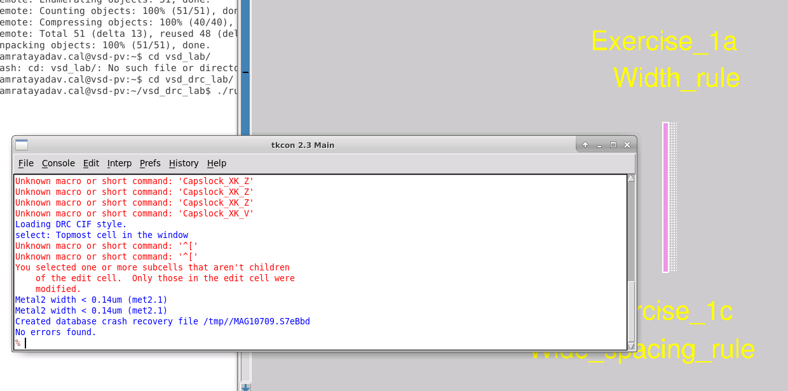
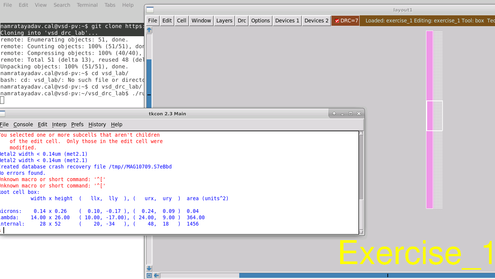
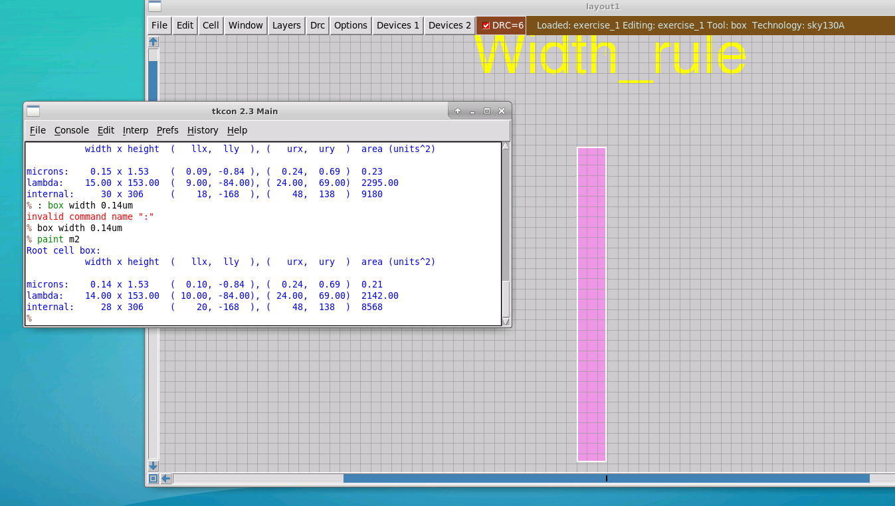
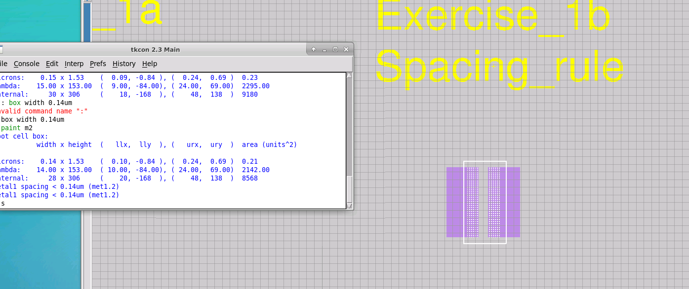
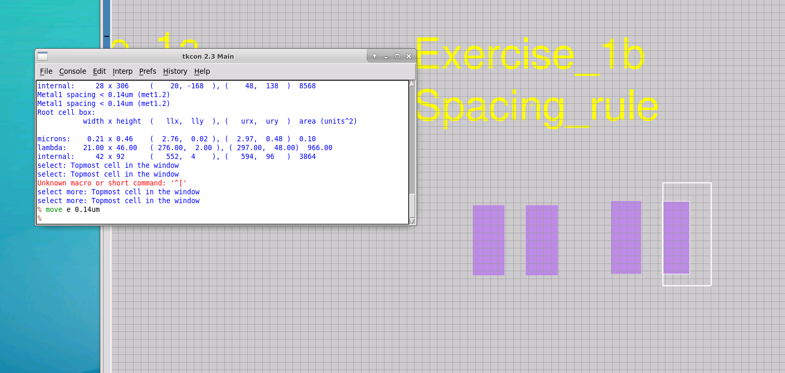

# L1 — Lab for Width Rule and Spacing Rule

## Overview

In this lab, I worked with **SKY130 Design Rule Checking (DRC)** in Magic and investigated two fundamental physical layout rules:

- **Minimum Width Rule**
- **Minimum Spacing Rule**

The objective was to understand how Magic identifies a DRC violation, how the violated geometry can be measured, and how the layout can be modified to satisfy the corresponding SKY130 design rule.

The basic workflow followed in this lab was:

```text
Launch SKY130 DRC Lab
        ↓
Load DRC Exercise
        ↓
Identify DRC Violation
        ↓
Query the Violated Rule
        ↓
Measure the Geometry
        ↓
Modify the Layout
        ↓
Recheck DRC
        ↓
Confirm Error is Removed
```

---

## 1. DRC Lab Setup

I first cloned the DRC exercise repository:

```bash
git clone https://github.com/RTimothyEdwards/vsd_drc_lab.git
```

Then I entered the repository:

```bash
cd vsd_drc_lab
```

and launched Magic using the provided script:

```bash
./run_magic
```

Magic launched with the **SKY130A technology** loaded, allowing the SKY130 design rules to be checked interactively.


---

## 2. Exercise Layout

The first exercise contains several intentionally created layout-rule violations.

The layout includes examples for:

```text
Exercise_1a → Width Rule
Exercise_1b → Spacing Rule
Exercise_1c → Wide Spacing Rule
Exercise_1d → Notch Rule
```

For this lab, I focused specifically on **Exercise_1a** and **Exercise_1b**.

The wide-spacing and notch-rule exercises are documented separately in L2.


---

# 3. Minimum Width Rule

## Initial Width Violation

I started with **Exercise_1a — Width_rule**.

The Metal2 geometry was intentionally created with a width smaller than the minimum allowed value.

After selecting the region and checking the DRC error, Magic identified a Metal2 width violation.



The reported rule was:

```text
Metal2 width < 0.14um (met2.1)
```



This indicates that the Metal2 geometry must have a minimum width of:

```text
0.14 µm
```

Therefore:

```text
Metal2 width < 0.14 µm
            ↓
       DRC Violation
```

---

## 4. Correcting the Width Rule

I measured the geometry using Magic's box dimensions and modified the Metal2 shape so that its width satisfied the minimum requirement.

The objective was:

```text
Metal2 width ≥ 0.14 µm
```

After modifying the geometry and checking the DRC again, Magic reported:

```text
No errors found.
```


I then confirmed the corrected Metal2 geometry and its dimensions.



The result can be summarized as:

```text
Width < 0.14 µm
       ↓
   DRC Error

       ↓ Correct geometry

Width ≥ 0.14 µm
       ↓
   Rule Satisfied
```

This exercise demonstrated how Magic's interactive DRC responds directly to changes in layout geometry.

---

# 5. Minimum Spacing Rule

Next, I worked on **Exercise_1b — Spacing_rule**.

This exercise contains Metal1 geometries placed closer together than the minimum permitted spacing.

Magic reported:

```text
Metal1 spacing < 0.14um (met1.2)
```



The spacing rule checks the distance between two separate geometries.

Conceptually:

```text
Metal1                  Metal1

██████                  ██████
       <-------------->

           Spacing
```

If:

```text
Spacing < 0.14 µm
```

the geometries violate the SKY130 Metal1 spacing rule.

---

# 6. Correcting the Spacing Rule

To correct the violation, I selected one of the Metal1 shapes and moved it away from the neighboring geometry.

I used the Magic command:

```tcl
move e 0.14um
```

where:

```text
move       → Move the selected geometry
e          → Move toward the east/right direction
0.14um     → Distance by which the geometry is moved
```



This increased the separation between the Metal1 shapes.

The objective was to satisfy:

```text
Metal1 spacing ≥ 0.14 µm
```

After correcting the geometry, the spacing-rule violation was removed.


The correction can therefore be represented as:

```text
Spacing < 0.14 µm
        ↓
    DRC Error

        ↓ move geometry

Spacing ≥ 0.14 µm
        ↓
   Rule Satisfied
```

---

# 7. Width Rule vs. Spacing Rule

| Rule | What is Checked | Layer Used in Exercise | Requirement |
|---|---|---|---|
| Minimum Width | Width of an individual geometry | Metal2 | ≥ 0.14 µm |
| Minimum Spacing | Separation between neighboring geometries | Metal1 | ≥ 0.14 µm |

The difference can be visualized as:

```text
WIDTH RULE

   <---- width ---->

       ███████


SPACING RULE

██████              ██████
       <--- gap --->
```

The **width rule** controls the minimum dimension of a single layout shape, while the **spacing rule** controls how close two geometries are allowed to be.

---

# 8. DRC Debugging Flow Practiced

The practical debugging flow I followed was:

```text
Locate DRC Marker
       ↓
Select the Error Region
       ↓
Query the DRC Rule
       ↓
Identify Layer + Rule
       ↓
Measure Geometry
       ↓
Modify Geometry
       ↓
Recheck DRC
       ↓
Verify Error Removal
```

This is an important layout-debugging workflow because the DRC message identifies both the physical layer and the geometric condition responsible for the violation.

For example:

```text
Metal2 width < 0.14um (met2.1)
```

can be interpreted as:

```text
Metal2
   ↓
Affected layer

width
   ↓
Type of rule

0.14um
   ↓
Minimum required value

met2.1
   ↓
Rule identifier
```

---

# Key Learnings

- Set up and launched the SKY130 DRC lab environment in Magic.
- Used Magic's interactive DRC capability.
- Identified a **Metal2 minimum-width violation**.
- Interpreted the `met2.1` DRC rule.
- Used Magic's geometry measurements while debugging the layout.
- Corrected the Metal2 width violation.
- Identified a **Metal1 minimum-spacing violation**.
- Interpreted the `met1.2` DRC rule.
- Used the `move` command to modify layout geometry precisely.
- Corrected the Metal1 spacing violation.
- Verified that DRC errors disappeared after correcting the geometry.

---

# Result

```text
SKY130 DRC environment launched       ✓
Exercise layout loaded                ✓
Width violation identified            ✓
Width rule interpreted                ✓
Width geometry corrected              ✓
Width DRC cleared                     ✓
Spacing violation identified          ✓
Spacing rule interpreted              ✓
Geometry moved using Magic command    ✓
Spacing DRC cleared                   ✓
```

This lab provided hands-on experience with the basic **width and spacing design rules** and established a practical workflow for identifying, understanding, and correcting DRC violations in Magic using the SKY130 PDK.
