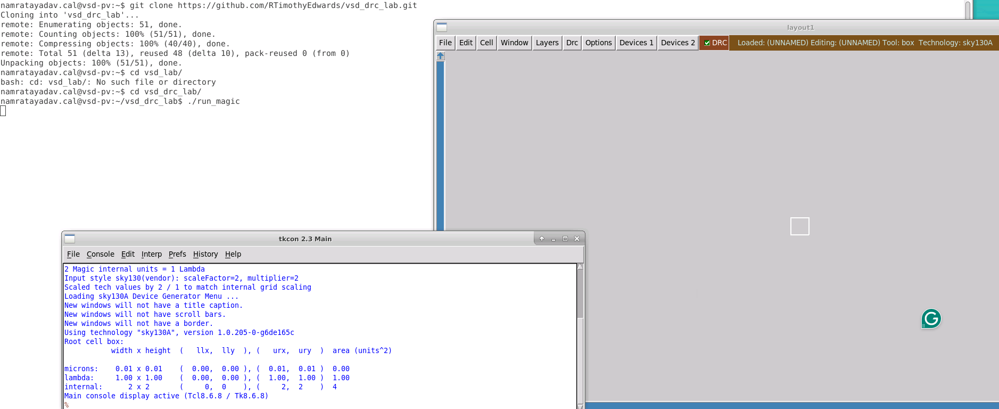
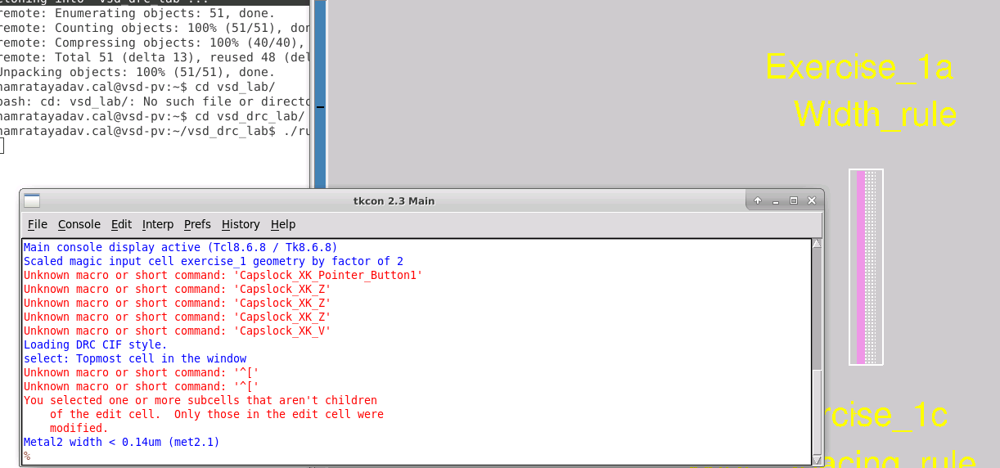
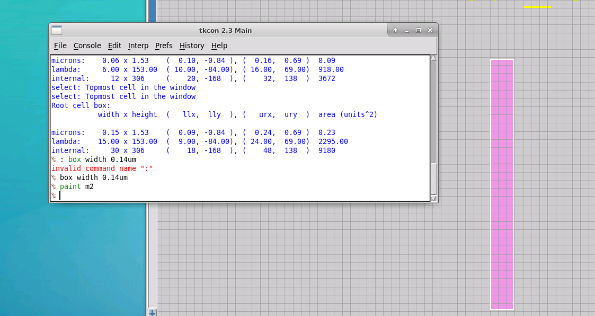
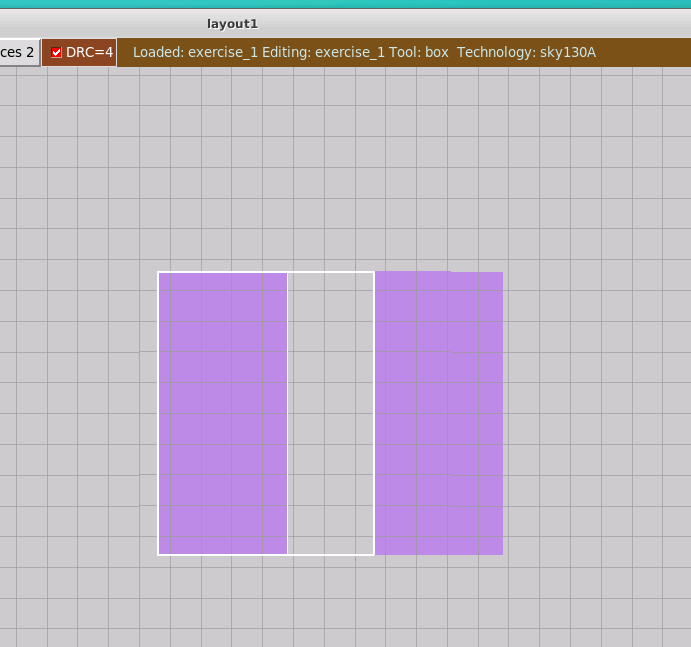

# L1 — Width Rule and Spacing Rule

## Overview

In this lab, I started working with **SKY130 design rules in Magic** and practiced identifying and correcting two fundamental layout violations:

- Minimum width rule
- Minimum spacing rule

The main goal was to understand how Magic reports DRC violations, how the corresponding geometry can be measured, and how modifying the layout removes the violation.

---

## Lab Setup

I first cloned the DRC lab repository:

```bash
git clone https://github.com/RTimothyEdwards/vsd_drc_lab.git
```

Then entered the lab directory:

```bash
cd vsd_drc_lab
```

and launched Magic using:

```bash
./run_magic
```

Magic started with the **SKY130A technology** loaded.



---

## Exercise Layout

The provided layout contains several intentionally created DRC violations.

For this lab, I focused on:

```text
Exercise_1a → Width rule
Exercise_1b → Spacing rule
```

The remaining exercises for wide-spacing and notch rules are covered separately in L2.



---

# Minimum Width Rule

## Initial Violation

I started with **Exercise_1a — Width_rule**.

The Metal2 geometry was intentionally drawn narrower than the minimum width allowed by the SKY130 design rules.


After querying the DRC violation, Magic reported:

```text
Metal2 width < 0.14um (met2.1)
```


This means that the Metal2 shape must have a minimum width of:

```text
0.14 µm
```

The original geometry did not satisfy this requirement.

---

## Measuring the Geometry

I used the Magic box to inspect the dimensions of the Metal2 shape.

The measurement allowed me to compare the actual width against the required minimum:

```text
Required Metal2 width = 0.14 µm
```

The basic check is:

```text
Actual width < 0.14 µm
          ↓
      DRC violation
```

---

## Correcting the Width

I modified the Metal2 geometry until its width satisfied the minimum requirement.


After correcting the geometry and checking the layout again, Magic reported:

```text
No errors found.
```



Therefore:

```text
Width < 0.14 µm   → DRC violation

Width ≥ 0.14 µm   → Rule satisfied
```

This demonstrated how Magic's interactive DRC responds directly to geometry changes.

---

# Minimum Spacing Rule

## Initial Violation

Next, I worked on **Exercise_1b — Spacing_rule**.

This exercise contains two Metal1 geometries placed closer together than the minimum permitted spacing.

Magic reported:

```text
Metal1 spacing < 0.14um (met1.2)
```


Unlike the width rule, which checks the dimension of a single shape, the spacing rule checks the separation between two shapes.

Conceptually:

```text
Metal1                Metal1
██████                ██████
       <------------>
           spacing
```

If the spacing is smaller than the required value, Magic reports a DRC violation.

---

## Correcting the Spacing

I selected one of the Metal1 geometries and moved it farther away from the other geometry.


The required minimum spacing was:

```text
0.14 µm
```

Therefore:

```text
Spacing < 0.14 µm
        ↓
    DRC violation
```

After increasing the separation:

```text
Spacing ≥ 0.14 µm
        ↓
    Rule satisfied
```



---

# Width vs. Spacing Rule

| Rule | What is checked | Violation observed |
|---|---|---|
| Width rule | Width of one geometry | Metal2 width `< 0.14 µm` |
| Spacing rule | Distance between two geometries | Metal1 spacing `< 0.14 µm` |

This exercise helped distinguish two of the most fundamental physical layout constraints:

```text
WIDTH
<------>

████████


SPACING

████       ████
     <--->
```

Width controls the minimum size of an individual shape, while spacing controls the minimum separation between neighboring shapes.

---

# DRC Debugging Flow

The workflow I practiced in this lab was:

```text
Load layout
     ↓
Locate DRC violation
     ↓
Query the violated rule
     ↓
Identify the affected layer
     ↓
Measure the geometry
     ↓
Modify the layout
     ↓
Recheck DRC
     ↓
Confirm violation is removed
```

---

## Key Learnings

- Set up and launched the SKY130 DRC lab environment.
- Used Magic for interactive design-rule checking.
- Identified a Metal2 minimum-width violation.
- Interpreted the `met2.1` width-rule message.
- Measured layout geometry using Magic.
- Modified Metal2 geometry to satisfy the width rule.
- Identified a Metal1 minimum-spacing violation.
- Interpreted the `met1.2` spacing-rule message.
- Adjusted geometry to satisfy minimum spacing.
- Observed DRC errors disappear after correcting the layout.

---

## Result

```text
SKY130 DRC environment setup       ✓
Width-rule violation identified    ✓
Width-rule requirement measured    ✓
Width violation corrected          ✓
Spacing-rule violation identified  ✓
Spacing requirement measured       ✓
Spacing violation corrected        ✓
Interactive DRC verified           ✓
```

This lab established the basic workflow for **identifying, understanding, measuring, and correcting geometric DRC violations in Magic using the SKY130 PDK**.
