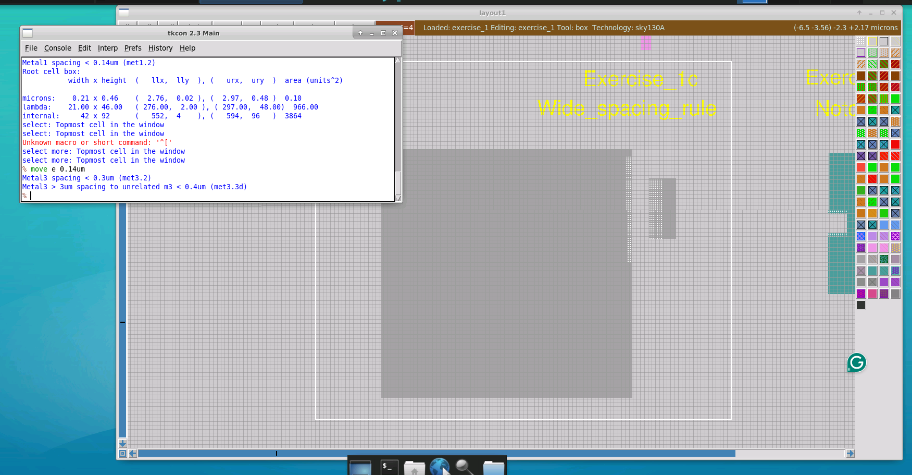
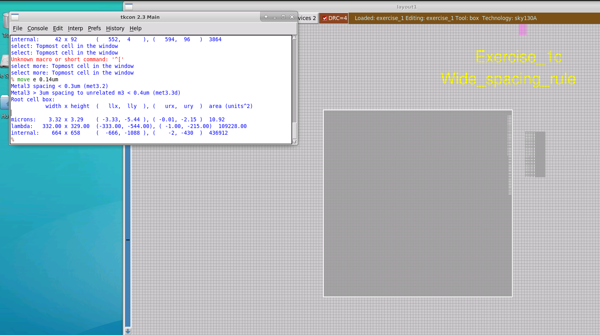
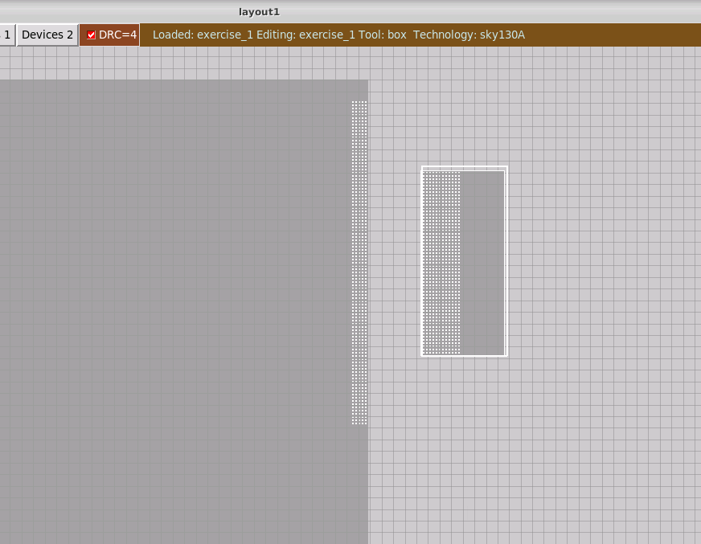
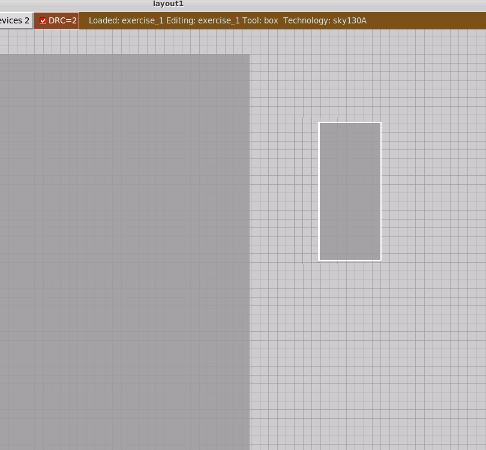
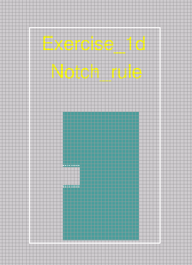
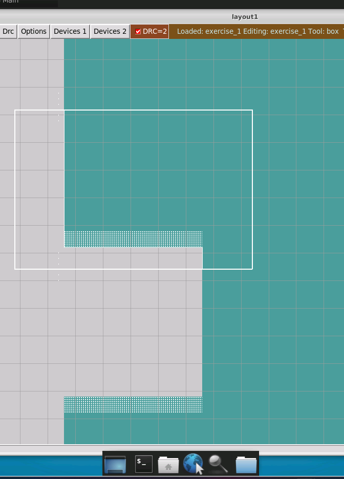
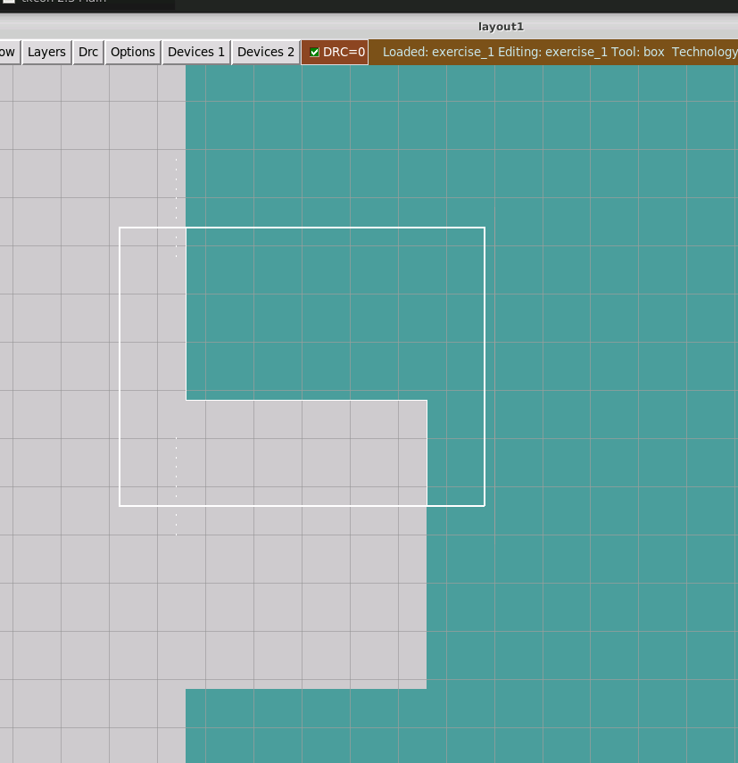
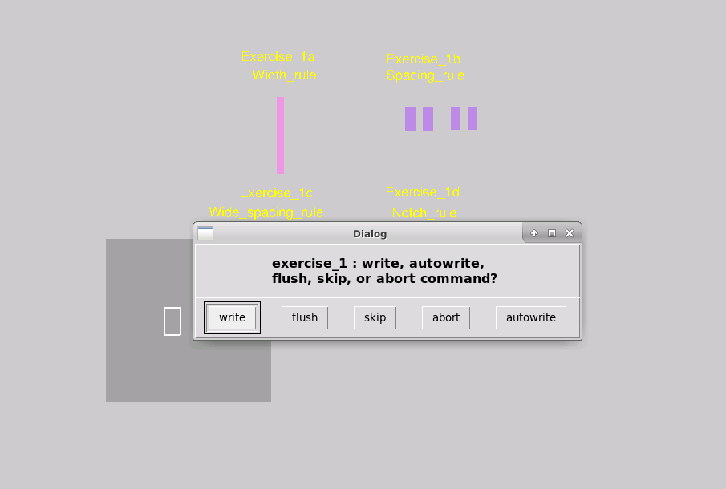

# L2 — Lab for Wide Spacing Rule and Notch Rule

## Overview

In this lab, I continued working with **SKY130 Design Rule Checking (DRC)** in Magic and investigated two additional geometry-dependent design rules:

- **Wide Metal Spacing Rule**
- **Notch Rule**

The wide-spacing exercise demonstrated how the required spacing can change depending on the size of a metal shape, while the notch exercise demonstrated how a narrow opening inside a continuous shape can also be treated as a spacing violation.

The overall flow was:

```text
Load Exercise 1
      ↓
Inspect Wide Spacing Violation
      ↓
Identify Basic + Wide Spacing Rules
      ↓
Measure Wide Metal Geometry
      ↓
Move Neighboring Geometry
      ↓
Clear Wide Spacing Violation
      ↓
Inspect Notch Violation
      ↓
Stretch Geometry
      ↓
Clear Notch Violation
      ↓
Verify DRC = 0
```

---

# 1. Wide Spacing Rule

I started with **Exercise_1c — Wide_spacing_rule**.

After selecting the DRC region and querying the error, Magic reported two spacing-related violations:

```text
Metal3 spacing < 0.3um (met3.2)

Metal3 > 3um spacing to unrelated m3 < 0.4um (met3.3d)
```



This showed that the geometry was violating both the normal Metal3 spacing requirement and an additional spacing requirement associated with wide Metal3 geometry.

---

## 2. Understanding the Wide-Metal Condition

The large Metal3 shape on the left triggers the wide-spacing rule because its dimensions exceed the size condition associated with this check.

I selected the large geometry and inspected its dimensions using Magic.



The important concept from this exercise was that spacing requirements are not always determined only by the two closest edges.

A sufficiently large metal region can trigger an additional spacing requirement.

Conceptually:

```text
Normal Metal

████        ████
    <------>


Wide Metal

████████████████        ████
                <------>
                  ↑
        Larger spacing may be required
```

For this exercise, Magic reported:

```text
Normal Metal3 spacing:
0.3 µm

Wide Metal3 spacing:
0.4 µm
```

---

# 3. Correcting the Wide Spacing Violation

The small Metal3 geometry was too close to the large Metal3 region.



Since this is fundamentally a spacing problem, I corrected it by selecting the smaller geometry and moving it farther away from the large Metal3 shape.

The normal spacing violation disappears once the basic spacing requirement is satisfied, but the wide-spacing rule can remain active until the larger required separation is reached.

Therefore, the correction process was:

```text
Initial separation
       ↓
Normal spacing violation
+
Wide spacing violation
       ↓
Move smaller Metal3 geometry
       ↓
Normal spacing rule satisfied
       ↓
Continue increasing separation
       ↓
Wide spacing rule satisfied
```

After moving the geometry sufficiently far from the wide Metal3 region, the wide-spacing violation was removed.



This demonstrated that **wide-metal rules can impose a larger spacing requirement than the ordinary spacing rule**.

---

# 4. Notch Rule

Next, I worked on **Exercise_1d — Notch_rule**.

A notch is a narrow opening or indentation inside what is otherwise a continuous piece of geometry.



Conceptually:

```text
████████████████
████████████████
████
████     ← notch
████
████████████████
████████████████
```

Although both sides of the opening belong to the same continuous shape, the opening can still be too narrow according to the process design rules.

Therefore, a notch rule can be viewed as another form of spacing constraint.

---

# 5. Notch Rule Violation

I zoomed into the notch region and inspected the DRC markers around the opening.



Unlike the previous spacing exercise, simply moving part of the geometry is not the appropriate correction.

Magic uses a **paint-based layout representation**. If part of the painted shape is selected and moved normally, it can separate that portion from the original geometry instead of extending the existing shape.

For this reason, the appropriate operation is to **stretch the geometry**.

---

# 6. Correcting the Notch Using Stretch

To correct the notch, I selected the appropriate edge/region of the geometry and stretched the existing shape.

In Magic, the keypad movement can be combined with **Shift** to perform a stretch rather than a normal move.

For example:

```text
Shift + Keypad 8
```

stretches the selected geometry upward.

The distinction is:

```text
Normal Move
     ↓
Moves selected geometry

Shift + Move
     ↓
Stretches existing geometry
```

This is important for notch correction because I wanted to modify the boundary of the same shape rather than split it into separate pieces.

After stretching the geometry sufficiently, the notch violation disappeared.



---

# 7. Final DRC Result

After correcting both the wide-spacing and notch violations, I completed Exercise 1.

The final layout reached:

```text
DRC = 0
```



I then saved the modified exercise from Magic.

This completed the first set of DRC exercises covering:

```text
Exercise_1a → Width Rule
Exercise_1b → Spacing Rule
Exercise_1c → Wide Spacing Rule
Exercise_1d → Notch Rule
```

Exercises 1a and 1b were documented in **L1**, while exercises 1c and 1d were completed in this lab.

---

# 8. Wide Spacing vs. Notch Rule

| Rule | Geometry Being Checked | Correction Used |
|---|---|---|
| Wide Spacing | Separation involving a wide metal region | Move geometry farther away |
| Notch | Narrow opening inside a continuous geometry | Stretch geometry |

The two rules are related because both ultimately constrain distances between nearby edges.

However, their physical situations are different:

```text
WIDE SPACING

██████████████        ███
              <------>


NOTCH

████████████████
████
████    <---->
████         ████
████████████████
```

---

# 9. Move vs. Stretch in Magic

One of the important practical concepts I learned in this lab was the difference between **moving** and **stretching** geometry.

### Move

Used when an entire geometry needs to change position.

```text
Before:

████      ████

             ↓ MOVE

After:

████            ████
```

This was useful for correcting the **wide-spacing rule**.

### Stretch

Used when the boundary of an existing painted geometry needs to be extended.

```text
Before:

████
████
     ████
     ████

       ↓ STRETCH

████████
████████
```

This was useful for correcting the **notch rule**.

---

# 10. DRC Debugging Flow Practiced

The workflow used in this lab was:

```text
Locate DRC Error
      ↓
Query Rule
      ↓
Understand Geometry Condition
      ↓
Measure Layout
      ↓
Determine Move vs. Stretch
      ↓
Modify Geometry
      ↓
Recheck DRC
      ↓
Continue Until DRC = 0
```

---

# Key Learnings

- Investigated the SKY130 **wide-metal spacing rule**.
- Observed both normal and wide-spacing violations on the same geometry.
- Learned that wide metal can require additional spacing from neighboring metal.
- Measured layout geometry in Magic to understand why a rule was triggered.
- Corrected spacing violations by moving geometry.
- Investigated a **notch-rule violation**.
- Understood a notch as a narrow opening within a continuous shape.
- Learned the difference between **move** and **stretch** operations in Magic.
- Used stretching to correct a notch without splitting the painted geometry.
- Reduced the Exercise 1 layout to **DRC = 0**.

---

# Result

```text
Wide-spacing violation identified       ✓
Normal spacing requirement observed     ✓
Wide-metal condition investigated       ✓
Wide-spacing geometry corrected         ✓
Notch violation identified              ✓
Move vs. stretch behavior understood    ✓
Notch geometry corrected                ✓
Final DRC count = 0                     ✓
Exercise 1 completed                    ✓
```

This lab extended the basic width and spacing concepts from L1 by showing that **DRC requirements can depend on geometry size and shape**, and that selecting the correct layout-editing operation is important when resolving violations in Magic.
