# L3 — Via Size, Multiple Vias, Via Overlap and Auto-Generated Vias

## Overview

In this lab, I explored how vias and contacts are represented and verified in Magic using the SKY130 technology.

The exercises covered four main areas:

- Via size rules
- Generation of multiple contact cuts
- Metal overlap/enclosure requirements around contacts
- Automatic via generation while routing between metal layers

A key observation from this lab was that a large contact area displayed in Magic does not necessarily represent one physically large via. Magic can use the available contact area to algorithmically generate an array of legal contact cuts.

The overall flow was:

```text
Load Exercise 2
      ↓
Investigate Via Size
      ↓
Inspect Generated Contact Cuts
      ↓
Use CIF Layer Feedback
      ↓
Investigate Via Overlap Rules
      ↓
Correct Metal Enclosure
      ↓
Use Wiring Tool
      ↓
Automatically Generate Vias
      ↓
Inspect Contact Arrays Across Metal Stack
```

---

## 1. Exercise 2 Overview

I loaded `exercise_2.mag` in Magic. The exercise contains four sections:

- Exercise 2a — Via size
- Exercise 2b — Multiple vias
- Exercise 2c — Via overlap
- Exercise 2d — Auto-generated vias

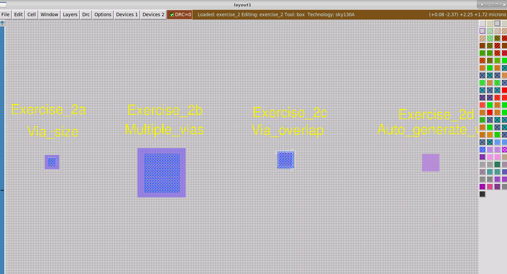

These exercises demonstrate that via verification involves more than simply checking whether two metal layers overlap. The via/contact itself and the surrounding conductive layers must satisfy specific geometrical requirements.

---

## 2. Via Size Rule

I first examined **Exercise 2a**, which contains a via/contact geometry with a size violation.

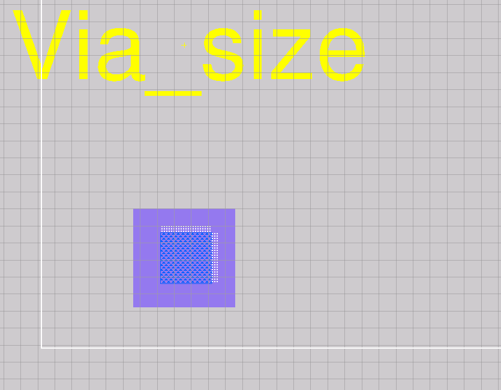

The via size problem behaves similarly to a width-rule violation in Magic.

I selected part of the geometry using:

```text
A
```

and stretched the selected region until the DRC violation disappeared.

This exercise demonstrated that the painted contact region must provide sufficient area for Magic to generate a legal contact cut.

---

## 3. Understanding CIF Contact Layers

Magic does not necessarily display the actual individual contact cuts directly as ordinary painted geometry.

To inspect what Magic would generate, I used the CIF layer visualization command.

I first intentionally queried an invalid layer:

```text
cif see xxx
```

Magic returned the list of valid CIF layer names.

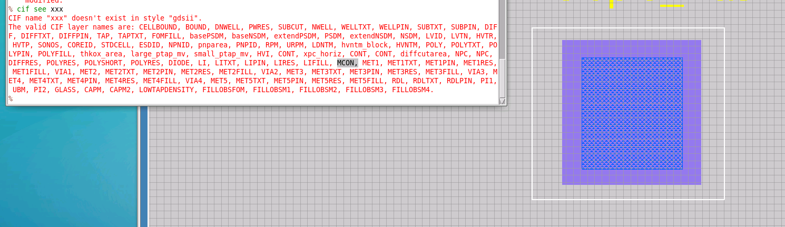

For the contact between local interconnect and Metal1, the relevant CIF layer is:

```text
MCON
```

Therefore I used:

```text
cif see MCON
```

---

## 4. Multiple Vias

Exercise 2b contains a relatively large contact region.

At first glance, this appears to be one large via. However, Magic interprets this region as an area in which multiple legal contact cuts can be generated.

Using:

```text
cif see MCON
```

I could visualize the generated cuts.

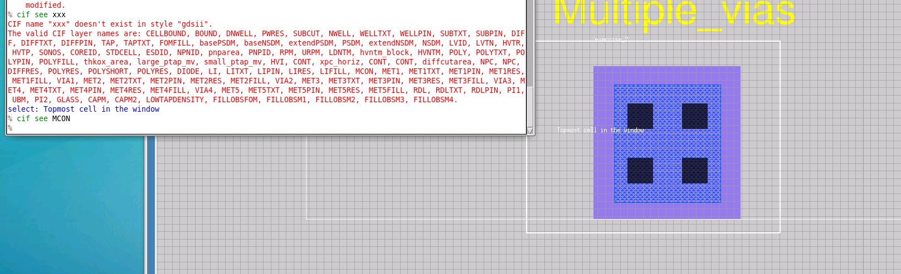

In this example, Magic generated multiple MCON cuts inside the available region.

This demonstrated an important layout concept:

> A larger via region can be implemented as an array of legal fixed-size contact cuts rather than as one oversized contact.

---

## 5. CIF Feedback

The shapes displayed by `cif see` are feedback generated from the CIF processing rather than ordinary layout geometry.

I used:

```text
feedback why
```

to inspect the generated feedback.

I then used:

```text
feedback clear
```

to remove it.

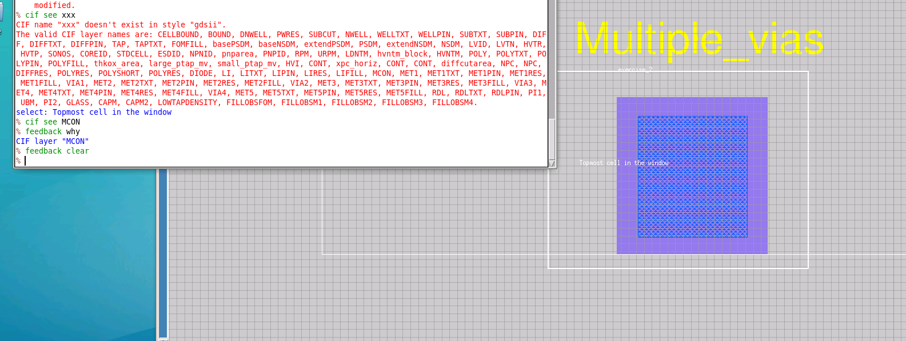

This was useful for distinguishing the actual painted layout from the contact geometry that Magic would generate from it.

---

## 6. Contact Generation in a Small Area

I returned to the smaller contact region in Exercise 2a and again used:

```text
cif see MCON
```

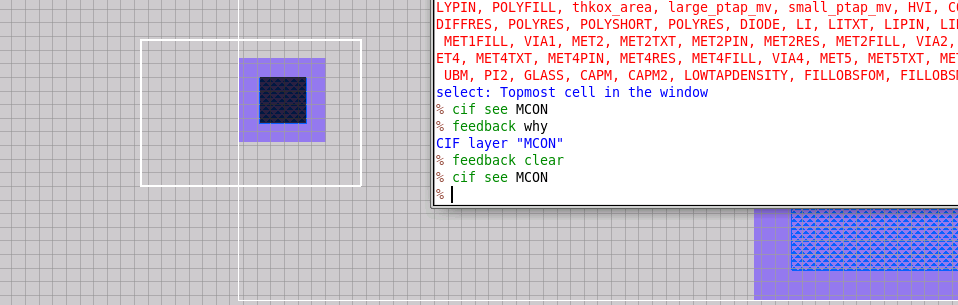

When sufficient area exists, Magic can fit a valid MCON contact cut inside the contact region.

I then reduced the available area to investigate what happens when the region becomes too small.

Magic reported:

```text
CIF error in cell exercise_2, layer MCON:
no room for contacts in area!
```

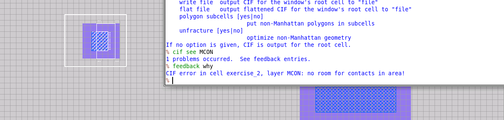

This helped distinguish two related checks:

```text
Painted contact geometry
        ↓
DRC verifies geometry
        ↓
CIF generation attempts to place contact cut
        ↓
Insufficient area
        ↓
"No room for contacts in area"
```

After restoring the geometry to a valid size, the contact could again be generated correctly.

---

## 7. Via Overlap / Enclosure Rule

Exercise 2c demonstrates that a contact also requires sufficient surrounding metal.

The initial geometry produced the rule:

```text
Metal1 overlap of local interconnect contact < 0.03um (met1.4)
```

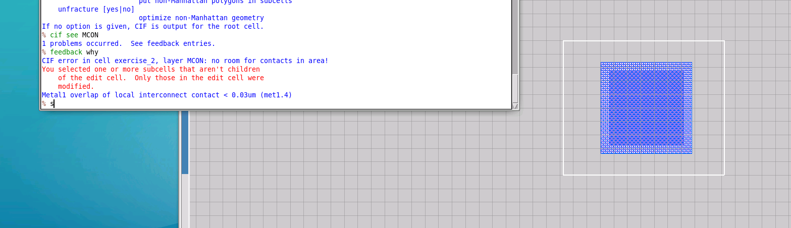

This means that Metal1 must extend beyond the contact by at least **0.03 µm** around it.

I selected the contact area and expanded the box using:

```text
box grow c 0.03um
```

Then I painted Metal1 over the expanded region.

---

## 8. Directional Metal1 Overlap

After satisfying the first enclosure requirement, another rule remained:

```text
Metal1 overlap of local interconnect contact < 0.06um
in one direction (met1.5)
```

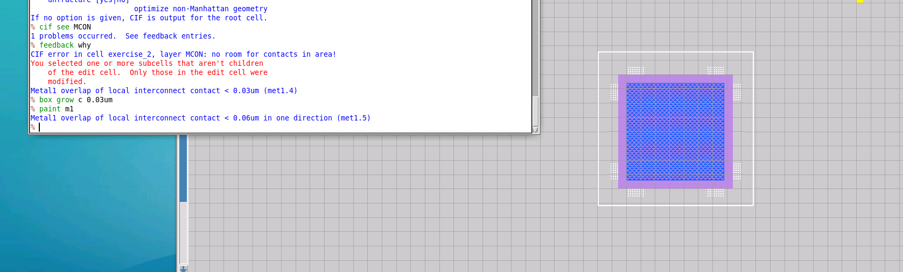

Because 0.03 µm had already been provided, I extended the selected Metal1 region by another 0.03 µm horizontally:

```text
box grow e 0.03um
box grow w 0.03um
```

and repainted Metal1.

This produced the required enclosure around the contact.

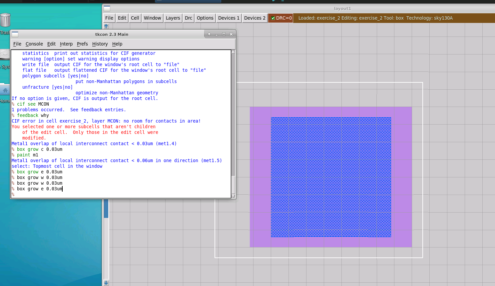

This exercise showed that via rules may contain both:

- minimum enclosure around all sides
- additional enclosure in one axis

---

## 9. Automatic Via Generation

Manually constructing every enclosure and contact region would be inefficient during routing.

Magic provides automatic via generation through its wiring tool.

Exercise 2d was used to investigate this feature.

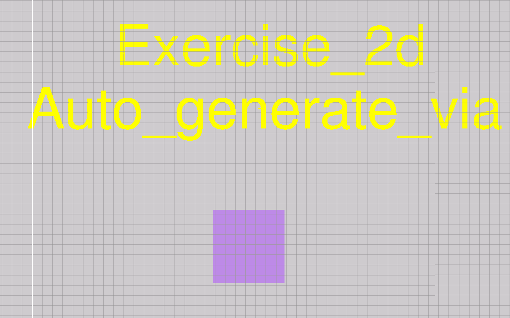

Pressing:

```text
Space
```

switches Magic into the wiring tool.

After selecting a metal layer, a normal left-click continues routing on that layer.

Holding **Shift** while making the routing transition allows Magic to generate the required via/contact and move to the next routing layer.

This allows routing through the stack approximately as:

```text
Local Interconnect
        ↓
      MCON
        ↓
      Metal1
        ↓
      VIA1
        ↓
      Metal2
        ↓
      VIA2
        ↓
      Metal3
        ↓
      VIA3
        ↓
      Metal4
        ↓
      VIA4
        ↓
      Metal5
```

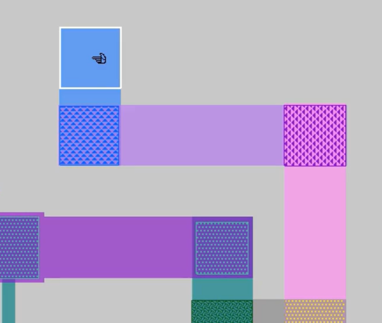

Magic automatically creates the contact and the necessary surrounding metal geometry during the layer transition.

---

## 10. Inspecting Vias Across the Metal Stack

The generated vias can be inspected individually using CIF.

I used:

```text
cif see MCON
cif see VIA1
cif see VIA2
cif see VIA3
cif see VIA4
```

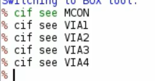

The generated contact cuts become visible for each transition in the routing stack.

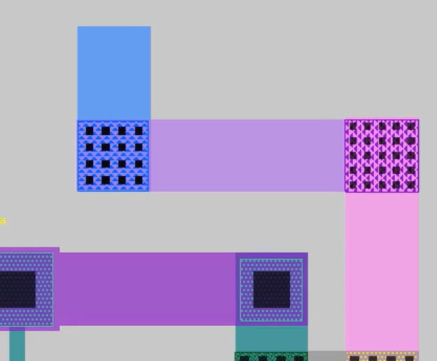

For the geometry used in this experiment, I observed different numbers of generated cuts depending on the via level and available metal area.

This demonstrates that Magic determines the legal via array based on the available geometry and the design rules for that layer transition.

---

## Commands Used

```text
load exercise_2

cif see xxx
cif see MCON

feedback why
feedback clear

box grow c 0.03um
paint m1

box grow e 0.03um
box grow w 0.03um
paint m1

cif see MCON
cif see VIA1
cif see VIA2
cif see VIA3
cif see VIA4
```

### Useful Interactive Controls

```text
A           Area selection
S           Select geometry
Space       Enter/cycle wiring tool
Shift       Used during wiring for layer transition/via generation
```

---

## Key Observations

### Via area is not necessarily one large via

A large painted contact region can be converted by Magic into an array of legal contact cuts.

### CIF helps inspect generated geometry

Commands such as:

```text
cif see MCON
```

allow the contact cuts generated from the layout to be inspected.

### Feedback is different from painted geometry

The output of `cif see` is feedback used to visualize generated CIF geometry. It can be inspected and cleared using:

```text
feedback why
feedback clear
```

### Contacts require proper enclosure

A contact is not valid simply because the contact cut exists. The surrounding conductive layers must also satisfy their overlap/enclosure rules.

### Via generation can be automated

Magic's wiring tool can automatically generate the appropriate transition geometry when moving between routing layers, avoiding the need to manually construct every via enclosure.

---

## Problems Encountered and Resolution

### 1. Invalid CIF Layer Name

While investigating generated contact cuts, I intentionally entered:

```text
cif see xxx
```

Magic reported that the layer did not exist and displayed the available CIF layer names.

**Resolution:** I identified `MCON` as the correct layer for the local-interconnect-to-Metal1 contact and used:

```text
cif see MCON
```

---

### 2. No Room for Contact Cuts

After reducing the contact area, CIF generation reported:

```text
no room for contacts in area!
```

**Cause:** The available geometry was too small for Magic to place a legal contact cut.

**Resolution:** I increased the contact region until a legal MCON cut could be generated.

---

### 3. Metal1 Enclosure Violation

The contact initially violated:

```text
Metal1 overlap of local interconnect contact < 0.03um
```

**Resolution:** I expanded the Metal1 region around the contact using:

```text
box grow c 0.03um
```

and painted Metal1.

---

### 4. Additional Directional Overlap Requirement

After fixing the basic overlap, an additional directional enclosure requirement remained.

**Resolution:** I extended the Metal1 region horizontally using:

```text
box grow e 0.03um
box grow w 0.03um
```

and repainted the region.

---

## What I Learned

From this lab, I learned how via/contact geometry is represented and checked in Magic. In particular, I learned that the painted contact region and the actual generated contact cuts are related but not identical.

I also learned how to:

- identify and correct via-size violations
- inspect generated contact cuts using CIF
- interpret CIF feedback
- understand multiple-contact generation inside a larger via region
- debug insufficient contact area
- satisfy metal overlap/enclosure rules
- distinguish general enclosure from directional enclosure
- use Magic's wiring tool for automatic via generation
- inspect `MCON`, `VIA1`, `VIA2`, `VIA3`, and `VIA4`
- understand how routing-layer transitions are constructed through the metal stack

The main takeaway is that a via connection is not simply a hole between two metal layers. It is a rule-driven structure consisting of contact cuts and the required surrounding conductive layers, and Magic can automatically generate much of this geometry during routing.
