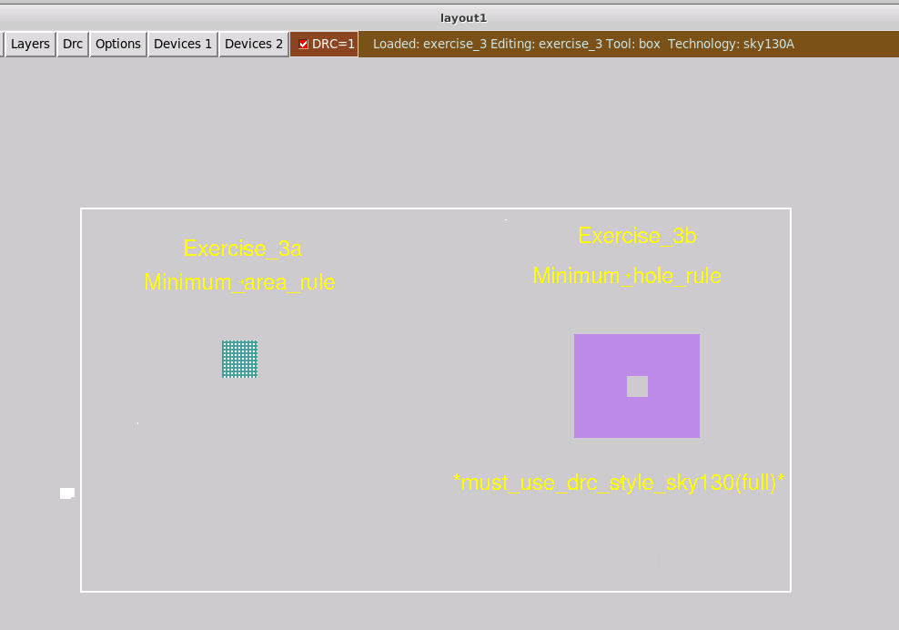
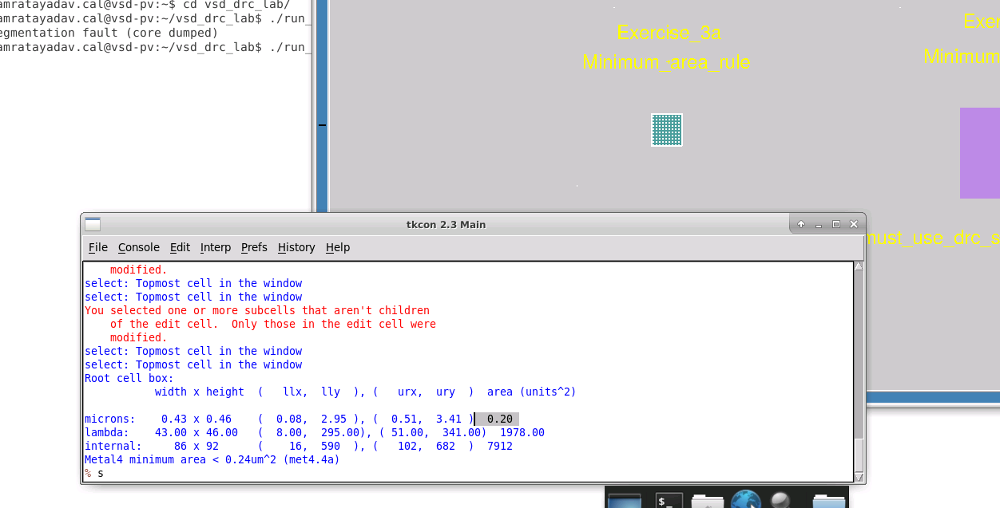
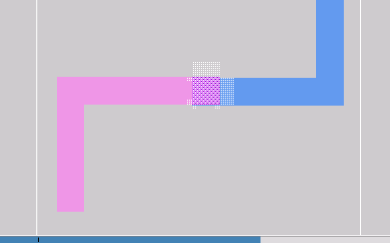
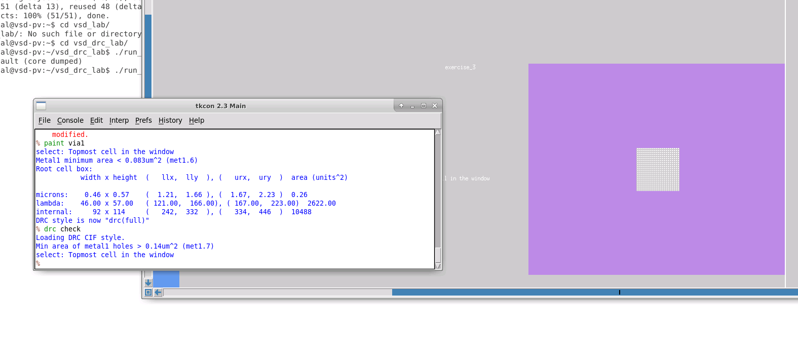
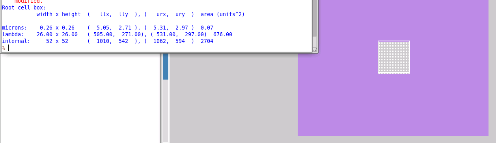
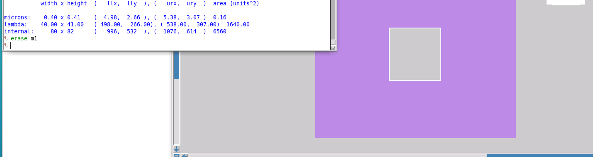

# L4 — Minimum Area Rule and Minimum Hole Rule

## Overview

In this lab, I worked with two additional SKY130 physical design rules in Magic:

- **Minimum Area Rule**
- **Minimum Hole Rule**

The minimum-area rule ensures that a polygon on a particular layer contains enough total material to satisfy the fabrication requirement.

The minimum-hole rule checks whether an opening completely surrounded by a layer has sufficient area.

An important observation from this exercise was that not every DRC rule is enabled during Magic's default interactive DRC. Computationally expensive checks, such as minimum-hole rules, may require switching to the **full DRC rule set**.

The overall flow was:

```text
Load Exercise 3
      ↓
Investigate Minimum Area Violation
      ↓
Measure Existing Geometry
      ↓
Increase Metal Area
      ↓
Create Multilayer Contact Example
      ↓
Observe Area Violation on Intermediate Metal
      ↓
Switch to Full DRC
      ↓
Detect Minimum Hole Violation
      ↓
Measure Hole Area
      ↓
Increase Hole Area
      ↓
Verify DRC
```

---

## 1. Exercise 3 Overview

I loaded Exercise 3 in Magic.

The layout contains two main exercises:

- **Exercise 3a — Minimum Area Rule**
- **Exercise 3b — Minimum Hole Rule**



The DRC indicator initially showed an error associated with the minimum-area example.

---

# Part 1 — Minimum Area Rule

## 2. Investigating the Minimum Area Violation

I first examined **Exercise 3a**.

After selecting the Metal4 geometry and querying the DRC violation, Magic reported:

```text
Metal4 minimum area < 0.24um^2 (met4.4a)
```



The SKY130 rule therefore requires:

```text
Metal4 area >= 0.24 um^2
```

I used the box information to inspect the dimensions and area of the existing shape.

The measured area was approximately:

```text
0.20 um^2
```

which is below the required:

```text
0.24 um^2
```

This explained the DRC violation.

### Resolution

Since this is an **area rule**, I did not need to completely redesign the geometry.

I only needed to add enough Metal4 to increase the total area beyond the minimum requirement.

After extending the metal geometry, the minimum-area violation disappeared.

---

## 3. Why Minimum Area Errors Commonly Appear Around Vias

A useful observation from this exercise was that minimum-area violations can occur when routing vertically through several metal layers.

For example:

```text
Local Interconnect
       ↓
     MCON
       ↓
    Metal1
       ↓
     VIA1
       ↓
    Metal2
```

If Metal1 exists only as the small enclosure required around the via, the total Metal1 area may still be too small to satisfy its minimum-area rule.

To investigate this, I created a small local-interconnect route and transitioned upward through the metal stack.



The resulting geometry demonstrates why simply satisfying via enclosure rules does not necessarily guarantee that the intermediate metal satisfies its minimum-area requirement.

The solution is to extend the affected metal layer until its total area satisfies the corresponding rule.

### What I learned

A via may be geometrically valid while the surrounding metal still violates a minimum-area rule.

Therefore:

```text
Valid via enclosure
        ≠
Guaranteed valid metal area
```

Both requirements must be checked independently.

---

# Part 2 — Minimum Hole Rule

## 4. Why the Hole Error Was Initially Missing

Exercise 3b contains a hole inside a larger Metal1 region.

Initially, the layout did not show the expected minimum-hole violation.

The reason is that Magic's normal interactive DRC does not necessarily run every available rule.

Minimum-hole calculations can be more computationally expensive, so they may not be included in the default fast interactive rule set.

I switched Magic to the complete DRC rules.

This can be done through:

```text
DRC → DRC Complete
```

or by setting the full DRC style.

Then I forced Magic to recheck the layout:

```text
drc check
```

After running the full check, Magic reported:

```text
Min area of metal1 holes > 0.14um^2 (met1.7)
```



This means that a hole completely enclosed by Metal1 must have an area greater than:

```text
0.14 um^2
```

---

## 5. Measuring the Hole

Unlike an ordinary metal polygon, the empty hole itself cannot simply be selected as a piece of painted geometry.

Therefore, I manually placed the Magic box around the opening and used the box dimensions to determine its size.



The measured hole was approximately:

```text
0.26 um × 0.26 um
```

giving an area of approximately:

```text
0.07 um^2
```

The required minimum was:

```text
> 0.14 um^2
```

so the opening was too small.

---

## 6. Correcting the Minimum Hole Violation

To correct the violation, I enlarged the opening by removing additional Metal1 around the hole.

I continued increasing the hole until its area exceeded the minimum requirement.



After increasing the opening sufficiently and allowing DRC to update, the minimum-hole violation disappeared.

The important difference is:

```text
Minimum Area Violation
→ Add more material

Minimum Hole Violation
→ Remove material to make the opening larger
```

---

# Commands / Controls Used

Some of the important commands and controls used during this exercise were:

```text
load exercise_3
```

Inspect the selected geometry:

```text
box
```

or:

```text
B
```

Force a complete DRC recheck:

```text
drc check
```

Select geometry:

```text
S
```

Area selection:

```text
A
```

The DRC style was also changed to the complete/full rule set before checking the minimum-hole rule.

---

# Problems Encountered and Resolution

## 1. Metal4 Minimum Area Violation

### Problem

Magic reported:

```text
Metal4 minimum area < 0.24um^2
```

The measured Metal4 area was approximately:

```text
0.20 um^2
```

which was below the required minimum.

### Resolution

I extended the Metal4 geometry until its total area exceeded the minimum-area requirement.

---

## 2. Minimum Area During Vertical Routing

### Problem

While creating a connection through multiple routing layers, the intermediate metal around the contact could satisfy the via enclosure but still have insufficient total metal area.

### Resolution

I added additional metal to the affected intermediate layer rather than changing the via itself.

This showed that **via enclosure and minimum metal area are separate DRC requirements**.

---

## 3. Minimum Hole Violation Was Not Initially Visible

### Problem

The hole shown in Exercise 3b initially did not generate the expected DRC error.

### Cause

Magic was using its normal interactive DRC rules rather than the complete DRC rule set.

### Resolution

I switched to the full DRC style and forced a complete recheck:

```text
drc check
```

The minimum-hole violation then appeared.

---

## 4. Hole Could Not Be Selected Directly

### Problem

The hole is empty space rather than painted geometry, so I could not select it like a normal Metal1 rectangle.

### Resolution

I manually positioned the Magic box around the hole and used the box dimensions to determine its area.

I then enlarged the hole by erasing additional Metal1 until the rule was satisfied.

---

# Key Observations

### Minimum area is based on total polygon area

A shape can satisfy its width requirement but still fail its minimum-area requirement.

For example:

```text
Correct width
     +
Insufficient length
     ↓
Insufficient total area
     ↓
Minimum-area DRC violation
```

---

### Via enclosure does not guarantee minimum area

A metal layer surrounding a via may satisfy the via-overlap rule while still containing insufficient total metal area.

Therefore both must be verified.

---

### Minimum-hole rules behave differently

For a normal minimum-area violation:

```text
Add material
```

For a minimum-hole violation:

```text
Remove surrounding material
```

because the opening itself needs to become larger.

---

### Fast DRC is not the complete rule set

Magic's default interactive DRC prioritizes rules that are useful during normal layout editing.

Some computationally expensive rules may require:

```text
Full DRC
+
drc check
```

This is important before considering a layout fully DRC-clean.

---

# What I Learned

From this lab, I learned how **minimum-area and minimum-hole rules** are checked and corrected in Magic.

I learned how to:

- identify a minimum-area DRC violation
- measure layout geometry using the Magic box
- calculate whether an existing metal shape satisfies its required area
- correct minimum-area errors by extending metal
- understand why via stacks can create minimum-area violations
- distinguish via-enclosure rules from metal-area rules
- switch from interactive DRC to the full DRC rule set
- force a complete layout recheck using `drc check`
- measure an empty hole using the Magic box
- correct minimum-hole violations by increasing the opening

The main takeaway from this exercise was that **DRC is not limited to width and spacing**. The foundry also controls the total area of fabricated shapes and enclosed openings, and some of these rules may only become visible when the complete DRC rule set is enabled.
