# L5 — Wells and Deep N-Well Rules

## Overview

In this lab, I explored the SKY130 design rules associated with wells, substrate/well taps, and Deep N-well structures using Magic.

The exercise was divided into three main sections:

- **Exercise 4a — Well and N-well tap rules**
- **Exercise 4b — Well/substrate contact rules**
- **Exercise 4c — Deep N-well rules**

Because many well-related checks are computationally expensive, this exercise was performed using the **full DRC rule set** rather than only the default fast interactive rules.

The overall flow was:

```text
Load Exercise 4
      ↓
Investigate N-well Tap Error
      ↓
Add N-type Tap
      ↓
Add Contact + Local Interconnect
      ↓
Resolve Enclosure Rules
      ↓
Investigate Substrate Tap
      ↓
Add P-type Contact
      ↓
Investigate Deep N-well
      ↓
Fix Deep N-well Size
      ↓
Fix Deep N-well Spacing
      ↓
Create N-well Isolation Ring
      ↓
Add Well Tap / Guard Ring
      ↓
Verify DRC
```

---

# 1. Exercise 4 Overview

I loaded Exercise 4 in Magic.

The layout contains three main exercises:

```text
Exercise 4a → Wells
Exercise 4b → Wells / substrate taps
Exercise 4c → Deep N-well
```

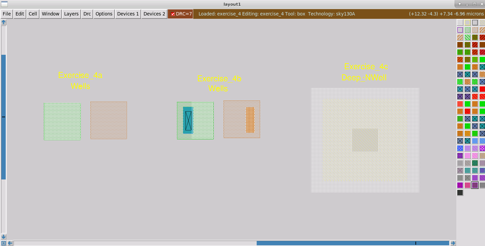

For these exercises, it is important to use the **full DRC rules**, because several well-related checks are not part of the faster interactive DRC set.

---

# Part 1 — N-Well Tap Rules

## 2. N-Well Must Contain a Connected Tap

In Exercise 4a, Magic reported:

```text
All nwells must contain metal-connected N+ taps (nwell.4)
```

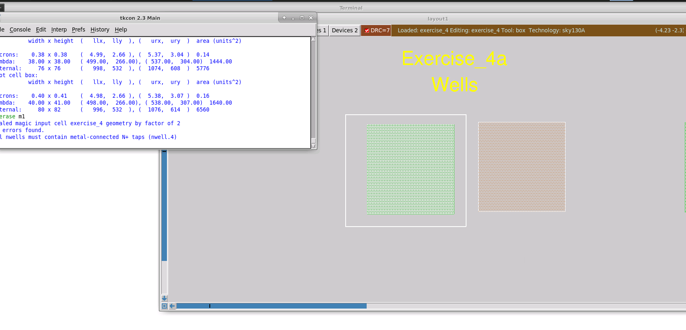

An N-well is an electrically isolated region and therefore cannot simply be left floating.

It needs a well tap that allows the well to be connected to a defined electrical potential.

Conceptually:

```text
N-well
   ↓
N+ well tap
   ↓
Contact
   ↓
Local Interconnect
   ↓
Electrical connection
```

The neighboring P-type region does not produce the same initial error because, in this context, it represents the P-type substrate rather than an isolated P-well.

---

## 3. Adding the N-Well Tap

I first added the N-type tap material inside the N-well.

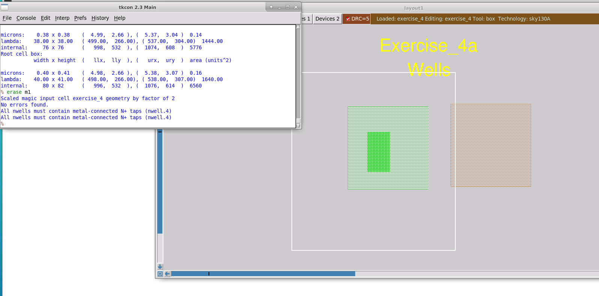

Adding only the tap material is not sufficient.

The DRC rule requires the tap to be **metal-connected**, so the tap also needs a contact and routing material.

This is an important distinction:

```text
N+ tap only
     ↓
Still electrically unconnected

N+ tap + contact + interconnect
     ↓
Connected well tap
```

---

## 4. Creating the Well Contact

I then added the corresponding N-type substrate/well contact.

The contact structure introduces several enclosure and overlap requirements.

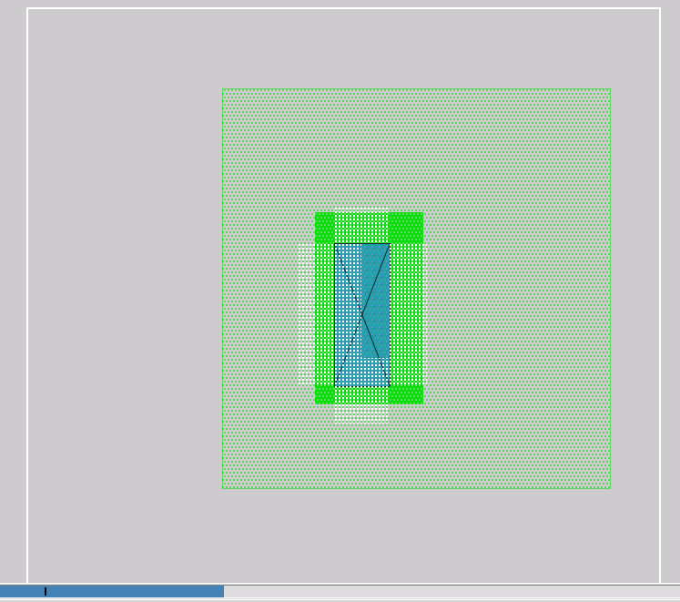

These rules ensure that the contact is properly surrounded by the required semiconductor and interconnect layers.

After adding the contact, I corrected the surrounding geometry by extending the necessary layers.

For example, the tap region can be expanded using a command such as:

```text
box grow c 0.12um
```

and then the appropriate tap material can be painted.

The local interconnect also needs sufficient overlap beyond the contact.

---

## 5. Completed N-Well Tap

After satisfying the tap, contact, N-well enclosure, and local-interconnect overlap requirements, the N-well becomes properly contacted.

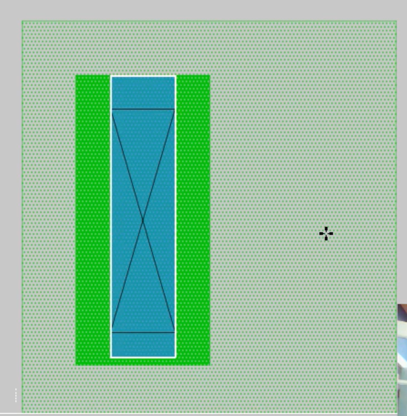

The important concept is that DRC does not determine whether the tap is ultimately connected to the correct supply voltage.

Instead, the geometrical rule verifies that a valid metal-connected tap exists.

Determining whether that connection goes to the intended potential is an electrical/connectivity problem rather than purely a geometrical DRC problem.

---

# Part 2 — Substrate Tap Rules

## 6. N-Well and Substrate Tap Examples

Exercise 4b demonstrates both an N-well tap and a substrate tap.

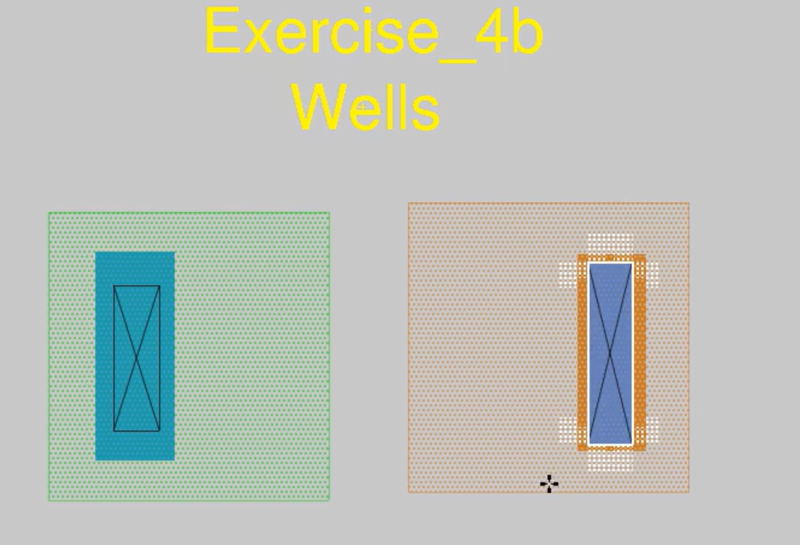

A complementary rule applies to substrate taps.

Once a substrate tap is created, it must also be properly contacted.

Magic reports an error if the tap material exists without the required electrical contact.

The conceptual structure is:

```text
P-type substrate
       ↓
P+ substrate tap
       ↓
Contact
       ↓
Local Interconnect
       ↓
Electrical connection
```

---

## 7. Completing the Substrate Tap

I added the P-type substrate contact and then corrected the surrounding enclosure errors.

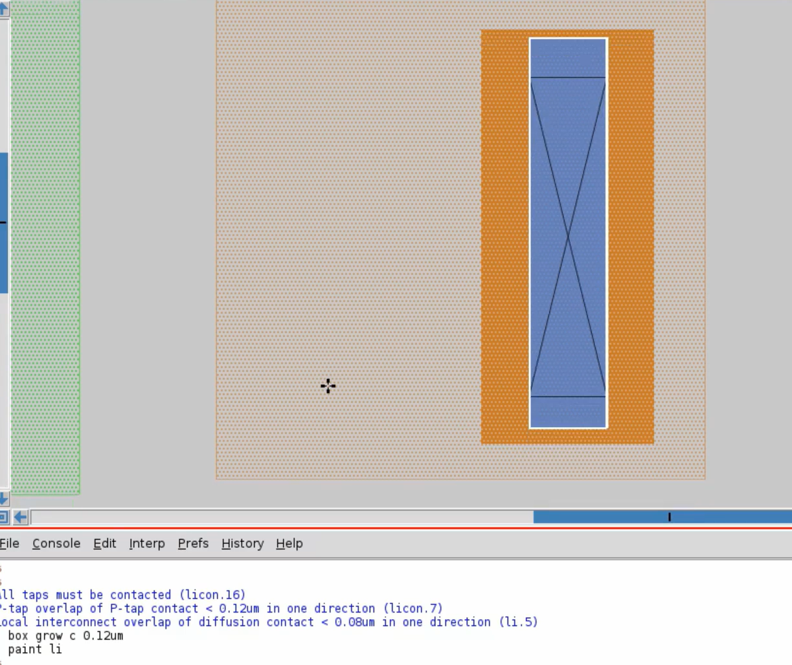

The tap material was extended around the contact, and local interconnect was extended sufficiently beyond it.

One useful observation is that the P-type region here is effectively representing the substrate, so its behavior is different from an isolated N-well.

After satisfying the contact and enclosure requirements, the substrate tap structure became DRC compliant.

---

# Part 3 — Deep N-Well

## 8. Initial Deep N-Well Errors

Exercise 4c introduces the **Deep N-well** structure.

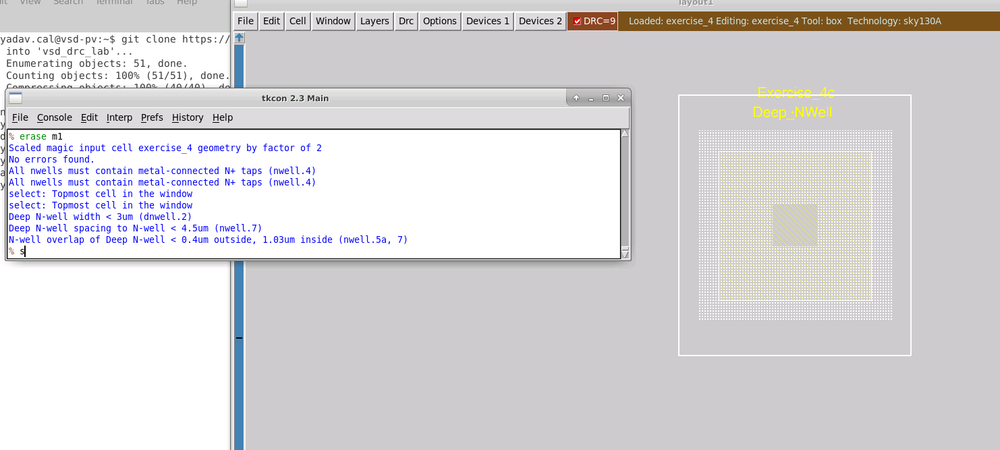

The initial structure produced multiple violations, including rules associated with:

```text
Deep N-well width
Deep N-well spacing to N-well
N-well overlap/enclosure around Deep N-well
```

The console showed rules such as:

```text
Deep N-well width < 3um (dnwell.2)

Deep N-well spacing to N-well < 4.5um (nwell.7)

N-well overlap of Deep N-well < 0.4um outside,
1.03um inside
```

These rules show that Deep N-well structures require significantly more area and isolation than ordinary well structures.

---

## 9. Correcting Deep N-Well Size and Spacing

I first increased the size of the Deep N-well.

The geometry was extended until the width requirement was satisfied.

I also investigated the large spacing requirement between the Deep N-well and unrelated N-well regions.


One important rule observed in this exercise was:

```text
Deep N-well spacing to N-well < 4.5um
```

Therefore, unrelated N-well structures need significant separation from a Deep N-well.

I moved the Deep N-well exercise farther away from nearby N-well structures to resolve this violation.

---

# 10. Creating the N-Well Ring

After resolving the size and spacing problems, the remaining rule required an N-well region around the Deep N-well.

I created an N-well ring around the Deep N-well.

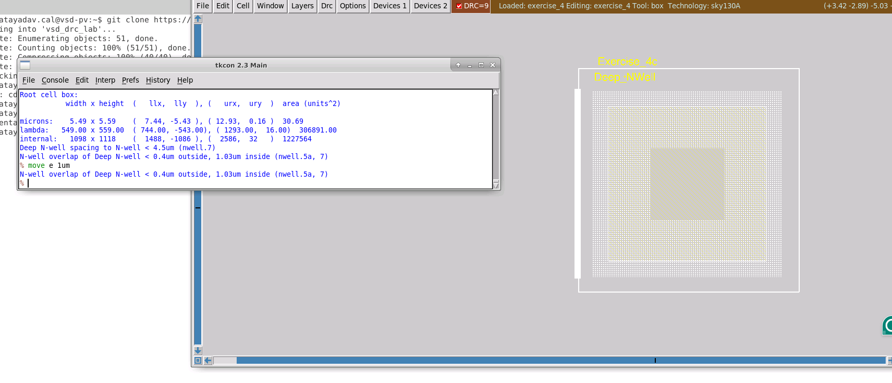

The structure can be understood approximately as:

```text
          N-well ring
     ┌─────────────────┐
     │                 │
     │   Deep N-well   │
     │                 │
     └─────────────────┘
```

The N-well surrounding the Deep N-well helps form the isolation structure around the internal P-type region.

After creating the N-well ring, the original Deep N-well enclosure error was replaced by another familiar rule:

```text
All nwells must contain metal-connected N+ taps
```

So the surrounding N-well also needs to be properly contacted.

---

# 11. Adding the Well Tap / Guard Ring

A well tap can be placed in the surrounding N-well to satisfy the well-contact requirement.

For better isolation, however, a complete guard ring can be created around the structure.

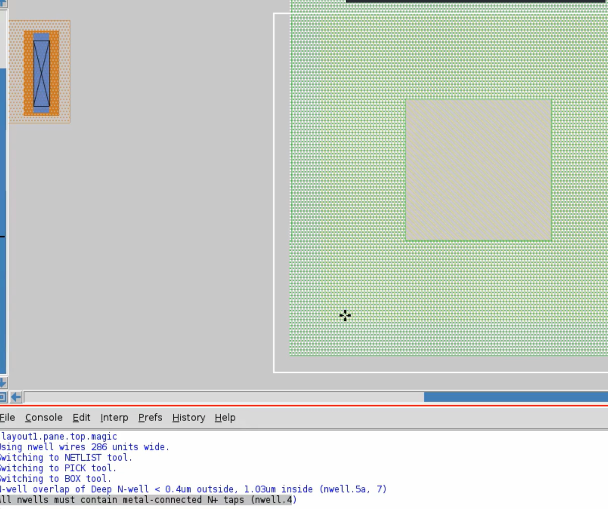

Magic provides a convenient device-generation option for this.

Using the menu:

```text
Devices 1 → Deep N-well Region
```

Magic can automatically generate the main components of the Deep N-well structure.

This includes:

```text
Deep N-well
     +
N-well isolation region
     +
Well contact / guard-ring structure
```

This is much more convenient than manually constructing every layer and enclosure.

---

# 12. Complete Deep N-Well Structure

The resulting structure contains the Deep N-well together with the surrounding isolation and tap structures.

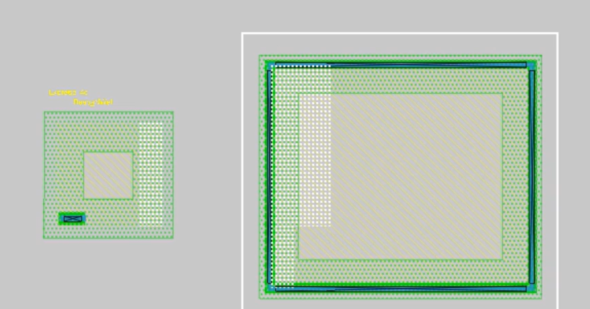

A simplified cross-sectional concept is:

```text
             Guard Ring / N+ Tap
        ┌─────────────────────────┐
        │        N-Well           │
        │   ┌─────────────────┐   │
        │   │   P-type region │   │
        │   │                 │   │
        │   └─────────────────┘   │
        │      Deep N-Well        │
        └─────────────────────────┘
               P-Substrate
```

The Deep N-well provides additional isolation between circuitry inside the structure and the surrounding substrate.

However, this comes at the cost of substantial layout area because of the large width, enclosure, and spacing requirements.

---

# Important DRC Rules Observed

| Rule | Meaning |
|---|---|
| `All nwells must contain metal-connected N+ taps` | N-well must have an electrically accessible well tap |
| `All taps must be contacted` | Existing substrate/well taps require a contact |
| Deep N-well width rule | Deep N-well must meet minimum width |
| Deep N-well to N-well spacing | Unrelated N-wells must remain sufficiently far away |
| N-well overlap of Deep N-well | N-well must provide the required enclosure around the Deep N-well |
| Tap/contact overlap rules | Tap material and interconnect must properly surround contacts |

---

# Commands / Controls Used

Some of the important Magic operations used in this lab were:

```text
load exercise_4
```

Inspect a DRC error:

```text
?
```

Measure geometry:

```text
B
```

Grow the selected box equally in all directions:

```text
box grow c 0.12um
```

Paint the selected layer:

```text
paint <layer>
```

Stretch or move geometry as required to satisfy well enclosure and spacing rules.

For the Deep N-well structure, Magic's device-generation menu was also used:

```text
Devices 1 → Deep N-well Region
```

---

# Key Observations

### 1. An N-well cannot be left floating

An N-well needs a properly contacted N-type tap.

```text
N-well
  ↓
N+ tap
  ↓
Contact
  ↓
Interconnect
```

---

### 2. A tap alone is not enough

Simply drawing N+ or P+ tap material does not satisfy the complete rule.

The tap must be contacted to routing material.

---

### 3. DRC verifies geometry, not the final electrical intent

The geometrical DRC can check that a contact exists, but it does not by itself prove that the well is connected to the intended supply.

For example:

```text
N-well → normally tied to a defined high potential
P-substrate → normally tied to a defined low potential
```

The electrical connectivity must ultimately be verified through the circuit/netlist flow.

---

### 4. Deep N-well requires significant layout area

Deep N-well structures have large:

```text
Width requirements
+
Spacing requirements
+
N-well enclosure requirements
+
Tap / guard-ring requirements
```

Therefore they consume considerably more area than ordinary well structures.

---

### 5. Deep N-well is useful for isolation

The additional well structure allows circuitry to be more strongly isolated from substrate interaction and noise.

The tradeoff is:

```text
Better isolation
      ↕
Larger layout area
```

---

# What I Learned

From this lab, I learned how well structures are handled in the SKY130 process and how Magic checks their physical-design requirements.

I learned how to:

- identify floating N-well violations
- create N-type well taps
- add well contacts and local interconnect
- correct tap and contact enclosure violations
- create and connect substrate taps
- distinguish substrate regions from isolated N-wells
- work with Deep N-well structures
- correct Deep N-well width violations
- correct Deep N-well spacing violations
- create the required surrounding N-well
- understand the role of a well guard ring
- use Magic's Deep N-well Region generator
- understand the area-versus-isolation tradeoff of Deep N-well structures

The main takeaway from this exercise is that **well structures are not just geometric regions**. They must be properly biased through taps and contacts, while Deep N-well structures require additional isolation geometry and substantially larger spacing to provide the intended substrate isolation.
