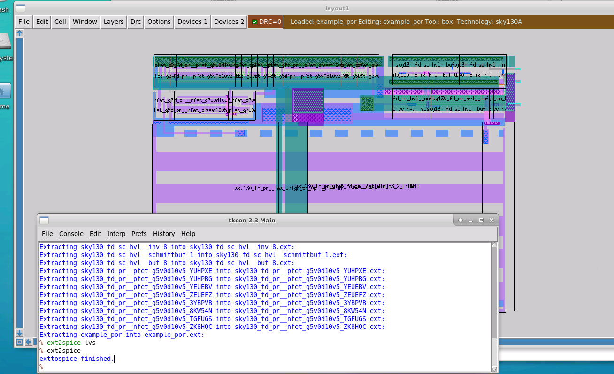
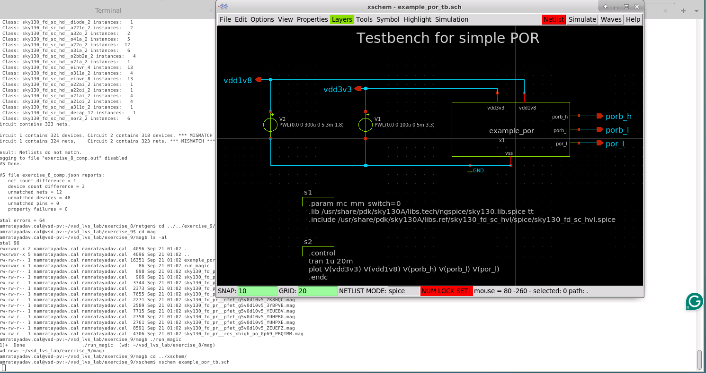
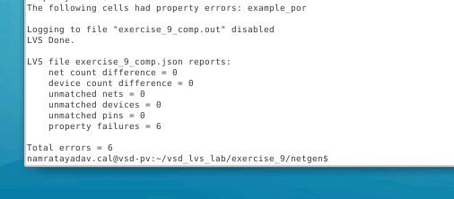
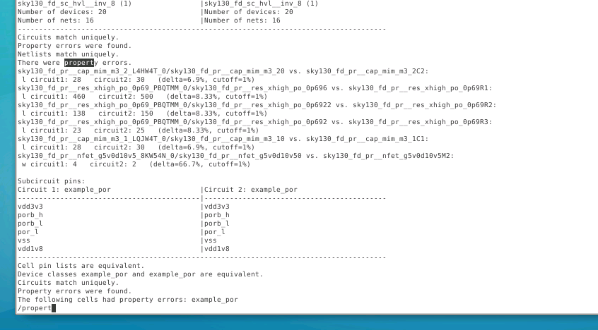
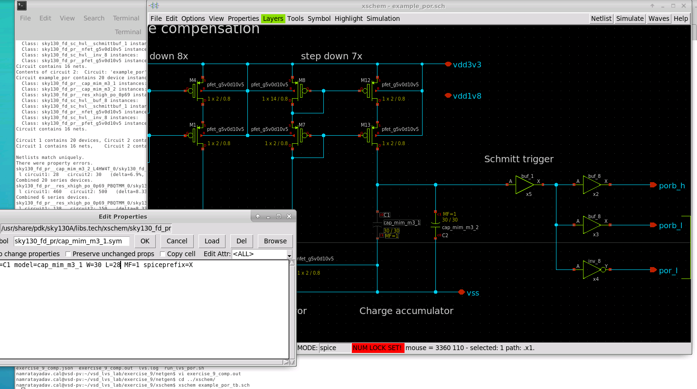
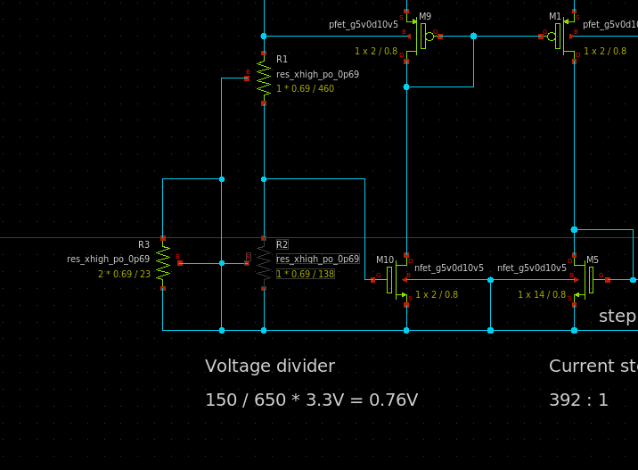
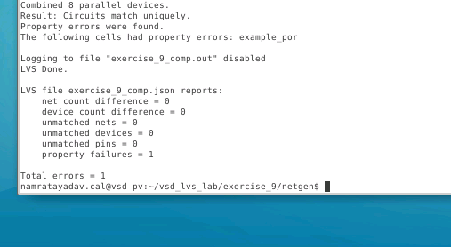
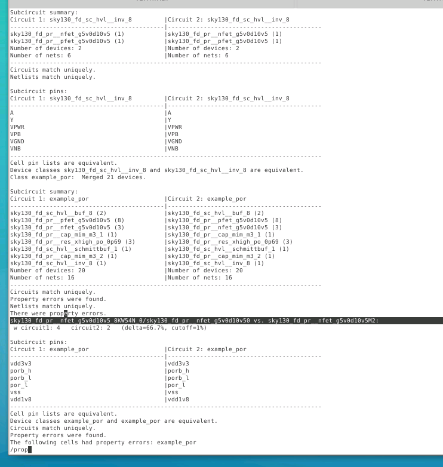
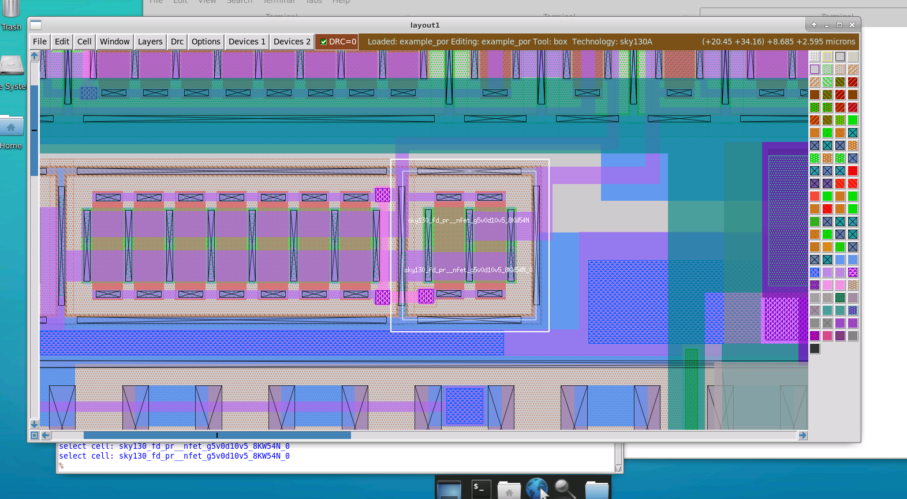
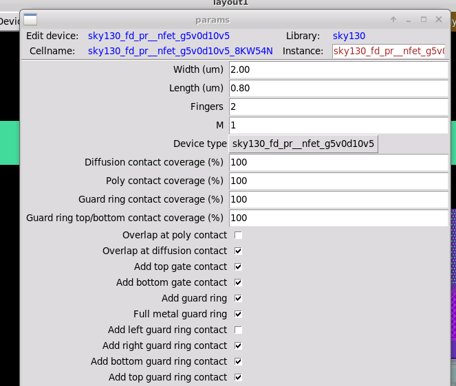

# L11 — LVS With Property Checking

## Objective

The objective of this lab is to understand how to identify and debug **property mismatches during LVS (Layout Versus Schematic)** using **Magic, Xschem, and Netgen**.

In the previous LVS exercises, most errors involved:

- Net mismatches
- Device mismatches
- Pin mismatches
- Connectivity/topology problems

In this exercise, the layout and schematic are **topologically correct**, but LVS still fails because some device properties are different between the two netlists.

Examples of device properties include:

- MOSFET width (`W`)
- MOSFET length (`L`)
- Number of fingers
- Resistor dimensions
- Capacitor dimensions

This lab uses the `example_por` circuit that was used in an earlier exercise.

---

# 1. Lab Flow

The overall flow followed in this exercise is:

```text
Magic Layout
     │
     ▼
Extract Layout SPICE Netlist
     │
     │
     ├──────────────┐
     │              │
     ▼              ▼
Layout Netlist    Xschem Schematic
                    │
                    ▼
              Generate SPICE Netlist
                    │
                    ▼
            Run Netgen LVS
                    │
                    ▼
          Topology Matches
                    │
                    ▼
         Property Errors Found
                    │
                    ▼
            Inspect comp.out
                    │
          ┌─────────┴─────────┐
          ▼                   ▼
 Correct Schematic       Correct Layout
 Properties              Device/PCell
          │                   │
          └─────────┬─────────┘
                    ▼
          Regenerate Netlists
                    │
                    ▼
              Run LVS Again
                    │
                    ▼
            Property Errors = 0
```

---

# 2. Extract the Layout Netlist Using Magic

The first step is to generate a SPICE netlist from the physical layout.

Open the `example_por` layout in Magic.

```tcl
load example_por
```

Select the top-level cell and perform extraction.

```tcl
extract do local
extract all
ext2spice lvs
ext2spice
```

The important point is that:

```tcl
ext2spice lvs
```

configures the SPICE extraction for LVS, and:

```tcl
ext2spice
```

writes the extracted SPICE netlist.

### Layout Extraction



The resulting extracted netlist represents the devices and connectivity Magic identified from the physical geometry.

---

# 3. Generate the Schematic Netlist Using Xschem

Next, the schematic-side netlist must be generated.

For this exercise, Xschem should be opened using the **testbench schematic**:

```bash
xschem example_por_tb.sch
```

Using the testbench is important because it allows Xschem to pick up the required SPICE library locations.

### Example POR Testbench



From Xschem, generate the SPICE netlist using:

```text
Netlist
```

After the schematic netlist has been generated, LVS can be run.

---

# 4. Run LVS

Run the provided LVS script from the Netgen directory.

For this exercise, the LVS comparison reports that the circuits are topologically equivalent, but there are property errors.

The summary shows:

```text
net count difference = 0
device count difference = 0
unmatched nets = 0
unmatched devices = 0
unmatched pins = 0
property failures = 6
```

### Initial LVS Result



This is an important LVS result.

The layout and schematic have:

- The same devices
- The same nets
- The same connectivity
- Matching pins

However:

```text
property failures = 6
```

Therefore, this is **not a topology problem**.

It is a **device-property problem**.

---

# 5. Understanding Property Errors

To understand the mismatches in detail, open the Netgen comparison report.

```bash
vi exercise_9_comp.out
```

The report shows:

```text
Circuits match uniquely.
Property errors were found.
Netlists match uniquely.
There were property errors.
```

This means Netgen successfully matched the devices between the two circuits but discovered that some properties of those corresponding devices differ.

### Property Error Report



The reported mismatches include:

- MIM capacitor dimensions
- Resistor dimensions
- NFET width

---

# 6. MIM Capacitor Property Mismatch

One of the first mismatches is a MIM capacitor.

Netgen reports approximately:

```text
Circuit 1: L = 28
Circuit 2: L = 30
```

The layout therefore contains a capacitor with:

```text
L = 28
```

while the schematic contains:

```text
L = 30
```

The device exists on both sides and its connectivity matches.

Only its physical property is different.

---

# 7. Decide Which Side Should Be Corrected

An important point in property-error debugging is that LVS does not automatically tell us which side is "correct."

There are two possibilities:

```text
Schematic represents intended design
            ↓
       Fix layout
```

or:

```text
Layout change was intentional
            ↓
      Fix schematic
```

In this exercise, the assumption is that approximately **2 µm was intentionally removed from the physical layout** to make the circuit fit into the available space.

Therefore, the physical capacitor and resistor dimensions in the layout are treated as intentional.

The schematic must be modified to match the implemented layout.

Afterward, the modified circuit would need to be checked through simulation to make sure it still satisfies the required specification.

---

# 8. Correct the MIM Capacitors in Xschem

Open the `example_por` schematic through the testbench and descend into the `example_por` block.

Locate the affected MIM capacitors.

Select a capacitor and press:

```text
Q
```

to open its properties.

The original capacitor has:

```text
L = 30
```

Change it to:

```text
L = 28
```

### Editing MIM Capacitor Properties



Perform the same correction for the other affected MIM capacitor.

So:

```text
Before:

L = 30

After:

L = 28
```

This makes the schematic capacitor geometry consistent with the extracted layout.

---

# 9. Correct the Resistor Properties

The LVS report also identifies resistor length mismatches.

The changes identified in the exercise are:

| Original Schematic Length | Layout Length |
|---:|---:|
| 25 | 23 |
| 150 | 138 |
| 500 | 460 |

Therefore, the corresponding resistor properties in Xschem are changed to:

```text
25  → 23
150 → 138
500 → 460
```

### Editing Resistor Properties



For example, one resistor property window shows:

```text
name=R3
L=23
model=res_xhigh_po_0p69
mult=2
```

The objective is to make the schematic resistor properties represent the physical resistor geometry extracted from the layout.

---

# 10. Regenerate the Schematic Netlist

After modifying the capacitors and resistors, return to the top-level schematic.

Save the changes.

Then regenerate the schematic netlist using:

```text
Netlist
```

The updated schematic SPICE netlist now contains the corrected resistor and capacitor dimensions.

---

# 11. Run LVS Again

Run LVS again after regenerating the schematic netlist.

The number of property errors now drops from:

```text
property failures = 6
```

to:

```text
property failures = 1
```

### One Property Error Remaining



This tells us that the resistor and capacitor corrections worked.

Only one device property mismatch remains.

---

# 12. Identify the Remaining NFET Property Error

Open the comparison report again.

```bash
vi exercise_9_comp.out
```

The remaining mismatch is an NFET.

Netgen reports:

```text
W circuit1: 4
W circuit2: 2
```

### Remaining NFET Width Mismatch



The important part is:

```text
Layout side    W = 4
Schematic side W = 2
```

Unlike the capacitor and resistor changes, this mismatch is treated as an error in the **layout**.

Therefore, the schematic is left unchanged and the corresponding layout device must be corrected.

---

# 13. Locate the NFET in Magic

The Netgen output contains a suffix that identifies the mismatched parameterized NFET.

The relevant suffix is:

```text
8KW54N
```

Return to Magic and locate the corresponding NFET PCell.

### NFET Located in Layout



The mismatched device can now be selected directly in the layout.

---

# 14. Inspect the NFET PCell Properties

Select the NFET PCell and open its device properties using:

```text
Ctrl + P
```

The parameter window shows:

```text
Width (um)  = 2.00
Length (um) = 0.80
Fingers     = 2
M           = 1
```

### NFET PCell Properties



At first glance, the width appears to be correct because:

```text
Width = 2 µm
```

However, the device has:

```text
Fingers = 2
```

Therefore, there are two 2 µm-wide NFET fingers.

The effective extracted width becomes:

```text
Wtotal = Wfinger × Number of Fingers
```

Therefore:

```text
Wtotal = 2 µm × 2
       = 4 µm
```

This explains exactly why Netgen reports:

```text
Layout    W = 4
Schematic W = 2
```

---

# 15. Correct the NFET Layout

The intended device should have a total width of:

```text
W = 2 µm
```

Therefore, the number of fingers must be changed from:

```text
Fingers = 2
```

to:

```text
Fingers = 1
```

The corrected PCell should therefore correspond to:

```text
Width   = 2.00 µm
Length  = 0.80 µm
Fingers = 1
M       = 1
```

The effective width then becomes:

```text
Wtotal = 2 µm × 1
       = 2 µm
```

which matches the schematic.

### Layout Device to Be Corrected


After modifying the PCell, any DRC errors caused by the geometry change must also be cleaned up.

---

# 16. Re-extract the Modified Layout

Because the physical layout has changed, the old extracted SPICE file is no longer valid.

The layout must be extracted again.

Run:

```tcl
extract do local
extract all
ext2spice lvs
ext2spice
```

This produces a new extracted layout netlist containing the corrected NFET.

---

# 17. Run Final LVS

Run the LVS comparison one final time.

The target result is:

```text
net count difference = 0
device count difference = 0
unmatched nets = 0
unmatched devices = 0
unmatched pins = 0
property failures = 0
```

At this point:

```text
Layout Topology   = Schematic Topology
Device Properties = Schematic Properties
Pins              = Matching
```

and the design is fully LVS clean.

---

# Property Error Debugging Strategy

A useful debugging procedure from this exercise is:

```text
Run LVS
   │
   ▼
Do net/device/pin counts match?
   │
   ├── NO ──► Debug topology/connectivity first
   │
   └── YES
        │
        ▼
Are property failures reported?
        │
        ├── NO ──► LVS clean
        │
        └── YES
             │
             ▼
        Open comp.out
             │
             ▼
       Identify Device
             │
             ▼
       Identify Property
        W / L / dimensions
             │
             ▼
 Decide which representation
      should be corrected
        │             │
        ▼             ▼
    Schematic       Layout
        │             │
        ▼             ▼
 Regenerate      Re-extract
   Netlist         Layout
        │             │
        └──────┬──────┘
               ▼
           Run LVS
```

---

# Important Commands Used

## Magic

Load the design:

```tcl
load example_por
```

Extract the layout:

```tcl
extract do local
extract all
```

Generate an LVS-oriented SPICE netlist:

```tcl
ext2spice lvs
ext2spice
```

---

## Xschem

Open the testbench:

```bash
xschem example_por_tb.sch
```

Open selected device properties:

```text
Q
```

Generate the schematic netlist:

```text
Netlist
```

---

## Netgen

Run the provided LVS script:

```bash
./run_lvs.sh
```

Inspect the detailed LVS report:

```bash
vi exercise_9_comp.out
```

---

# Understanding the LVS Result

The most important lesson from this exercise is:

> **A topological match does not necessarily mean that LVS has passed.**

For example:

```text
net count difference = 0
device count difference = 0
unmatched nets = 0
unmatched devices = 0
unmatched pins = 0
property failures = 6
```

means:

```text
Connectivity → Correct
Devices      → Correct
Pins         → Correct
Properties   → Incorrect
```

So the circuits can be structurally identical while their device implementations differ.

---

# Types of Property Errors Seen in This Lab

| Device | Property Problem | Correction |
|---|---|---|
| MIM capacitor | `L = 30` vs `L = 28` | Change schematic `L` to 28 |
| Resistor | `L = 25` vs `L = 23` | Change schematic to 23 |
| Resistor | `L = 150` vs `L = 138` | Change schematic to 138 |
| Resistor | `L = 500` vs `L = 460` | Change schematic to 460 |
| NFET | `W = 4` vs `W = 2` | Correct layout PCell fingers |

---

# Key Learning: Width and Fingers

One particularly useful lesson from this exercise is the relationship between device width and the number of fingers.

The NFET PCell initially contained:

```text
W  = 2 µm
NF = 2
```

Therefore:

```text
Effective extracted width
        =
Width per finger × Number of fingers

        =
2 µm × 2

        =
4 µm
```

But the schematic expected:

```text
W = 2 µm
```

Changing the layout to:

```text
W  = 2 µm
NF = 1
```

gives:

```text
Effective width = 2 µm
```

and resolves the property mismatch.

---

# Important Practical Lesson

Property mismatches require engineering judgment.

Consider:

```text
Layout        Schematic
L = 28   ≠    L = 30
```

LVS can identify the difference, but it cannot decide which value represents the intended design.

The designer must determine whether:

```text
Layout is wrong
      ↓
Modify Layout
```

or:

```text
Layout modification was intentional
      ↓
Modify Schematic
      ↓
Re-simulate the circuit
```

In this exercise, the resistor and capacitor layout changes were treated as intentional, so the schematic was updated.

The NFET width difference was treated as a layout mistake, so the layout PCell was corrected.

---

# Final Workflow

```text
                 ┌──────────────────────┐
                 │   Xschem Schematic   │
                 └──────────┬───────────┘
                            │
                            ▼
                    Schematic SPICE
                            │
                            │
                            ▼
┌────────────────┐      ┌───────────────┐
│  Magic Layout  │      │    Netgen     │
└───────┬────────┘      │      LVS      │
        │               └───────┬───────┘
        ▼                       │
 Layout Extraction              │
        │                       │
        ▼                       │
 Layout SPICE ──────────────────┘
                                │
                                ▼
                     Topology Comparison
                                │
                                ▼
                      Property Comparison
                                │
                     ┌──────────┴─────────┐
                     │                    │
                     ▼                    ▼
              Property Match       Property Mismatch
                                          │
                                          ▼
                                     comp.out
                                          │
                                          ▼
                               Identify W/L/Device
                                          │
                                          ▼
                              Fix Schematic/Layout
                                          │
                                          ▼
                                  Regenerate Netlist
                                          │
                                          ▼
                                      Run LVS
```

---

# Final Result

After correcting the resistor and capacitor dimensions in the schematic and correcting the NFET PCell in the layout, the goal is:

```text
Net mismatches      = 0
Device mismatches   = 0
Pin mismatches      = 0
Property failures   = 0
```

This represents a complete LVS match between the schematic and physical implementation.

---

# Conclusion

In this lab, I learned how to debug **device property mismatches during LVS** using Magic, Xschem, and Netgen.

The initial comparison showed that the layout and schematic were topologically equivalent, but Netgen reported multiple property failures. By examining `exercise_9_comp.out`, the mismatches were traced to MIM capacitor dimensions, resistor dimensions, and an NFET width.

The resistor and capacitor geometry changes were considered intentional layout modifications, so their schematic properties were updated accordingly. The remaining NFET mismatch was traced back to a parameterized layout device containing two fingers, producing an extracted width of `4 µm` instead of the schematic's `2 µm`.

The exercise demonstrates an important physical-verification concept:

> **LVS verification includes both circuit connectivity and device properties. A design can match topologically while still failing because the physical device dimensions do not match the schematic.**

The final debugging flow is therefore:

```text
Extract Layout
      ↓
Generate Schematic Netlist
      ↓
Run LVS
      ↓
Check Topology
      ↓
Check Properties
      ↓
Inspect comp.out
      ↓
Correct Schematic or Layout
      ↓
Regenerate / Re-extract
      ↓
Run LVS Again
      ↓
LVS Clean
```
