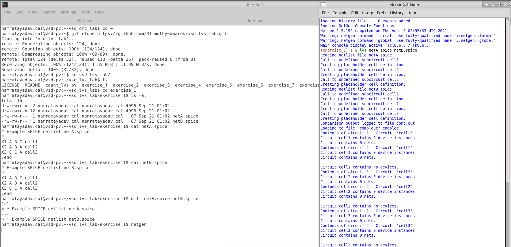
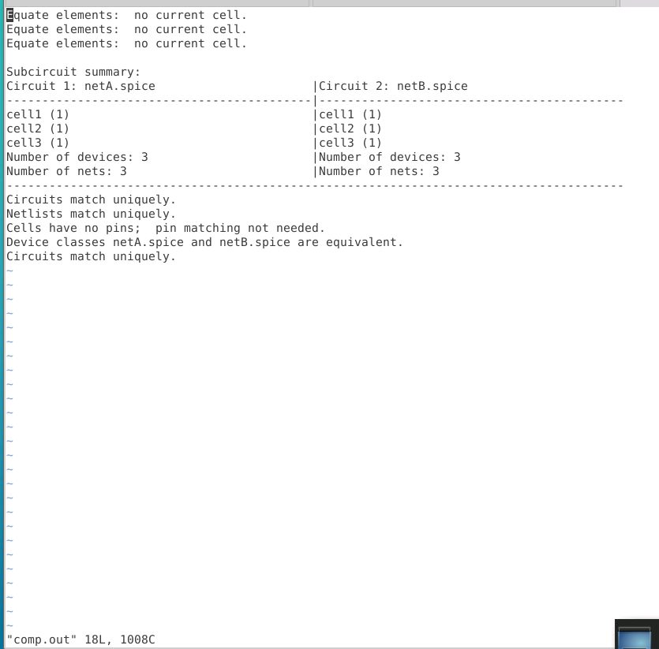
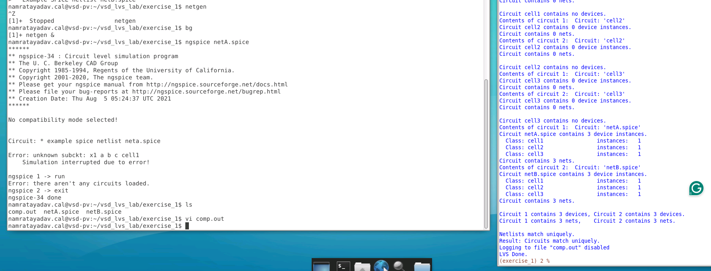
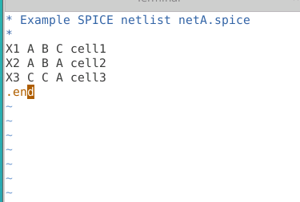
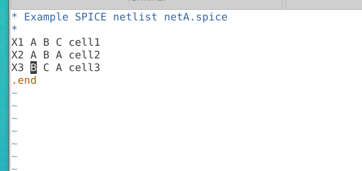
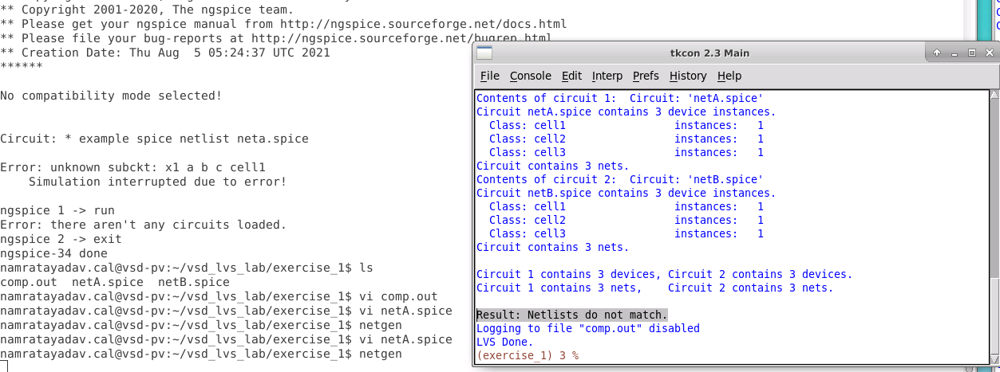
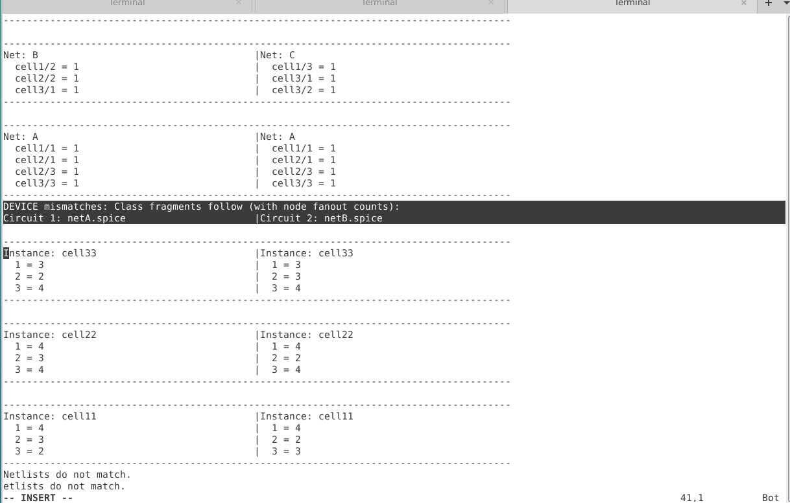
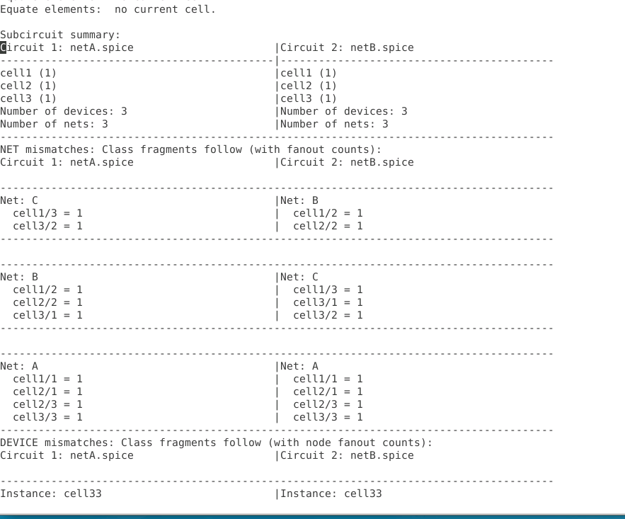

# L1 — Simple LVS Experiment with Netgen

## Overview

In this lab, I started with a very simple LVS comparison using **Netgen**.

Two SPICE netlists, `netA.spice` and `netB.spice`, were compared first in their matching state and then after intentionally modifying one connection.

The main purpose of this exercise was to understand:

- how Netgen reads SPICE netlists,
- how undefined subcircuits are handled,
- how Netgen differs from a circuit simulator such as ngspice,
- how a successful LVS result is reported,
- how a small connectivity change causes an LVS mismatch,
- and how `comp.out` can be used to debug net and device mismatches.

---

## 1. Clone the LVS Lab Repository

The lab repository was cloned from GitHub:

```bash
git clone https://github.com/RTimothyEdwards/vsd_lvs_lab.git
cd vsd_lvs_lab
```

The first exercise was opened with:

```bash
cd exercise_1
ls -al
```

The directory contains two simple SPICE netlists:

```text
netA.spice
netB.spice
```

Their contents can be inspected using:

```bash
cat netA.spice
cat netB.spice
```

Both netlists contain three instantiated cells:

```spice
X1 A B C cell1
X2 A B A cell2
X3 C C A cell3
```

Each cell has three terminals.

A direct comparison was also performed:

```bash
diff netA.spice netB.spice
```

Initially, the only difference was the comment/title line, so the actual circuit connectivity was equivalent.



---

## 2. Run Netgen Interactively

Netgen was started from the terminal:

```bash
netgen
```

From the Netgen Tcl console, LVS was run using:

```tcl
lvs netA.spice netB.spice
```

Netgen reads both netlists and encounters:

```text
cell1
cell2
cell3
```

These cells are instantiated but are not defined anywhere in the files.

Netgen therefore creates **placeholder cell definitions** for them.

This is important because Netgen does not need the internal implementation of a cell if the undefined cell is used consistently in both circuits being compared.

---

## 3. Initial LVS Match

After comparing the two original netlists, Netgen reports that both circuits contain:

```text
Number of devices: 3
Number of nets:    3
```

and concludes:

```text
Circuits match uniquely.
Netlists match uniquely.
```

The detailed comparison is written to:

```text
comp.out
```

I inspected it using:

```bash
vi comp.out
```



### Observation

The report also contains:

```text
Cells have no pins; pin matching not needed.
```

Because `cell1`, `cell2`, and `cell3` have no definitions, Netgen treats them as placeholder/black-box-style cells and compares how they are connected between the two netlists.

---

## 4. Netgen vs ngspice

The same `netA.spice` file was then opened using ngspice:

```bash
ngspice netA.spice
```

ngspice reports an error similar to:

```text
Error: unknown subckt: x1 a b c cell1
Simulation interrupted due to error!
```

This happens because ngspice is a **circuit simulator** and needs the actual definitions of the instantiated subcircuits.

Netgen behaves differently because its purpose here is **netlist comparison**. If an undefined cell occurs consistently in both netlists, Netgen can still compare their connectivity.



### Key Difference

```text
ngspice → needs circuit definitions to simulate the circuit

Netgen  → can compare matching undefined cells based on connectivity
```

---

## 5. Original netA.spice Connectivity

Before introducing an error, the original `netA.spice` contained:

```spice
X1 A B C cell1
X2 A B A cell2
X3 C C A cell3
```

The important line is:

```spice
X3 C C A cell3
```

Here the **first pin of cell3 is connected to net C**.



---

## 6. Introduce a Connectivity Error

To understand how Netgen reports mismatches, I intentionally modified `netA.spice`.

The original connection:

```spice
X3 C C A cell3
```

was changed to:

```spice
X3 B C A cell3
```

Therefore, the first pin of `cell3` was moved from:

```text
C → B
```

This creates a real **network topology change**.



---

## 7. Run LVS Again

Netgen was started again:

```bash
netgen
```

and the same comparison was repeated:

```tcl
lvs netA.spice netB.spice
```

This time Netgen still finds the same overall counts:

```text
Circuit 1 contains 3 devices, Circuit 2 contains 3 devices.
Circuit 1 contains 3 nets,    Circuit 2 contains 3 nets.
```

However, equal device and net counts do **not** mean the connectivity is equal.

Netgen now reports:

```text
Result: Netlists do not match.
```



This demonstrates an important LVS concept:

> LVS checks circuit connectivity, not merely whether the two circuits contain the same number of devices and nets.

---

## 8. Debugging the Mismatch Using comp.out

The detailed mismatch information was inspected using:

```bash
vi comp.out
```

Netgen reports two major categories of differences:

```text
Net mismatches
Device mismatches
```



### Net Mismatch Interpretation

The report compares the connectivity associated with nets such as:

```text
Net B
Net C
Net A
```

Since the subcircuits are undefined, their terminals do not have meaningful pin names.

Netgen therefore refers to them numerically.

For example:

```text
cell3/1
```

means:

```text
cell3 → pin 1
```

The modification made earlier changed:

```text
cell3/1 : C → B
```

Therefore, `cell3/1` appears associated with different nets between the two circuits.

This is the actual source of the LVS failure.

---

## 9. Understanding the Device Mismatch Output

The lower section of `comp.out` contains **device mismatches**.



The report contains entries such as:

```text
Instance: cell33

1 = 3
2 = 2
3 = 4
```

For these entries:

- the number on the left identifies the pin,
- the number after `=` represents its fanout/connectivity count.

Because changing one connection affects the connectivity around several related nets and devices, a single error can produce multiple mismatch entries.

This is why the LVS report can look much larger than the actual mistake.

---

## 10. Why One Error Creates Multiple Mismatches

Only one connection was intentionally changed:

```text
cell3 pin 1

C → B
```

But this changes the connectivity signatures of multiple surrounding nets.

Therefore, Netgen reports several affected partitions.

Some reported nets may themselves be correctly connected but appear in the mismatch report because they are connected to a device involved in the actual mismatch.

For debugging, the **net mismatch section** is therefore often easier to interpret than the device mismatch section.

---

## LVS Flow Used in This Lab

```text
Clone LVS repository
        ↓
Open exercise_1
        ↓
Inspect netA.spice and netB.spice
        ↓
Compare files using diff
        ↓
Launch Netgen
        ↓
Run LVS comparison
        ↓
Netlists match
        ↓
Inspect comp.out
        ↓
Test netA.spice with ngspice
        ↓
Modify cell3 pin connectivity
        ↓
Run LVS again
        ↓
Netlists do not match
        ↓
Inspect net mismatches
        ↓
Inspect device/fanout mismatches
        ↓
Identify cell3/1 connectivity change
```

---

## Commands Used

```bash
git clone https://github.com/RTimothyEdwards/vsd_lvs_lab.git

cd vsd_lvs_lab
cd exercise_1

ls -al

cat netA.spice
cat netB.spice

diff netA.spice netB.spice

netgen

ngspice netA.spice

vi netA.spice
vi comp.out
```

Inside Netgen:

```tcl
lvs netA.spice netB.spice
```

---

## Key Takeaways

- **LVS compares circuit topology and connectivity**, not just device counts.
- Netgen can compare undefined subcircuits by treating them as placeholder cells.
- A simulator such as **ngspice requires actual subcircuit definitions**, while Netgen can still compare undefined cells when their usage is consistent.
- `comp.out` is the important Netgen comparison report.
- A single pin connectivity error can generate several mismatch entries.
- Entries such as `cell3/1` identify a cell type and its numbered terminal.
- Net mismatch information is often more useful for tracing the original connectivity error than device mismatch information.
- Equal numbers of devices and nets do not guarantee that two netlists are equivalent.

---

## Result

The initial netlists successfully passed LVS:

```text
Netlists match uniquely.
```

After intentionally changing the first connection of `cell3` from net `C` to net `B`, Netgen correctly detected the topology difference:

```text
Netlists do not match.
```

The mismatch report was then used to trace the failure back to the modified `cell3/1` connection.
