# L2 — LVS with Subcircuits

## Overview

In this lab, I extended the basic Netgen LVS experiment by placing the circuit inside a **SPICE subcircuit**.

This exercise demonstrates an important distinction between:

- the top level of a SPICE file,
- a subcircuit definition,
- selecting the correct top-level cell for LVS,
- circuit topology matching,
- and top-level pin matching.

I also learned why Netgen should be **reinitialized between LVS runs** and how to move from interactive Netgen operation to a repeatable **batch LVS flow**.

---

## 1. Inspect the Exercise 2 Netlists

I moved into the second exercise directory:

```bash
cd ../exercise_2
```

and inspected both netlists:

```bash
cat netA.spice
cat netB.spice
```

Unlike Exercise 1, the circuit is now enclosed inside a SPICE subcircuit:

```spice
.subckt test A B C

X1 A B C cell1
X2 A B A cell2
X3 C C A cell3

.ends
.end
```

The circuit itself is essentially the same as Exercise 1, but it is now a **definition of a subcircuit called `test`**.

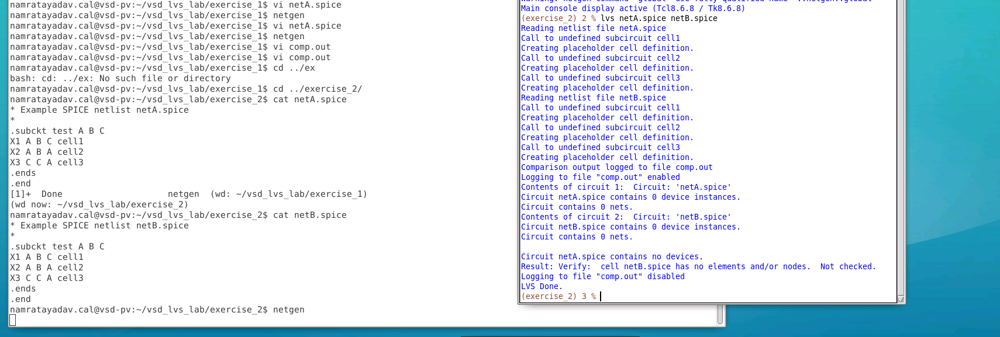

---

## 2. Why the Initial LVS Command Does Not Work

I initially started Netgen and used the same command as Exercise 1:

```tcl
lvs netA.spice netB.spice
```

Netgen reads both files, but the result indicates that there is no useful top-level circuit to compare.

The important reason is that:

```spice
.subckt test A B C
...
.ends
```

only **defines** the subcircuit.

It does not instantiate it.

A subcircuit definition is not itself an active top-level component. Normally, a SPICE subcircuit is instantiated using an `X` statement.

Therefore, when Netgen is only given:

```tcl
lvs netA.spice netB.spice
```

it attempts to compare the top level of the two files rather than the `test` subcircuits contained inside them.

---

## 3. Behavior in ngspice

I also tested the file using:

```bash
ngspice netA.spice
```

and then:

```text
run
```

Unlike Exercise 1, ngspice does not complain about the undefined:

```text
cell1
cell2
cell3
```

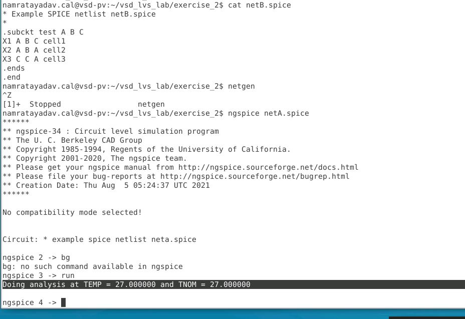

The reason is that these undefined cells exist **inside `test`**, but `test` itself is never instantiated.

Therefore, ngspice never needs to evaluate the contents of `test`.

Conceptually:

```text
.subckt test ...
       ↓
Defines a circuit
       ↓
But test is never instantiated
       ↓
Nothing active exists at the top level
       ↓
ngspice never evaluates cell1/cell2/cell3
```

---

## 4. Explicitly Specify the Top-Level Subcircuit

Netgen needs both:

```text
Netlist file
+
Subcircuit to compare
```

The correct LVS command therefore becomes:

```tcl
lvs "netA.spice test" "netB.spice test"
```

Before rerunning LVS in the same Netgen session, I first used:

```tcl
reinitialize
```

and then:

```tcl
lvs "netA.spice test" "netB.spice test"
```

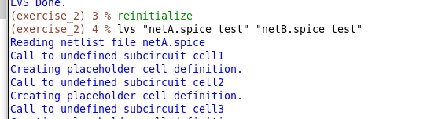

---

## 5. Why `reinitialize` Is Important

Netgen keeps previously loaded netlists in memory.

If I modify:

```text
netA.spice
```

and immediately rerun the same LVS command, Netgen may continue using the netlist already stored in memory rather than rereading the changed file.

Therefore, when keeping Netgen open between runs, I use:

```tcl
reinitialize
```

before rerunning LVS.

The flow becomes:

```text
Modify netlist
      ↓
reinitialize
      ↓
Run LVS again
      ↓
Netgen rereads the files
```

Alternatively, quitting and restarting Netgen also gives a clean state.

---

## 6. Successful Subcircuit LVS

After explicitly selecting `test`, Netgen compares the intended circuits.

The output reports:

```text
Circuit 1 contains 3 devices, Circuit 2 contains 3 devices.
Circuit 1 contains 3 nets,    Circuit 2 contains 3 nets.

Netlists match uniquely.
Result: Circuits match uniquely.
```

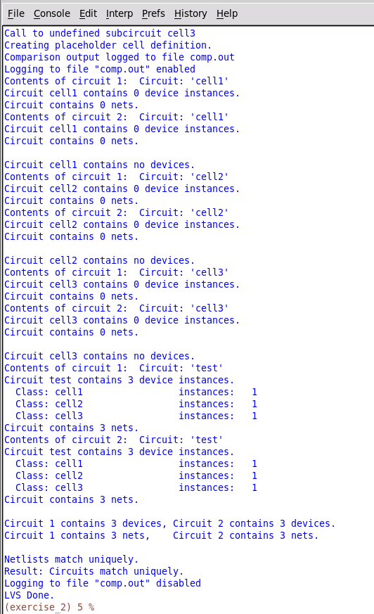

This time the comparison is:

```text
test ↔ test
```

rather than:

```text
netA.spice ↔ netB.spice
```

---

## 7. Inspecting Top-Level Pin Matching

The `comp.out` report now contains additional information that was not available in the same way in Exercise 1.

I opened it using:

```bash
vi comp.out
```

The report shows the subcircuit pins:

```text
Circuit 1: test          Circuit 2: test

A                        A
B                        B
C                        C
```

and concludes:

```text
Cell pin lists are equivalent.
Device classes test and test are equivalent.
Circuits match uniquely.
```

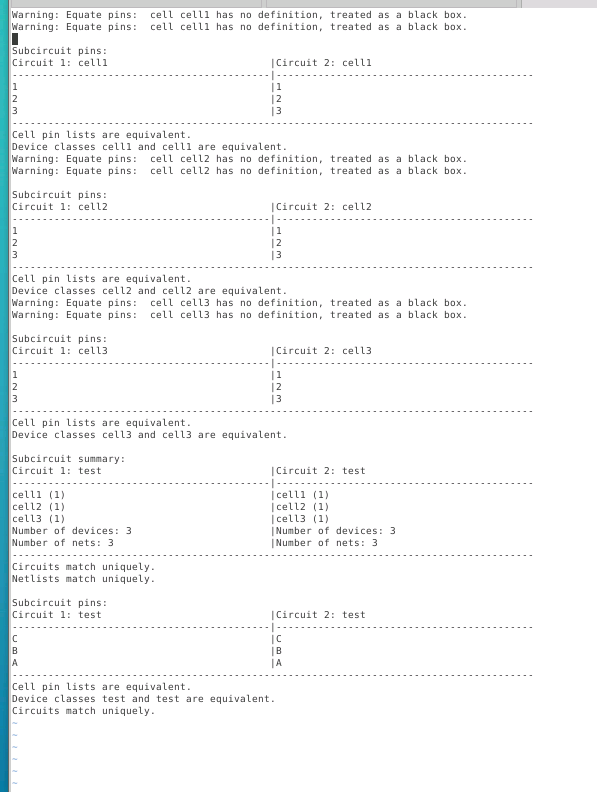

This is one advantage of comparing a specific subcircuit: Netgen can verify not only the internal topology but also the **interface pins of the top-level cell being compared**.

---

# Experiment 1 — Change Only Port Order

## 8. Original Port Order

Initially, `netA.spice` contains:

```spice
.subckt test A B C
```

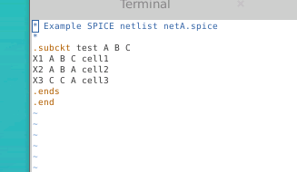

The pin order is therefore:

```text
A  B  C
```

---

## 9. Reorder the Subcircuit Ports

I then changed only the order of the port declaration:

```spice
.subckt test C B A
```

while keeping the circuit connections consistent.

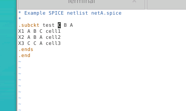

Before rerunning LVS:

```tcl
reinitialize
```

Then:

```tcl
lvs "netA.spice test" "netB.spice test"
```

---

## 10. Port Reordering Still Matches

Netgen still reports:

```text
Netlists match uniquely.
Result: Circuits match uniquely.
```

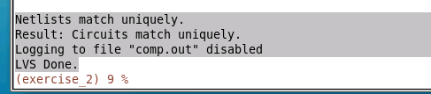

This demonstrates that **changing only the order in which the named ports are listed does not necessarily create an LVS failure**.

Netgen can associate the corresponding named pins while comparing the top-level cells.

So:

```text
A B C
```

versus:

```text
C B A
```

does not by itself mean that the electrical circuit has changed.

---

# Experiment 2 — Actually Swap the Pin Connectivity

## 11. Change A and C in the Circuit

Next, I changed more than just the `.subckt` port ordering.

I changed the actual use of `A` and `C` in `netA.spice`.

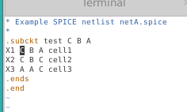

This represents a real change to which external pin names correspond to the internal circuit connections.

This distinction is important:

```text
Reordering the port declaration
        ≠
Changing which named pin connects to which circuit node
```

---

## 12. Topology Can Match While Pin Matching Fails

After the modification, I again ran:

```tcl
reinitialize
```

followed by:

```tcl
lvs "netA.spice test" "netB.spice test"
```

Netgen reports:

```text
Netlists match uniquely.
```

but then:

```text
Result: Cells failed matching, or top level cell failed pin matching.
```

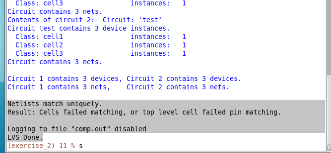

This is a very important LVS result.

The internal circuits can still be **topologically equivalent**, while their external pin assignments are incorrect.

In other words:

```text
Internal topology
       ✓

Top-level pin correspondence
       ✗
```

---

## 13. Debugging the Pin Mismatch in comp.out

The `comp.out` report makes the problem clearer.

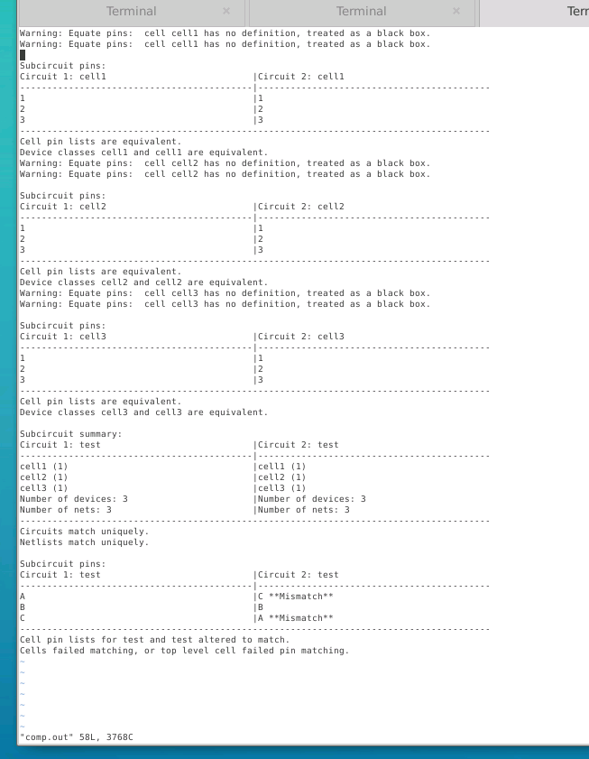

The report shows:

```text
Circuit 1: test        Circuit 2: test

A                      C  **Mismatch**
B                      B
C                      A  **Mismatch**
```

Therefore:

```text
A ↔ C
C ↔ A
```

while:

```text
B ↔ B
```

remains correct.

This explains why Netgen can report:

```text
Netlists match uniquely.
```

while still failing the overall LVS comparison because the **top-level pin mapping is wrong**.

This matters in a real chip because external documentation, package connections, bonding information, and other interfaces depend on the correct top-level pin assignment.

---

# Moving from Interactive LVS to Batch LVS

## 14. Running Netgen from the Terminal

Instead of opening the Netgen GUI and entering the LVS command interactively, the command can be passed directly using:

```bash
netgen -batch lvs "netA.spice test" "netB.spice test"
```

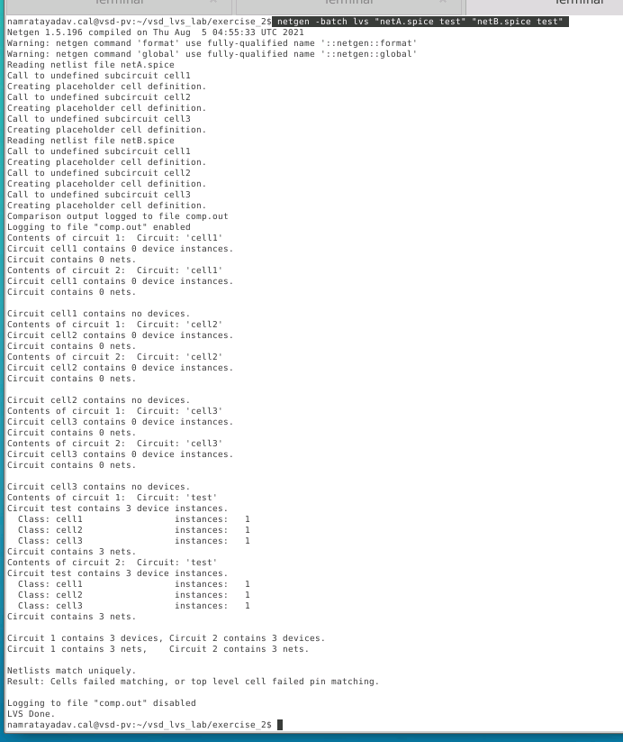

This makes the LVS process easier to automate.

---

## 15. Save Terminal Output with `tee`

The terminal output can also be saved while still being displayed:

```bash
netgen -batch lvs "netA.spice test" "netB.spice test" | tee lvs.log
```

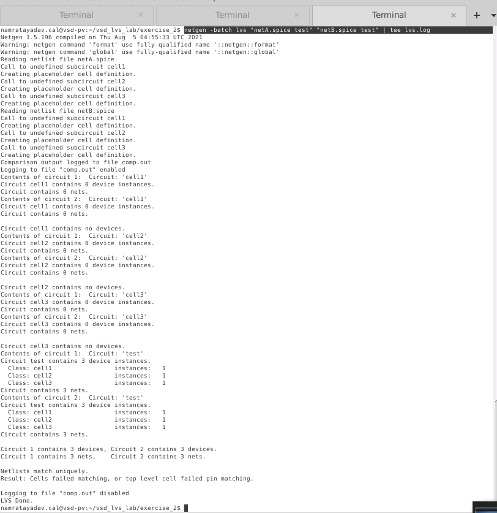

The command:

```bash
tee lvs.log
```

copies the terminal output into:

```text
lvs.log
```

while still displaying it on screen.

---

## 16. Add the SKY130 Netgen Setup File

For a technology-aware LVS flow, the SKY130 Netgen setup file can be supplied.

The batch command used was of the form:

```bash
netgen -batch lvs \
"netA.spice test" \
"netB.spice test" \
/usr/share/pdk/sky130A/libs.tech/netgen/sky130A_setup.tcl \
exercise_2_comp.out \
-json | tee lvs.log
```

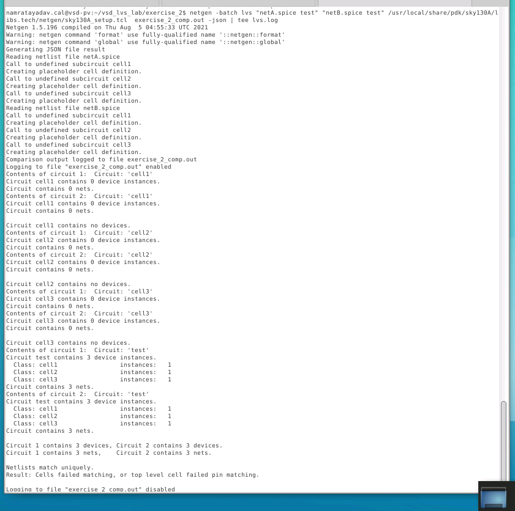

The setup file is:

```text
/usr/share/pdk/sky130A/libs.tech/netgen/sky130A_setup.tcl
```

For these simple placeholder cells, the setup file does not materially change the comparison, but it establishes the flow that will be needed for later SKY130 LVS examples.

---

## 17. Generate Machine-Readable JSON Output

The batch LVS command was also configured to generate JSON output.

This provides a machine-readable LVS result in addition to the normal human-readable comparison report.

After the run, the directory contains files such as:

```text
comp.out
exercise_2_comp.out
exercise_2_comp.json
lvs.log
netA.spice
netB.spice
```

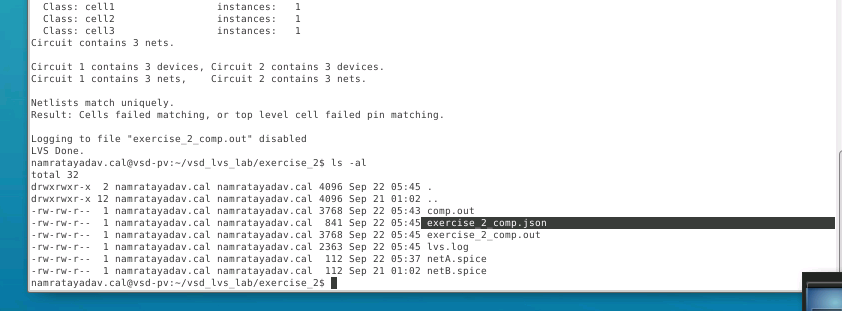

The outputs now serve different purposes:

```text
exercise_2_comp.out
        ↓
Human-readable LVS comparison

exercise_2_comp.json
        ↓
Machine-readable LVS result

lvs.log
        ↓
Complete terminal/diagnostic output
```

The JSON format is useful when LVS results need to be parsed automatically by scripts.

---

# 18. Create a Reusable LVS Shell Script

Instead of repeatedly typing the long batch command, I created a shell script.

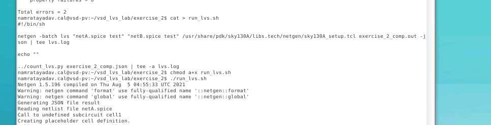

The script contains the Netgen LVS command along with the SKY130 setup file, comparison output, JSON generation, and logging.

Conceptually:

```bash
#!/bin/sh

netgen -batch lvs \
"netA.spice test" \
"netB.spice test" \
/usr/share/pdk/sky130A/libs.tech/netgen/sky130A_setup.tcl \
exercise_2_comp.out \
-json | tee lvs.log
```

The script can be made executable using:

```bash
chmod a+x run_lvs.sh
```

and then executed using:

```bash
./run_lvs.sh
```

This creates a much more repeatable LVS flow than manually entering the complete command every time.

---

# LVS Flow Learned in This Lab

```text
netA.spice                  netB.spice
     │                           │
     │   .subckt test A B C      │
     │                           │
     └────────────┬──────────────┘
                  ↓
       Specify top-level cell
                  ↓
 lvs "netA.spice test" "netB.spice test"
                  ↓
          Netgen comparison
                  ↓
        ┌─────────┴─────────┐
        ↓                   ↓
 Internal topology      Top-level pins
        ↓                   ↓
 Device/net match       Pin correspondence
        └─────────┬─────────┘
                  ↓
              comp.out
                  ↓
         PASS / MISMATCH
```

---

# Important Difference Learned

This exercise demonstrates three different situations:

| Modification | Topology | Pin Match | LVS Result |
|---|---|---|---|
| Original circuits | Match | Match | Pass |
| Reorder `.subckt` port list | Match | Match | Pass |
| Swap actual A/C pin connectivity | Match | Fail | Overall pin-matching failure |

Therefore, a circuit can be internally equivalent while still having an incorrect external interface.

---

# Commands Used

```bash
cd ../exercise_2

cat netA.spice
cat netB.spice

ngspice netA.spice

vi netA.spice
vi comp.out
```

Interactive Netgen:

```tcl
lvs netA.spice netB.spice

reinitialize

lvs "netA.spice test" "netB.spice test"
```

Batch Netgen:

```bash
netgen -batch lvs "netA.spice test" "netB.spice test"
```

With logging:

```bash
netgen -batch lvs "netA.spice test" "netB.spice test" | tee lvs.log
```

Technology setup and JSON output:

```bash
netgen -batch lvs \
"netA.spice test" \
"netB.spice test" \
/usr/share/pdk/sky130A/libs.tech/netgen/sky130A_setup.tcl \
exercise_2_comp.out \
-json | tee lvs.log
```

---

# Key Takeaways

- A `.subckt` statement defines a circuit but does not instantiate it.
- If the desired circuit exists inside a subcircuit, Netgen should be told which subcircuit to compare.
- The file and cell can be specified together as:

```tcl
"netA.spice test"
```

- `reinitialize` clears Netgen's previously loaded circuit information before another interactive LVS run.
- Simply changing the order of named ports does not necessarily change circuit connectivity.
- Changing which external pin name corresponds to an internal network can produce a **top-level pin mismatch even when the internal topology matches**.
- `comp.out` shows detailed pin correspondence.
- `netgen -batch` enables non-interactive LVS.
- `tee` preserves terminal output in a log file.
- JSON output allows LVS results to be processed by scripts.
- A shell script makes the verification flow repeatable and avoids repeatedly typing long commands.

---

## Result

The correct subcircuit-level comparison:

```tcl
lvs "netA.spice test" "netB.spice test"
```

successfully demonstrated that the original circuits match.

Reordering:

```text
A B C
```

to:

```text
C B A
```

did not by itself cause the circuits to fail.

However, after actually swapping the A and C connectivity, Netgen still found the internal topology equivalent but correctly reported a **top-level pin matching failure**.

This experiment clearly separates:

```text
Circuit topology equivalence
```

from:

```text
Top-level interface correctness
```

and establishes the batch Netgen flow that will be used in the following LVS exercises.
