# L3 — LVS with Blackbox Subcircuits

## Overview

In this lab, I explored how **Netgen handles empty subcircuits as blackboxes** during LVS.

The experiment starts with three empty subcircuit definitions:

```spice
.subckt cell1 A B C
.ends

.subckt cell2 A B C
.ends

.subckt cell3 A B C
.ends
```

These cells have no internal devices, but they still contain meaningful interface information:

```text
Cell name
Pin names
Pin order
```

This allows Netgen to treat them as abstract or blackbox cells and compare how they are instantiated in the top-level circuit.

The lab demonstrates:

- empty subcircuits as blackboxes,
- blackbox pin matching,
- the importance of pin names,
- proxy pins,
- dummy nets,
- automatic flattening of empty cells,
- and the Netgen `-blackbox` option.

---

# 1. Inspect Exercise 3 Netlist

I moved into the third exercise directory:

```bash
cd ../exercise_3
```

and inspected the netlist:

```bash
cat netA.spice
```

The netlist now contains explicit definitions for:

```text
cell1
cell2
cell3
```

Example:

```spice
.subckt cell1 A B C
.ends

.subckt cell2 A B C
.ends

.subckt cell3 A B C
.ends
```

The top-level circuit is:

```spice
.subckt test A B C

X1 A B C cell1
X2 A B A cell2
X3 C C A cell3

.ends
.end
```

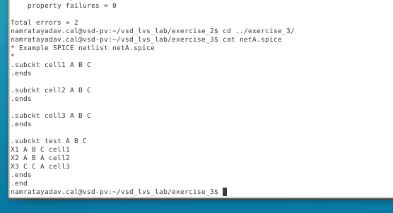

Unlike the previous exercise, Netgen no longer has to invent pin numbers such as:

```text
1
2
3
```

because the blackbox definitions explicitly provide pin names:

```text
A
B
C
```

---

# 2. Run the Initial LVS

The exercise contains a helper script:

```bash
./run_lvs.sh
```

Running the script produces a clean LVS result.

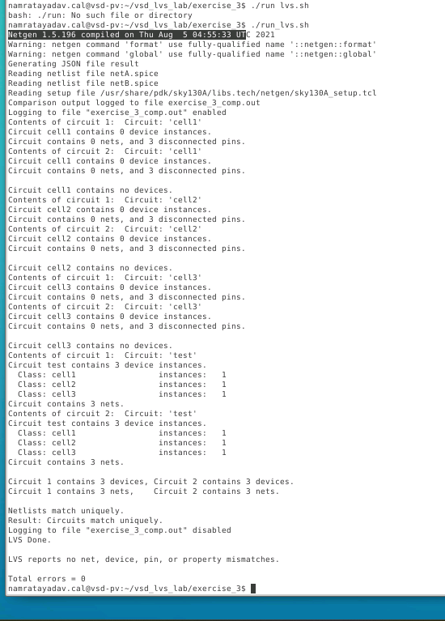

The important result is:

```text
Netlists match uniquely.
Result: Circuits match uniquely.

LVS reports no net, device, pin, or property mismatches.

Total errors = 0
```

So the starting point is:

```text
netA.spice
     │
     ├── cell1
     ├── cell2
     └── cell3
          │
          ▼
       Netgen
          ▲
          │
     ├── cell1
     ├── cell2
     └── cell3
     │
netB.spice

Result → MATCH
```

---

# 3. Blackbox Pin Reports

I then inspected:

```bash
vi exercise_3_comp.out
```

The report now contains a pin comparison for every empty subcircuit.

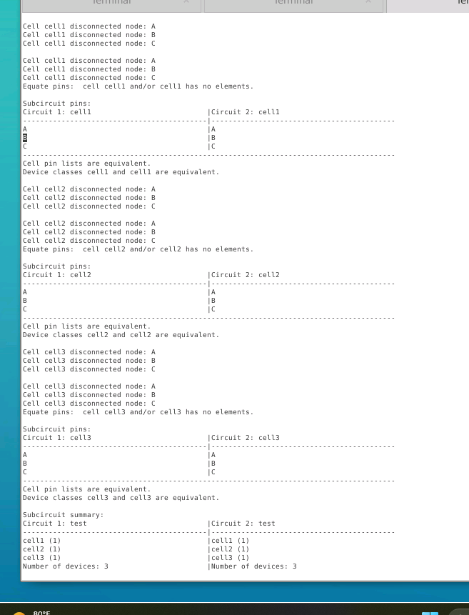

For example:

```text
Subcircuit pins:

Circuit 1: cell1       Circuit 2: cell1

A                      A
B                      B
C                      C
```

Netgen also reports:

```text
Cell pin lists are equivalent.
Device classes cell1 and cell1 are equivalent.
```

The same result appears for:

```text
cell2
cell3
```

This is different from the earlier undefined-cell case.

Here Netgen actually knows the names of the blackbox pins.

---

# Experiment 1 — Reorder Blackbox Pins

## 4. Original cell1 Definition

Initially:

```spice
.subckt cell1 A B C
.ends
```

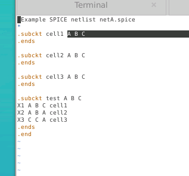

So the blackbox interface is:

```text
cell1
 ├── A
 ├── B
 └── C
```

---

# 5. Change cell1 from ABC to CBA

I modified only `netA.spice`:

```spice
.subckt cell1 C B A
.ends
```

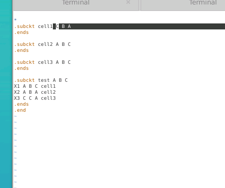

This differs from the top-level port-order experiment in L2.

For a blackbox, Netgen has no internal circuit available to determine equivalence.

Its most important information is the cell interface itself.

Therefore the pin definitions become significant.

---

# 6. Rerun LVS

I ran:

```bash
./run_lvs.sh
```

This time LVS reports a mismatch.

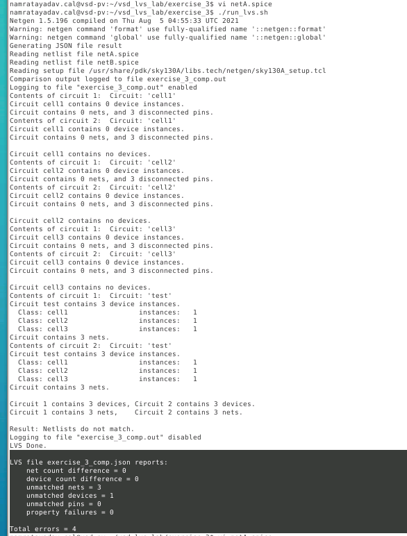

The topology now contains incorrectly associated blackbox pins.

---

# 7. Inspect Blackbox Pin Matching

Opening:

```bash
vi exercise_3_comp.out
```

shows that `cell1` no longer has the same effective pin correspondence.

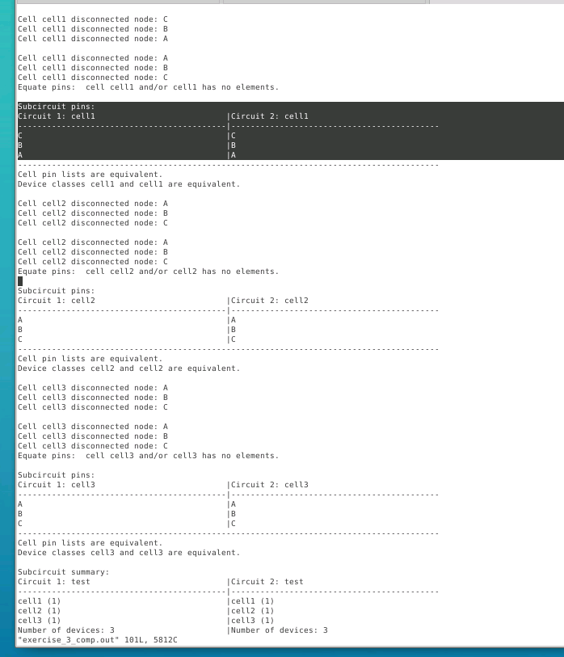

The report reflects:

```text
Circuit 1: cell1       Circuit 2: cell1

C                      C
B                      B
A                      A
```

Although the names themselves exist on both sides, changing their position in the blackbox declaration changes which external connection corresponds to each blackbox pin.

Because the top-level instance still uses:

```spice
X1 A B C cell1
```

the internal interpretation becomes different.

---

# 8. Net and Device Mismatch

Further down in the comparison report, Netgen shows net and device mismatches.

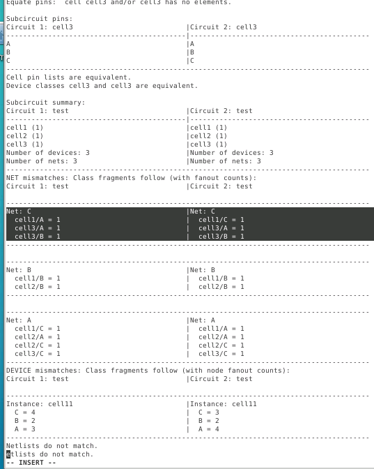

For example, connections involving:

```text
cell1/A
cell1/C
```

no longer correspond correctly between the two circuits.

This demonstrates that for blackboxes:

```text
Pin name
+
Pin position
+
Instance connection
```

must be interpreted together.

---

# Experiment 2 — Change a Blackbox Pin Name

## 9. Change C to D

Next, instead of only reordering pins, I changed the blackbox interface itself.

I modified:

```spice
.subckt cell1 C B A
```

to:

```spice
.subckt cell1 A B D
```

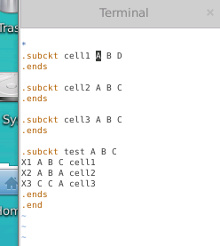

Now:

```text
Circuit 1 cell1 → A B D
Circuit 2 cell1 → A B C
```

So one side contains:

```text
D
```

while the other contains:

```text
C
```

---

# 10. LVS Error Summary

Running:

```bash
./run_lvs.sh
```

again produces a mismatch.

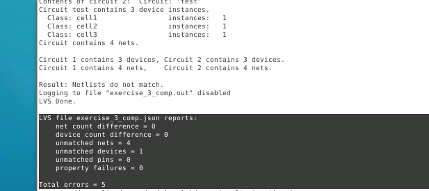

The summary reports unmatched objects because the blackbox interfaces are no longer equivalent.

---

# 11. Missing Blackbox Pins

The comparison report clearly identifies the missing pin.

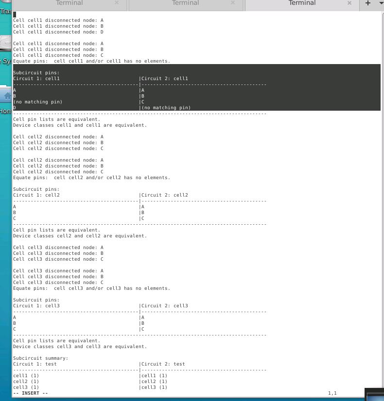

Conceptually:

```text
Circuit 1              Circuit 2

A        ────────────  A
B        ────────────  B

D        ────────────  no matching pin
no pin   ────────────  C
```

Netgen cannot simply assume:

```text
D = C
```

because the contents of the blackbox are unknown.

Pin identity is therefore part of the only reliable information available.

---

# 12. Proxy Pins and Dummy Nets

A particularly interesting part of the report is the appearance of:

```text
proxyC
proxyD
dummy_4
```

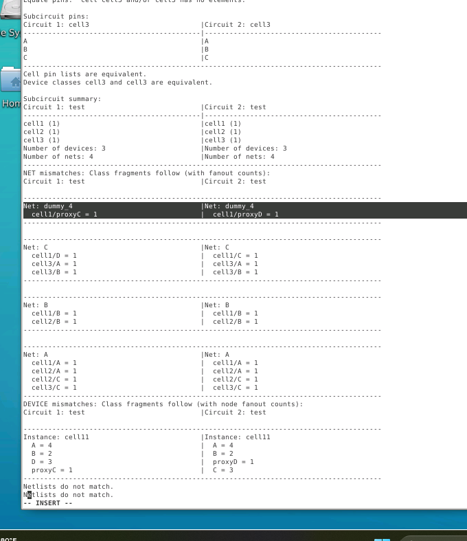

Why does Netgen do this?

Consider:

```text
Circuit 1 cell1 → A B D
Circuit 2 cell1 → A B C
```

Netgen knows both circuits refer to a cell named:

```text
cell1
```

so it tries to construct a common representation.

Conceptually it reasons that the complete interface might need to contain:

```text
A
B
C
D
```

But:

```text
Circuit 1 is missing C
Circuit 2 is missing D
```

Netgen therefore generates placeholder connections such as:

```text
proxyC
proxyD
```

and connects them through a generated dummy net.

Conceptually:

```text
          Real blackbox interface assumed by Netgen

                  cell1
             ┌────────────┐
             │ A          │
             │ B          │
             │ C          │
             │ D          │
             └────────────┘

Circuit 1                    Circuit 2

A                            A
B                            B
proxyC                       C
D                            proxyD
```

The proxy name tells the user that the pin was not actually present in that netlist.

---

# Experiment 3 — Rename a Blackbox Cell

## 13. Restore ABC and Rename cell1

Next I restored the original pins:

```spice
.subckt cell1 A B C
```

but renamed the cell itself.

I changed:

```text
cell1
```

to:

```text
cell4
```

both in the definition and in its top-level instance.

For example:

```spice
.subckt cell4 A B C
.ends

.subckt cell2 A B C
.ends

.subckt cell3 A B C
.ends

.subckt test A B C

X1 A B C cell4
X2 A B A cell2
X3 C C A cell3

.ends
.end
```

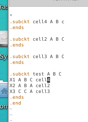

One circuit therefore contains:

```text
cell4
cell2
cell3
```

while the other contains:

```text
cell1
cell2
cell3
```

---

# 14. Unexpectedly, LVS Still Matches

Running:

```bash
./run_lvs.sh
```

without any special blackbox option produced:

```text
Netlists match uniquely.
```

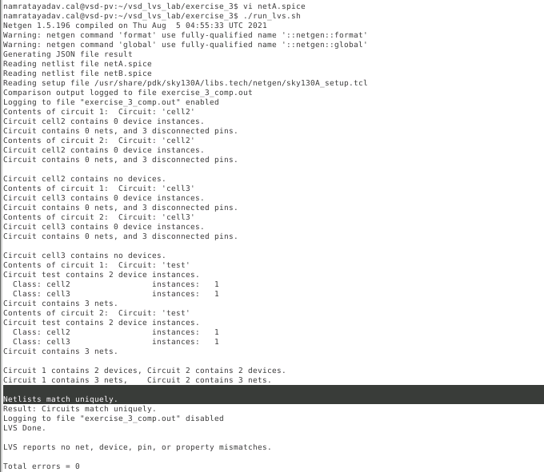

At first this seems surprising.

We changed:

```text
cell1
```

to:

```text
cell4
```

so why did LVS still pass?

---

# 15. Netgen Automatically Flattened the Empty Cells

The answer is visible in the comparison output.

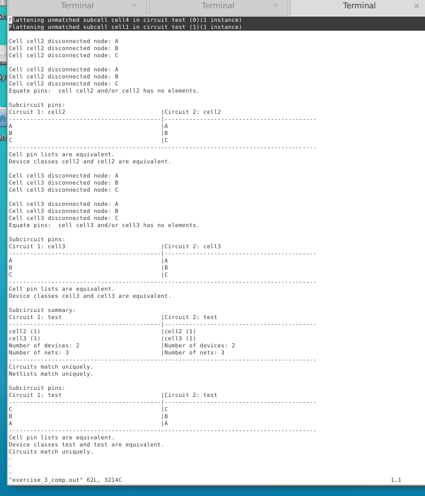

Netgen reports something similar to:

```text
Flattening unmatched subcell cell4 in circuit test
Flattening unmatched subcell cell1 in circuit test
```

Because these subcircuits contain no internal devices, Netgen cannot always determine whether they are intended to represent:

```text
real blackboxes
```

or simply:

```text
empty hierarchy that may safely be flattened
```

Without being explicitly told otherwise, Netgen can flatten the unmatched empty cells.

After flattening them, the remaining circuits can still match.

---

# Why This Is Dangerous

For a real blackbox, flattening is not what we want.

Suppose:

```text
cell1
```

and:

```text
cell4
```

represent two completely different IP blocks.

Their contents are intentionally hidden.

If Netgen simply removes both empty definitions, a real hierarchical mismatch may disappear.

Therefore Netgen needs to be explicitly told:

```text
These empty cells are real blackboxes.
Do not flatten them.
```

---

# 16. Enable the `-blackbox` Option

I edited:

```bash
run_lvs.sh
```

and added:

```text
-blackbox
```

to the LVS command.

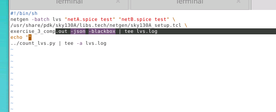

The script is now similar to:

```bash
#!/bin/sh

netgen -batch lvs \
"netA.spice test" \
"netB.spice test" \
/usr/share/pdk/sky130A/libs.tech/netgen/sky130A_setup.tcl \
exercise_3_comp.out \
-json \
-blackbox | tee lvs.log

echo ""

./count_lvs.py | tee -a lvs.log
```

The important new option is:

```bash
-blackbox
```

This tells Netgen to preserve empty subcircuits as blackbox devices instead of flattening them away.

---

# 17. Rerun LVS with Blackbox Preservation

After adding:

```text
-blackbox
```

I ran:

```bash
./run_lvs.sh
```

again.

Now LVS reports a real mismatch.

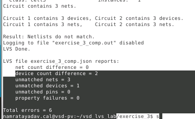

The result shows a device count / unmatched device difference.

Now Netgen correctly treats:

```text
cell1
```

and:

```text
cell4
```

as distinct blackbox cell types.

---

# 18. Inspect the Blackbox Mismatch

The comparison report now shows:

```text
Circuit 1                 Circuit 2

cell4 (1)                 (no matching element)
cell2 (1)                 cell2 (1)
cell3 (1)                 cell3 (1)
(no matching element)     cell1 (1)
```

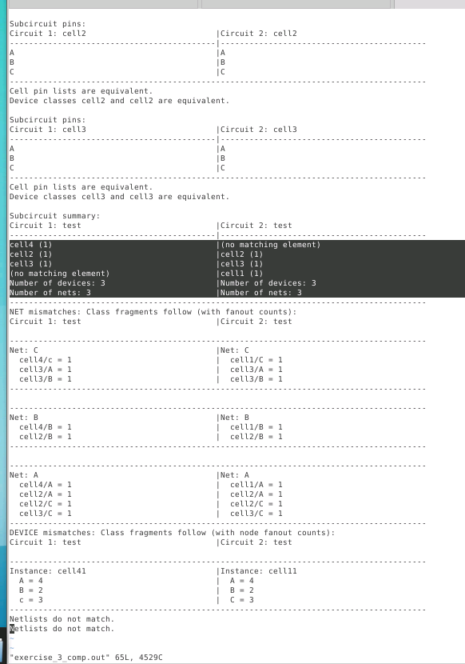

This is exactly the result we expect.

The two circuits contain:

```text
Circuit 1 → cell4
Circuit 2 → cell1
```

and Netgen is no longer allowed to flatten those cells away.

---

# Important Lesson About the Mismatch Report

The mismatch report may place objects beside each other, for example:

```text
cell4          | cell1
```

but this does **not necessarily mean Netgen believes they are a valid pair**.

If something appears inside a mismatch partition, it means that part of the comparison was not resolved.

Netgen tries to organize mismatching elements into useful groups, but the left and right columns should not automatically be interpreted as:

```text
this exact object ↔ that exact object
```

The reliable starting points are usually:

```text
Subcircuit summary
Net mismatches
Unmatched devices
Pin mismatches
```

---

# Blackbox Behavior Learned

The experiments demonstrate three important cases.

| Modification | Result |
|---|---|
| Identical `cell1 A B C` definitions | LVS passes |
| Change blackbox pin order | LVS mismatch |
| Change blackbox pin C → D | Missing/proxy pin mismatch |
| Rename cell1 → cell4 without `-blackbox` | Netgen may flatten cells and LVS can pass |
| Rename cell1 → cell4 with `-blackbox` | LVS correctly reports unmatched cells |

---

# Blackbox LVS Concept

```text
Normal hierarchical cell
        │
        ▼
Internal devices available
        │
        ▼
Netgen can compare topology


Blackbox cell
        │
        ▼
Internal devices unavailable
        │
        ▼
Netgen relies on:
    Cell name
    Pin names
    Pin mapping
        │
        ▼
Interface becomes critical
```

---

# Why Blackboxes Are Useful

Blackboxes are important when the internal implementation of a block is unavailable or intentionally ignored.

Examples include:

```text
Standard cells represented by abstract views
Macros
Memory blocks
Analog IP
Third-party IP
Preverified blocks
Large hierarchical blocks
```

Instead of comparing everything inside the cell, LVS can verify that:

```text
the correct block exists
+
the correct pins exist
+
the block is connected correctly
```

---

# Commands Used

Move to the exercise:

```bash
cd ../exercise_3
```

Inspect the netlist:

```bash
cat netA.spice
```

Edit the netlist:

```bash
vi netA.spice
```

Run LVS:

```bash
./run_lvs.sh
```

Inspect the comparison:

```bash
vi exercise_3_comp.out
```

Edit the LVS script:

```bash
vi run_lvs.sh
```

Add:

```bash
-blackbox
```

and rerun:

```bash
./run_lvs.sh
```

---

# Key Takeaways

- Empty SPICE subcircuits can be used by Netgen as abstract or blackbox cells.
- Explicit blackbox definitions provide real pin names instead of automatically generated pin numbers.
- For blackboxes, pin information is particularly important because internal topology is unavailable.
- Reordering blackbox pins can change how instance connections are interpreted.
- Changing a pin name can cause missing-pin mismatches.
- Netgen may introduce:

```text
proxy pins
dummy nets
```

to represent missing blackbox interfaces during comparison.

- Empty unmatched subcircuits may be flattened automatically if Netgen is not explicitly told that they are blackboxes.
- The:

```bash
-blackbox
```

option prevents those empty subcircuits from being silently flattened.
- With `-blackbox`, different cell types such as:

```text
cell1
cell4
```

are preserved and reported as unmatched.
- Objects displayed beside each other in a mismatch partition are not automatically equivalent or intended matches.

---

# Final Result

This lab demonstrated how LVS changes when hierarchy contains cells whose internal contents are unavailable.

The fundamental difference is:

```text
Normal cell
→ Compare internal topology

Blackbox cell
→ Compare interface identity and connectivity
```

The most important practical lesson is to use:

```bash
-blackbox
```

when empty subcircuits are intentionally being used as abstract representations.

Otherwise, Netgen may flatten an empty unmatched hierarchy and potentially hide the mismatch that the LVS run was intended to detect.
