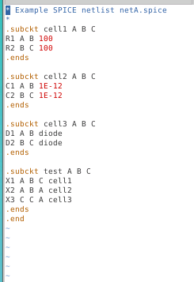
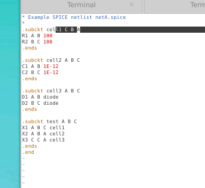
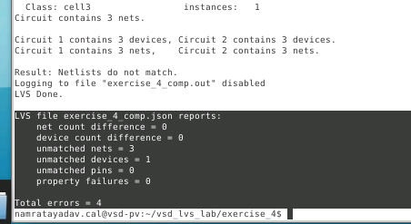
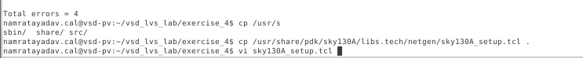
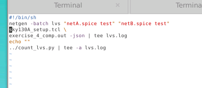
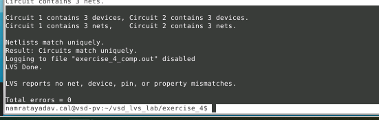
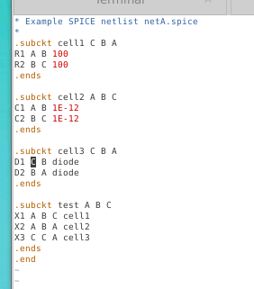
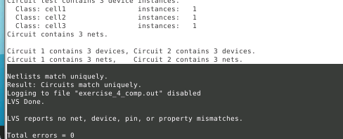
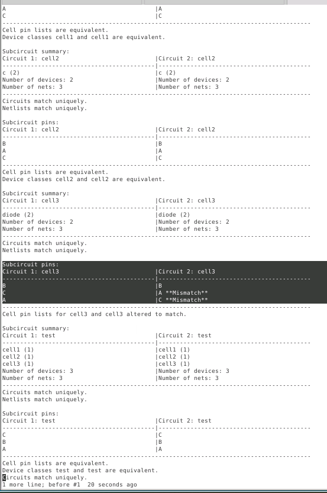

# L4 — LVS with SPICE Low-Level Components

## Overview

In this lab, I explored how Netgen handles **low-level SPICE components** such as:

- resistors,
- capacitors,
- diodes,

and how their electrical behavior affects LVS pin matching.

Unlike subcircuits, low-level SPICE devices have fixed device syntax and predefined terminal behavior.

For example:

```text
R → resistor
C → capacitor
D → diode
```

A resistor is electrically symmetric, while a diode is directional.

This difference becomes important when Netgen tries to determine whether pins may be exchanged during LVS.

---

# 1. Exercise 4 Netlist

The starting `netA.spice` contains three hierarchical cells.

```spice
.subckt cell1 A B C
R1 A B 100
R2 B C 100
.ends

.subckt cell2 A B C
C1 A B 1E-12
C2 B C 1E-12
.ends

.subckt cell3 A B C
D1 A B diode
D2 B C diode
.ends

.subckt test A B C
X1 A B C cell1
X2 A B A cell2
X3 C C A cell3
.ends

.end
```



The important difference from the previous lab is that:

```text
cell1
cell2
cell3
```

are no longer empty blackboxes.

They now contain real SPICE devices.

---

# 2. Low-Level Device Types

The three subcircuits contain:

```text
cell1 → resistors
cell2 → capacitors
cell3 → diodes
```

These components do not begin with:

```text
X
```

so they are not subcircuit calls.

Instead, they are primitive SPICE devices.

For example:

```spice
R1 A B 100
```

means:

```text
Resistor R1
between A and B
value = 100 Ω
```

Similarly:

```spice
C1 A B 1E-12
```

represents a capacitor.

And:

```spice
D1 A B diode
```

represents a diode.

---

# 3. Device Terminal Symmetry

An important concept in LVS is whether a device's terminals may be exchanged.

For a resistor:

```text
A --- R --- B
```

is electrically equivalent to:

```text
B --- R --- A
```

Therefore the two resistor terminals are **permutable**.

The same concept applies to ideal capacitors.

However, a diode is directional:

```text
Anode → Cathode
```

Its terminal order is meaningful.

So in general:

```text
Resistor   → terminals interchangeable
Capacitor  → terminals interchangeable
Diode      → terminals directional
```

---

# Experiment 1 — Swap Cell1 Pins

## 4. Change Cell1 Port Order

Initially Cell1 is:

```spice
.subckt cell1 A B C
```

I changed it to:

```spice
.subckt cell1 C B A
```



The internal resistors remain:

```spice
R1 A B 100
R2 B C 100
```

Because both resistors have the same value and resistor terminals are interchangeable, the circuit is electrically symmetric with respect to A and C.

Conceptually:

```text
A --100Ω-- B --100Ω-- C
```

and reversing A and C gives:

```text
C --100Ω-- B --100Ω-- A
```

which represents the same electrical network.

---

# 5. Run LVS

After changing the Cell1 port order, I ran:

```bash
./run_lvs.sh
```

Netgen still reported a mismatch.



This happens because Netgen still considers the subcircuit pin names when comparing Cell1.

Although the internal resistor network is symmetric, Netgen does not automatically conclude that the entire Cell1 interface is permutable.

So the physical symmetry of the circuit alone is not enough.

---

# 6. Create a Local Netgen Setup File

To explicitly tell Netgen that Cell1 pins A and C can be exchanged, I copied the technology setup file into the local exercise directory.

```bash
cp /usr/share/pdk/sky130A/libs.tech/netgen/sky130A_setup.tcl .
```



This creates:

```text
sky130A_setup.tcl
```

inside the current exercise directory.

The local setup file can now be modified without changing the PDK installation.

---

# 7. Modify the LVS Script

The `run_lvs.sh` script originally referenced the PDK setup file.

I modified it so that it uses the local copy.

For example:

```bash
#!/bin/sh

netgen -batch lvs \
"netA.spice test" \
"netB.spice test" \
sky130A_setup.tcl \
exercise_4_comp.out \
-json | tee lvs.log

echo ""

../count_lvs.py | tee -a lvs.log
```



This allows custom Netgen rules to be added for this experiment.

---

# 8. Declare Cell1 Pins A and C Permutable

Inside:

```text
sky130A_setup.tcl
```

I added:

```tcl
permute "-circuit1 cell1" A C
permute "-circuit2 cell1" A C
```


These commands tell Netgen:

```text
For cell1 in Circuit 1:
A and C may be exchanged.

For cell1 in Circuit 2:
A and C may be exchanged.
```

Conceptually:

```text
cell1

A ─────┐
       │
       ├── allowed to swap
       │
C ─────┘
```

This explicitly describes the symmetry that exists in the resistor network.

---

# 9. LVS Passes After Permutation Rule

I ran:

```bash
./run_lvs.sh
```

again.

This time:

```text
Netlists match uniquely.
Result: Circuits match uniquely.
```



The summary reports:

```text
LVS reports no net, device, pin, or property mismatches.

Total errors = 0
```

So Netgen now understands that:

```text
Cell1 A ↔ C
```

is a valid permutation.

---

# Why Netgen Needed the Permute Rule

Netgen already knows that individual resistor terminals may be reversed.

However, that does not automatically imply that the complete hierarchical circuit can exchange its external pins.

These are two different concepts:

```text
Primitive device permutation
        ↓
Resistor terminal 1 ↔ terminal 2
```

versus:

```text
Hierarchical cell permutation
        ↓
Cell1 pin A ↔ Cell1 pin C
```

The second relationship must be specified explicitly.

---

# Experiment 2 — Change Cell3 Pins

## 10. Modify Cell3

Cell3 originally contains diodes:

```spice
.subckt cell3 A B C

D1 A B diode
D2 B C diode

.ends
```

I changed the subcircuit pin order to:

```spice
.subckt cell3 C B A
```

and also changed the diode connections so that the same physical circuit behavior was represented using the renamed terminals.



Unlike resistors, diode terminals are directional.

For a diode:

```text
terminal 1 ≠ terminal 2
```

because the first terminal and second terminal have different electrical meanings.

---

# 11. Run LVS Again

After modifying Cell3, I reran:

```bash
./run_lvs.sh
```

The result was:

```text
Netlists match uniquely.
Result: Circuits match uniquely.
```



This may initially look surprising because Cell3's pin names have changed.

The key point is that:

```text
Cell3 is not the top-level circuit.
```

Netgen is allowed to adjust the mapping between hierarchical subcircuit pins when the internal topology proves how the pins correspond.

---

# 12. Cell3 Pin Mapping in comp.out

Looking at:

```bash
vi exercise_4_comp.out
```

shows how Netgen handled Cell3.



The report shows something similar to:

```text
Subcircuit pins:

Circuit 1: cell3       Circuit 2: cell3

B                      B
C                      A **Mismatch**
A                      C **Mismatch**
```

Then Netgen reports:

```text
Cell pin lists for cell3 and cell3 altered to match.
```

This is important.

Netgen noticed that:

```text
A ↔ C
C ↔ A
```

but because Cell3 is an internal hierarchical cell, it was able to remap the Cell3 ports according to the topology.

It then verified how Cell3 was instantiated in the top-level `test` circuit.

Since the top-level connectivity remained equivalent, LVS passed.

---

# Top-Level vs Internal Pin Matching

This experiment highlights an important difference.

For the **top-level circuit**, pin identity is strict.

For example:

```text
Input A
Output C
```

cannot simply be renamed or exchanged without Netgen reporting a top-level pin mismatch.

But for internal hierarchy:

```text
cell3
```

Netgen can sometimes determine that:

```text
Circuit 1 pin A
```

corresponds topologically to:

```text
Circuit 2 pin C
```

and internally alter the pin correspondence.

---

# Cell1 vs Cell3 Behavior

The two experiments appear similar but Netgen handles them differently.

## Cell1

```text
A -- R -- B -- R -- C
```

The two identical resistors create symmetry.

Because resistor terminals are themselves permutable, Netgen cannot automatically establish which symmetrical hierarchical pin mapping should be preferred.

Therefore we explicitly added:

```tcl
permute "-circuit1 cell1" A C
permute "-circuit2 cell1" A C
```

---

## Cell3

The diode network is directional.

Because diode terminals are not reversible, the internal device topology gives Netgen additional information about which external pin corresponds to which pin on the other side.

Therefore Netgen can determine:

```text
A ↔ C
C ↔ A
```

and alter the internal Cell3 pin mapping.

---

# Important Difference

```text
Symmetric internal circuit
        │
        ▼
Multiple equally valid mappings
        │
        ▼
Netgen may need explicit permute rule
```

versus:

```text
Directional internal circuit
        │
        ▼
Topology identifies corresponding pins
        │
        ▼
Netgen can remap internal subcircuit pins
```

---

# Permutable and Non-Permutable Devices

| Device | SPICE Prefix | Terminal behavior |
|---|---|---|
| Resistor | `R` | Permutable |
| Capacitor | `C` | Permutable |
| Diode | `D` | Directional |
| Subcircuit | `X` | Depends on subcircuit topology/setup |

The important point is that low-level SPICE devices already have known electrical semantics.

Netgen can use this information while performing matching.

---

# Commands Used

Move to Exercise 4:

```bash
cd ../exercise_4
```

Inspect the netlist:

```bash
cat netA.spice
```

Edit the netlist:

```bash
vi netA.spice
```

Run LVS:

```bash
./run_lvs.sh
```

Copy the local setup file:

```bash
cp /usr/share/pdk/sky130A/libs.tech/netgen/sky130A_setup.tcl .
```

Edit the setup file:

```bash
vi sky130A_setup.tcl
```

Add:

```tcl
permute "-circuit1 cell1" A C
permute "-circuit2 cell1" A C
```

Edit the run script:

```bash
vi run_lvs.sh
```

Run LVS again:

```bash
./run_lvs.sh
```

Inspect detailed output:

```bash
vi exercise_4_comp.out
```

---

# Key Takeaways

- SPICE low-level devices have predefined terminal semantics.
- Resistor terminals are interchangeable.
- Capacitor terminals are also generally interchangeable.
- Diode terminals are directional.
- Device-level symmetry does not automatically mean the entire hierarchical cell interface is considered permutable.
- Netgen may require an explicit:

```tcl
permute
```

rule for symmetric hierarchical cells.
- A local copy of:

```text
sky130A_setup.tcl
```

can be modified to add custom LVS matching rules.
- Internal subcircuit pin names are not treated as strictly as top-level pins.
- Netgen can alter pin mapping for internal hierarchy when topology determines the correct correspondence.
- Top-level pin matching remains important because those pins represent the external interface of the complete design.

---

# Final Result

This lab demonstrated the relationship between:

```text
Device semantics
       +
Pin permutation
       +
Hierarchy
       +
LVS matching
```

The main lesson is:

```text
Netgen does not compare text.

Netgen compares electrical topology.
```

But when a circuit contains electrical symmetry, additional information such as:

```tcl
permute
```

may be required to tell Netgen which hierarchical pins are legally interchangeable.

For internal cells whose topology uniquely determines the mapping, Netgen can automatically alter the subcircuit pin correspondence and still produce a valid LVS match.
