# L5 — LVS for Small Analog Block: Power-On Reset — Part 1

## Overview

In this lab, I moved from small artificial LVS examples to a **real hierarchical analog design implemented in the SkyWater SKY130 technology**.

The design is based on the Caravel `user_analog_project` example and contains two power-on-reset (POR) circuits.

The main LVS flow in this exercise was:

```text
Xschem Schematic
       ↓
Schematic SPICE Netlist
       ↓
                Netgen LVS
               ↙          ↘
Magic Layout              Compare
       ↓
Extracted SPICE Netlist
```

The main goal was to:

- generate a schematic netlist from Xschem,
- generate an extracted layout netlist from Magic,
- compare them using Netgen,
- identify problems caused by missing standard-cell definitions,
- use the testbench netlist to include the required PDK libraries,
- and perform LVS on an internal hierarchical POR block.

---

# 1. Exercise 5 Project Structure

Unlike the earlier simple LVS exercises, this exercise is organized like a real analog design project.

The important directories are:

```text
exercise_5/
├── xschem/
├── mag/
└── netgen/
```

Their purposes are:

```text
xschem/  → schematic source and schematic-generated netlists

mag/     → physical layout and extracted layout netlists

netgen/  → LVS scripts and comparison results
```

This separation keeps the schematic, layout, and verification results organized.

---

# 2. Open the Top-Level Schematic

First I moved into the Xschem directory:

```bash
cd exercise_5/xschem
```

Then opened:

```bash
xschem user_analog_project_wrapper.sch
```

The top-level schematic contains two instances of the power-on-reset block.

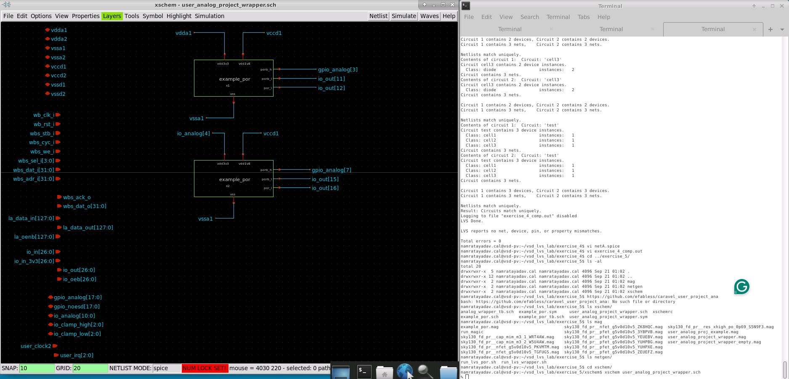

The wrapper also contains a large number of Caravel interface pins.

Most of these signals are not used by this small analog example.

---

# 3. Inspect the Power-On-Reset Circuit

I selected an `example_por` symbol and descended into its schematic.

The POR circuit contains:

- PMOS devices,
- NMOS devices,
- resistors,
- capacitors,
- Schmitt-trigger standard cells,
- buffers,
- inverters.

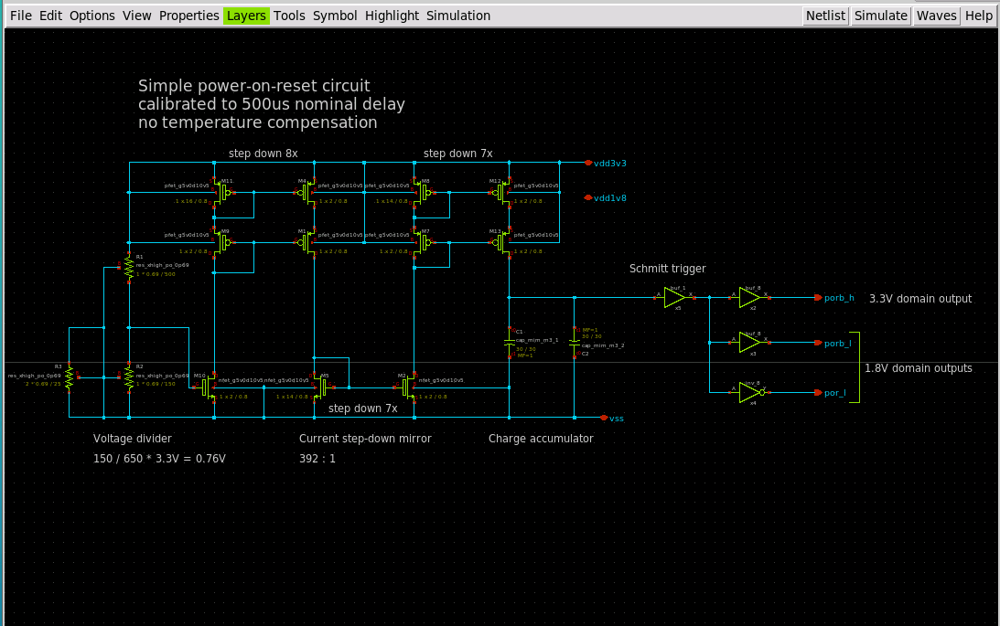

The circuit can be viewed approximately as:

```text
Voltage divider
      ↓
Current step-down mirror
      ↓
Charge accumulator
      ↓
Schmitt trigger
      ↓
Digital POR outputs
```

The schematic identifies the main sections directly.

The POR circuit monitors the supply and produces digital signals used to indicate that the supply has reached an appropriate operating condition.

---

# 4. Generate the First Schematic Netlist

For a properly constructed Xschem schematic, netlist generation is straightforward.

I initially clicked:

```text
Netlist
```

Xschem generated:

```text
user_analog_project_wrapper.spice
```

However, inspection of the generated file showed a problem.

The top-level subcircuit definition was commented out.

For LVS, I wanted:

```spice
.subckt user_analog_project_wrapper ...
```

to be an actual subcircuit definition.

---

# 5. Enable LVS Top-Level Subcircuit Mode

In Xschem I selected:

```text
Simulation
    ↓
LVS netlist: Top level is a .subckt
```

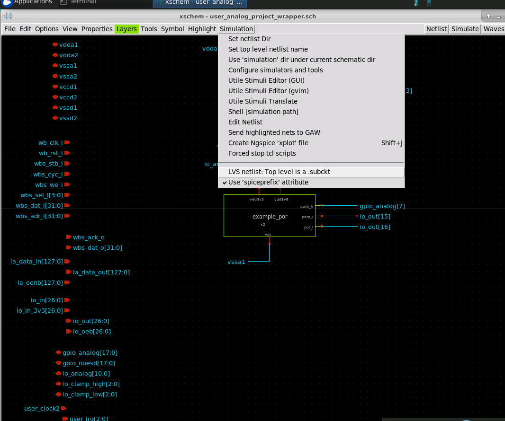

I then generated the netlist again.

Now the SPICE file begins with the required top-level definition:

```spice
.subckt user_analog_project_wrapper ...
```

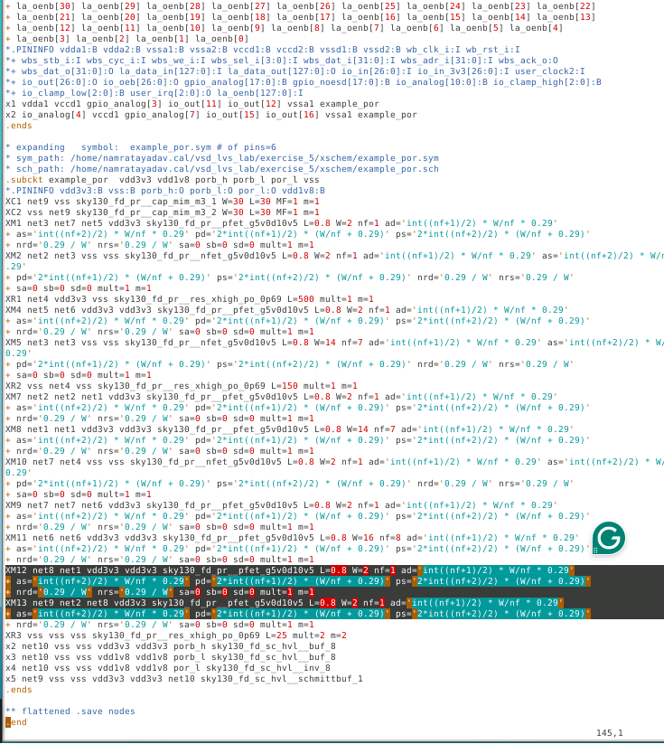

This is important because Netgen should compare:

```text
user_analog_project_wrapper
```

rather than an anonymous SPICE top level.

---

# 6. Inspect the Generated SPICE

The generated netlist contains a very large pin list because the wrapper interfaces with the Caravel harness.

Inside it, the POR block appears as a hierarchical subcircuit.

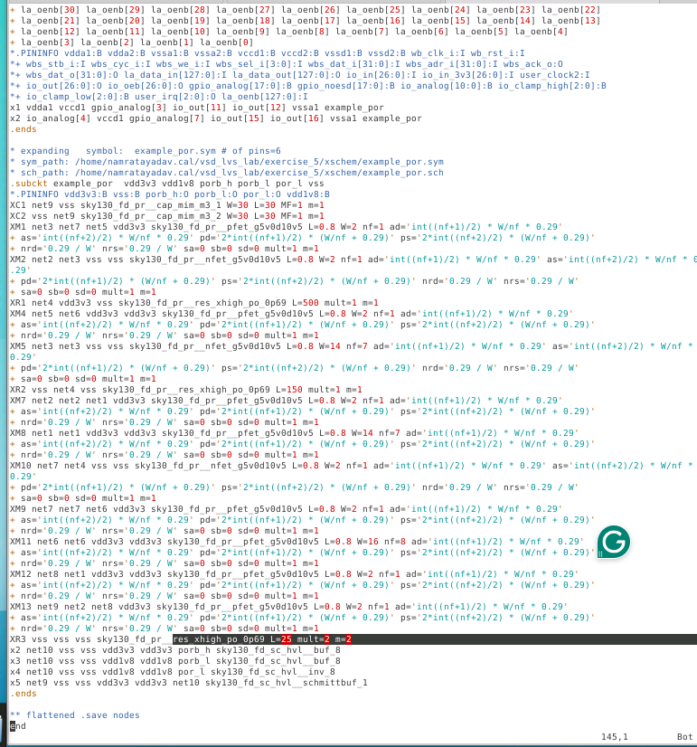

The POR contains device instances such as:

```text
sky130_fd_pr__pfet_g5v0d10v5
sky130_fd_pr__nfet_g5v0d10v5
sky130_fd_pr__res_xhigh_po_0p69
sky130_fd_pr__cap_mim_m3_1
```

An important observation is that many foundry devices begin with:

```text
X
```

in the generated SPICE.

That means they are represented as SPICE subcircuits rather than simple primitive devices.

---

# 7. Why the Netgen Setup File Matters

Netgen must know how the SKY130 devices should be treated during LVS.

The PDK provides:

```text
sky130A_setup.tcl
```

This setup file contains rules describing devices such as:

```text
MOSFETs
resistors
capacitors
diodes
```

For example, a resistor model may be configured so that Netgen understands:

```text
terminal 1 ↔ terminal 2
```

as a legal permutation.

The setup file can also tell Netgen how device properties such as:

```text
L
W
```

should be compared.

Therefore:

```text
SPICE model name
        +
Netgen setup rules
        ↓
Correct LVS device interpretation
```

---

# 8. Open the Layout in Magic

Next I moved to the layout directory:

```bash
cd ../mag
```

and started Magic:

```bash
./run_magic
```

I opened:

```text
user_analog_project_wrapper.mag
```

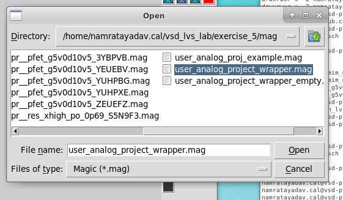

The complete project occupies only part of the available Caravel user-project area.

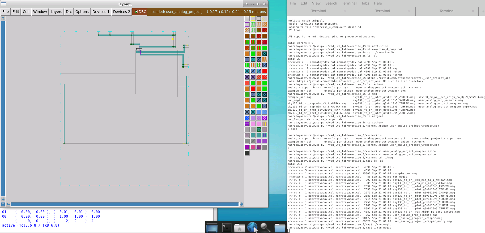

---

# 9. Inspect the POR Layout

I expanded the hierarchy to inspect the physical implementation of the POR circuit.

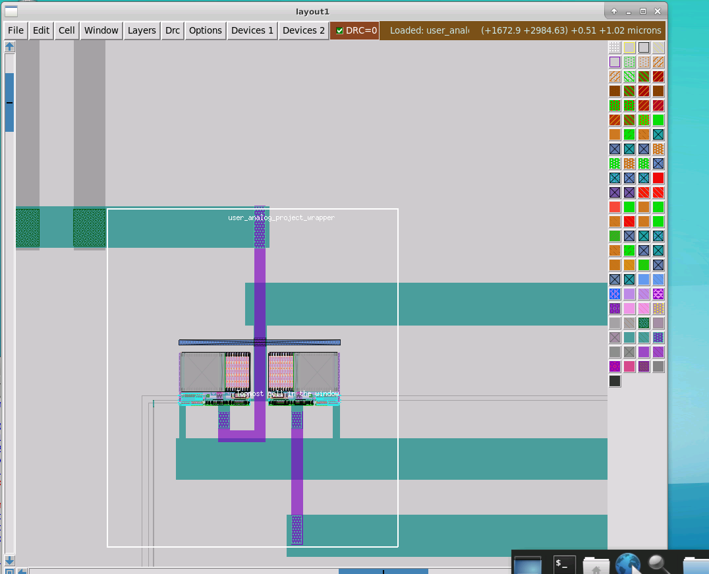

This shows the physical implementation corresponding to the transistor-level schematic inspected earlier.

At this stage we have two representations of the same intended circuit:

```text
Xschem
   ↓
Logical/electrical schematic
```

and

```text
Magic
   ↓
Physical layout
```

LVS will determine whether their extracted electrical connectivity is equivalent.

---

# 10. Extract the Layout

The next step was to extract connectivity from the Magic layout.

The extraction flow was:

```tcl
extract do local
extract all
ext2spice lvs
ext2spice
```

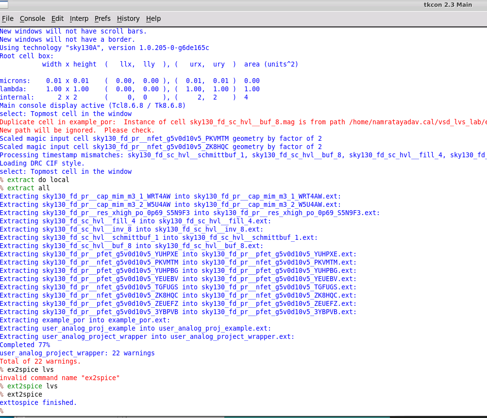

The extraction generated `.ext` files for the hierarchy and finally:

```text
user_analog_project_wrapper.spice
```

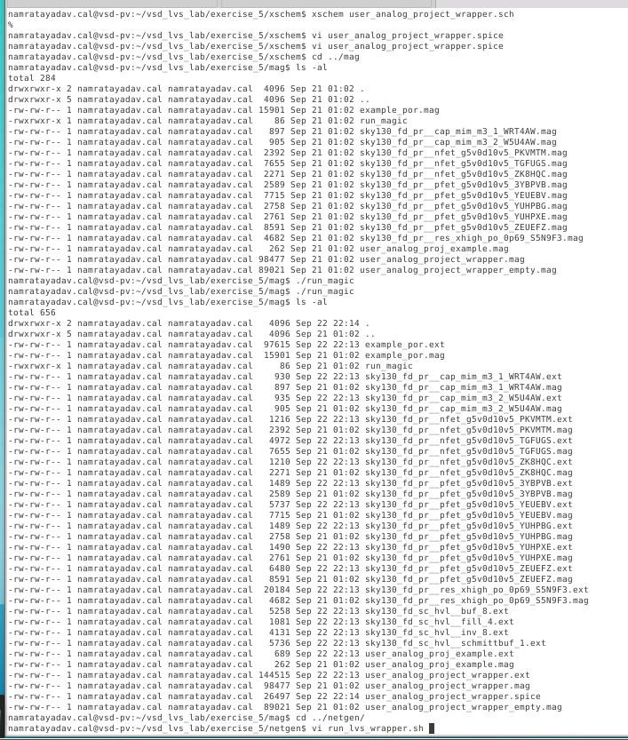

So I now had:

```text
Schematic netlist
    user_analog_project_wrapper.spice
              ↑
            Xschem
```

and

```text
Layout netlist
    user_analog_project_wrapper.spice
              ↑
             Magic
```

They are stored in separate directories.

---

# 11. Initial Wrapper LVS

Next I moved to:

```bash
cd ../netgen
```

The LVS script compares the layout-extracted wrapper against the schematic wrapper.

The important Netgen command has the form:

```bash
netgen -batch lvs \
"../mag/user_analog_project_wrapper.spice user_analog_project_wrapper" \
"../xschem/user_analog_project_wrapper.spice user_analog_project_wrapper" \
/usr/share/pdk/sky130A/libs.tech/netgen/sky130A_setup.tcl \
wrapper_comp.out \
-json | tee lvs.log
```

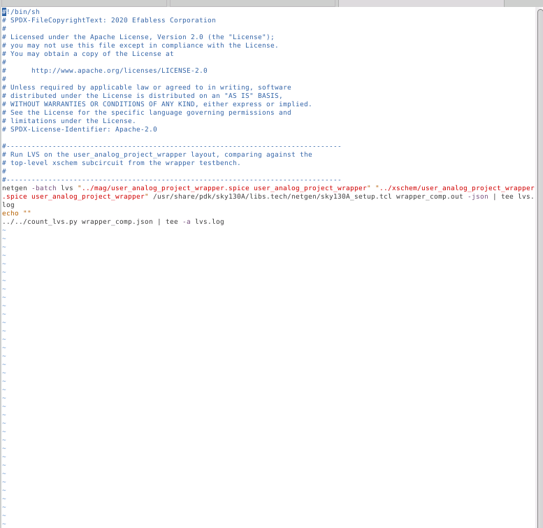

This means:

```text
Circuit 1
→ Magic extracted layout

Circuit 2
→ Xschem schematic

Cell being compared
→ user_analog_project_wrapper
```

---

# 12. Initial LVS Mismatch

The first LVS comparison did **not** match.

Inspecting:

```bash
vi wrapper_comp.out
```

showed net mismatches.

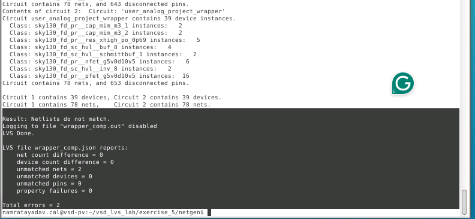

The circuit summary showed that the device counts were close, but connectivity associated with the standard cells did not line up correctly.

---

# 13. Why the Initial Comparison Failed

The schematic-generated wrapper netlist did not contain the full SPICE definitions of the SKY130 standard cells.

Therefore Netgen effectively had incomplete information for cells such as:

```text
sky130_fd_sc_hvl__buf_8
sky130_fd_sc_hvl__inv_8
sky130_fd_sc_hvl__schmittbuf_1
```

On one side, Netgen saw incomplete/black-box-like standard-cell information.

On the extracted layout side, it had detailed subcircuit information.

This resulted in incompatible pin interpretation and eventually produced top-level connectivity mismatches.

Conceptually:

```text
Schematic side
Standard cell
Pins not fully defined
        ↓
Netgen must infer pins
```

while:

```text
Layout side
Standard cell
Full extracted definition
        ↓
Named/known connectivity
```

These two representations are not sufficient for a reliable comparison.

---

# 14. Use the Wrapper Testbench

The solution is to use the existing Xschem testbench:

```text
analog_wrapper_tb.sch
```

I opened it using:

```bash
xschem analog_wrapper_tb.sch
```

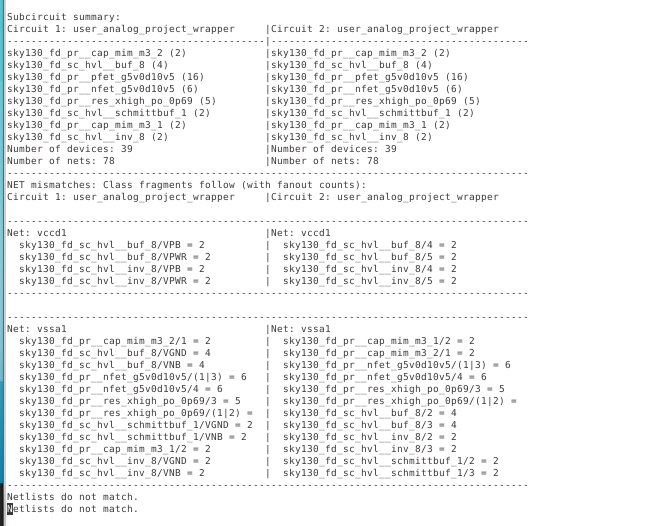

The testbench contains the wrapper instance together with simulation/netlist configuration.

More importantly, it includes the required PDK SPICE libraries.

This gives the generated SPICE netlist access to the standard-cell definitions that were missing from the standalone wrapper netlist.

---

# 15. Generate the Testbench Netlist

For the testbench, I generated the SPICE netlist normally.

I did **not** need:

```text
LVS netlist: Top level is a .subckt
```

because the cell I want Netgen to compare is not the SPICE file's outermost testbench level.

Instead, Netgen can select:

```text
user_analog_project_wrapper
```

from inside the generated hierarchical netlist.

This demonstrates an important Netgen capability:

> The circuit being compared does not have to be the top-level circuit in the SPICE file.

---

# 16. Update the LVS Script

I modified the schematic-side input of the LVS script to use the testbench-generated netlist.

The comparison therefore became conceptually:

```text
Magic:
user_analog_project_wrapper.spice
        ↓
user_analog_project_wrapper
```

versus:

```text
Xschem:
analog_wrapper_tb.spice
        ↓
user_analog_project_wrapper
```

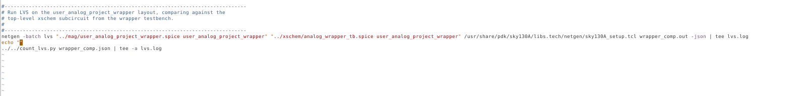

The cell selected for comparison remains:

```text
user_analog_project_wrapper
```

even though it is embedded inside the testbench netlist.

---

# 17. Wrapper Comparison Improves

After including the library definitions, the comparison became much closer.

The major standard-cell topology problem disappeared.

However, the wrapper still did not completely pass.

The LVS summary showed that topology was largely resolved, but pin matching remained problematic.

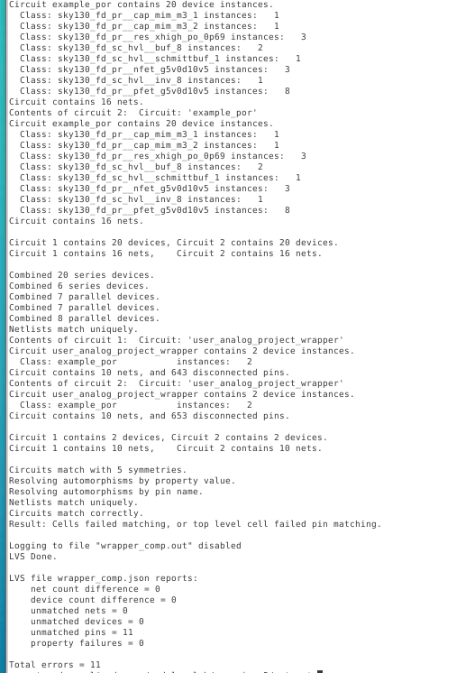

The output showed behavior such as:

```text
Netlists match uniquely.
```

followed by:

```text
Result: Cells failed matching,
or top level cell failed pin matching.
```

This distinction is important.

It means:

```text
Internal circuit topology
        ↓
matches
```

but:

```text
External pin correspondence
        ↓
still has problems
```

The wrapper pin mismatch will be investigated further in the continuation of this exercise.

---

# 18. Compare Only the POR Subcircuit

Before debugging the wrapper pins, I also compared the internal POR circuit directly.

Netgen allows selecting any hierarchical cell contained in the supplied netlists.

Instead of:

```text
user_analog_project_wrapper
```

the LVS script selects:

```text
example_por
```

Conceptually:

```bash
netgen -batch lvs \
"../mag/user_analog_project_wrapper.spice example_por" \
"../xschem/analog_wrapper_tb.spice example_por" \
...
```

This tells Netgen:

```text
Ignore the wrapper as the comparison target.

Find example_por in both netlists
and compare those circuits directly.
```

---

# 19. POR Circuit Passes LVS

The POR comparison produces a clean topology match.

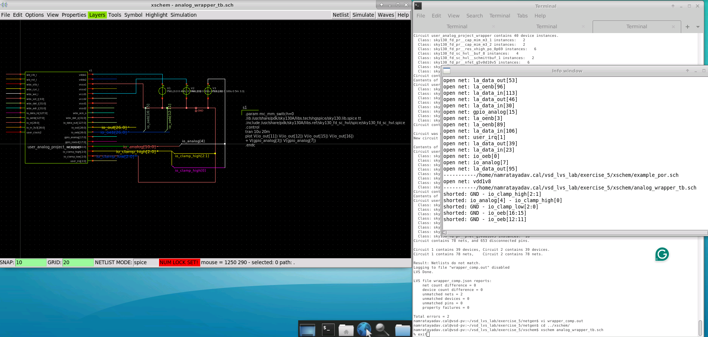

The output shows equivalent device and net counts followed by a successful circuit match.

This proves that the actual analog POR block is electrically consistent between:

```text
Xschem schematic
```

and:

```text
Magic extracted layout
```

even though the surrounding wrapper still has pin-related issues.

---

# 20. Hierarchical LVS

This exercise demonstrates why hierarchical LVS is useful.

Suppose the complete design is:

```text
user_analog_project_wrapper
│
├── example_por
│
└── example_por
```

If wrapper LVS fails, that does not automatically mean the POR circuit itself is incorrect.

We can independently compare:

```text
example_por schematic
        ↕ LVS
example_por layout
```

and verify that block separately.

This greatly reduces the debugging area.

Instead of asking:

```text
Why does this entire design fail?
```

we can determine:

```text
POR topology       → PASS
Wrapper topology   → largely matches
Wrapper pins       → still require debugging
```

---

# 21. Parameterized Cells in the Layout

The POR LVS output also contains messages about unmatched subcells being flattened.

Many of these have names similar to:

```text
sky130_fd_pr__pfet_g5v0d10v5_XXXXXX
```

or:

```text
sky130_fd_pr__nfet_g5v0d10v5_XXXXXX
```

These generated names come from parameterized physical devices.

The layout representation may introduce an extra hierarchy level for a parameterized device, while the schematic representation may directly instantiate the electrical device.

Therefore Netgen may flatten this additional layout hierarchy during matching.

Conceptually:

```text
Layout

Parameterized cell
      ↓
Device
```

versus:

```text
Schematic

Device
```

Netgen can remove the unnecessary hierarchy during LVS so the underlying electrical devices can be compared.

---

# 22. Important LVS Debugging Lesson

A failing top-level LVS does **not** automatically mean that every circuit inside the design is wrong.

For this exercise:

```text
Initial Wrapper LVS
        ↓
Standard-cell definition problem
        ↓
Include PDK library definitions
        ↓
Topology comparison improves
        ↓
Remaining wrapper pin mismatch
```

At the same time:

```text
example_por
     ↓
Direct hierarchical LVS
     ↓
Clean match
```

This is a much more realistic LVS debugging workflow than simply comparing two small flat netlists.

---

# Commands Used

### Open the wrapper schematic

```bash
cd exercise_5/xschem
xschem user_analog_project_wrapper.sch
```

### Generate schematic netlist

In Xschem:

```text
Simulation
→ LVS netlist: Top level is a .subckt
```

then:

```text
Netlist
```

### Inspect the generated netlist

```bash
vi user_analog_project_wrapper.spice
```

### Open layout

```bash
cd ../mag
./run_magic
```

Open:

```text
user_analog_project_wrapper.mag
```

### Extract layout

In Magic:

```tcl
extract do local
extract all
ext2spice lvs
ext2spice
```

### Check generated files

```bash
ls -al
```

### Run wrapper LVS

```bash
cd ../netgen
./run_lvs_wrapper.sh
```

### Inspect LVS report

```bash
vi wrapper_comp.out
```

### Open the testbench

```bash
cd ../xschem
xschem analog_wrapper_tb.sch
```

Generate the netlist using:

```text
Netlist
```

### Run LVS again

```bash
cd ../netgen
./run_lvs_wrapper.sh
```

### Run POR-only LVS

```bash
./run_lvs_por.sh
```

---

# Key Takeaways

- Real LVS flows usually keep schematic, layout, and verification files in separate directories.
- Xschem generates the schematic-side SPICE netlist.
- Magic extraction generates the layout-side SPICE netlist.
- For LVS, the top-level schematic can be generated as a `.subckt`.
- SKY130 foundry devices may be represented as SPICE subcircuits rather than simple primitive devices.
- `sky130A_setup.tcl` tells Netgen how SKY130 devices should be interpreted.
- Missing standard-cell definitions can cause misleading LVS connectivity mismatches.
- Using the testbench netlist provides the required PDK library definitions.
- Netgen can compare a subcircuit located anywhere inside a hierarchical SPICE netlist.
- A top-level LVS failure does not imply that every internal block is incorrect.
- Hierarchical comparison can isolate a correctly matching block such as `example_por`.
- Parameterized layout devices can introduce extra hierarchy that Netgen may flatten during comparison.
- A circuit can match topologically while still failing top-level pin matching.

---

# Final Result

At the end of Part 1:

```text
Schematic netlist generation       ✓
Layout extraction                  ✓
Sky130 device interpretation       ✓
Standard-cell library inclusion    ✓
POR block topology LVS             ✓
Wrapper topology comparison        ✓
Wrapper top-level pin matching     → requires further debugging
```

The major lesson from this exercise is that **LVS debugging is hierarchical**.

A mismatch should not immediately be treated as a transistor-level design failure. The first task is to determine whether the problem comes from:

```text
device definitions,
hierarchy,
missing libraries,
net connectivity,
or pin correspondence.
```

By comparing `example_por` independently, I verified that the actual analog power-on-reset circuit matches between schematic and layout, allowing the remaining debugging effort to focus on the wrapper interface.
