# L6 — LVS for Small Analog Block: Power-On Reset — Part 2

## Overview

In this lab, I continued debugging the real SKY130 `user_analog_project_wrapper` design from the previous exercise.

The internal `example_por` block already matched successfully, so the remaining work was focused on the **top-level wrapper pin mismatches**.

The main topics covered were:

- parameterized cells in Magic,
- automatic flattening by Netgen,
- automatic merging of parallel devices,
- reading top-level pin mismatch reports,
- tracing layout nets using `getnode`,
- identifying accidentally shorted layout ports,
- separating ports using a Metal3 resistor,
- matching the same resistor in Xschem,
- re-extracting the layout,
- regenerating the schematic netlist,
- and re-running LVS.

---

# 1. Inspecting the POR Layout Hierarchy

I opened the `example_por` layout in Magic.

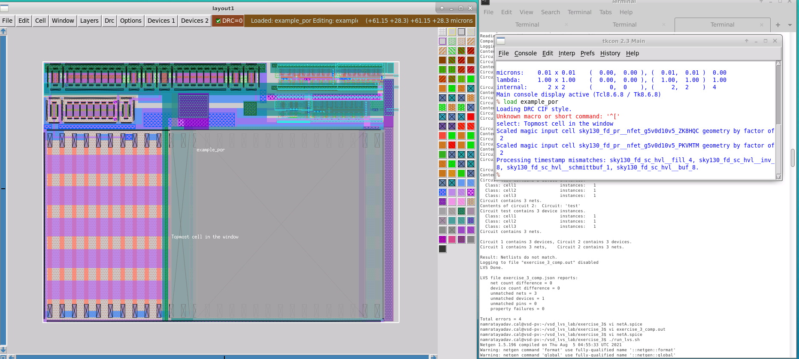

The layout hierarchy contains:

```text
example_por
   ↓
Parameterized cell
   ↓
Low-level extracted devices
```

MOSFETs, capacitors, and the large resistor are represented using parameterized layout cells.

This hierarchy is different from the schematic representation.

In Xschem, the hierarchy is approximately:

```text
example_por
   ↓
Electrical devices
```

So the schematic does not contain the same intermediate parameterized-cell hierarchy that exists in Magic.

---

# 2. Parameterized Cells in the Extracted Netlist

Magic extracts the physical geometry of each parameterized device.

Looking at the extracted SPICE netlist shows individual transistor instances inside the parameterized cells.

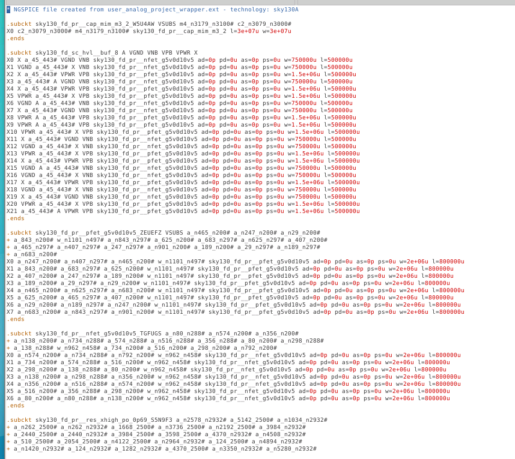

For example, a MOSFET that was created as a multi-finger parameterized cell may appear as several individual extracted transistors.

Conceptually:

```text
Magic PCell
M = 7
```

may extract as:

```text
M1
M2
M3
M4
M5
M6
M7
```

because physically those devices are individual transistor fingers.

---

# 3. Netgen Automatically Flattens PCells

The schematic does not contain matching parameterized-cell names.

Netgen detects that those layout-only cells do not have corresponding cells on the schematic side.

Instead of treating this as a failure, Netgen flattens the unmatched parameterized cells.

Conceptually:

```text
Layout

example_por
    ↓
PCell
    ↓
M1 M2 M3 M4 ...
```

becomes:

```text
example_por
    ↓
M1 M2 M3 M4 ...
```

This allows Netgen to compare the actual devices instead of the layout hierarchy.

This means I do **not** need to manually flatten the Magic layout.

That is important because manually flattening a PCell would remove the ability to later modify its parameters.

---

# 4. Netgen Merges Parallel Devices

After flattening the PCells, Netgen checks whether extracted devices are electrically parallel.

If multiple devices have the same terminals and compatible properties, Netgen can combine them.

Conceptually:

```text
M1 ─┐
M2 ─┤
M3 ─┤ same nodes
M4 ─┘
```

can become equivalent to:

```text
Mtotal
```

with an appropriate multiplicity.

The LVS output showed several messages like:

```text
Combined series devices
Combined parallel devices
```

This is why the final device count of the layout can become equal to the schematic device count even though Magic originally extracted many more individual devices.

---

# 5. Investigating the Wrapper Pin Errors

The internal POR block was LVS clean.

The remaining problem existed in:

```text
user_analog_project_wrapper
```

Looking at the bottom of `wrapper_comp.out` showed a long pin comparison.

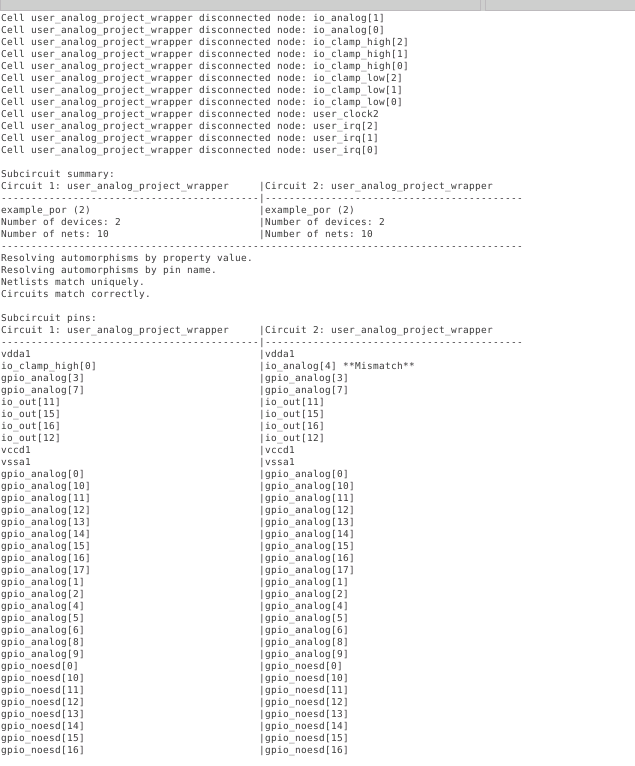

One important mismatch was between:

```text
Layout:
io_clamp_high[0]
```

and:

```text
Schematic:
io_analog[4]
```

Later in the report, additional pins were shown as missing.

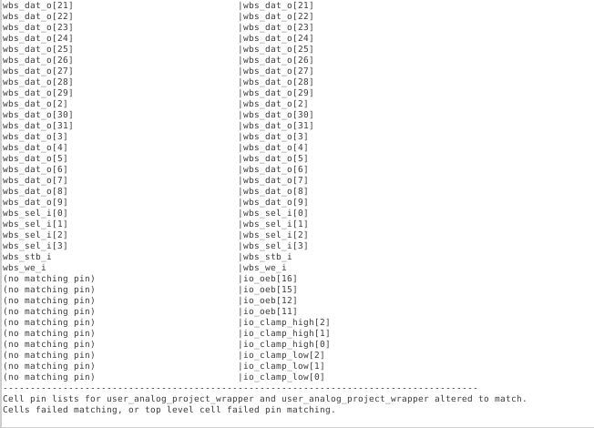

These included several:

```text
io_oeb[]
io_clamp_high[]
io_clamp_low[]
```

ports.

---

# 6. Trace `io_analog[4]` in the Schematic

I opened the wrapper schematic in Xschem and examined the second `example_por` instance.

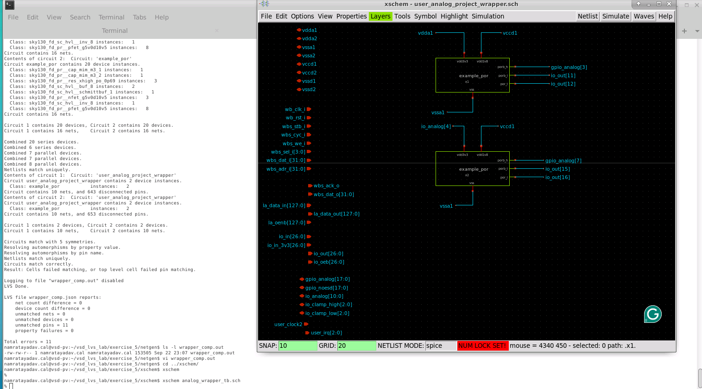

The schematic showed:

```text
io_analog[4]
       ↓
VDD3V3 input
       ↓
second example_por
```

So electrically the schematic expected `io_analog[4]` to be its own port.

---

# 7. Trace the Same Net in Magic

Next I opened:

```text
user_analog_project_wrapper
```

in Magic.

I located the 3.3 V supply routing associated with the second POR circuit.

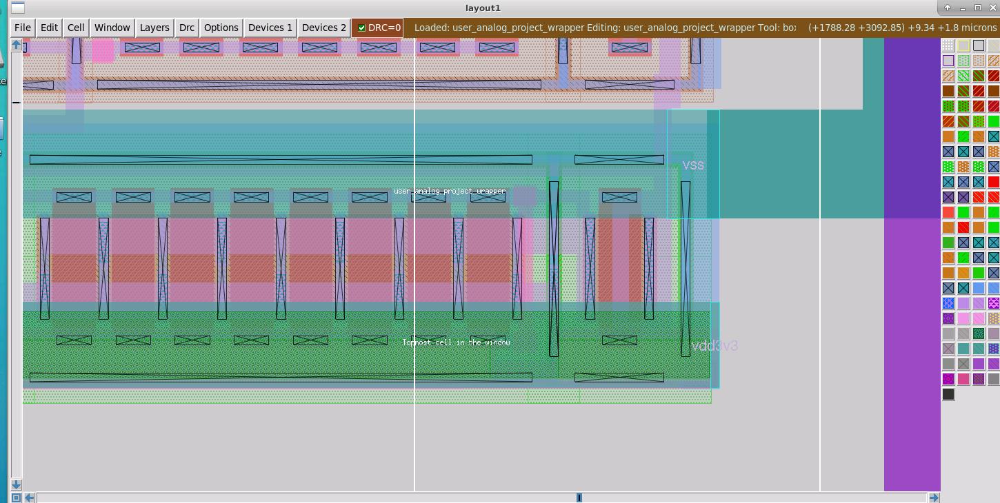

Using:

```tcl
getnode
```

on the metal confirmed:

```text
io_analog[4]
```

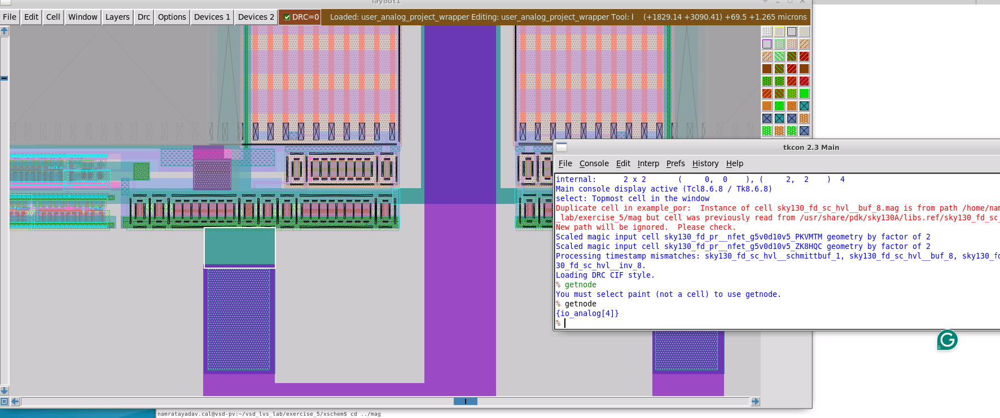

So the local net name itself was correct.

---

# 8. Select the Entire Net

To understand where the mismatch came from, I selected the complete connected network.

In Magic, repeated selection using:

```text
S
```

can be used to expand selection to the whole connected net.

Tracing the signal up toward the wrapper pins revealed the real problem.

The layout had physically connected:

```text
io_analog[4]
```

and:

```text
io_clamp_high[0]
```

together.

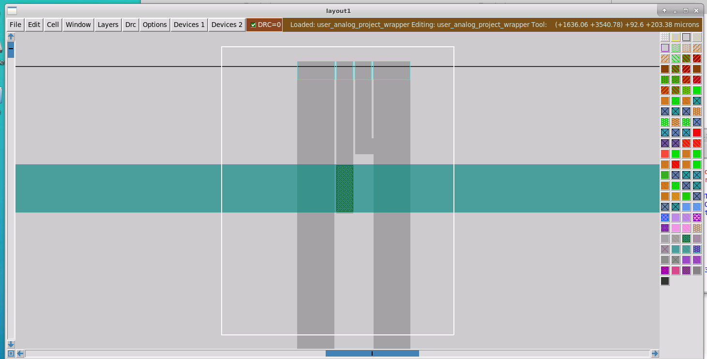

From a normal electrical connectivity perspective, Magic therefore considered these two ports part of the same net.

---

# 9. Why This Causes LVS Pin Matching Problems

Top-level pins are important to LVS.

Internally, Netgen can often resolve differently named nets based on topology.

At the top level, however, the external interface must remain meaningful.

If:

```text
io_analog[4]
```

and:

```text
io_clamp_high[0]
```

are directly merged in layout, Magic extracts only one electrical net.

The schematic still contains two separate port names.

Therefore Netgen sees a pin correspondence problem.

---

# 10. Separate the Nets with a Metal Resistor

Instead of directly shorting the two ports with normal Metal3, the connection can be represented using a Metal3 resistor.

Conceptually, change:

```text
io_analog[4] ───────── io_clamp_high[0]
```

into:

```text
io_analog[4]
      │
   Rmetal3
      │
io_clamp_high[0]
```

The resistor electrically connects the signals while keeping them as distinct named nets.

I replaced the direct Metal3 bridge with:

```text
rmetal3
```

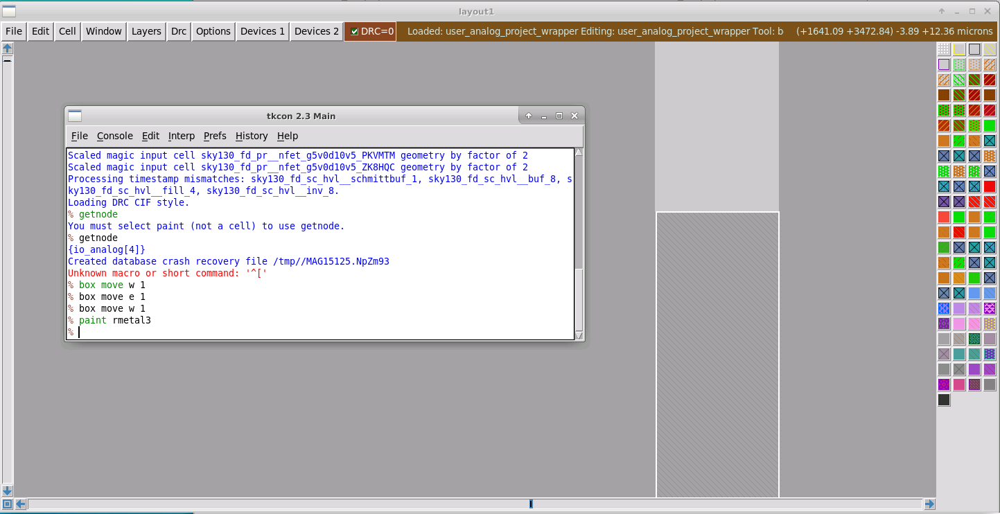

After doing this, selecting either side showed that Magic now considered them separate nets.

---

# 11. Measure the Metal3 Resistor

The resistor dimensions are important because the schematic-side resistor must have matching properties.

I measured the resistor in Magic.

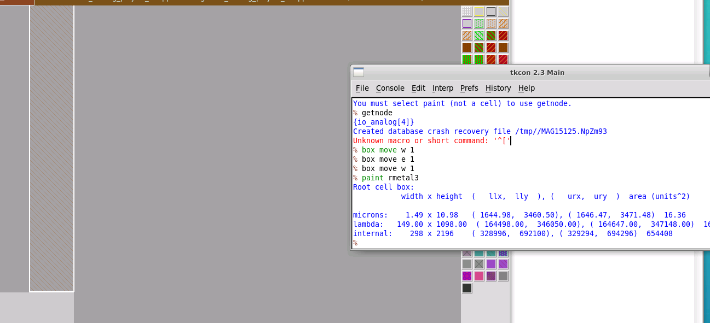

The dimensions were approximately:

```text
W = 11 µm
L = 1.5 µm
```

The current flows across the shorter direction.

Therefore:

```text
Length = 1.5 µm
Width  = 11 µm
```

---

# 12. Re-extract the Modified Layout

After modifying the layout, I regenerated the extracted netlist.

The extraction flow was again:

```tcl
extract do local
extract all
ext2spice lvs
ext2spice
```

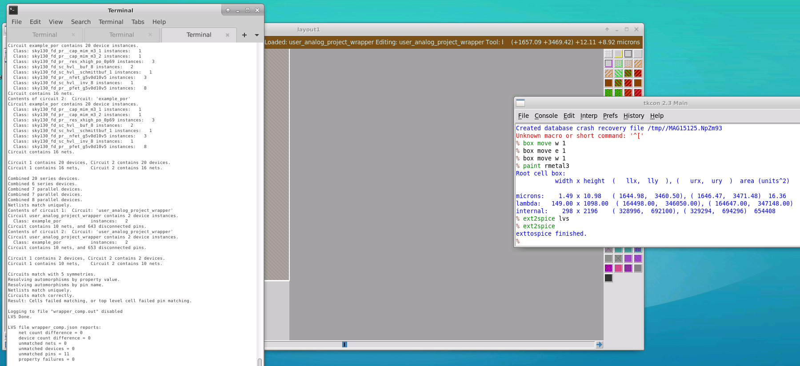

This updated:

```text
user_analog_project_wrapper.spice
```

with the new Metal3 resistor.

---

# 13. LVS Now Reports a New Device

After re-running LVS, the situation initially became worse.

The reason was expected.

The layout now contained:

```text
res_generic_m3
```

but the schematic did not.

So Netgen reported a device-count mismatch.

Conceptually:

```text
Layout:
Rmetal3 = present
```

while:

```text
Schematic:
Rmetal3 = missing
```

For LVS to match, the same device must exist on both sides.

---

# 14. Add the Matching Resistor in Xschem

I returned to Xschem.

The SKY130 symbol library does not provide a dedicated symbol named exactly:

```text
res_generic_m3
```

but it provides a generic resistor symbol.

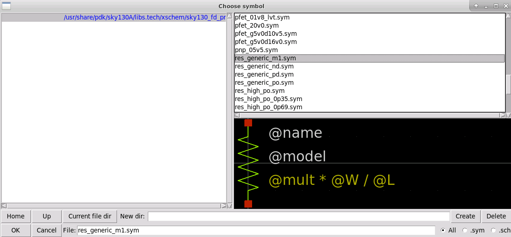

I inserted the generic resistor and placed it between:

```text
io_analog[4]
```

and:

```text
io_clamp_high[0]
```

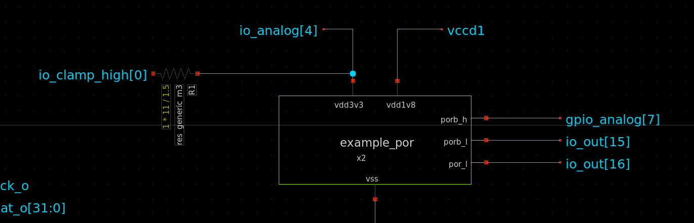

The schematic now conceptually matches:

```text
io_analog[4]
      │
  Metal3 resistor
      │
io_clamp_high[0]
```

---

# 15. Set the Resistor Properties

The resistor properties must match the layout.

I set:

```text
W = 11
L = 1.5
```

and changed the resistor type to Metal3.

So both representations now describe the same physical resistor.

```text
Layout                         Schematic

Rmetal3                        Rmetal3
W = 11 µm                      W = 11 µm
L = 1.5 µm                     L = 1.5 µm
```

---

# 16. Regenerate the Schematic Netlist

Because the wrapper is being used for LVS, I again ensured that the Xschem top-level circuit is generated appropriately.

Then I regenerated the schematic SPICE netlist.

After modifying either schematic or layout, LVS should always be run on newly generated netlists.

The correct flow is:

```text
Modify schematic
       ↓
Regenerate SPICE
```

and:

```text
Modify layout
       ↓
Re-extract SPICE
```

followed by:

```text
Netgen LVS
```

---

# 17. LVS After Adding the First Metal Resistor

I reran Netgen LVS.

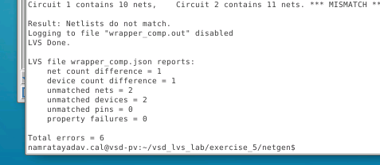

The original `io_analog[4]` / `io_clamp_high[0]` issue was improved.

The remaining problems were now concentrated around the other unmatched ports.

This is an important debugging pattern:

```text
Fix one root cause
      ↓
Re-run LVS
      ↓
Read new reduced mismatch set
      ↓
Fix next problem
```

rather than trying to correct everything at once.

---

# 18. Investigating the Remaining Ports

I returned to the wrapper schematic.

The remaining signals include ports such as:

```text
io_oeb[11]
io_oeb[12]
io_oeb[15]
io_oeb[16]

io_clamp_high[]
io_clamp_low[]
```

These are shown as floating ports in the schematic.

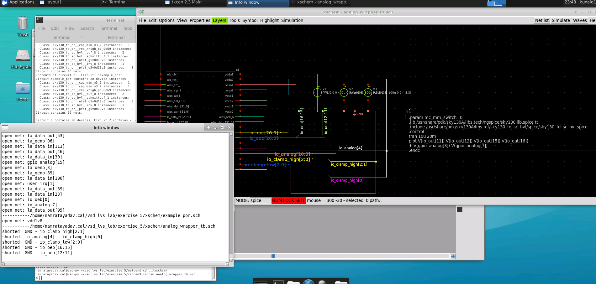

The key question was:

```text
If the pins exist in the schematic,
why are they missing from the extracted layout?
```

---

# 19. Locate a Missing Pin in Magic

One example is:

```text
io_oeb[11]
```

A pin containing square brackets must be escaped or surrounded by braces when used in Tcl commands.

For example:

```tcl
goto {io_oeb[11]}
```

rather than:

```tcl
goto io_oeb[11]
```

because `[` and `]` have special meaning in Tcl.

After locating the port in Magic, I could inspect the metal connected to it.

---

# 20. `getnode` Reveals the Problem

Running:

```tcl
getnode
```

showed that the signal was actually part of another power net.

For example:

```text
io_oeb[11]
```

was connected to:

```text
VSSD1
```

in the layout.

This means that the two port names had again been directly shorted into one physical net.

That explains why the expected independent pin disappears during layout extraction.

---

# 21. Remaining Fixes

The remaining mismatches have the same basic cause as the first one.

Several wrapper ports are directly connected to supply nets.

Examples include:

```text
io_oeb[...]       → VSSD1
io_clamp_high[]   → VSSA1
io_clamp_low[]    → VSSA1
```

Instead of directly joining these named ports to the supply metal, each connection should use a Metal3 resistor.

The corresponding resistor must also be added to the schematic.

The repair pattern is:

```text
LAYOUT

Port
 │
Rmetal3
 │
Supply
```

and:

```text
SCHEMATIC

Port
 │
Rmetal3
 │
Supply
```

---

# 22. General Top-Level Port Rule

This exercise demonstrates an important LVS concept.

Suppose the intended interface has two pins:

```text
PORT_A
PORT_B
```

even if electrically the design intentionally connects them together, directly drawing:

```text
PORT_A ───────── PORT_B
```

can cause the extractor to treat them as one net.

For a top-level design interface, that may destroy the distinction between the two port names.

Using a physical resistor preserves:

```text
PORT_A
```

and:

```text
PORT_B
```

as separate extracted nets while still creating an electrical connection between them.

---

# 23. Debugging Workflow Used

The overall debugging flow in this exercise was:

```text
Run LVS
   ↓
Open comp.out
   ↓
Find mismatched pin
   ↓
Check schematic connectivity
   ↓
Locate same signal in Magic
   ↓
Use getnode
   ↓
Trace connected layout geometry
   ↓
Identify unintended port merging
   ↓
Insert Rmetal3
   ↓
Measure W and L
   ↓
Add equivalent resistor in Xschem
   ↓
Regenerate both netlists
   ↓
Run LVS again
```

This is a realistic LVS-debugging workflow.

---

# Useful Magic Commands

### Identify selected net

```tcl
getnode
```

### Extract layout again

```tcl
extract do local
extract all
ext2spice lvs
ext2spice
```

### Navigate to a pin containing brackets

```tcl
goto {io_oeb[11]}
```

### Measure the Magic cursor box

```tcl
box
```

The displayed box dimensions can be used to determine resistor `W` and `L`.

---

# Important Lessons

- Magic parameterized cells introduce an extra hierarchy level that may not exist in Xschem.
- Netgen can automatically flatten unmatched parameterized cells.
- Extracted multi-finger devices may appear as individual devices.
- Netgen can merge electrically parallel devices automatically.
- Equal final device counts do not mean the extracted layouts originally contained the same number of raw devices.
- `comp.out` should be used
