# L7 — LVS Layout vs Verilog for a Standard-Cell Design

## Overview

In this lab, I performed LVS between a **Magic-extracted layout netlist** and a **structural Verilog netlist** for the `digital_pll` block.

Unlike the previous analog examples, this design is primarily constructed from SKY130 standard cells and was generated using a digital place-and-route flow.

The main objectives were:

- load the `digital_pll` layout in Magic,
- extract a SPICE netlist from the physical layout,
- inspect the structural Verilog netlist,
- compare SPICE layout extraction against Verilog using Netgen,
- understand why filler and tap cells create LVS mismatches,
- inspect filler cells in the physical layout,
- understand why Magic removes them during extraction,
- modify the LVS environment used by Netgen,
- and obtain a clean LVS result.

---

# 1. Load the Digital PLL Layout

The exercise contains separate source directories for:

```text
mag/
verilog/
netgen/
```

The physical layout is located in the `mag` directory.

I started Magic and loaded:

```tcl
load digital_pll
```

The complete digital PLL layout contains a large number of SKY130 standard-cell instances.

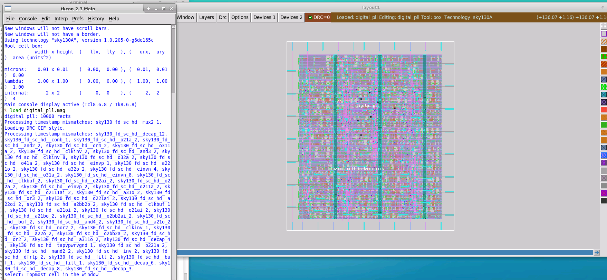

This is representative of a design created using an automated place-and-route flow such as OpenLane.

---

# 2. Extract the Layout Netlist

The next step was to extract the electrical connectivity from the physical layout.

The extraction flow used was:

```tcl
extract do local
extract all
ext2spice lvs
ext2spice
```

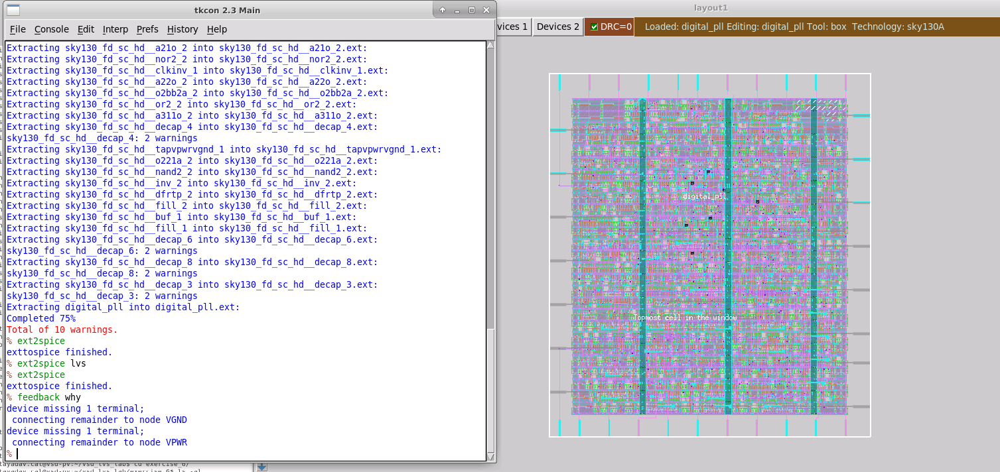

The important command:

```tcl
ext2spice lvs
```

configures the SPICE output for LVS comparison.

After extraction, Magic generated:

```text
digital_pll.spice
```

which represents the physical connectivity of the layout.

---

# 3. Extraction Warnings

During extraction, Magic reported several warnings.

For example:

```text
device missing 1 terminal;
connecting remainder to node VGND
```

and:

```text
device missing 1 terminal;
connecting remainder to node VPWR
```

These types of warnings are common for some decap structures where source and drain regions are intentionally tied together.

Since these were associated with known standard-cell structures, they were not immediately treated as the main LVS problem.

---

# 4. Inspect the Verilog Netlist

Unlike the previous analog lab, there is no Xschem schematic for this exercise.

Instead, the reference circuit is provided as:

```text
digital_pll.v
```

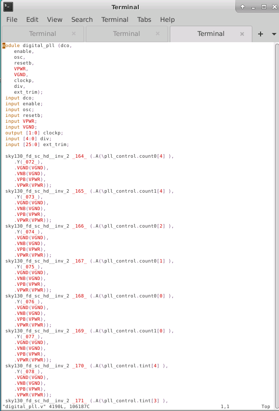

The Verilog is a **structural netlist**, not behavioral RTL.

It contains standard-cell instances such as:

```verilog
sky130_fd_sc_hd__inv_2
sky130_fd_sc_hd__buf_1
sky130_fd_sc_hd__dfxtp_2
```

with their associated connectivity.

For LVS, Netgen needs this type of gate-level or structural Verilog.

Behavioral code such as:

```verilog
always @(posedge clk)
```

would not directly represent the physical circuit connectivity needed for LVS.

---

# 5. Run the Initial LVS Comparison

After extracting the layout, I moved to:

```text
netgen/
```

and ran the LVS script.

The script compares:

```text
Layout:
../mag/digital_pll.spice
```

against:

```text
Reference:
../verilog/digital_pll.v
```

using the SKY130 Netgen setup file.

The initial comparison failed.

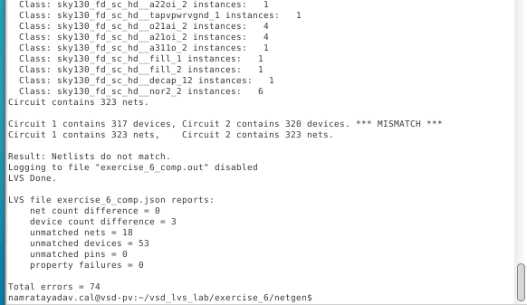

The report showed:

```text
Circuit 1 contains 317 devices
Circuit 2 contains 320 devices
```

with:

```text
*** MISMATCH ***
```

The JSON summary also reported multiple unmatched devices and nets.

---

# 6. Inspect `exercise_6_comp.out`

To understand the problem, I opened:

```bash
vi exercise_6_comp.out
```

The subcircuit summary showed that most standard cells matched correctly.

However, some cells existed only on one side.

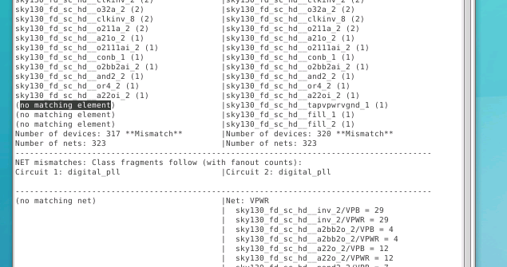

The important missing cell types included cells such as:

```text
sky130_fd_sc_hd__fill_1
sky130_fd_sc_hd__fill_2
sky130_fd_sc_hd__tapvpwrvgnd_1
```

These are not normal logic cells.

They are physical implementation cells used during place and route.

---

# 7. Find a Filler Instance in Verilog

To understand the mismatch, I searched the structural Verilog for one of the filler instances.

For example:

```text
FILLER_0_11
```

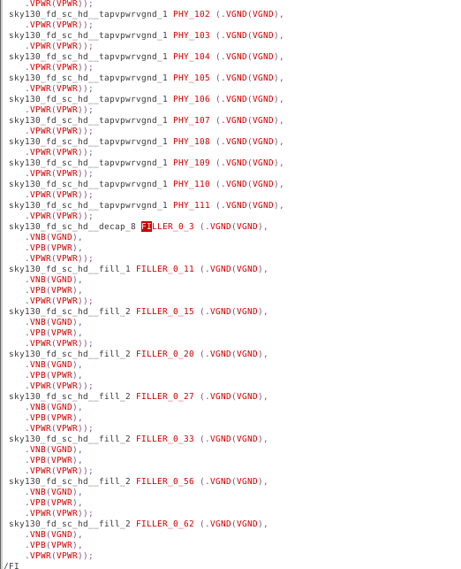

The filler cell clearly exists in the Verilog netlist.

Therefore, from the Verilog point of view:

```text
filler cell = present
```

---

# 8. Search for the Same Cell in Extracted SPICE

I then opened:

```text
digital_pll.spice
```

and searched for the same filler instance.

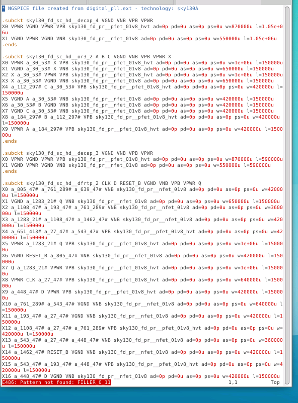

The instance was not present in the extracted layout netlist.

So the comparison looked like:

```text
Verilog:
FILLER_0_11 present

Layout SPICE:
FILLER_0_11 absent
```

This explains part of the device-count mismatch.

---

# 9. Verify the Filler Exists in Magic

The next question was:

```text
If the filler exists physically,
why does it disappear from the extracted SPICE?
```

I reopened the layout in Magic and selected the filler instance.

For example:

```tcl
select cell FILLER_0_11
```

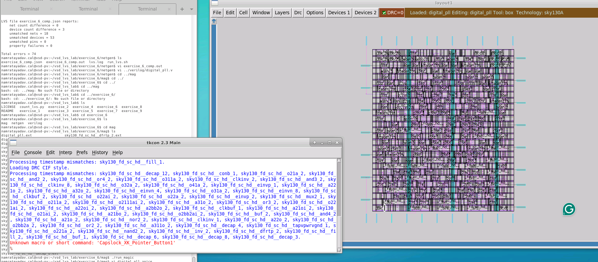

The filler cell does physically exist in the layout.

---

# 10. Push Down into the Filler Cell

I then pushed down into the selected filler cell.

The filler contains physical layers and pins, but no electrically meaningful active devices such as:

- MOSFETs,
- resistors,
- capacitors,
- logic devices.


Conceptually:

```text
Filler cell
   ├── power rail geometry
   ├── well structures
   └── physical spacing structures
```

but:

```text
No functional circuit element
```

Because Magic performs electrical extraction, a cell containing no relevant electrical devices may be completely optimized out.

Therefore:

```text
Layout contains filler geometry
              ↓
Magic extracts connectivity
              ↓
No functional device exists
              ↓
Cell disappears from extracted SPICE
```

---

# 11. Why Filler Cells Exist

Filler cells are used during physical implementation to maintain layout continuity.

They may be used for purposes such as:

```text
continuous wells
continuous power rails
density requirements
physical placement gaps
```

They are important for the physical layout, but usually do not represent functional logic.

This creates a special situation for LVS.

The structural Verilog may still contain their instances, while electrical extraction may remove them.

---

# 12. Tap Cells Have a Similar Problem

The LVS report also contained cells such as:

```text
sky130_fd_sc_hd__tapvpwrvgnd_1
```

Tap cells are used to connect wells and substrate regions to the proper supply potentials.

Like filler cells, they are primarily physical implementation structures.

Therefore they may need special handling when comparing:

```text
layout extraction
```

against:

```text
place-and-route Verilog
```

---

# 13. Inspect the SKY130 Netgen Setup

The solution used by the SKY130/OpenLane flow can be found inside the Netgen setup TCL file.

I searched the setup file for:

```text
fill
```

The file contains special rules for ignoring digital filler, tap, decap, and similar cells.

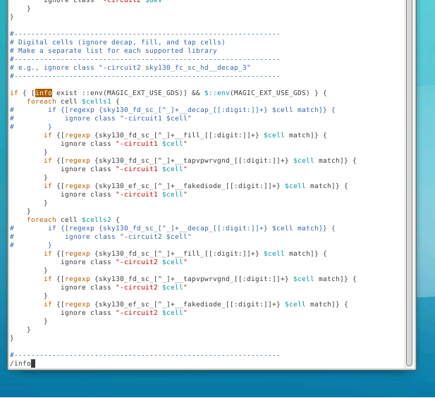

The setup file contains conditional logic similar to:

```tcl
ignore class "-circuit1 $cell"
```

for matching cell-name patterns such as:

```text
fill
tapvpwrvgnd
decap
fakeiode
```

However, these rules are only enabled under a specific environment condition.

---

# 14. `MAGIC_EXT_USE_GDS`

The ignore rules depend on the environment variable:

```text
MAGIC_EXT_USE_GDS
```

When this variable is enabled, the Netgen setup knows that the extracted layout is being compared in a flow where certain physical-only cells should be ignored.

Without this setting, Netgen attempts to directly compare the filler/tap cells present in the Verilog against the layout extraction.

That produces false mismatches.

---

# 15. Initial LVS Script

The original script ran Netgen approximately as:

```bash
netgen -batch lvs \
"../mag/digital_pll.spice digital_pll" \
"../verilog/digital_pll.v digital_pll" \
/usr/share/pdk/sky130A/libs.tech/netgen/sky130A_setup.tcl \
exercise_6_comp.out -json | tee lvs.log
```

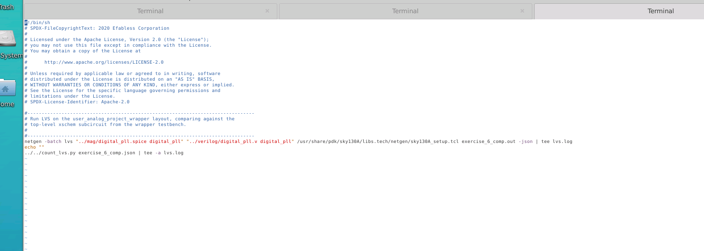

This compares:

```text
digital_pll.spice
```

against:

```text
digital_pll.v
```

using the top-level cell:

```text
digital_pll
```

---

# 16. Enable the GDS Extraction Behavior

I modified the script and added:

```bash
export MAGIC_EXT_USE_GDS=1
```

before the Netgen command.

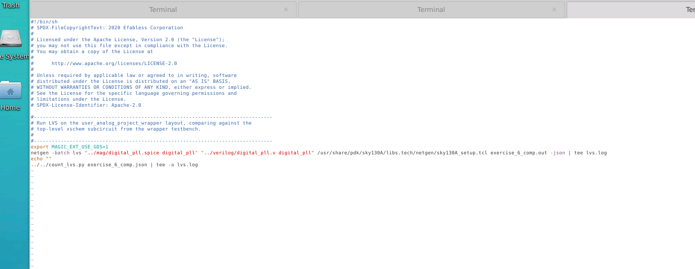

The resulting flow becomes:

```bash
export MAGIC_EXT_USE_GDS=1

netgen -batch lvs \
"../mag/digital_pll.spice digital_pll" \
"../verilog/digital_pll.v digital_pll" \
/usr/share/pdk/sky130A/libs.tech/netgen/sky130A_setup.tcl \
exercise_6_comp.out -json | tee lvs.log
```

This enables the appropriate SKY130 setup rules for ignoring physical-only standard cells.

---

# 17. Run LVS Again

After modifying the script, I reran:

```bash
./run_lvs.sh
```

This time the layout and Verilog matched successfully.

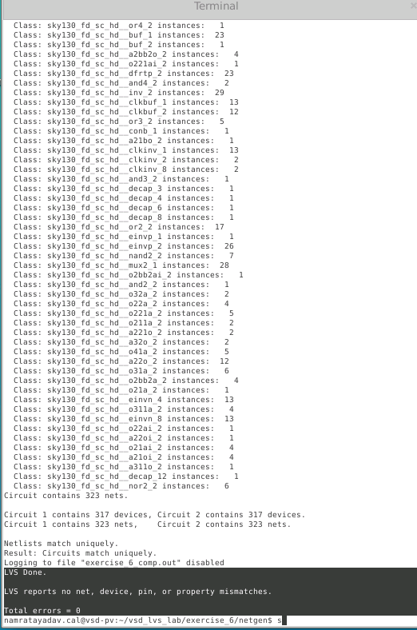

The final report showed:

```text
Circuit 1 contains 317 devices
Circuit 2 contains 317 devices

Circuit 1 contains 323 nets
Circuit 2 contains 323 nets
```

followed by:

```text
Netlists match uniquely.
Result: Circuits match uniquely.
```

The summary reported:

```text
net count difference = 0
device count difference = 0
unmatched nets = 0
unmatched devices = 0
unmatched pins = 0
property failures = 0
```

and finally:

```text
Total errors = 0
```

---

# 18. Why the Final Comparison Works

Initially:

```text
Layout SPICE
317 devices
```

while:

```text
Verilog
320 devices
```

because physical-only filler/tap cells existed in the Verilog but were removed during Magic extraction.

After enabling:

```bash
MAGIC_EXT_USE_GDS=1
```

the SKY130 Netgen setup ignored the appropriate physical-only cells.

The comparison then effectively became:

```text
Functional layout devices
        VS
Functional Verilog devices
```

rather than:

```text
Extracted devices
        VS
Functional + physical-only implementation cells
```

---

# 19. Relation to OpenLane

This exercise demonstrates part of what happens inside an automated OpenLane physical-design flow.

A simplified flow is:

```text
RTL
 ↓
Synthesis
 ↓
Gate-level Verilog
 ↓
Placement
 ↓
Standard cells
 ↓
Routing
 ↓
Physical layout
 ↓
Magic extraction
 ↓
SPICE netlist
 ↓
Netgen LVS
 ↓
Compare against structural Verilog
```

OpenLane performs these verification steps automatically.

In this exercise, I reproduced the important LVS portion manually.

---

# 20. Structural Verilog vs Behavioral Verilog

For LVS, the Verilog must represent actual circuit instances.

Suitable:

```verilog
sky130_fd_sc_hd__inv_2 U1 (
    .A(a),
    .Y(y)
);
```

This represents an actual standard cell.

Not suitable as a direct LVS reference:

```verilog
always @(posedge clk)
    q <= d;
```

The second form describes behavior rather than an explicit physical circuit topology.

Therefore the LVS comparison requires a synthesized or structural netlist.

---

# 21. Important Difference Between Analog and Digital LVS

In the previous analog exercise:

```text
Magic layout
     ↓
SPICE extraction
     ↔
Xschem SPICE
```

In this exercise:

```text
Magic layout
     ↓
SPICE extraction
     ↔
Structural Verilog
```

Netgen is capable of comparing different netlist formats because the underlying comparison is based on circuit topology.

---

# 22. Debugging Flow Used

The debugging flow for this exercise was:

```text
Load layout in Magic
        ↓
Extract SPICE
        ↓
Inspect structural Verilog
        ↓
Run Netgen LVS
        ↓
Observe device mismatch
        ↓
Open comp.out
        ↓
Identify fill/tap cells
        ↓
Search instance in Verilog
        ↓
Search same instance in SPICE
        ↓
Verify filler physically exists in Magic
        ↓
Inspect filler contents
        ↓
Determine Magic optimized it away
        ↓
Inspect SKY130 Netgen setup
        ↓
Enable MAGIC_EXT_USE_GDS
        ↓
Run LVS again
        ↓
LVS CLEAN
```

---

# Useful Commands

## Start Magic

```bash
cd mag
./run_magic
```

## Load layout

```tcl
load digital_pll
```

## Extract layout

```tcl
extract do local
extract all
ext2spice lvs
ext2spice
```

## Select a cell instance

```tcl
select cell FILLER_0_11
```

## Run LVS

```bash
cd ../netgen
./run_lvs.sh
```

## Inspect comparison output

```bash
vi exercise_6_comp.out
```

## Search in Vi

```text
/fill
```

## Environment variable used for the final LVS flow

```bash
export MAGIC_EXT_USE_GDS=1
```

---

# Key Takeaways

- LVS can compare a SPICE layout netlist against structural Verilog.
- Digital LVS normally compares the extracted physical layout against a synthesized gate-level netlist.
- Magic electrically extracts standard-cell layout geometry into SPICE.
- Structural Verilog must contain explicit standard-cell instances.
- Filler and tap cells can exist physically without producing meaningful extracted electrical devices.
- Magic may optimize such physical-only cells out of the extracted SPICE netlist.
- Their presence in structural Verilog can therefore produce false LVS device mismatches.
- SKY130's Netgen setup contains special rules for handling these cells.
- The environment variable `MAGIC_EXT_USE_GDS=1` activates the relevant ignore behavior in this flow.
- `comp.out` is the key file for understanding which devices or nets caused LVS failure.
- A zero device-count difference alone is not enough; nets, pins, properties, and unmatched devices should also be checked.
- The final result for this exercise was:

```text
Netlists match uniquely.
Total errors = 0
```

---

## Final Result

Successfully performed:

```text
SKY130 Digital PLL Layout
          ↓
Magic SPICE Extraction
          ↓
Netgen LVS
          ↕
Structural Verilog Netlist
```

and resolved the initial filler/tap-cell mismatch to achieve a clean LVS comparison.

```text
LVS STATUS: PASS
Total errors: 0
```
