# L8 — LVS for Digital Macros

## Overview

In this lab, I performed LVS on the `mgmt_protect` digital block.

Unlike the previous digital PLL example, this design contains **macro blocks inside the top-level digital layout**.

The main objectives were:

- extract the `mgmt_protect` layout using Magic,
- compare the extracted SPICE netlist against Verilog,
- understand the difference between structural and behavioral Verilog,
- identify why the original Verilog could not be used directly for LVS,
- switch to the synthesized gate-level Verilog,
- debug ground-domain mismatches,
- understand substrate connectivity during extraction,
- and modify the reference Verilog so that its ground connectivity matches the extracted layout.

---

# 1. Load the `mgmt_protect` Layout

The exercise contains separate directories for:

```text
mag/
verilog/
netgen/
```

I started from the `mag` directory and launched Magic.

```bash
cd mag
./run_magic
```

Then loaded:

```tcl
load mgmt_protect
```

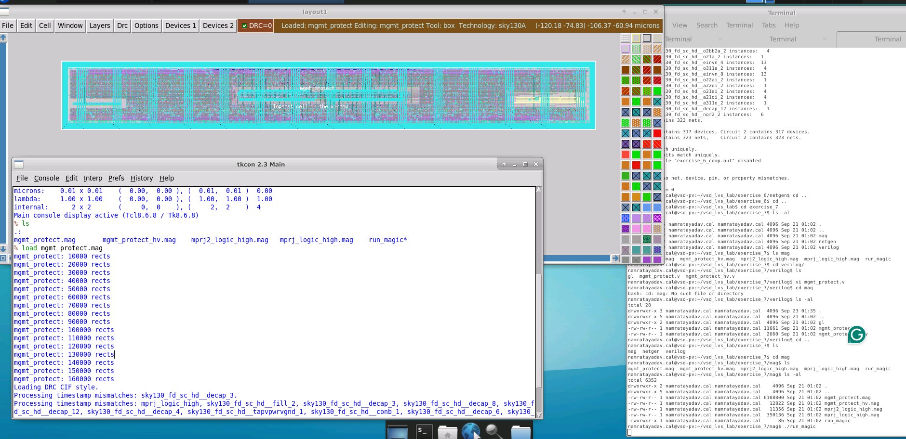

The layout is a digital block containing synthesized logic along with internal macro blocks.

Unlike a completely flat standard-cell layout, this design contains additional hierarchy.

---

# 2. Extract the Layout

The physical layout must first be converted into an electrical SPICE netlist.

I used:

```tcl
extract do local
extract all
ext2spice lvs
ext2spice
```

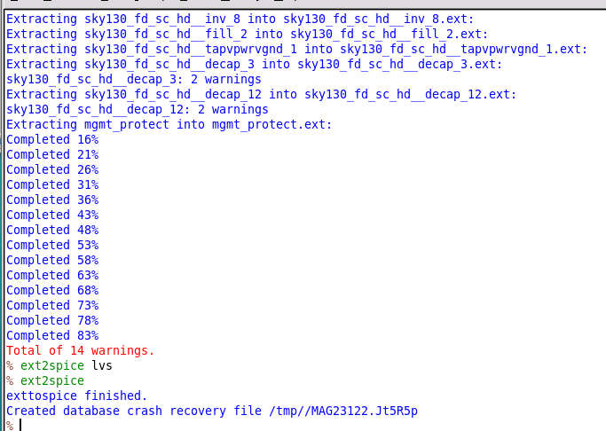

Magic generated the extracted netlist:

```text
mgmt_protect.spice
```

The extraction completed with some warnings associated with standard cells such as decap structures.

---

# 3. Initial LVS Script

The initial LVS script compared:

```text
../mag/mgmt_protect.spice
```

against:

```text
../verilog/mgmt_protect.v
```

with top-level cell:

```text
mgmt_protect
```

The script also used:

```bash
export MAGIC_EXT_USE_GDS=1
```

to enable the SKY130 handling of physical-only digital cells.

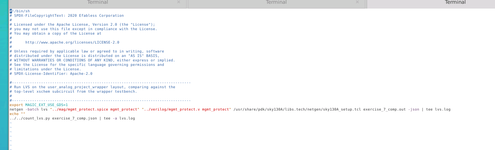

The important part was:

```bash
netgen -batch lvs \
"../mag/mgmt_protect.spice mgmt_protect" \
"../verilog/mgmt_protect.v mgmt_protect" \
/usr/share/pdk/sky130A/libs.tech/netgen/sky130A_setup.tcl \
exercise_7_comp.out -json | tee lvs.log
```

---

# 4. Initial LVS Failure

Running:

```bash
./run_lvs.sh
```

did not produce a normal comparison.

Netgen reported:

```text
Module 'mgmt_protect' is not structural verilog, making black-box.
```

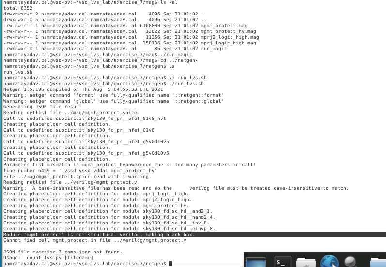

This meant that although the Verilog looked mostly like a gate-level netlist, Netgen detected some behavioral logic inside it.

Because the **top-level circuit** was converted into a black box, there was effectively nothing useful for Netgen to compare internally.

---

# 5. Structural vs Behavioral Verilog

For LVS, Netgen needs structural Verilog.

Structural Verilog explicitly instantiates cells:

```verilog
sky130_fd_sc_hd__inv_2 U1 (
    .A(a),
    .Y(y)
);
```

This directly describes circuit topology.

Behavioral Verilog contains expressions or operators that still require synthesis.

For example:

```verilog
~caravel_clk
```

contains a Boolean NOT operation.

---

# 6. Find the Behavioral Statement

Inside:

```text
mgmt_protect.v
```

I found an instance containing:

```verilog
.A(~caravel_clk)
```

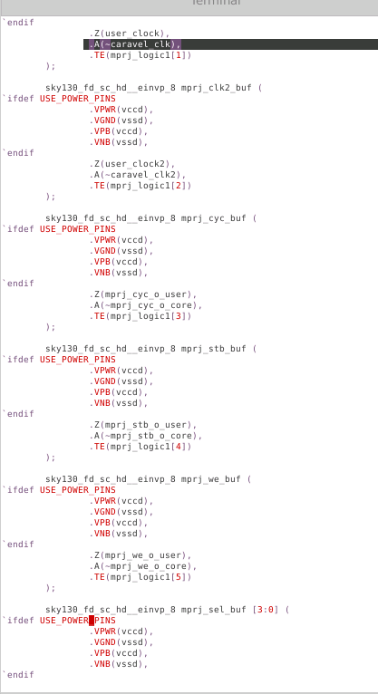

The `~` operator means:

```text
Boolean inversion
```

Conceptually:

```text
caravel_clk
     |
     v
   inverter
     |
     v
inverted clock
```

But there is no explicit inverter instance in this Verilog statement.

Therefore the file still requires synthesis.

So even though most of the file contains instantiated standard cells, it is not a completely structural netlist.

---

# 7. Why This Matters for LVS

Magic extracts actual devices and physical connectivity:

```text
Layout
   ↓
physical devices
   ↓
SPICE netlist
```

Netgen therefore needs another explicit topology to compare against.

A statement such as:

```verilog
~caravel_clk
```

does not tell Netgen which exact standard cell physically implements the inversion.

That is the synthesis tool's job.

Therefore:

```text
RTL / partially behavioral Verilog
               X
               |
               | cannot directly compare
               |
Extracted physical SPICE
```

Instead, we need:

```text
Synthesized gate-level Verilog
               ↕
Extracted physical SPICE
```

---

# 8. Use the Gate-Level Verilog

The exercise contains a `gl` directory:

```text
verilog/gl/
```

This contains the actual synthesized gate-level netlist generated after synthesis.

I modified the LVS script from:

```text
../verilog/mgmt_protect.v
```

to:

```text
../verilog/gl/mgmt_protect.v
```

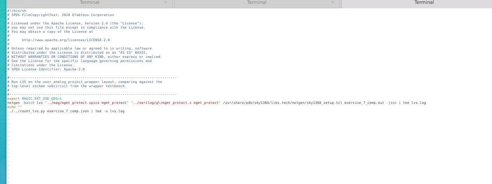

The comparison became:

```bash
netgen -batch lvs \
"../mag/mgmt_protect.spice mgmt_protect" \
"../verilog/gl/mgmt_protect.v mgmt_protect" \
/usr/share/pdk/sky130A/libs.tech/netgen/sky130A_setup.tcl \
exercise_7_comp.out -json | tee lvs.log
```

Now Netgen could actually inspect the complete digital topology.

---

# 9. LVS Runs but Ground Mismatches Remain

After switching to gate-level Verilog, Netgen was able to perform the comparison.

However, LVS still failed.

The remaining problems were mostly associated with ground nets.

The design uses several ground names, including:

```text
vssd
vssd1
vssd2
vssa1
vssa2
```

The Verilog treats these as separate electrical nets.

But the extracted layout did not.

---

# 10. Inspect the Ground Rings in Magic

The layout contains separate-looking ground/power rings.

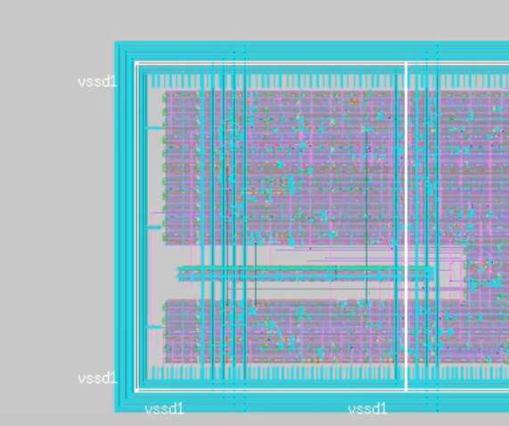

From the drawn metal geometry, these nets may appear separated.

For example, using Magic's interactive net selection can make:

```text
vssd1
```

appear to be an independent net.

However, extraction determines more than just direct metal connectivity.

---

# 11. Substrate Connectivity

The important issue is the silicon substrate.

The substrate effectively behaves like a large conductive region underneath the circuit.

Although different ground nets may be connected to physically separate metal rings, they may all contact the same substrate.

Conceptually:

```text
VSSD
  |
 substrate
  |
VSSD1

VSSD2
  |
 substrate
  |
VSSA1

VSSA2
  |
 same substrate
```

Therefore Magic's extracted circuit can merge ground domains that visually appear separate in the drawn metal.

---

# 12. Why Magic Gives Two Different Impressions

Magic's interactive net selection mainly follows visible connected layout geometry.

So visually:

```text
VSSD1 metal ring ≠ VSSD2 metal ring
```

But extraction performs a deeper electrical analysis including substrate connectivity.

So electrically:

```text
VSSD
VSSD1
VSSD2
VSSA1
VSSA2
     ↓
common substrate connectivity
```

This is why the interactive layout view and the extracted SPICE connectivity may appear different.

---

# 13. The `isosub` Limitation

Magic has a concept called:

```text
isosub
```

which represents isolated substrate regions.

In principle, isolated substrate regions could prevent these substrate connections from collapsing into one net.

However, in the flow used for this lab, Magic does not extract multiple isolated substrates in the required way.

Therefore another LVS workaround is needed.

---

# 14. Match the Verilog to the Extracted Ground Connectivity

Since Magic merges the ground domains during extraction, the reference Verilog must represent the same connectivity.

Simple Verilog assignments can connect nets without introducing additional Boolean logic.

For example:

```verilog
assign vssa1 = vssd;
```

This is different from:

```verilog
assign a = ~b;
```

The first statement simply connects two nets.

The second requires logic.

---

# 15. Modify `mgmt_protect_hv`

The first macro requiring correction was:

```text
mgmt_protect_hv
```

At the bottom of its gate-level Verilog module, but before:

```verilog
endmodule
```

I added:

```verilog
assign vssa1 = vssd;
assign vssa2 = vssd;
```

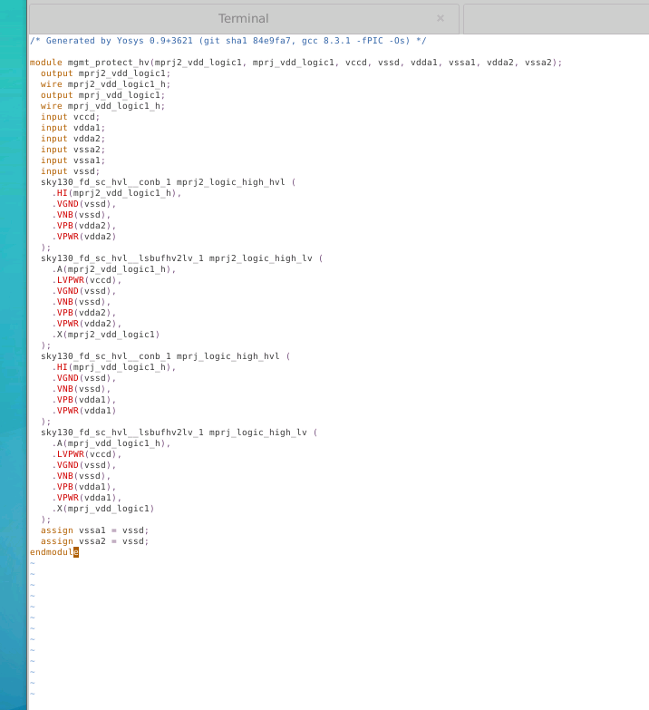

This makes the reference netlist agree with the substrate connectivity observed during layout extraction.

---

# 16. Modify the Top-Level `mgmt_protect`

The top-level module also contains several power domains.

The ground domains need to be merged at this level as well.

The required assignments are:

```verilog
assign vssa1 = vssd;
assign vssa2 = vssd;
assign vssd1 = vssd;
assign vssd2 = vssd;
```

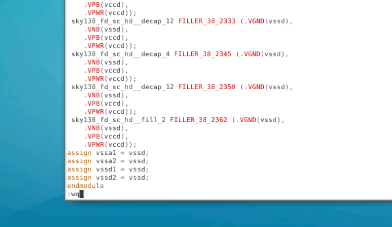

These statements are placed before:

```verilog
endmodule
```

---

# 17. Initial Ground-Domain Error Summary

Before making these connectivity corrections, Netgen reported remaining mismatches.

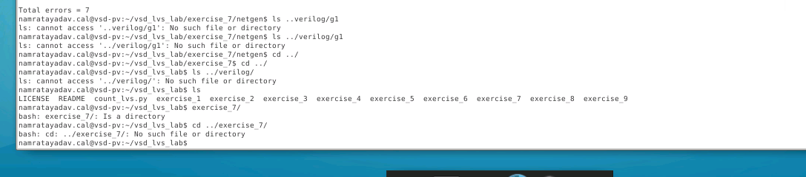

The report showed unmatched nets and devices because the two representations disagreed about whether the ground domains were separate.

Conceptually:

```text
Layout extraction:

VSSD ─┬─ VSSD1
      ├─ VSSD2
      ├─ VSSA1
      └─ VSSA2
```

while the Verilog initially described:

```text
VSSD

VSSD1

VSSD2

VSSA1

VSSA2
```

as separate nets.

---

# 18. Macro Hierarchy

This exercise differs from the previous standard-cell-only example because `mgmt_protect` contains macro hierarchy.

The structure is conceptually:

```text
mgmt_protect
│
├── standard cells
│
├── mgmt_protect_hv
│   └── standard cells
│
├── mprj_logic_high
│   └── standard cells
│
└── additional digital logic
```

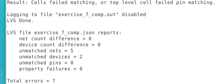

LVS must therefore correctly resolve both:

```text
top-level connectivity
```

and:

```text
connectivity inside macro blocks
```

---

# 19. Important Lesson About Macros

A macro is a reusable physical block placed inside a larger digital design.

Instead of completely flattening everything:

```text
Top
 └── thousands of individual cells
```

the design may preserve hierarchy:

```text
Top
 ├── Macro A
 ├── Macro B
 └── Standard cells
```

This makes physical design and verification more manageable.

Netgen can compare hierarchical designs as long as the hierarchy and connectivity can be resolved consistently.

---

# 20. Debugging Flow

The complete debugging process for this lab was:

```text
Load mgmt_protect in Magic
        ↓
Extract SPICE
        ↓
Run LVS against mgmt_protect.v
        ↓
Netgen says:
"not structural Verilog"
        ↓
Inspect Verilog
        ↓
Find ~caravel_clk
        ↓
Recognize Boolean logic still needs synthesis
        ↓
Switch to verilog/gl/mgmt_protect.v
        ↓
Run LVS again
        ↓
Ground-net mismatches remain
        ↓
Inspect layout ground rings
        ↓
Understand common substrate connectivity
        ↓
Add ground assignments in Verilog
        ↓
Merge:
VSSA1
VSSA2
VSSD1
VSSD2
into VSSD
        ↓
Rerun LVS
```

---

# 21. Useful Commands

## Start Magic

```bash
cd mag
./run_magic
```

## Load layout

```tcl
load mgmt_protect
```

## Extract layout

```tcl
extract do local
extract all
ext2spice lvs
ext2spice
```

## Run LVS

```bash
cd ../netgen
./run_lvs.sh
```

## Inspect LVS output

```bash
vi exercise_7_comp.out
```

## Search inside Vi

```text
/
```

Example:

```text
/vssd1
```

## Search Verilog

```text
/caravel_clk
```

---

# 22. Important Verilog Changes

Inside `mgmt_protect_hv.v`:

```verilog
assign vssa1 = vssd;
assign vssa2 = vssd;
```

Inside top-level `mgmt_protect.v`:

```verilog
assign vssa1 = vssd;
assign vssa2 = vssd;
assign vssd1 = vssd;
assign vssd2 = vssd;
```

---

# Key Takeaways

- LVS requires explicit circuit topology.
- A Verilog file may look gate-level but still contain behavioral expressions.
- Boolean operators such as `~` imply logic that still needs synthesis.
- Netgen treats non-structural Verilog modules as black boxes.
- A black-box top-level module is not useful for a full LVS comparison.
- Synthesized gate-level Verilog should be used for digital LVS.
- Digital macros introduce hierarchy inside the top-level block.
- Layout extraction can determine connectivity that is not obvious from visible metal geometry.
- Substrate connectivity can cause several apparently separate ground domains to collapse into one electrical net.
- Magic's interactive net tracing and full extraction do not necessarily answer connectivity questions in exactly the same way.
- Simple Verilog `assign` statements can be used to represent intentional direct net connections.
- The reference netlist and extracted layout must describe the same electrical connectivity before LVS can pass.

---

# Final Flow

```text
mgmt_protect Layout
        |
        v
Magic Extraction
        |
        v
mgmt_protect.spice
        |
        |        compare
        +----------------------+
                               |
Synthesized Gate-Level Verilog |
verilog/gl/mgmt_protect.v      |
        |                      |
        +----------------------+
                               |
                               v
                            Netgen
                               |
                               v
                       LVS Verification
```

The main debugging issues in this lab were therefore:

```text
1. Behavioral Verilog used instead of gate-level Verilog
2. Ground domains merged through substrate during extraction
3. Reference Verilog needed matching ground connectivity
```

This exercise demonstrated how LVS debugging becomes more complex when **standard cells, macros, multiple power domains, and substrate connectivity** are all present in the same digital block.
