# L9 — LVS Digital PLL Debugging — Part 1

## Overview

In this lab, I performed LVS debugging on a previously synthesized **Digital PLL** block.

Unlike a normal clean LVS run, this exercise intentionally contains several layout-side errors to demonstrate a practical **divide-and-conquer debugging strategy**.

The main issues investigated in this part were:

- physical-only fill and tap cells,
- an antenna-fix diode present only in the layout,
- device-count mismatches,
- net mismatches caused by missing devices,
- and the beginning of a broken power-network investigation.

---

# 1. Load and Extract the Digital PLL

I started from the layout directory and launched Magic.

```bash
cd mag
./run_magic
```

Then loaded the Digital PLL:

```tcl
load digital_pll
```

The hierarchy was expanded and extracted:

```tcl
extract do local
extract all
ext2spice lvs
ext2spice
```

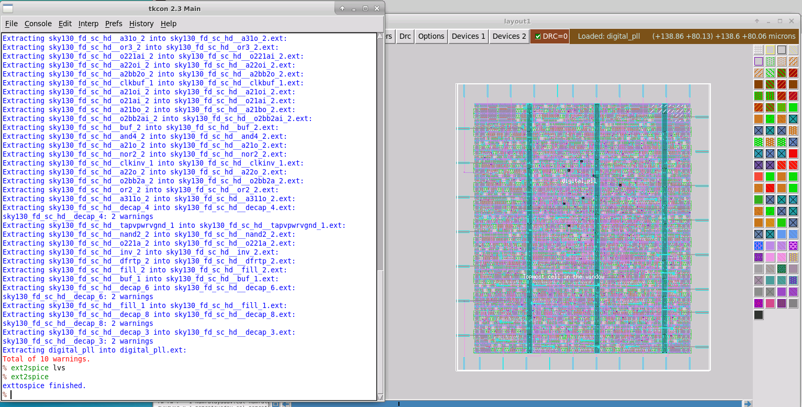

Magic generated:

```text
digital_pll.spice
```

which is the extracted layout-side netlist used for LVS.

---

# 2. Run the Initial LVS

From the Netgen directory:

```bash
cd ../netgen
./run_lvs.sh
```

The initial LVS result showed many errors.

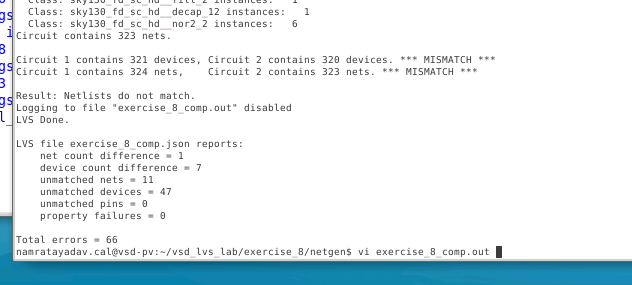

The JSON summary reported differences such as:

```text
net count difference
device count difference
unmatched nets
unmatched devices
```

At first this looks like a large LVS failure, but the correct strategy is not to debug every net mismatch immediately.

Instead, start with the **device mismatches**.

---

# 3. Divide-and-Conquer Debugging Strategy

The important rule used in this exercise is:

```text
Fix device mismatches first.
Then analyze net mismatches.
```

Why?

If the two circuits do not contain the same devices, the connectivity comparison will naturally generate a large number of secondary net errors.

So the debugging flow is:

```text
Device mismatch
      ↓
Fix missing / extra devices
      ↓
Rerun LVS
      ↓
Reduce net mismatch output
      ↓
Debug connectivity
```

---

# 4. Inspect the Top-Level Device Summary

The lower-level standard cells matched correctly.

The important differences appeared at the top-level `digital_pll` circuit.

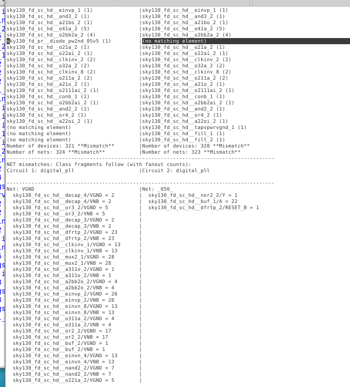

The summary showed several suspicious differences:

```text
decap cell count mismatch
diode present on only one side
fill/tap cells present on only one side
```

These became the first targets for debugging.

---

# 5. Low-Hanging Fruit — Fill and Tap Cells

The fill and tap mismatch is similar to the issue encountered in the previous digital LVS exercise.

These physical-only cells may exist in the placed-and-routed Verilog but disappear during Magic extraction because they do not contain electrically meaningful devices.

The solution is to enable the Sky130 Netgen handling for these cells.

Inside:

```text
run_lvs.sh
```

I added:

```bash
export MAGIC_EXT_USE_GDS=1
```

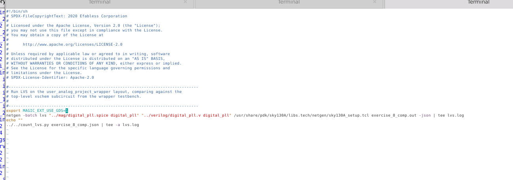

This allows the Sky130 Netgen setup to ignore the appropriate physical-only cells such as:

```text
fill
tap
decap-related physical structures
```

where appropriate.

---

# 6. Rerun LVS

After updating the environment variable:

```bash
./run_lvs.sh
```

Netgen again processed the hierarchy.

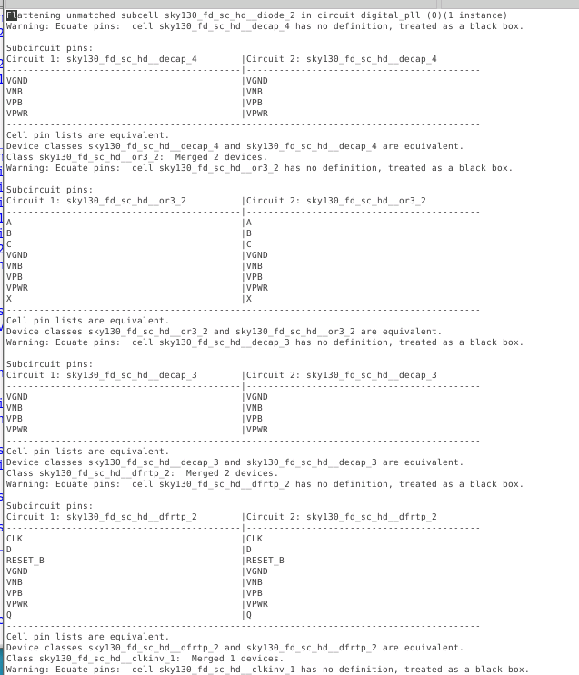

The output now contained fewer mismatches.

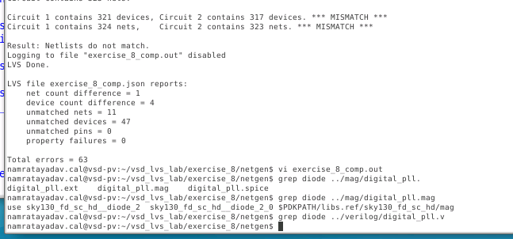

The fill/tap problem had been reduced, leaving more meaningful errors to investigate.

---

# 7. Investigate the Unmatched Diode

The next obvious device mismatch was:

```text
sky130_fd_sc_hd__diode_2
```

The important observation was that this was not a normal logic standard cell expected from synthesis.

I searched for it in both the layout and Verilog sources.

```bash
grep diode ../mag/digital_pll.mag
```

and:

```bash
grep diode ../verilog/digital_pll.v
```

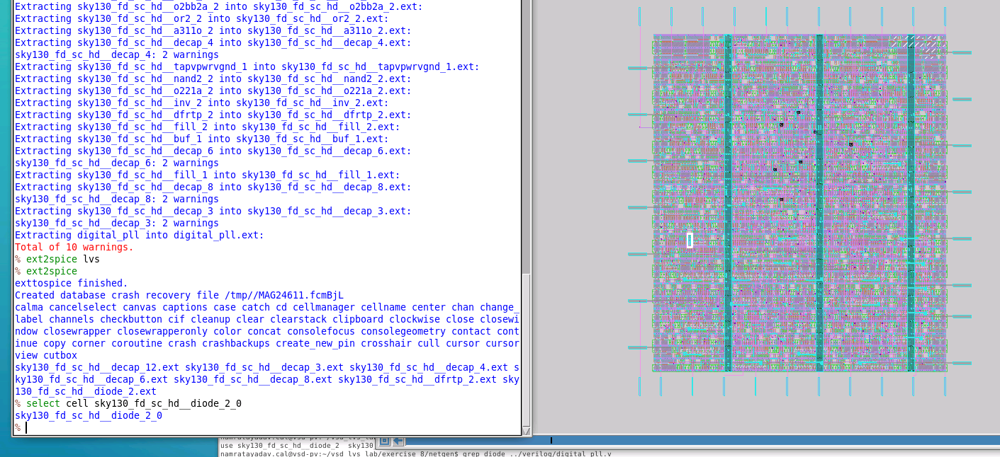

The result showed:

```text
diode exists in layout
diode does not exist in Verilog
```

This explains the LVS device mismatch.

---

# 8. Why Is the Diode Only in the Layout?

The diode was likely inserted during physical design to fix an **antenna violation**.

A common implementation flow is:

```text
Synthesis
   ↓
Gate-level Verilog
   ↓
Place and Route
   ↓
Antenna violation detected
   ↓
Antenna diode inserted
```

Therefore the final physical layout may contain a diode that was not present in the original synthesized Verilog.

This produces:

```text
Layout:   diode exists
Verilog:  diode missing
```

and LVS fails.

---

# 9. Locate the Diode Instance in Magic

The diode instance name was obtained using `grep`.

Then inside Magic I selected the instance:

```tcl
select cell <diode_instance_name>
```

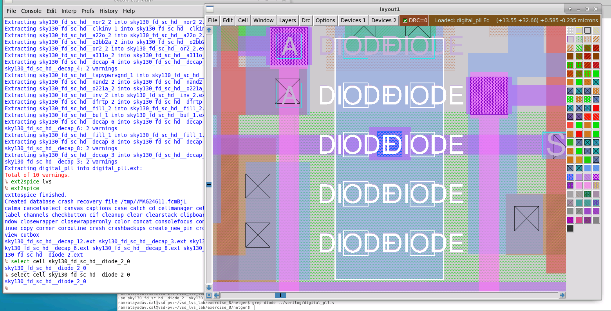

The diode could now be inspected directly in the layout.

---

# 10. Determine Which Net the Diode Is Connected To

After selecting the geometry, I used:

```tcl
getnode
```

Magic reported that the diode was connected to:

```text
VCO
```

The selected net was then traced through the layout.

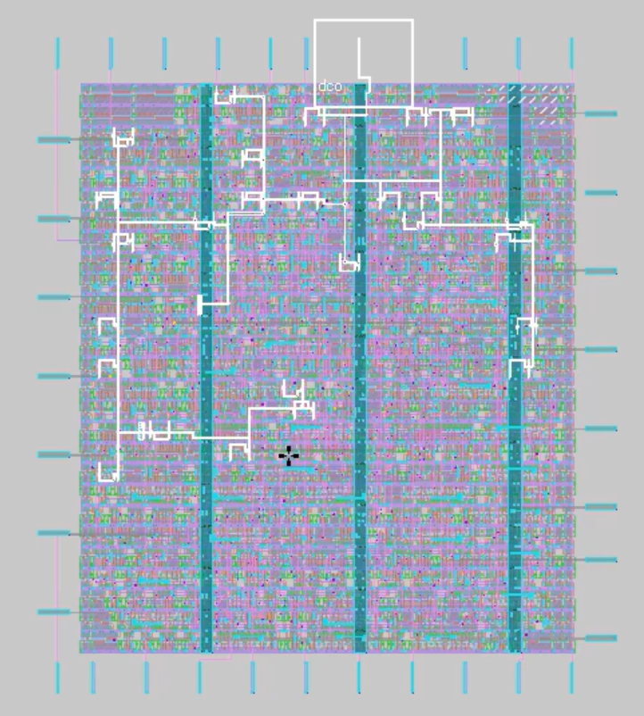

Zooming out showed that the diode connection reaches the DCO/VCO-related signal at the block boundary.

This makes sense for an antenna diode because it is connected to a signal net rather than inserted into the logic function itself.

---

# 11. Confirm the Same Error in `comp.out`

The LVS report can also be searched for the diode:

```bash
vi exercise_8_comp.out
```

then:

```text
/diode
```

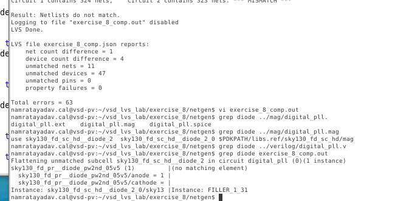

Netgen showed the diode only on one side of the comparison.

Conceptually:

```text
Layout                          Verilog
------                          -------
diode_2                         no matching element
```

So the LVS report confirms what was already observed in the source files.

---

# 12. Add the Diode to the Gate-Level Verilog

Since the diode is physically present in the final layout, the synthesized comparison netlist must also represent it.

I edited:

```text
digital_pll.v
```

and added an instance of:

```verilog
sky130_fd_sc_hd__diode_2
```

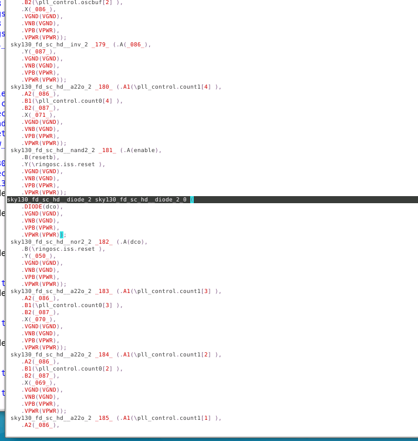

The standard power connections were copied from nearby standard-cell instances.

The signal pin was connected to the net identified in Magic:

```text
VCO
```

Conceptually:

```verilog
sky130_fd_sc_hd__diode_2 <instance_name> (
    .DIODE(vco),
    .VGND(VGND),
    .VNB(VGND),
    .VPB(VPWR),
    .VPWR(VPWR)
);
```

The exact net names must match the gate-level Verilog used in the exercise.

---

# 13. Rerun LVS After Adding the Diode

After editing the Verilog:

```bash
./run_lvs.sh
```

I searched again for:

```text
diode
```

The diode was now successfully matched.

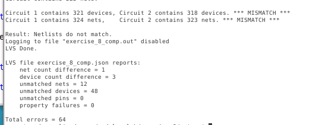

The diode-related LVS error disappeared.

This demonstrates an important LVS debugging technique:

```text
Mismatch report
      ↓
Identify unmatched device
      ↓
Find physical instance
      ↓
Determine connected net
      ↓
Update reference netlist
      ↓
Rerun LVS
```

---

# 14. Remaining Decap / Power-Network Errors

After resolving the diode, device-count differences associated with decap cells still remained.

The device mismatch output showed an important clue.

One side had a power/ground fanout involving hundreds of devices, while another related instance showed a much smaller fanout.

That strongly suggests:

```text
broken power connectivity
```

rather than an actual incorrect decap cell.

---

# 15. Why Power-Net Errors Produce Large LVS Reports

Power networks connect to almost every device in a digital block.

Therefore a single missing via can affect hundreds of devices.

For example:

```text
VPWR
 |
 +---- standard cell
 |
 +---- standard cell
 |
 +---- standard cell
 |
 X    ← missing via
 |
 +---- isolated group of cells
```

A single missing connection can produce:

```text
many net mismatches
many device fanout mismatches
different decap connectivity
```

So a very large LVS report does not necessarily mean there are many independent physical errors.

---

# 16. Find the Suspect Instance

The Netgen output provided an instance associated with the abnormal fanout.

Remember that Netgen device mismatch entries often contain:

```text
cell_name + instance_name
```

The actual instance name can then be selected in Magic:

```tcl
select cell <instance_name>
```

After zooming to that instance, the surrounding power network can be examined.

---

# 17. Trace the Power Network

The power geometry can be selected using repeated selection:

```text
S
S
S
```

to expand the selection through the connected net.

Then:

```tcl
getnode
```

can identify the net.

The expected vertical stripes were:

```text
VPWR
VGND
VPWR
```

The isolated row should have been connected to the VPWR stripe.

However, tracing the network showed that part of the row was electrically isolated from the main power grid.

---

# 18. Missing Via

Comparing the problematic row against the neighboring rows showed the difference.

The correct rows contained an additional upper-level via connecting the row to the vertical power stripe.

The bad row was missing that via.

Conceptually:

```text
Correct row:

horizontal power
      |
     VIA3
      |
vertical VPWR
```

but the failing row looked like:

```text
horizontal power

   no VIA3

vertical VPWR
```

Therefore the power network was physically broken.

---

# 19. Fix the Missing Power Connection

The missing contact can be added in Magic by painting the required via at the intersection.

For LVS purposes, one valid connection is electrically sufficient to reconnect the two parts of the net.

After modifying the layout, the layout must be extracted again.

```tcl
extract do local
extract all
ext2spice lvs
ext2spice
```

Then LVS can be rerun.

---

# Debugging Flow Used in This Lab

```text
Extract Digital PLL
        ↓
Run LVS
        ↓
Large number of errors
        ↓
Ignore net mismatches initially
        ↓
Inspect device-count mismatches
        ↓
Identify fill/tap cells
        ↓
Set MAGIC_EXT_USE_GDS=1
        ↓
Rerun LVS
        ↓
Identify unmatched diode
        ↓
grep layout + Verilog
        ↓
Locate diode in Magic
        ↓
getnode → VCO
        ↓
Add diode to gate-level Verilog
        ↓
Rerun LVS
        ↓
Diode mismatch removed
        ↓
Analyze remaining decap mismatch
        ↓
Notice abnormal power fanout
        ↓
Locate suspect standard-cell row
        ↓
Trace VPWR
        ↓
Find missing via
        ↓
Add via
        ↓
Re-extract layout
        ↓
Continue LVS debugging
```

---

# Useful Commands

## Extract layout

```tcl
extract do local
extract all
ext2spice lvs
ext2spice
```

## Run LVS

```bash
./run_lvs.sh
```

## Inspect comparison output

```bash
vi exercise_8_comp.out
```

## Search inside Vi

```text
/diode
```

## Find diode in layout

```bash
grep diode ../mag/digital_pll.mag
```

## Find diode in Verilog

```bash
grep diode ../verilog/digital_pll.v
```

## Select a layout instance

```tcl
select cell <instance_name>
```

## Determine selected net

```tcl
getnode
```

---

# Key Takeaways

- Large LVS mismatch reports should be debugged using a divide-and-conquer strategy.
- Device mismatches should generally be addressed before interpreting large net-mismatch lists.
- Fill and tap cells may need special handling because they are physical-only structures.
- `MAGIC_EXT_USE_GDS=1` enables the Sky130 Netgen flow used to ignore appropriate physical-only cells.
- Antenna diodes may be inserted after synthesis, so the physical layout can contain devices missing from the synthesized Verilog.
- `grep`, Netgen output, Magic `select cell`, and `getnode` are useful together for tracing unmatched devices.
- The reference gate-level netlist must represent the final electrical layout, including antenna-fix devices when required.
- Power-network errors can generate hundreds of secondary mismatches because power connects to nearly every cell.
- A single missing via can split one power net into multiple disconnected networks.
- After every layout modification, the layout must be re-extracted before LVS is rerun.

---

# Main Lesson

This exercise demonstrates that LVS debugging is not simply:

```text
Run LVS → read every error → fix every error
```

A better strategy is:

```text
Run LVS
   ↓
Find the simplest structural mismatch
   ↓
Fix it
   ↓
Rerun
   ↓
Observe which errors disappear
   ↓
Repeat
```

The number of reported errors often collapses rapidly after correcting only a few root-cause problems.
